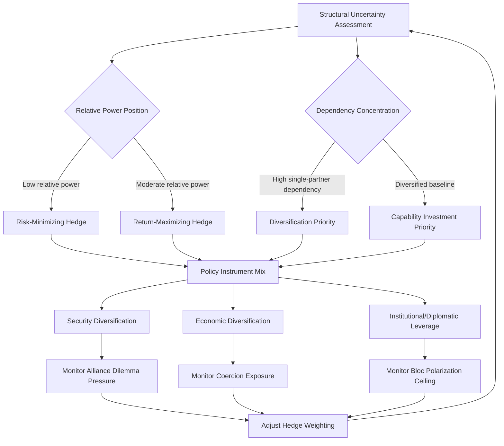

## Middle Powers and Strategic Hedging Behavior

### Conceptual Foundations

#### Defining Middle Powers

A middle power is a state that possesses sufficient material capability, diplomatic capacity, and international standing to influence outcomes beyond its immediate region, but lacks the sustained global power-projection capacity of a great power or superpower. Classifications generally rely on a composite of:

- **Material capability metrics**: GDP (nominal and PPP), defense expenditure, population, and technological base, typically ranked outside the top-tier (roughly 5th–25th globally, though thresholds vary by methodology)
- **Behavioral/relational criteria**: A propensity for coalition-building, multilateral institutionalism, niche diplomacy, and self-identification as a stabilizing or norm-entrepreneurial actor (e.g., Australia, Canada, South Korea, Indonesia, Turkey, Saudi Arabia, Poland)
- **Positional criteria**: Occupying a structurally significant location—chokepoints, contested regions, or resource corridors—that grants disproportionate strategic relevance relative to raw material power

[Inference] The category is contested in the International Relations literature; some scholars (constructivist traditions) emphasize self-identification and diplomatic style over material thresholds, while realist scholars emphasize relative capability rankings. No single authoritative index universally demarcates "middle" status.

#### Strategic Hedging Defined

Hedging is a strategy pursued by a state facing uncertainty about the future distribution of power or the reliability of a dominant patron, in which the state simultaneously pursues engagement/bandwagoning-adjacent policies toward a great power while maintaining or building insurance mechanisms against the risk of that power's dominance, decline, coercion, or abandonment. Hedging is distinct from:

- **Balancing**: Deliberately building capability or alliances to counter a specific perceived threat
- **Bandwagoning**: Aligning with the stronger or rising power to share in gains or avoid its wrath
- **Neutrality**: Formal non-alignment with legal/diplomatic commitments to abstain from bloc politics

Hedging occupies the strategic space between these poles—it is deliberately ambiguous, reversible, and designed to preserve optionality under conditions of structural uncertainty.

---

### Theoretical Drivers of Hedging Behavior

#### Structural Uncertainty

[Inference] Hedging becomes the dominant rational strategy under conditions where (a) the probability distribution over future power transitions is wide, (b) the costs of premature commitment are high (abandonment risk, entrapment risk), and (c) a state's relative power is insufficient to independently shape outcomes. This is most acute during systemic transitions—such as the current period of contested U.S.–China primacy—where committing fully to either pole risks:

- **Entrapment**: Being drawn into conflicts or costs disproportionate to national interest
- **Abandonment**: Being deprioritized or sacrificed by a patron pursuing its own great-power bargain
- **Economic coercion exposure**: Concentrated dependency inviting punitive leverage

#### The Hedging Spectrum

Hedging is not binary but exists along a continuum of policy mixes, often modeled as a portfolio allocation problem:

$$H_i = \sum_{j=1}^{n} w_j \cdot P_j$$

Where $H_i$ represents state $i$'s hedging posture, $P_j$ represents a discrete policy instrument (e.g., security cooperation with Power A, economic integration with Power B, indigenous capability investment), and $w_j$ represents the weight/intensity allocated to that instrument. [Inference] This formalization is an analytical heuristic used in academic and think-tank literature to visualize diversification logic; it is not a validated predictive model, and real-world weighting is rarely quantified with this precision by practitioners.

#### Return-Maximizing vs. Risk-Minimizing Hedging

- **Return-maximizing hedging**: The state hedges to extract maximum benefit from both poles simultaneously—economic access to one power's market, security guarantees from another—treating ambiguity as a bargaining asset
- **Risk-minimizing hedging**: The state hedges primarily to avoid catastrophic downside (abandonment, coercion, or entrapment in great-power conflict), accepting lower absolute gains in exchange for insurance

---

### Instruments of Hedging

#### Security Domain

- **Diversified defense partnerships**: Maintaining formal or informal security ties with multiple great powers simultaneously (e.g., arms procurement diversification, joint exercises with competing blocs)
- **Indigenous capability investment**: Building autonomous defense-industrial capacity to reduce dependency on any single patron's security guarantee
- **Minilateral arrangements**: Participating in smaller, issue-specific security groupings (e.g., Quad-adjacent dialogues, AUKUS-adjacent technology pacts) that fall short of formal alliance commitment, preserving deniability and reversibility
- **Ambiguous alliance commitments**: Maintaining treaty alliances while explicitly limiting their scope or resisting integration into a patron's broader containment architecture

#### Economic Domain

- **Trade and investment diversification**: Spreading dependency across multiple major markets to reduce coercive leverage available to any single partner (a core lesson drawn from cases of economic coercion, such as sanctions or trade restrictions imposed by a dominant partner on a smaller state)
- **Dual participation in competing economic architectures**: Simultaneous membership in institutions associated with different great-power blocs (e.g., participating in both Belt and Road-adjacent infrastructure financing and Western-led development finance institutions)
- **Currency and financial diversification**: Reducing dependency on a single reserve currency or payment system to preserve monetary policy autonomy under coercion scenarios

#### Diplomatic and Institutional Domain

- **Multilateral institutionalism**: Investing disproportionate diplomatic capital in rules-based multilateral fora (UN system, WTO, regional organizations) where middle powers can aggregate influence through coalition-building rather than raw power
- **Coalition and bloc leadership**: Positioning as a leader of like-situated states (e.g., ASEAN centrality, Non-Aligned Movement successor coalitions) to amplify collective bargaining leverage
- **Issue-based coalition-switching**: Aligning with different great powers on different issue-areas (e.g., security alignment with one power, climate or trade alignment with another) rather than maintaining a single consistent bloc identity

---

### Case Illustrations

#### Association of Southeast Asian Nations (ASEAN) Member States

[Inference] Many ASEAN states, notably Vietnam, Indonesia, and the Philippines, are frequently cited in the literature as archetypal hedgers: pursuing deepening economic integration with China (trade volume, supply chain linkage) while simultaneously strengthening security ties with the United States, Japan, and Australia, and investing heavily in ASEAN centrality as an institutional hedge against being forced into bloc alignment. The Philippines' post-2022 shift toward more overt U.S. security alignment—while maintaining substantial economic engagement with China—illustrates how hedging postures can shift in weighting without fully abandoning the hedge structure.

#### India

India is frequently analyzed as a hedging power pursuing "multi-alignment": deepening security and technology cooperation with the United States and Quad partners while maintaining longstanding defense-procurement relationships with Russia and preserving strategic autonomy doctrine (a legacy of Cold War non-alignment) as a diplomatic hedge against full alliance integration with any bloc.

#### Gulf States (Saudi Arabia, UAE)

Gulf middle powers illustrate economic-security hedging: maintaining the U.S. security umbrella as the primary guarantor of regional order while simultaneously deepening economic and technology ties with China, and pursuing diversified arms procurement (Russian, Chinese, European, and U.S. systems) to avoid single-supplier dependency.

#### Turkey

Turkey is often cited as an extreme case of hedging within a formal alliance structure—remaining a NATO member while pursuing independent procurement decisions (e.g., air-defense systems from non-NATO suppliers), maintaining relations with Russia despite alliance tensions, and leveraging its geographic position as a bargaining asset in negotiations with both blocs.

---

### Constraints and Limits on Hedging

#### Structural Ceiling Effects

[Inference] Hedging space is not unlimited; it contracts as systemic polarization intensifies. In a bipolar or intensely bloc-competitive system, the "middle ground" that hedging strategies depend upon narrows, and great powers increasingly demand costly signals of alignment (e.g., export control compliance, technology-sharing restrictions, basing rights) that reduce the feasible policy space for ambiguity.

#### Alliance Dilemma Pressures

Middle powers embedded in formal alliances face particular strain: the alliance security guarantee itself may become conditional on reducing hedging behavior (e.g., patron pressure to restrict a third-country technology partner as a condition of continued security cooperation), forcing a binary choice the hedge was designed to avoid.

#### Domestic Political Economy Constraints

[Inference] Hedging requires sustained elite consensus and bureaucratic capacity to manage simultaneously competing relationships; domestic political volatility, coalition government instability, or strong ideological factions favoring one bloc can erode the credibility and consistency of a hedging posture over time, as inconsistent signaling reduces the state's value as a hedging partner to both great powers.

#### The "Hedging Trap"

[Inference] Some analysts describe a risk wherein prolonged hedging, rather than preserving optionality, results in strategic drift—the state accumulates entanglements with both poles that individually seemed low-cost but collectively produce vulnerabilities to coercion from either side, without producing the security or economic benefits of a clearer alignment. This remains a debated proposition rather than an empirically settled finding.

---

### Analytical Framework for Assessing Hedging Postures

The diagram represents an iterative assessment loop: a middle power's hedging posture is not a one-time decision but a continuously re-evaluated portfolio, adjusted as structural conditions, dependency exposure, and bloc polarization intensity shift.

---

### Indicators Analysts Use to Detect Hedging Behavior

| Indicator Category | Observable Signals |
| --- | --- |
| Security signaling | Diversified arms procurement sources; participation in minilateral (non-treaty) security dialogues; resistance to formal basing/integration requests |
| Economic signaling | Simultaneous participation in competing trade/investment architectures; explicit diversification policy statements; resistance to exclusive supply-chain commitments |
| Diplomatic signaling | Abstention patterns in multilateral votes on great-power-sensitive issues; disproportionate investment in regional institution-building; rhetorical emphasis on "strategic autonomy" or "non-alignment" |
| Rhetorical framing | Official statements explicitly disclaiming bloc membership; consistent invocation of sovereignty/non-interference norms |

[Inference] These indicators are heuristics drawn from comparative case-study literature rather than a validated quantitative index; analysts typically triangulate across multiple indicator categories rather than relying on any single signal, since individual signals (e.g., a single arms deal) can reflect commercial rather than strategic logic.

---

### Distinguishing Hedging from Related Strategic Postures

- **Hedging vs. Non-Alignment**: Non-alignment is typically a formal, declared, legally/normatively grounded posture (rooted in doctrines like the Non-Aligned Movement); hedging is an informal, behavioral pattern that may coexist with formal alliance membership
- **Hedging vs. Omni-balancing**: Omni-balancing theory focuses on regime survival against both internal and external threats and is primarily used to explain the foreign policy choices of weak/authoritarian states balancing domestic legitimacy against external alignment; hedging is a broader systemic-level concept applicable across regime types
- **Hedging vs. Opportunistic Alignment Switching**: Pure opportunism implies no underlying risk-management logic, only short-term gain-seeking; hedging implies a sustained, deliberate insurance rationale even when short-term switching costs are incurred

---

**Related Topics**

- Alliance dilemma theory: abandonment vs. entrapment dynamics
- Economic statecraft and coercion resilience strategies for smaller states
- Minilateralism and issue-based coalition formation (Quad, AUKUS, I2U2)
- ASEAN centrality as an institutional hedging mechanism
- Strategic autonomy doctrines (EU, India) compared and contrasted
- Power transition theory and systemic polarity's effect on middle-power agency
- Supply chain and critical mineral diversification as economic hedging instruments
- Case study: Vietnam's "bamboo diplomacy" as an explicit hedging doctrine