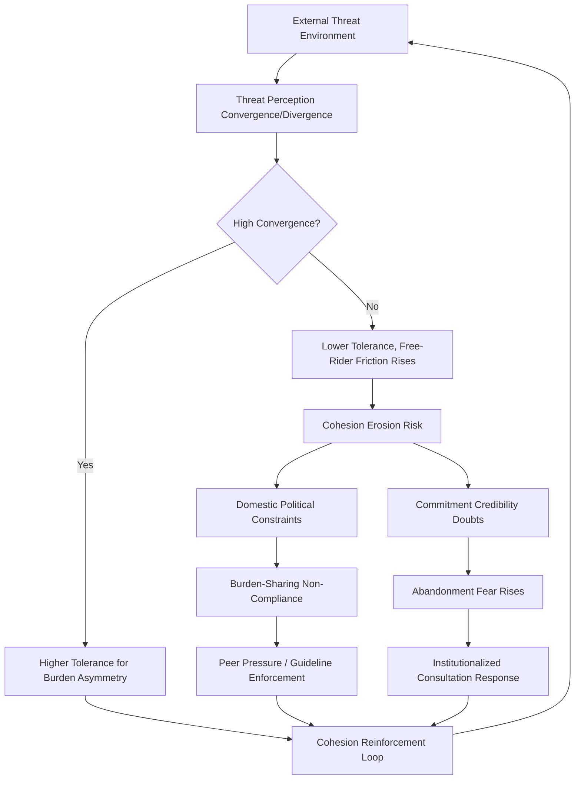

## Alliance Cohesion and Burden-Sharing Debates

### Conceptual Foundations

#### Defining Alliance Cohesion

Alliance cohesion refers to the degree to which member states of a security alliance maintain unified policy positions, coordinated military planning, and mutual confidence in the credibility of collective commitments over time. Cohesion is multidimensional rather than a single measurable quantity, typically decomposed into:

- **Threat perception convergence**: The extent to which members share a common assessment of the primary external threat and its severity
- **Policy coordination**: Consistency in diplomatic, economic, and military signaling toward third parties
- **Capability interoperability**: The degree to which member militaries can operate jointly (standardized equipment, doctrine, command structures)
- **Commitment credibility**: The perceived likelihood that members will honor mutual defense obligations if invoked

[Inference] These dimensions can move independently—an alliance may exhibit high policy coordination but declining commitment credibility (or vice versa), which is why single-indicator assessments of "alliance health" are generally considered unreliable in the comparative alliance literature.

#### Defining Burden-Sharing

Burden-sharing concerns the allocation of the costs of collective defense—financial, material, and human—across alliance members relative to their capacity to contribute. It is typically analyzed along:

- **Input burden-sharing**: Defense expenditure as a share of GDP, force contributions, basing access provided
- **Output burden-sharing**: Operational contributions to alliance missions, deployments, and capability gaps filled
- **Risk burden-sharing**: Exposure to casualties, frontline geographic positioning, and escalation risk borne disproportionately by certain members

---

### Theoretical Frameworks

#### Collective Action and the Public Goods Problem

The dominant theoretical lens, originating with Olson and Zeckhauser's 1966 economic theory of alliances, treats alliance security as a public good: once provided by the largest/most capable member, smaller members cannot be excluded from its benefits. This generates a structural incentive toward free-riding.

$$U_i = B(\Sigma S_j) - C_i(s_i)$$

Where $U_i$ is member $i$'s utility, $B$ is the benefit function of aggregate alliance security $\Sigma S_j$ (summed contributions across all members $j$), and $C_i(s_i)$ is member $i$'s cost of its own contribution $s_i$. [Inference] Because $B$ depends on the sum of all contributions rather than any single member's share, each member's marginal incentive is to minimize $s_i$ while free-riding on $\Sigma S_j$—predicting systematic under-provision relative to the collectively optimal level, and predicting that larger/wealthier members will bear a disproportionate share (the "exploitation of the great by the small" hypothesis).

[Unverified] The empirical robustness of the Olson-Zeckhauser prediction has been extensively contested in subsequent alliance-politics literature; joint-product models (where alliance spending also produces private/national goods, such as territorial defense or domestic industrial benefits) predict less severe free-riding than the pure public-goods model, and empirical tests have produced mixed results across different alliance structures and time periods.

#### Joint-Product Model Refinement

The joint-product model (Sandler and others) modifies the pure public goods framing by recognizing that defense spending simultaneously produces:

- A pure public good component (deterrence of external aggression, benefiting all members equally regardless of contribution)
- A partially excludable component (alliance-specific power projection, prestige, influence over alliance decision-making)
- A purely private component (territorial defense capability that benefits primarily the contributing state)

[Inference] This decomposition helps explain why smaller/frontline states sometimes over-contribute relative to the pure public-goods prediction—their private benefit share (territorial defense) is proportionally larger given their direct exposure, altering the incentive calculus predicted by the simpler model.

#### Credibility and Extended Deterrence Theory

A parallel theoretical strand focuses on cohesion as a function of extended deterrence credibility: alliance cohesion depends not merely on burden distribution but on member states' confidence that the alliance's dominant power will honor commitments even when doing so entails significant risk (including nuclear risk, in nuclear alliances). This generates the classic **entrapment-abandonment dilemma**:

- **Abandonment fear**: Smaller members worry the dominant power will not honor commitments when costs are high, will realign, or will fail to consult before major decisions affecting the alliance
- **Entrapment fear**: The dominant power (and sometimes other members) worry that formal commitments will drag the alliance into conflicts driven by a member's regional disputes or provocative behavior

---

### Empirical Indicators of Burden-Sharing

#### Standard Metrics

| Metric | Description | Common Application |
| --- | --- | --- |
| Defense expenditure / GDP | Headline "input" metric | NATO's 2% guideline (subsequently revised upward in recent commitments) |
| Equipment expenditure / total defense spending | Proxy for modernization investment vs. personnel/operating costs | NATO's supplementary 20% equipment guideline |
| Deployable/usable forces | Share of total force structure that is actually deployable for alliance operations | Assessing real operational contribution vs. nominal force size |
| Host-nation support | Value of basing access, infrastructure, and logistics provided | Relevant for states hosting forward-deployed forces |

[Inference] Expenditure-to-GDP ratios are widely criticized as an imperfect proxy: they do not capture output quality (force readiness, interoperability), can be inflated by pension/personnel costs unrelated to deployable capability, and do not account for non-financial contributions like strategic geographic positioning or intelligence-sharing.

#### The NATO Burden-Sharing Debate as Reference Case

[Inference] NATO is the most extensively studied case in the empirical burden-sharing literature due to data availability. Persistent themes include:

- Long-standing U.S. share of aggregate NATO defense spending substantially exceeding its proportional share of alliance GDP, cited recurrently in U.S. domestic political debates over allied "free-riding"
- Post-2014 (following Russia's annexation of Crimea) and post-2022 (following the full-scale invasion of Ukraine) shifts toward increased European defense expenditure commitments, reflecting threat-perception convergence effects on burden-sharing behavior
- Variation in compliance with spending guidelines correlated with geographic proximity to perceived threat (frontline Baltic and Nordic/Eastern European states have generally shown higher compliance rates than more geographically distant members)

---

### Drivers of Cohesion Erosion

#### Threat Perception Divergence

[Inference] When alliance members face geographically or structurally different threat exposures, their tolerance for burden-sharing asymmetry and policy coordination costs diverges. A member bordering a revisionist power perceives far higher stakes in alliance credibility than a member with no direct exposure, generating friction over resource allocation and risk tolerance.

#### Domestic Political Economy Constraints

Defense spending increases compete with domestic fiscal priorities (healthcare, pensions, infrastructure) within democratic alliance members, and coalition governments with fragmented parliamentary structures face higher domestic veto-player constraints on rapid defense-spending increases than more centralized executives.

#### Leadership Transition and Signaling Effects

[Inference] Changes in the dominant alliance power's leadership or declared strategic priorities (e.g., explicit statements questioning the value or terms of existing alliance commitments) can independently reduce smaller members' confidence in commitment credibility, even absent any change in formal treaty obligations—since credibility is a function of perceived willingness, not merely legal commitment.

#### Out-of-Area Operations and Mission Creep

Alliances originally designed around a narrow collective-defense mandate face cohesion strain when expected to undertake out-of-area operations (peacekeeping, counterterrorism, expeditionary missions) that do not equally implicate all members' core security interests, since burden-sharing consensus is harder to sustain for missions perceived as discretionary rather than existential.

---

### Alliance Management Mechanisms

#### Institutionalized Consultation

Formal consultation mechanisms (standing councils, integrated command structures, joint planning staffs) are designed to reduce abandonment fears by embedding decision-making transparency, making unilateral defection more costly and more visible to other members.

#### Burden-Sharing Guidelines and Peer Pressure

Explicit numeric targets (such as expenditure-to-GDP benchmarks) function less as binding legal obligations and more as focal points for peer accountability—enabling public comparison, media scrutiny, and diplomatic pressure on underperforming members. [Inference] Their effectiveness is debated; critics note that guideline non-compliance rarely carries enforceable consequences, while defenders argue that reputational and alliance-standing costs provide meaningful, if imperfect, compliance pressure.

#### Capability Specialization ("Smart Defense" / Pooling and Sharing)

Rather than requiring every member to maintain full-spectrum capability, alliances increasingly pursue specialization arrangements where members contribute niche capabilities (e.g., specific enabler assets, logistics, cyber capacity) pooled at the alliance level—intended to improve aggregate capability efficiency while reducing the perceived unfairness of uniform spending targets across states with very different economic bases.

---

### Analytical Framework: Cohesion-Burden Interaction

The loop illustrates that cohesion and burden-sharing are mutually reinforcing or mutually eroding rather than independent variables: threat convergence increases tolerance for asymmetric contribution, while divergence amplifies free-rider friction, which in turn feeds back into credibility doubts and further cohesion strain absent effective management mechanisms.

---

### Distinguishing Related Concepts

- **Burden-sharing vs. Burden-shifting**: Burden-sharing implies a negotiated, roughly proportional distribution of costs; burden-shifting describes attempts by one member to transfer disproportionate cost onto others without corresponding adjustment in influence or benefit-sharing
- **Cohesion vs. Unanimity**: Cohesion does not require identical policy positions on every issue; alliances can sustain high cohesion on core mandate issues (collective defense) while tolerating divergence on peripheral issues (out-of-area operations, economic policy toward third parties)
- **Alliance credibility vs. Alliance capability**: Credibility is a perceptual/political variable (will commitments be honored); capability is a material variable (can commitments be honored); low cohesion can result from deficits in either dimension independently

---

**Related Topics**

- Extended deterrence theory and nuclear alliance commitment credibility
- NATO Article 5 invocation history and precedent-setting effects on alliance credibility
- Alliance capability specialization and pooling/sharing arrangements in practice
- Domestic veto players and defense budget politics in coalition governments
- Out-of-area alliance operations and mandate-scope cohesion strain
- Comparative alliance structures: NATO vs. U.S. bilateral hub-and-spoke alliances in East Asia
- Economic theory of alliances: Olson-Zeckhauser model and joint-product model critiques
- Alliance fragmentation and dissolution: historical cases and warning indicators