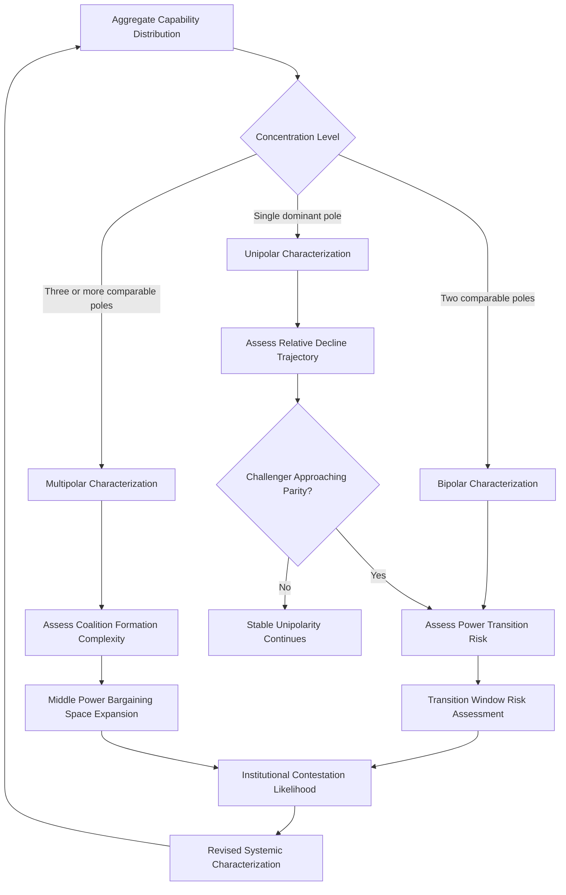

## Multipolarity and the Changing Balance of Power

### Conceptual Foundations

#### Defining Polarity

Polarity, in structural realist International Relations theory, refers to the number of major power centers ("poles") capable of independently shaping the international system's core security dynamics. The standard typology distinguishes:

- **Unipolarity**: A single power possesses preponderant capability across military, economic, and technological dimensions, with no combination of other states able to effectively balance against it in the near term
- **Bipolarity**: Two roughly comparable power centers dominate the system, with most other states' security calculations organized around the relationship between the two poles
- **Multipolarity**: Three or more power centers possess sufficient independent capability to shape systemic outcomes, none possessing decisive preponderance over the others

[Inference] Polarity is a structural-level concept describing the distribution of capability across the system as a whole; it is analytically distinct from any single state's foreign policy orientation (e.g., a state can pursue hedging behavior under any polarity structure, though the incentives and feasible strategies differ by structure).

#### Measuring Pole Status

No single authoritative metric defines pole status; composite assessments typically weigh:

- **Aggregate material capability**: GDP, defense expenditure, population, technological/industrial base, often modeled via composite indices (e.g., variants of the Correlates of War National Material Capabilities framework)
- **Power projection capacity**: The ability to sustain military and economic influence beyond the immediate region, distinguishing regional powers from systemic poles
- **Institutional and normative influence**: Capacity to shape the rules, norms, and institutional architecture of the international system, not merely react to it

$$P_i = \alpha \cdot M_i + \beta \cdot R_i + \gamma \cdot I_i$$

Where $P_i$ is state $i$'s composite pole-status score, $M_i$ is aggregate material capability, $R_i$ is power-projection reach, $I_i$ is institutional/normative influence, and $\alpha, \beta, \gamma$ are analyst-assigned weights. [Inference] This formalization is a heuristic used to structure comparative assessment; no consensus weighting scheme exists in the literature, and different analytical traditions (realist, liberal-institutionalist) assign systematically different weights to the $I_i$ term in particular.

---

### Theoretical Debates on Multipolar Stability

#### The Stability-Instability Debate

A long-standing theoretical dispute concerns whether multipolar systems are more or less war-prone than bipolar systems:

- **Waltzian bipolar-stability thesis**: [Inference] Kenneth Waltz argued bipolarity is inherently more stable because it reduces the number of possible great-power dyads requiring management, simplifies threat assessment (each pole need only track the other), and reduces miscalculation risk from complex alliance-formation dynamics
- **Multipolar-stability counter-thesis**: [Inference] Alternative structural arguments (associated with Karl Deutsch, J. David Singer, and later Kenneth Waltz's own qualified revisions in some contexts) suggest multipolarity can diffuse conflict by distributing attention and capability across multiple dyads, preventing any single rivalry from dominating systemic dynamics, and by increasing the number of potential coalition partners available to check an aspiring hegemon
- [Unverified] Empirical testing of these competing hypotheses using historical polarity coding (e.g., comparing the 19th-century multipolar "Concert of Europe" era against the Cold War bipolar era) has produced contested and methodology-dependent results; systemic war frequency, severity, and duration do not straightforwardly sort by polarity type across the historical record, and confounding variables (nuclear deterrence, economic interdependence, institutional density) complicate isolating polarity's independent effect.

#### Power Transition Theory

A distinct but related theoretical strand focuses not on the static number of poles but on the dynamics of relative power change between a dominant state and a rising challenger:

[Inference] Power transition theory (associated with A.F.K. Organski and later quantitative extensions) predicts that systemic conflict risk peaks not during stable unipolarity or stable bipolarity/multipolarity, but during the transition window when a rising challenger's capability approaches parity with the established dominant power—particularly when the challenger is dissatisfied with the existing rules-based order the dominant power has constructed. This generates the widely cited but contested **Thucydides Trap** framing, describing structural pressure toward conflict when a rising power threatens to displace an established one.

[Unverified] The empirical validity and predictive power of power transition theory, including the specific "trap" framing applied to contemporary U.S.-China dynamics, remains actively debated; critics note the historical reference set is small, selection of cases is contested, and nuclear deterrence dynamics in the contemporary period differ substantially from most historical transition cases used to build the theory.

---

### Contemporary Multipolarity Assessment

#### Characterizing the Current System

[Inference] Substantial scholarly and policy-analytic disagreement exists over whether the contemporary international system is best characterized as unipolar (with relative U.S. decline), bipolar (U.S.-China), or emergent multipolar (incorporating additional independent poles such as the EU, India, and potentially a reconstituted Russia-aligned bloc). Different characterizations often reflect different weighting of the $M_i$, $R_i$, and $I_i$ components above rather than disagreement over underlying facts:

- Analysts emphasizing military/economic aggregate capability concentration tend toward a bipolar (U.S.-China) framing, given the scale gap between these two economies/militaries and other candidate poles
- Analysts emphasizing institutional and normative influence diffusion, or regional power autonomy, tend toward a multipolar framing, incorporating the EU's regulatory/economic weight, India's demographic and growing economic trajectory, and middle-power coalition behavior as independently consequential
- [Speculation] Some policy commentary uses "multipolarity" more loosely as a rhetorical framing associated with resistance to a U.S.-centric order, rather than as a rigorously operationalized structural classification—this usage should be distinguished from the analytical IR-theory concept

#### Diffusion of Economic Power

[Inference] A commonly cited empirical driver of multipolar characterization is the relative diffusion of global GDP share away from historical concentration in a small set of advanced economies toward a broader set of large emerging economies over recent decades, altering relative aggregate capability distributions independent of any single dyadic (U.S.-China) framing. [Unverified] The degree to which GDP diffusion translates into comparable diffusion of military capability, technological frontier position, and institutional agenda-setting power is contested—economic scale and effective systemic influence are related but not equivalent.

#### Technological Multipolarity

A distinct dimension of contemporary analysis concerns whether technological leadership (semiconductors, artificial intelligence, biotechnology) is itself becoming multipolar, given the emergence of multiple states and firm ecosystems pursuing frontier capability, in contrast to earlier periods of more concentrated technological leadership. [Inference] This has generated growing use of "technopolarity" or similar framings in more recent policy literature, treating technological capability distribution as an analytically distinct axis from traditional military/economic polarity, given the differing dynamics of diffusion, dual-use applicability, and non-state (corporate) actor relevance in the technology domain.

---

### Systemic Consequences of Multipolar Transition

#### Alliance Formation Complexity

[Inference] Multipolar systems generate more complex alliance-formation dynamics than bipolar systems: with three or more independent poles, coalition mathematics allow for a wider range of potential alignments (including shifting coalitions against whichever pole is perceived as most threatening at a given moment), increasing both strategic flexibility for secondary states and the difficulty of maintaining stable, predictable alliance commitments over time.

#### Institutional Contestation

Rising poles dissatisfied with existing institutional architecture (constructed predominantly under prior unipolar or bipolar conditions) have incentive to construct parallel or competing institutions rather than working exclusively within existing structures, generating institutional proliferation and potential fragmentation of previously universal governance mechanisms (trade, finance, development lending).

#### Middle Power Agency Expansion

[Inference] Multipolar or transitional systems generally expand the strategic bargaining space available to middle powers relative to stable bipolar or unipolar conditions, since the reduced concentration of capability among poles increases the marginal value of middle-power alignment choices to competing poles—directly relevant to hedging-strategy feasibility discussed elsewhere in this chapter.

---

### Analytical Framework: Polarity Transition Assessment

The loop reflects that polarity characterization is not static but continuously reassessed as capability distributions, institutional contestation, and coalition dynamics evolve, feeding back into subsequent capability-distribution assessments.

---

### Distinguishing Related Concepts

- **Multipolarity vs. Multilateralism**: Multipolarity describes the structural distribution of power capability; multilateralism describes a mode of diplomatic practice (rules-based, institutionalized cooperation among three or more states) that can occur under any polarity structure
- **Multipolarity vs. Regional Power Diffusion**: A system can exhibit regional power concentration (a single dominant regional hegemon in multiple distinct regions) without those regional powers possessing systemic pole status if their power-projection reach remains regionally bounded
- **Relative decline vs. Absolute decline**: A dominant power's relative capability share can decline (as other states grow faster) without any absolute decline in its material capability—this distinction is frequently conflated in popular discourse on "great power decline" and is analytically significant for polarity assessment

---

**Related Topics**

- Power transition theory and the Thucydides Trap debate in depth
- Technopolarity: corporate and technological actors as quasi-systemic poles
- Historical polarity case studies: Concert of Europe multipolarity vs. Cold War bipolarity
- Composite national capability indices: construction methodology and critiques
- Institutional proliferation and parallel governance architecture (BRICS institutions, alternative development banks)
- Regional hegemony vs. systemic pole status: analytical boundary cases
- Nuclear deterrence's moderating effect on polarity-conflict relationships
- Coalition formation mathematics under multipolar systemic conditions