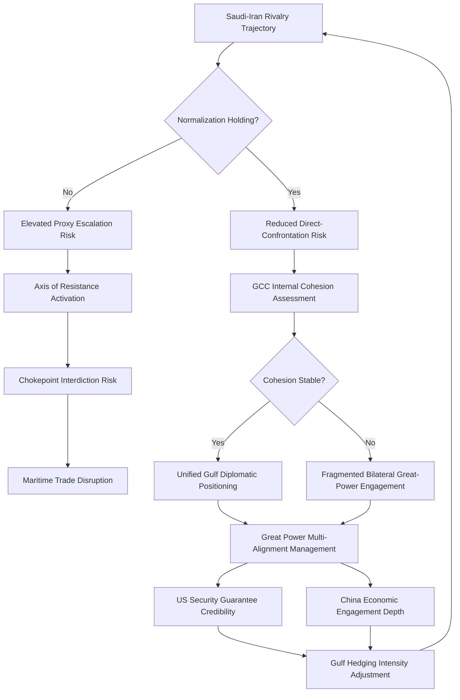

## Middle East and Gulf Geopolitics

### Regional Structural Overview

#### Core Analytical Dimensions

The Middle East and Gulf region is conventionally analyzed across several interacting structural layers, each generating distinct but interconnected risk dynamics:

- **Intra-regional power rivalry**: Contestation for regional influence among a small set of capable states (notably Saudi Arabia, Iran, Turkey, Israel, and to a lesser degree Egypt and the UAE)
- **Sectarian and identity-based cleavages**: Sunni-Shia sectarian dynamics, ethnic divisions (Arab-Persian-Kurdish-Turkic), and their instrumentalization in proxy competition
- **Great power engagement**: Overlapping U.S., Chinese, Russian, and European strategic interests, historically centered on energy security and increasingly incorporating technology, arms sales, and counterterrorism cooperation
- **Resource and energy centrality**: The region's disproportionate share of global proven oil and natural gas reserves, and its geographic position astride critical maritime chokepoints
- **State fragility and non-state actor proliferation**: A cluster of weak or fragmented state structures (Yemen, Syria, Libya, Iraq, Lebanon) enabling sustained non-state and quasi-state armed actor activity

[Inference] No single framework dominates regional analysis; most professional geopolitical risk assessment blends realist state-rivalry analysis with attention to sub-state and non-state dynamics, given the region's unusually high incidence of weak-state and contested-sovereignty conditions relative to other regions.

---

### Intra-Regional Rivalry Architecture

#### Saudi Arabia–Iran Rivalry

The Saudi-Iranian rivalry is widely treated as the primary organizing axis of regional competition, combining:

- **Sectarian framing**: Saudi Arabia's position as custodian of Islam's two holiest sites and self-conception as leader of the Sunni Arab world, against Iran's position as the dominant Shia power and self-conception as leader of a transnational "Axis of Resistance"
- **Geopolitical framing**: Competition for regional influence independent of sectarian identity, expressed through competing alignments in multiple theaters (Yemen, Syria, Lebanon, Iraq)
- **Proxy and partner network competition**: Iran's cultivation of non-state and semi-state aligned actors (discussed below) against Saudi-aligned state and coalition partners

[Inference] The 2023 China-brokered Saudi-Iran normalization agreement represented a significant, though [Unverified] not necessarily durable, de-escalatory shift in the formal diplomatic relationship; analysts differ on whether normalization reflects genuine strategic recalibration or tactical de-escalation that leaves underlying structural rivalry drivers unresolved. Subsequent regional crises have tested, without fully reversing, the normalization framework.

#### Iran's Axis of Resistance Network

Iran's regional strategy centers on cultivating a network of aligned non-state and semi-state armed actors across multiple states, providing Iran with strategic depth and deterrent/retaliatory capability without direct state-to-state conflict exposure. Key network components include:

- Lebanese Hezbollah (the most militarily capable and longest-established network member)
- Various Iraqi Shia militia formations with varying degrees of integration into formal Iraqi state security structures
- Yemen's Houthi movement (Ansar Allah)
- Syrian-based aligned militia presence (substantially altered following the fall of the Assad government in late 2024)

[Inference] The network functions as an asymmetric strategic asset, allowing Iran to impose costs on adversaries, contest maritime and territorial space, and maintain deterrent leverage while preserving formal state-level deniability and avoiding direct force-on-force exposure with materially superior conventional militaries.

#### Turkey's Regional Positioning

Turkey pursues an independent, at times cross-cutting, regional strategy shaped by:

- NATO membership combined with independent procurement and diplomatic engagement with non-NATO powers (directly relevant to the hedging-behavior analysis elsewhere in this curriculum)
- Sustained military and political engagement in Syria, driven substantially by Kurdish-security concerns along its southern border
- Competing and cooperating relationships with Gulf states depending on issue area (energy, investment, political-Islam-adjacent ideological alignment)
- Mediation and balancing roles in Russia-Ukraine-adjacent and broader regional diplomacy, leveraging its geographic position

---

### The Gulf Cooperation Council (GCC) System

#### Structural Characteristics

The GCC (Saudi Arabia, UAE, Kuwait, Qatar, Bahrain, Oman) constitutes a distinct sub-regional system characterized by:

- Hydrocarbon-dependent rentier state economic structures, generating distinct political-economy dynamics (limited taxation, extensive social welfare provision, and consequent regime-legitimacy structures tied to distributive capacity rather than electoral accountability)
- Heavy reliance on U.S. security guarantees (basing access, arms sales, air and maritime defense cooperation) as the primary external security architecture
- Internal GCC cohesion strains, most visibly demonstrated by the 2017–2021 Qatar diplomatic and economic blockade by Saudi Arabia, UAE, Bahrain, and Egypt—illustrating that GCC membership does not guarantee policy convergence

#### Post-Rentier Economic Diversification and Its Geopolitical Implications

[Inference] Gulf state economic diversification strategies (most prominently associated with Saudi Arabia's Vision 2030 framework and comparable UAE and Qatari diversification initiatives) carry geopolitical significance beyond domestic economic policy: reduced long-run hydrocarbon revenue dependency alters the strategic calculus around oil-market management, potentially reduces (though does not eliminate) the centrality of energy-security considerations in great-power engagement with the region, and drives increased Gulf state investment in technology, finance, and logistics sectors that generate new forms of economic leverage and international entanglement (sovereign wealth fund investment patterns, technology-transfer negotiations with the U.S. and China).

#### Gulf State Multi-Alignment

[Inference] Gulf states, particularly the UAE and Saudi Arabia, are frequently analyzed as pursuing an increasingly overt hedging/multi-alignment strategy—maintaining the U.S. security relationship as the core security guarantee while substantially deepening economic, technology, and diplomatic engagement with China, and diversifying arms procurement across U.S., European, Russian, and Chinese suppliers. This reflects the general middle-power hedging dynamics discussed earlier in this chapter, applied to Gulf-specific structural conditions (extreme hydrocarbon wealth enabling costly diversification, formal but non-treaty U.S. security relationships in most cases permitting greater flexibility than formal alliance structures).

---

### Israel-Palestine and the Broader Arab-Israeli Dimension

#### Structural Overview

[Inference] The Israeli-Palestinian conflict remains a distinct but interconnected driver of regional dynamics, with significance extending beyond the bilateral dimension into: normalization diplomacy between Israel and Arab states (the Abraham Accords framework and subsequent normalization discussions), the conflict's role as a mobilizing issue within pan-Arab and pan-Islamic public opinion constraining state-level diplomatic flexibility, and its direct entanglement with the Iran-aligned network (particularly Hezbollah and Houthi engagement) described above.

[Unverified] The trajectory of broader Saudi-Israeli normalization discussions, and their relationship to Palestinian statehood conditionality, remains an actively evolving and contested diplomatic process; developments in this area should be verified against current reporting rather than treated as settled.

---

### Maritime Chokepoints and Energy Security Geography

#### Critical Geographic Features

| Chokepoint | Strategic Significance |
| --- | --- |
| Strait of Hormuz | Primary maritime corridor for Gulf hydrocarbon exports; bordered by Iran, creating persistent disruption/interdiction risk during periods of Iran-West tension |
| Bab-el-Mandeb Strait | Red Sea entry point connecting to Suez Canal route; adjacent to Yemen, exposing shipping to Houthi interdiction capability |
| Suez Canal | Primary Europe-Asia maritime shortcut; Egyptian-controlled, generating distinct sovereign-risk and toll-revenue dynamics separate from Gulf dynamics proper |

[Inference] The 2023–2024 Houthi Red Sea shipping campaign, conducted in the stated context of the Israel-Gaza conflict, demonstrated the practical significance of chokepoint vulnerability: sustained attacks on commercial shipping transiting the Bab-el-Mandeb corridor drove substantial rerouting of global shipping around the Cape of Good Hope, illustrating how a comparatively low-capability non-state actor can impose material costs on global trade flows through chokepoint interdiction, independent of direct state-to-state conflict.

---

### Great Power Engagement Patterns

#### United States

[Inference] U.S. regional engagement has historically centered on energy security, counterterrorism cooperation, and Israel's security, combined with extensive bilateral security architecture across Gulf states; ongoing policy debate concerns the degree and trajectory of U.S. regional prioritization relative to Indo-Pacific strategic reallocation, with implications for Gulf state confidence in the durability of U.S. security guarantees (directly relevant to hedging incentives discussed above).

#### China

[Inference] Chinese regional engagement has centered predominantly on economic and energy-import relationships (China being a major hydrocarbon export destination for Gulf producers) combined with Belt and Road-adjacent infrastructure investment, generally avoiding deep security-architecture commitments comparable to the U.S. role, though China's 2023 Saudi-Iran normalization mediation represented a notable, if [Unverified] not necessarily precedent-setting, diplomatic engagement beyond its traditional economic focus.

#### Russia

[Inference] Russian regional engagement has centered on Syria (military basing and political support for the Assad government prior to its December 2024 fall), arms sales relationships with multiple regional states, and OPEC+ coordination with Saudi Arabia on oil-market management, combined with a general strategy of positioning as an alternative partner for states seeking to diversify away from exclusive U.S. security dependence.

---

### Regional Risk Assessment Framework

The loop reflects that Gulf state hedging intensity is continuously recalibrated based on both intra-regional rivalry trajectory and perceived great-power commitment credibility, feeding back into the primary rivalry dynamics through resource allocation and diplomatic signaling choices.

---

### Distinguishing Related Concepts

- **Sectarian framing vs. Geopolitical framing**: Analysts caution against over-attributing regional conflict dynamics to primordial sectarian identity; state interests frequently diverge from or cut across sectarian lines (e.g., state-level alignment choices driven by security and economic calculation rather than purely religious identity)
- **Rentier state theory vs. General political economy**: Gulf state political stability analysis draws on a distinct theoretical literature (rentier state theory) not directly transferable to non-hydrocarbon-dependent regional states (Egypt, Jordan, pre-2024 Syria), which face different fiscal-legitimacy dynamics
- **Proxy conflict vs. Direct interstate conflict**: Much of the region's recent conflict activity is proxy-mediated rather than direct interstate war, requiring distinct analytical tools (principal-agent dynamics, deniability calculus) beyond traditional interstate conflict frameworks

---

**Related Topics**

- Iran's nuclear program trajectory and regional proliferation risk
- Post-Assad Syria: state reconstruction and regional realignment dynamics
- Yemen conflict dynamics and Houthi governance/military evolution
- Abraham Accords normalization diplomacy and its regional spillover effects
- OPEC+ coordination mechanics and oil-market management as geopolitical tool
- Gulf sovereign wealth funds as instruments of geoeconomic influence
- Water security and Nile Basin/Tigris-Euphrates transboundary resource disputes
- Kurdish political movements across Turkey, Iraq, Syria, and Iran: comparative analysis