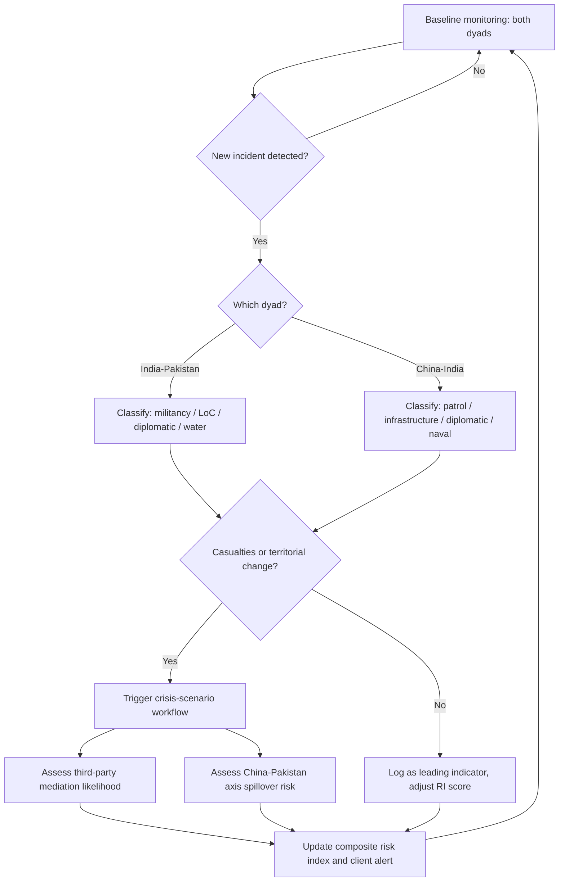

## South Asia: India-Pakistan and China-India Dynamics


### Strategic Overview and Regional Framing

South Asia's geopolitical risk profile is dominated by two interlocking, asymmetric bilateral rivalries — India-Pakistan and China-India — that share a common pivot point in India but differ fundamentally in structure, escalation dynamics, and time horizon. Analysts typically frame these not as two isolated dyads but as a **strategic triangle**, since Chinese-Pakistani alignment (the "all-weather" partnership formalized through the China-Pakistan Economic Corridor, or CPEC) creates a latent two-front contingency that shapes Indian force posture, deterrence signaling, and diplomatic bandwidth on both fronts simultaneously.

For a risk analyst, the core distinguishing features are:

- **India-Pakistan**: a symmetric nuclear dyad with a short geographic depth, a live territorial dispute (Kashmir), a history of four wars and repeated sub-conventional crises, and compressed decision timelines.
- **China-India**: an asymmetric dyad (China holds significant economic, military, and diplomatic weight advantages), an undemarcated and disputed boundary (the Line of Actual Control, or LAC) rather than a settled border, low historical war frequency (one major war, 1962) but recurrent standoffs, and a slower, more calibrated escalation tempo.

### India-Pakistan Bilateral Dynamics

#### Historical Foundations and Core Disputes

The rivalry originates in the 1947 Partition of British India, which produced two independent states and an unresolved dispute over the princely state of Jammu and Kashmir. Four wars (1947–48, 1965, 1971, and the 1999 Kargil conflict) and the 1971 secession of East Pakistan (Bangladesh) have structured mutual threat perception. Kashmir remains divided by the Line of Control (LoC), a de facto ceasefire line rather than an international border, and both states claim the territory in full while administering separate portions.

Key structural drivers of persistent friction:

- **Territorial**: Kashmir sovereignty claims, and India's 2019 revocation of Jammu and Kashmir's special constitutional status (Article 370), which Pakistan does not recognize.
- **Sub-state violence**: Pakistan-based militant groups (e.g., Lashkar-e-Taiba, Jaish-e-Mohammed) have been repeatedly linked by India to attacks on Indian soil, which Pakistan denies sponsoring, producing a recurring accusation-denial cycle that itself functions as an escalation trigger.
- **Resource interdependence**: the Indus Waters Treaty (IWT, 1960) governs shared river systems critical to Pakistani agriculture, making it a high-value coercive lever for India.

#### Nuclear Deterrence and the Stability-Instability Paradox

Both states tested nuclear weapons in 1998, producing a deterrence relationship analysts describe through the **stability-instability paradox**: mutual nuclear deterrence suppresses the probability of full-scale war while simultaneously making sub-conventional provocations (terrorism, limited strikes, artillery exchanges) more permissible, since both sides calculate that escalation to the nuclear threshold remains implausible. This paradox is central to understanding why crises recur (2001–02 Twin Peaks crisis, 2008 Mumbai attacks, 2016 Uri/surgical strikes, 2019 Pulwama/Balakot) without producing general war.

$$P(\text{war}) = P(\text{crisis}) \times P(\text{escalation} \mid \text{crisis}) \times \big(1 - D_n\big)$$

Where $P(\text{crisis})$ is the annual probability of a triggering incident, $P(\text{escalation} \mid \text{crisis})$ is the conditional probability that a crisis escalates past the sub-conventional threshold, and $D_n$ represents the deterrence discount imposed by mutual nuclear capability. Historically, $D_n$ has been treated by analysts as high (suppressing full-scale war) while offering comparatively weak restraint on $P(\text{escalation} \mid \text{crisis})$ at lower rungs of the escalation ladder — this asymmetric effectiveness is the paradox's operational core. **[Inference]** — this formulation is a simplified pedagogical construct rather than a validated quantitative model; real-world escalation probabilities are not empirically estimable with this precision.

#### The 2025 Pahalgam-Operation Sindoor Crisis and Its Aftermath

The most recent major crisis illustrates the paradox in practice. On April 22, 2025, a militant attack in Pahalgam, Indian-administered Kashmir, killed 26 civilians, the deadliest attack on civilians in the region in roughly two decades. India attributed responsibility to Pakistan-linked militant infrastructure; Pakistan denied involvement and called for a neutral investigation. India responded by suspending its participation in the Indus Waters Treaty — an unprecedented step, since the treaty had survived all prior wars — and downgrading diplomatic and travel ties.

In early May 2025, India conducted cross-border strikes under the codename **Operation Sindoor**, targeting alleged militant infrastructure inside Pakistan. Pakistan responded with drone, missile, and artillery activity along the border, producing roughly four days of the most intense direct military exchange between the two states in decades before a ceasefire understanding took hold, reportedly with US diplomatic involvement. Both governments publicly claimed a favorable outcome.

The aftermath has produced a durable diplomatic freeze rather than either war or reconciliation: continued suspension of the IWT, a standing ban on bilateral sporting contact (India permits participation only in multilateral tournaments), and severely downgraded diplomatic representation. A brief, symbolically notable exception occurred in late December 2025 / early January 2026, when India's External Affairs Minister and Pakistan's National Assembly Speaker exchanged greetings on the sidelines of a funeral in Dhaka — the first visible high-level contact since the crisis — which regional analysts characterized as a minor signal rather than a substantive thaw. **[Unverified]** — whether this contact reflects any coordinated policy shift on either side, versus incidental diplomatic protocol, has not been confirmed by either government.

#### Water Security as an Emerging Flashpoint

The suspension of the Indus Waters Treaty is widely flagged by regional analysts as the most consequential structural change to emerge from the 2025 crisis, because it removes a six-decade-old institutional buffer that had functioned even during active warfare. Pakistan depends on the Indus system for the large majority of its irrigated agriculture; any material Indian move toward altering upstream flow (beyond treaty-permitted use) would constitute an existential-tier threat from Islamabad's perspective. Analysts treat this as a durable, longer-horizon risk vector distinct from — and potentially more dangerous than — the sub-conventional militancy cycle, because water infrastructure disputes lack the established crisis-management channels that have (imperfectly) governed military incidents.

#### Escalation Ladder and Risk Indicators

Practical monitoring indicators used by risk analysts covering this dyad include:

- **Leading indicators**: militant attack frequency/lethality in Kashmir; LoC ceasefire violation counts; diplomatic staff expulsions; changes in visa/trade/transit policy; rhetoric intensity from military spokespeople.
- **Coincident indicators**: troop mobilization and force posture changes; airspace closures; naval deployments; back-channel diplomatic activity (often visible only retrospectively).
- **Structural risk multipliers**: domestic political incentives for hawkish signaling (elections, leadership legitimacy pressures on either side); third-party mediator availability and willingness (historically the US, occasionally China or Gulf states); IWT-related infrastructure developments.

### China-India Bilateral Dynamics

#### The Line of Actual Control and Unresolved Boundary

Unlike the India-Pakistan LoC, the 3,488 km India-China boundary has never been formally demarcated on the ground. The two sides dispute both the boundary's exact alignment and, in the eastern sector, the sovereignty of Arunachal Pradesh (which China refers to as "South Tibet") in its entirety. The western sector dispute centers on Aksai Chin, administered by China but claimed by India as part of Ladakh. Because no agreed line exists, "differing perceptions" of the LAC routinely produce patrol overlaps that both sides characterize as incursions by the other.

#### 2020 Galwan Clash and the Disengagement Process

Relations entered their most serious post-1962 deterioration following a June 2020 clash in the Galwan Valley, eastern Ladakh, in which Indian and Chinese soldiers fought with improvised and non-firearm weapons (per a decades-old bilateral protocol against using firearms at the LAC), resulting in the deaths of at least 20 Indian soldiers; China did not disclose its own casualty figures at the time. The clash triggered a multi-year, multi-front military standoff involving tens of thousands of troops on each side, addressed through a sustained sequence of Working Mechanism for Consultation and Coordination (WMCC) talks and Corps Commander-level military negotiations, which incrementally achieved disengagement at friction points including Pangong Tso, Gogra-Hot Springs, and (later) Depsang and Demchok.

#### The 2024–2026 Normalization Track

A patrolling and disengagement agreement covering the remaining Depsang and Demchok friction points was reached in October 2024, coinciding with a Modi-Xi meeting on the sidelines of the BRICS summit in Kazan, Russia — the first formal bilateral meeting between the two leaders since the Galwan clash. This agreement has anchored a subsequent, still-fragile normalization track through 2025 and into 2026, including steps toward resuming direct flights, border trade, and pilgrimage routes that had been suspended since 2020. **[Inference]** — the durability of this normalization should be treated cautiously by risk analysts; disengagement addresses troop postures at specific points but does not resolve the underlying boundary dispute, and previous thaws (e.g., post-Doklam 2017) have proven reversible under renewed friction.

#### Structural Asymmetry: Trade, Military, and Economic Leverage

China-India risk dynamics differ from India-Pakistan in that the relationship is layered with deep economic interdependence alongside strategic rivalry. China has for years been among India's largest trading partners by goods volume, with India running a persistent and substantial trade deficit, particularly in electronics, machinery, and active pharmaceutical ingredients — creating a dependency that constrains India's coercive options even amid border tension (India has, however, used regulatory tools such as investment screening and app bans against Chinese firms as a lower-intensity pressure lever). Militarily, China's defense spending and power-projection capacity substantially exceed India's, which shapes India's strategic hedging behavior, including deepened security cooperation with the United States, Japan, and Australia through the Quad grouping.

#### Risk Indicators for China-India Relations

- **Leading indicators**: infrastructure construction near the LAC (roads, dual-use villages, airfields); patrol frequency and confrontation reports; changes in visa, trade, or investment policy; statements from WMCC or Special Representative-level talks.
- **Coincident indicators**: force redeployments in Ladakh/Arunachal sectors; naval activity in the Indian Ocean Region (a growing secondary theater as China expands port and basing access, sometimes termed the "String of Pearls" framework by some analysts); diplomatic signaling around multilateral summits (BRICS, SCO).
- **Structural risk multipliers**: Belt and Road Initiative expansion in South Asia (particularly CPEC through Pakistan-administered Kashmir, which India regards as a sovereignty violation); Tibet-related political sensitivities (the Dalai Lama's succession is widely flagged as a potential future flashpoint); US-China and US-India relations, which shape alignment incentives on both sides.

### The China-Pakistan Axis and India's Two-Front Dilemma

China-Pakistan alignment, anchored by CPEC (a corridor exceeding an estimated tens of billions of USD in committed infrastructure investment) and sustained defense cooperation (China is Pakistan's principal arms supplier), is a standing input into Indian strategic planning. Indian defense doctrine has for over a decade explicitly referenced the need to plan against a collusive or simultaneous two-front contingency, even though no historical instance of coordinated China-Pakistan military action against India has occurred. For risk analysts, the practical significance is less about the probability of simultaneous conflict and more about **opportunity-cost dynamics**: heightened tension on one front constrains India's diplomatic and military bandwidth on the other, and each rival is aware of this constraint when calibrating its own signaling.

### Quantitative Risk Modeling Framework

A simplified composite risk index, of the kind used in political-risk dashboards to compare relative volatility across the two dyads, can be expressed as:

$$RI_i = \sum_{k=1}^{n} w_k X_{k,i}$$

Where $RI_i$ is the composite risk score for dyad $i$ (India-Pakistan or China-India), $X_{k,i}$ represents a normalized indicator (e.g., incident frequency, force posture change, diplomatic downgrade events, rhetoric intensity index), and $w_k$ is an analyst-assigned or model-derived weight reflecting that indicator's historical predictive value for escalation. Comparative dyadic risk over time can then be tracked as:

$$\Delta RI_i = RI_{i,t} - RI_{i,t-1}$$

with sustained positive $\Delta RI_i$ across multiple periods typically treated as a rising-risk signal warranting scenario planning. **[Inference]** — this is a generic, pedagogically simplified framework; production-grade political risk models used by firms and government analysts typically incorporate far larger indicator sets, machine-assisted text analysis of official statements, and structured expert elicitation rather than a simple weighted sum.

### Escalation Ladder Comparison (svg_diagram)

<svg xmlns="http://www.w3.org/2000/svg" viewBox="0 0 760 420">
\<style\>
.title{font:bold 16px sans-serif;fill:#1a1a1a;}
.lbl{font:12px sans-serif;fill:#1a1a1a;}
.small{font:10px sans-serif;fill:#444;}
.bar1{fill:#c0392b;}
.bar2{fill:#2874a6;}
\</style\>
<text x="380" y="24" text-anchor="middle" class="title">Escalation Ladder Comparison (svg_diagram)</text>

<text x="150" y="50" text-anchor="middle" class="lbl" font-weight="bold">India-Pakistan</text>

<text x="580" y="50" text-anchor="middle" class="lbl" font-weight="bold">China-India</text>


<rect x="60" y="330" width="180" height="30" class="bar1" opacity="0.5" />
<text x="150" y="350" text-anchor="middle" class="small">1. Diplomatic protest</text>
<rect x="60" y="290" width="180" height="30" class="bar1" opacity="0.6" />
<text x="150" y="310" text-anchor="middle" class="small">2. Proxy / militant incident</text>
<rect x="60" y="250" width="180" height="30" class="bar1" opacity="0.7" />
<text x="150" y="270" text-anchor="middle" class="small">3. Cross-border strikes</text>
<rect x="60" y="210" width="180" height="30" class="bar1" opacity="0.8" />
<text x="150" y="230" text-anchor="middle" class="small">4. Limited conventional clash</text>
<rect x="60" y="170" width="180" height="30" class="bar1" opacity="0.9" />
<text x="150" y="190" text-anchor="middle" class="small">5. Sustained conflict (e.g. 2025)</text>
<rect x="60" y="130" width="180" height="30" class="bar1" />
<text x="150" y="150" text-anchor="middle" class="small">6. Nuclear signaling threshold</text>

<rect x="490" y="330" width="180" height="30" class="bar2" opacity="0.5" />
<text x="580" y="350" text-anchor="middle" class="small">1. Diplomatic note / statement</text>
<rect x="490" y="290" width="180" height="30" class="bar2" opacity="0.6" />
<text x="580" y="310" text-anchor="middle" class="small">2. Patrol overlap / faceoff</text>
<rect x="490" y="250" width="180" height="30" class="bar2" opacity="0.7" />
<text x="580" y="270" text-anchor="middle" class="small">3. Non-firearm clash (Galwan-type)</text>
<rect x="490" y="210" width="180" height="30" class="bar2" opacity="0.8" />
<text x="580" y="230" text-anchor="middle" class="small">4. Multi-division standoff</text>
<rect x="490" y="170" width="180" height="30" class="bar2" opacity="0.9" />
<text x="580" y="190" text-anchor="middle" class="small">5. Limited armed conflict</text>
<rect x="490" y="130" width="180" height="30" class="bar2" />
<text x="580" y="150" text-anchor="middle" class="small">6. Large-scale war (1962-type)</text>

<text x="380" y="400" text-anchor="middle" class="small">Darker shading = higher historical escalation intensity reached. Ladder rungs are illustrative, not to scale.</text>

</svg>

### Risk-Monitoring Decision Workflow





```
### **Key Points**

- India-Pakistan is a symmetric nuclear dyad where deterrence suppresses full-scale war but enables recurring sub-conventional crises (the stability-instability paradox); the 2025 Pahalgam attack and Operation Sindoor, followed by the unprecedented suspension of the Indus Waters Treaty, mark the current risk baseline.
- China-India is an asymmetric dyad centered on an undemarcated boundary (the LAC) rather than a fixed border; the 2020 Galwan clash produced a multi-year standoff that has been easing since the October 2024 Kazan disengagement agreement, though the underlying boundary dispute remains unresolved.
- The China-Pakistan "all-weather" partnership, anchored by CPEC, creates a standing two-front planning consideration for India that shapes signaling and bandwidth on both fronts, independent of any coordinated Chinese-Pakistani action actually occurring.
- Effective risk monitoring for this region tracks leading indicators (incidents, infrastructure, diplomatic status) separately for each dyad while watching for cross-dyad spillover effects.

### **Example**

A risk analyst tracking a multinational firm's South Asia exposure notices two developments in the same week: (1) an uptick in Chinese infrastructure construction near a Depsang-adjacent sector reported through open-source satellite imagery, and (2) a Pakistani foreign ministry statement referencing "unresolved water grievances" ahead of a scheduled WMCC-equivalent Indus dialogue. Applying the composite index framework, the analyst would flag the first as a *China-India leading indicator* (infrastructure category, moderate weight given the still-active normalization track) and the second as an *India-Pakistan structural risk multiplier* (water security category, high weight given its post-2025 elevation to a primary flashpoint). Neither alone triggers a crisis-scenario workflow, but the analyst would recommend increased monitoring cadence on both dyads rather than treating them as unrelated, since renewed India-Pakistan friction historically correlates with reduced Indian diplomatic bandwidth for the China track.

### **Conclusion**

South Asia's core geopolitical risk architecture rests on two structurally distinct but strategically linked rivalries: a nuclear-armed, crisis-prone India-Pakistan dyad where deterrence manages the top of the escalation ladder but not the bottom, and a slower-moving but strategically consequential India-China boundary dispute layered over deep economic interdependence. The 2025 Pahalgam-Operation Sindoor crisis and the ongoing 2024–2026 China-India normalization track represent the current inflection points analysts should anchor baseline assessments to, while treating both as reversible rather than settled.

### **Related Topics**

- Nuclear deterrence theory and the stability-instability paradox in South Asia
- Indus Waters Treaty mechanics and transboundary water risk modeling
- China-Pakistan Economic Corridor (CPEC) as a geoeconomic risk vector
- Line of Actual Control demarcation history and Special Representative talks
- Quad grouping and Indo-Pacific balancing strategies
- Composite political risk index construction and indicator weighting methodologies
- Non-state militant proxy dynamics and attribution challenges in crisis escalation


```