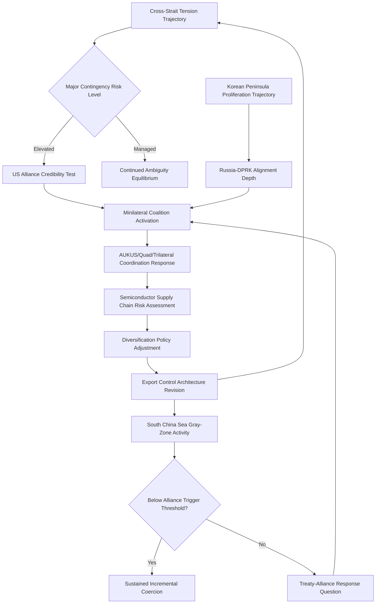

## East Asia and the Indo-Pacific

### Regional Structural Overview

East Asia and the broader Indo-Pacific constitute the geographic theater most directly associated with contemporary great-power competition dynamics, organized around the U.S.-China strategic rivalry but encompassing a dense set of additional bilateral and multilateral risk dimensions: unresolved territorial and sovereignty disputes, alliance-architecture management, and the region's centrality to global semiconductor and advanced-manufacturing supply chains.

[Inference] The analytical shift from "Asia-Pacific" to "Indo-Pacific" framing in official U.S., Japanese, Indian, and Australian strategic documents over the past decade reflects a deliberate broadening of the geographic and conceptual frame to explicitly incorporate the Indian Ocean and India's role, distinguishing it from the narrower Cold War-era Asia-Pacific conception centered primarily on the Western Pacific.

---

### Taiwan and the Cross-Strait Dimension

#### Structural Foundations

The Taiwan question—centered on the unresolved political status of Taiwan following the 1949 Chinese Civil War outcome, under which the Republic of China government retreated to Taiwan while the People's Republic of China established control over the mainland—is widely regarded as the most consequential single flashpoint in contemporary East Asian geopolitical risk analysis, given its combination of:

- **Great-power entanglement**: The United States' longstanding but deliberately ambiguous policy commitments under the Taiwan Relations Act and the "one China" policy framework, distinct from Beijing's "one China principle," creating persistent interpretive ambiguity regarding the scope of potential U.S. response to a cross-strait contingency (commonly termed "strategic ambiguity")
- **Technological centrality**: Taiwan's outsized role in global advanced-semiconductor manufacturing, discussed further below, generating economic-security entanglement extending far beyond the immediate cross-strait relationship
- **Escalation potential**: Analyst assessments generally treat a major cross-strait military contingency as carrying substantial risk of direct U.S.-China confrontation, given both the depth of (deliberately ambiguous) U.S. commitment signaling and the alliance-credibility stakes such a contingency would pose for the broader U.S. Indo-Pacific alliance architecture

#### Strategic Ambiguity and Its Critics

[Inference] The U.S. policy of strategic ambiguity—deliberately avoiding explicit commitment to either intervene or not intervene militarily in a cross-strait conflict—is intended to simultaneously deter Chinese use of force (by not foreclosing intervention) and discourage unilateral Taiwanese moves toward formal independence declaration (by not guaranteeing unconditional support). [Unverified] The policy's continued effectiveness and durability is a subject of active debate among strategists, with some arguing evolving Chinese capability has eroded the deterrent value of ambiguity and others arguing explicit commitment would be destabilizing or entrapping; official U.S. policy statements on this question should be checked against current reporting given the sensitivity and evolution of this framing.

#### Cross-Strait Military Balance Trajectory

[Inference] Comparative assessments generally note a substantial and continuing shift in the cross-strait military balance, reflecting sustained Chinese military modernization and force-structure investment specifically oriented toward cross-strait and area-denial contingencies, against which Taiwan's own defense modernization (including increased defense expenditure commitments and doctrinal shifts toward asymmetric "porcupine strategy" defense concepts) and deepening informal U.S. and partner security cooperation represent partial but [Unverified] not necessarily sufficient countervailing responses; net assessment of the military balance trajectory is a specialized and continuously updated area of analysis.

---

### South China Sea Disputes

#### Overlapping Claims Architecture

The South China Sea features overlapping sovereignty and maritime-zone claims among China, Taiwan, Vietnam, the Philippines, Malaysia, and Brunei, complicated by:

- **China's "nine-dash line" claim**: An expansive historical claim encompassing most of the South China Sea, found to lack legal basis under the UN Convention on the Law of the Sea by the 2016 Permanent Court of Arbitration ruling in the Philippines v. China case—a ruling China has not recognized or complied with
- **Artificial island construction and militarization**: Sustained Chinese land-reclamation and military-infrastructure construction on contested features, substantially altering the practical military balance in the disputed area over the past decade
- **Philippines-China friction**: Recurrent confrontations around contested features (notably Second Thomas Shoal and Scarborough Shoal) involving Chinese coast guard and maritime militia vessels against Philippine resupply and fishing operations, generating sustained escalation-management challenges given the Philippines' formal U.S. treaty-alliance status

[Inference] The South China Sea disputes are frequently analyzed as a template case for "gray zone" or "hybrid" coercion strategies—the use of coast guard, maritime militia, and civilian-flagged vessels rather than uniformed naval forces to assert territorial control incrementally while remaining below the threshold likely to trigger formal treaty-alliance military response, complicating both deterrence and alliance-credibility management.

---

### Korean Peninsula Dynamics

#### Structural Overview

The Korean Peninsula presents a distinct risk architecture centered on:

- The unresolved formal state of war between North and South Korea (governed by the 1953 Armistice Agreement rather than a formal peace treaty)
- North Korea's advancing nuclear and ballistic missile program, generating sustained proliferation and deterrence-stability concerns
- The U.S.-South Korea and U.S.-Japan bilateral alliance structures, and the comparatively underdeveloped trilateral U.S.-Japan-South Korea coordination architecture, historically constrained by bilateral Japan-South Korea historical-legacy tensions

[Inference] North Korea's deepening military and diplomatic engagement with Russia, particularly evident since 2022, including reported munitions transfers and troop deployment in the Russia-Ukraine conflict context, represents a notable and [Unverified] still-evolving realignment with implications for both Korean Peninsula deterrence dynamics and broader assessment of an emerging China-Russia-North Korea (and to a debated degree, Iran) loose alignment structure, sometimes informally characterized in policy commentary as an "axis of upheaval" or similar framing; the durability and depth of this realignment should be checked against current reporting.

---

### U.S. Alliance Architecture in the Indo-Pacific

#### Hub-and-Spoke Structure

Unlike NATO's integrated multilateral structure, the U.S. Indo-Pacific alliance system has historically consisted of a "hub-and-spoke" architecture: separate bilateral treaty alliances (Japan, South Korea, Philippines, Australia, Thailand) centered on Washington, with historically limited formal multilateral integration among the spoke states themselves.

#### Minilateral Densification

[Inference] Recent years have seen substantial growth in minilateral security arrangements intended to partially address hub-and-spoke limitations without constructing a full NATO-equivalent multilateral structure:

- **AUKUS** (Australia-UK-US): Centered on nuclear-powered submarine technology transfer and advanced-capability cooperation
- **The Quad** (Australia-India-Japan-US): A looser, primarily diplomatic and functional-cooperation-oriented grouping, notable for incorporating India despite India's non-treaty-alliance status and strategic-autonomy doctrine
- **Trilateral U.S.-Japan-South Korea coordination**: Significantly deepened in recent years, though [Unverified] its durability against renewed bilateral Japan-South Korea friction remains a subject of ongoing assessment

[Inference] This minilateral densification trend is frequently analyzed as a structural adaptation to the region's combination of diverse threat perceptions (China-focused, North Korea-focused, and mixed), historical bilateral frictions among potential multilateral partners (particularly Japan-South Korea), and the desire to build coalition flexibility without the rigidity of full multilateral treaty integration—directly relevant to alliance cohesion dynamics discussed earlier in this curriculum.

---

### Semiconductor and Advanced-Technology Supply Chain Centrality

#### Structural Concentration

[Inference] The Indo-Pacific region, and East Asia specifically, hosts an unusually concentrated share of global advanced-semiconductor manufacturing capacity, most notably Taiwan's dominant position in leading-edge logic chip fabrication, alongside substantial South Korean memory-chip manufacturing capacity and Japan's role in semiconductor manufacturing equipment and specialized materials. This concentration generates:

- **Economic-security entanglement**: Direct linkage between cross-strait stability and global technology supply-chain continuity, elevating Taiwan's strategic significance beyond traditional territorial-dispute analysis
- **Export-control and technology-restriction dynamics**: Sustained U.S. and allied policy attention to restricting Chinese access to advanced semiconductor manufacturing equipment and design capability, generating a distinct and rapidly evolving policy domain (export-control architecture) with direct bearing on U.S.-China technological-competition trajectory
- **Diversification and "friend-shoring" initiatives**: Policy efforts (particularly U.S.-led) to diversify advanced semiconductor manufacturing capacity geographically, reducing concentration risk, though [Unverified] the pace and scale of effective diversification relative to existing East Asian concentration remains a continuously updated empirical question

---

### Regional Risk Assessment Framework

The loop reflects that the region's distinct flashpoints (Taiwan, South China Sea, Korean Peninsula) are increasingly analyzed as interconnected through shared alliance-credibility stakes and supply-chain risk exposure, rather than as fully independent risk silos.

---

### Distinguishing Related Concepts

- **One China policy (U.S.) vs. One China principle (PRC)**: Distinct formulations with materially different content—the U.S. formulation acknowledges but does not endorse Beijing's position on Taiwan's status, preserving the ambiguity central to U.S. cross-strait policy, whereas Beijing's principle asserts Taiwan as an integral part of PRC territory
- **Gray-zone coercion vs. Conventional military conflict**: Gray-zone activity is specifically designed to remain below thresholds likely to trigger formal alliance military response or clear conflict classification, requiring distinct deterrence and response frameworks from conventional contingency planning
- **Hub-and-spoke vs. Multilateral alliance structure**: A structural distinction with direct implications for burden-sharing and cohesion dynamics—hub-and-spoke structures concentrate coordination burden on the hub power and can limit spoke-to-spoke interoperability absent deliberate minilateral investment, unlike NATO's integrated multilateral command structure

---

**Related Topics**

- Cross-strait military balance: net assessment methodologies and key capability indicators
- Export control architecture: entity lists, foreign direct product rule, and allied coordination
- AUKUS Pillar II advanced-capability cooperation beyond submarines
- Japan-South Korea historical-legacy disputes and their effect on trilateral coordination
- North Korea-Russia military cooperation: scope and strategic implications
- Philippines-China Second Thomas Shoal incidents and treaty-alliance escalation thresholds
- Semiconductor "friend-shoring" initiatives: CHIPS Act and allied equivalents
- Comparative alliance architecture: NATO integration vs. Indo-Pacific hub-and-spoke models