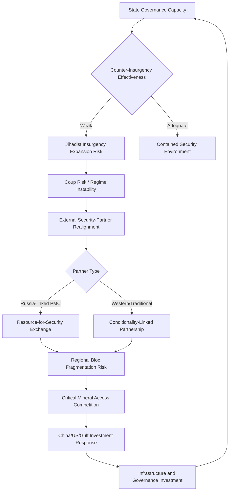

## Sub-Saharan Africa's Geopolitical Landscape

### Regional Structural Overview

Sub-Saharan Africa's contemporary geopolitical landscape is shaped by the intersection of persistent post-colonial state-fragility dynamics, an increasingly crowded and competitive field of external great-power engagement, and the region's growing demographic and resource significance to global systemic dynamics. Unlike the more bipolar-organized competition dynamics in East Asia or the historically bilateral rivalry structures of South Asia, Sub-Saharan Africa is best characterized as a multipolar arena of external engagement overlaid on substantial internal sub-regional heterogeneity.

[Inference] Analysts caution against treating "Sub-Saharan Africa" as a geopolitically uniform unit given the region's extraordinary internal diversity across more than 45 states with widely varying governance structures, resource endowments, and external-relationship patterns; sub-regional analysis (West Africa/Sahel, Horn of Africa, Southern Africa, Central Africa) is generally considered analytically necessary rather than optional.

---

### The Sahel Security Crisis

#### Structural Drivers

The Sahel region (spanning Mali, Burkina Faso, Niger, Chad, and adjacent states) has experienced a sustained and deepening security crisis characterized by:

- **Jihadist insurgency proliferation**: Sustained activity by groups affiliated with both al-Qaeda (notably the Jama'at Nusrat al-Islam wal-Muslimin, JNIM) and the Islamic State (Islamic State Sahel Province), exploiting weak state governance capacity, porous borders, and pre-existing ethnic and communal grievances
- **Recurrent military coups**: A pronounced coup cluster since 2020 across Mali, Burkina Faso, Niger, and Guinea, widely analyzed as reflecting both genuine governance-legitimacy crises tied to counter-insurgency failures and, in several cases, explicit military-junta framing of coup justification around inadequate civilian-government security performance
- **External security-partner realignment**: A pronounced shift among Sahelian juntas away from France (the traditional post-colonial security partner) and toward Russian security cooperation, including through Russian state-linked private military contractor engagement (the Wagner Group and its reorganized successor structures under closer Russian state control following Wagner's 2023 internal upheaval)

[Inference] The French military withdrawal from the Sahel (following successive expulsions from Mali, Burkina Faso, and Niger) represents a structurally significant realignment of the region's external security architecture, with substantial though [Unverified] not yet fully assessed implications for counter-insurgency trajectory, given differing operational approaches and force postures between departing French and incoming Russian-linked security actors.

#### The Alliance of Sahel States

[Inference] Mali, Burkina Faso, and Niger's 2023–2024 formation of the Alliance of Sahel States (AES), including formal withdrawal from the Economic Community of West African States (ECOWAS), represents a significant sub-regional institutional fragmentation, driven substantially by junta-government friction with ECOWAS over coup-response sanctions and democratic-governance conditionality; the AES's trajectory toward deeper institutional integration (including discussion of a joint military force and common currency alternatives) remains [Unverified] and should be checked against current reporting given the initiative's recency.

---

### Great Power and External Actor Engagement

#### China's Economic-Infrastructure Model

[Inference] China's engagement model across Sub-Saharan Africa has centered predominantly on infrastructure financing and construction (frequently under Belt and Road Initiative framing), resource-extraction investment (particularly in critical minerals relevant to global energy-transition supply chains, such as cobalt in the Democratic Republic of Congo), and expanding trade relationships, generally avoiding the deep security-architecture and political-conditionality engagement historically associated with Western partners, though this characterization has grown somewhat more complex with China's establishment of its first overseas military base in Djibouti and modestly expanding peacekeeping and security-cooperation engagement.

#### Russia's Security-Partnership Model

[Inference] Russian engagement has centered predominantly on security-sector cooperation, particularly through private military contractor arrangements providing regime-security and counter-insurgency support to partner governments, frequently in exchange for resource-extraction access (notably gold and other mineral concessions), combined with disinformation and influence-operation activity that has, in several documented cases, specifically targeted French and broader Western regional standing to facilitate Russian security-partner displacement of traditional partners.

#### United States and European Engagement

[Inference] U.S. and European engagement has historically combined development assistance, counter-terrorism security cooperation, and trade/investment initiatives, though this engagement model has faced sustained criticism within the region regarding perceived governance-conditionality paternalism and inconsistency, and has experienced notable retrenchment pressure in the Sahel specifically following the French military withdrawal and junta-government realignment described above; the broader trajectory of Western re-engagement strategy across the region remains an actively evolving policy area.

#### Gulf State Engagement

[Inference] Gulf states, particularly the UAE and Saudi Arabia, have expanded economic and, in some cases, security-adjacent engagement across the Horn of Africa specifically, reflecting the sub-region's strategic position along Red Sea and Bab-el-Mandeb maritime corridors (directly connecting to the Middle East and Gulf chokepoint dynamics discussed earlier in this curriculum) and generating a distinct layer of external-actor competition beyond the traditional China-Russia-West framing.

---

### The Horn of Africa

#### Structural Overview

The Horn of Africa (Ethiopia, Eritrea, Somalia, Djibouti, and the disputed territory of Somaliland) presents a distinct risk architecture shaped by:

- **Ethiopia's internal conflict dynamics**: Sustained internal conflict and communal tension within Africa's second-most-populous state, with substantial implications for broader Horn stability given Ethiopia's demographic and economic weight in the sub-region
- **Somalia's protracted state-fragility**: Sustained al-Shabaab insurgent activity against a still-consolidating federal government structure, combined with international counter-terrorism and peacekeeping/stabilization engagement
- **Red Sea and Bab-el-Mandeb strategic geography**: The sub-region's position astride critical maritime chokepoint geography, generating disproportionate external great-power interest relative to the sub-region's aggregate economic weight, evidenced by the unusually dense concentration of foreign military basing in Djibouti specifically (hosting U.S., French, Chinese, and Japanese military facilities within a small geographic area)

[Inference] Ethiopia's stated ambition to secure sovereign Red Sea maritime access (given its landlocked status following Eritrean independence), including a disputed 2024 memorandum of understanding with the breakaway territory of Somaliland regarding port access, has introduced a notable additional friction dimension with Somalia and generated broader regional diplomatic tension; the trajectory and durability of this arrangement remains [Unverified] and should be checked against current reporting.

---

### Critical Minerals and Resource Geopolitics

#### Democratic Republic of Congo and Cobalt Centrality

[Inference] The Democratic Republic of Congo's dominant position in global cobalt production—a mineral critical to lithium-ion battery manufacturing and thus central to the global energy-transition and electric-vehicle supply chain—has generated substantially elevated external strategic attention, combining sustained Chinese investment dominance in DRC mining-sector assets with more recent U.S. and allied policy attention toward diversifying critical-mineral supply-chain access away from concentrated Chinese-linked positions.

#### Resource Extraction and Governance Risk Interaction

[Inference] Critical-mineral extraction across multiple Sub-Saharan African states continues to interact with persistent governance-risk factors—including eastern DRC's protracted armed-conflict dynamics involving multiple state and non-state armed actors, with documented links between conflict-actor financing and mineral-resource control—generating a distinct analytical category of "conflict minerals" risk assessment relevant to global supply-chain due-diligence and corporate-responsibility frameworks.

---

### Demographic and Long-Term Structural Trajectory

#### Demographic Weight

[Inference] Sub-Saharan Africa's demographic trajectory—characterized by sustained high fertility rates relative to most other global regions and a correspondingly young and rapidly growing population—is frequently cited in longer-horizon geopolitical risk analysis as a structurally significant factor with substantial implications for global labor-force composition, migration pressure dynamics, and the region's prospective long-run economic and political weight, though the realization of this demographic potential into commensurate economic and geopolitical influence remains contingent on governance, infrastructure, and human-capital investment trajectories that are [Unverified] and vary substantially across the region's constituent states.

---

### Regional Risk Assessment Framework

The loop reflects that governance capacity, security-partner realignment, and resource-access competition form a mutually reinforcing cycle across much of the region, with external-actor engagement choices feeding back into the governance and stability conditions that initially shaped partner-selection incentives.

---

### Distinguishing Related Concepts

- **State fragility vs. State failure**: Fragility describes diminished but not absent governance capacity across specific functions (security provision, service delivery, territorial control); failure implies a more complete breakdown, a distinction with significant implications for appropriate external-engagement strategy
- **Private military contractor engagement vs. Formal state military presence**: Russian PMC-linked engagement operates under materially different legal, accountability, and diplomatic-signaling frameworks than formal state military deployment, complicating both regional governments' and external observers' assessment of genuine security commitment and accountability
- **Resource curse dynamics vs. General governance-risk factors**: Resource-dependent economies face a documented, though contested, distinct set of governance and conflict-risk dynamics (rent-seeking incentive structures, reduced institutional-accountability pressure) analytically separate from, though frequently overlapping with, general state-fragility risk factors

---

**Related Topics**

- Wagner Group reorganization and Russian Africa Corps security-partnership model
- ECOWAS institutional cohesion and the Alliance of Sahel States fragmentation
- Djibouti's multi-power basing concentration as a case study in small-state leverage
- Conflict minerals due-diligence frameworks and supply-chain governance
- Ethiopia-Somaliland port access dispute and Horn of Africa territorial recognition questions
- China's Belt and Road debt-sustainability risk across African partner states
- Demographic transition trajectories and long-run African geopolitical weight projections
- Comparative sub-regional governance trajectories: East African Community vs. Sahel fragmentation