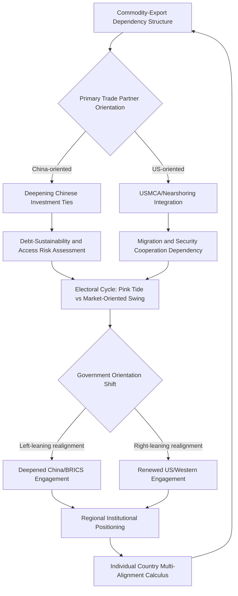

## Latin America's Shifting Alignments

### Regional Structural Overview

Latin America's contemporary geopolitical landscape is characterized less by the intense great-power military-security competition dynamics seen in East Asia or Eastern Europe, and more by a gradual reconfiguration of economic dependency and diplomatic alignment patterns—historically organized around U.S. regional primacy under the informal legacy framing of the Monroe Doctrine—toward a more diversified, multipolar engagement structure incorporating substantially deepened Chinese economic ties alongside persistent, if uneven, U.S. influence.

[Inference] Analysts generally characterize the region's shift as primarily economic and diplomatic rather than security-architecture-driven, distinguishing Latin America's alignment dynamics from the more militarized great-power competition patterns observed in the Indo-Pacific or Eastern Europe, though this distinction should not be overstated given growing attention to Chinese infrastructure investment with potential dual-use implications and periodic U.S. security-policy attention to the region.

---

### China's Economic Ascendance in the Region

#### Trade and Investment Trajectory

[Inference] China has become a leading trade partner for numerous Latin American economies over the past two decades, particularly for commodity-exporting economies (Brazil, Chile, Peru, Argentina) supplying agricultural products, minerals, and energy resources to Chinese demand, substantially diversifying the region's trade-dependency structure away from near-exclusive historical orientation toward the United States and, for some countries, former European colonial powers.

#### Infrastructure Financing and Belt and Road Engagement

[Inference] Chinese infrastructure financing across the region, frequently though not universally framed under Belt and Road Initiative branding, has concentrated on transportation, energy, and port infrastructure, generating both development-financing benefits for recipient states and, in specific cases, debt-sustainability and strategic-access concerns among U.S. and regional analysts, particularly regarding port-infrastructure investment with potential dual-use military-access implications.

#### Critical Minerals and the Lithium Triangle

[Inference] The "Lithium Triangle" spanning Argentina, Bolivia, and Chile—collectively holding a substantial share of global lithium reserves critical to battery and energy-transition supply chains—has generated intensified external investment competition, with Chinese firms securing substantial extraction and processing positions alongside more recent U.S. and allied policy attention toward securing diversified access, directly paralleling the critical-minerals competition dynamics observed in Sub-Saharan Africa's cobalt sector.

---

### United States Regional Engagement Trajectory

#### Historical Primacy and Its Erosion

[Inference] U.S. regional influence has historically rested on geographic proximity, extensive trade and investment integration (particularly via NAFTA/USMCA with Mexico and Central America), and a legacy security-primacy framework; this primacy has faced gradual erosion pressure from Chinese economic-engagement expansion, periodic U.S. policy inconsistency and reduced sustained diplomatic attention to the region relative to other geographic priorities, and recurrent regional political resentment toward historical U.S. intervention patterns.

#### Migration and Security Cooperation

[Inference] Contemporary U.S.-Latin America engagement has been substantially shaped by migration-management cooperation, particularly regarding Central American and, more recently, Venezuelan migration flows, alongside continued counter-narcotics security cooperation, though the relative policy weight assigned to migration and security cooperation versus broader economic and diplomatic engagement has varied significantly across successive U.S. administrations and remains [Unverified] regarding current-period specifics that should be checked against recent reporting.

---

### Political Alignment Volatility: The "Pink Tide" Pattern

#### Cyclical Ideological Swings

[Inference] Latin American electoral politics have exhibited a documented pattern of cyclical ideological realignment—broadly characterized as alternating "pink tide" (left-leaning governments, particularly prominent in the early-to-mid 2000s and again in a "second pink tide" wave in the 2020s) and right-leaning/market-oriented government periods—generating substantial volatility in individual countries' foreign-policy orientation, regional-integration engagement, and relationship posture toward the United States, China, and other external actors.

[Unverified] The specific composition of left-leaning versus right-leaning governments across the region is subject to continuous electoral change and should be verified against current reporting rather than treated as a stable structural feature; what is more structurally durable is the pattern of cyclical volatility itself rather than any specific government's alignment at a given moment.

#### Venezuela's Distinct Trajectory

[Inference] Venezuela presents a distinct and particularly severe case within the broader regional pattern: sustained authoritarian consolidation under the Chavez-Maduro governing framework, a severe and sustained economic and humanitarian crisis driving one of the largest sustained migration outflows in recent global history, extensive U.S. sanctions architecture, and deepened alignment with China, Russia, Cuba, and Iran as alternative external partners amid Western diplomatic and economic isolation—together constituting a case frequently analyzed as illustrative of the broader "axis of upheaval" framing discussed in the East Asia and Korean Peninsula context, applied to the Western Hemisphere.

---

### Sub-Regional Heterogeneity

#### Mexico and Central America

[Inference] Mexico's geopolitical position is substantially distinguished from South America by its deep economic integration with the United States via USMCA, extensive cross-border migration and security-cooperation entanglement, and increasing relevance as a "nearshoring" or "friend-shoring" destination for manufacturing capacity seeking to diversify supply chains away from concentrated Chinese-based production, generating a distinct economic-alignment dynamic relative to South American states more oriented toward Chinese commodity demand.

#### Brazil's Middle-Power Positioning

[Inference] Brazil occupies a distinctive regional position as Latin America's largest economy and a self-conceived middle-power actor pursuing an explicit multi-alignment strategy—maintaining substantial economic engagement with China (its largest trading partner), participating in the BRICS grouping and associated institutional architecture, while preserving engagement with Western institutions and periodic diplomatic mediation ambitions—directly exemplifying the middle-power hedging framework discussed earlier in this curriculum, applied to Brazil's specific regional-leadership aspirations.

#### Southern Cone and Andean Variation

[Inference] Chile, Argentina, Peru, and Colombia exhibit substantial individual variation in external-alignment posture driven by domestic political-cycle factors, commodity-export composition, and historical U.S.-relationship depth, resisting straightforward regional generalization; sub-regional analysis at the individual-country level is generally considered necessary given this heterogeneity, paralleling the analytical caution urged in the Sub-Saharan Africa context against treating the region as a uniform analytical unit.

---

### Regional Risk Assessment Framework

The loop reflects that trade-dependency structure and domestic electoral-cycle volatility interact continuously to reshape individual countries' external-alignment posture, without producing a single stable region-wide alignment pattern.

---

### Distinguishing Related Concepts

- **Economic alignment vs. Security alignment**: Latin American states frequently pursue economic diversification (deepening Chinese trade/investment ties) without corresponding security-architecture realignment away from historical U.S.-oriented cooperation, a decoupling less commonly observed in Indo-Pacific or Eastern European contexts where economic and security alignment tend to move more closely together
- **Pink tide ideological framing vs. Individual-country policy substance**: Broad ideological-bloc characterization can obscure substantial policy variation among governments nominally grouped under the same ideological label, given differing domestic-coalition constraints and pragmatic economic-policy constraints across nominally aligned governments
- **BRICS membership vs. Formal alliance commitment**: Brazil's BRICS participation, and the group's broader expansion, constitutes an institutional and diplomatic-coordination framework rather than a formal mutual-defense or exclusive-alignment commitment, consistent with the broader middle-power hedging behavior pattern rather than bloc-style exclusive alignment

---

**Related Topics**

- BRICS expansion and institutional development: New Development Bank and currency-diversification initiatives
- Venezuela's sanctions architecture and migration-crisis regional spillover effects
- Lithium Triangle extraction governance and critical-minerals supply-chain diversification
- USMCA renegotiation dynamics and nearshoring manufacturing-investment trends
- Comparative pink-tide government case studies: policy substance versus ideological framing
- China-Latin America port and infrastructure investment: dual-use access concerns
- Colombia and the post-conflict security-governance trajectory
- Argentina's debt-crisis history and its bearing on external-creditor alignment choices