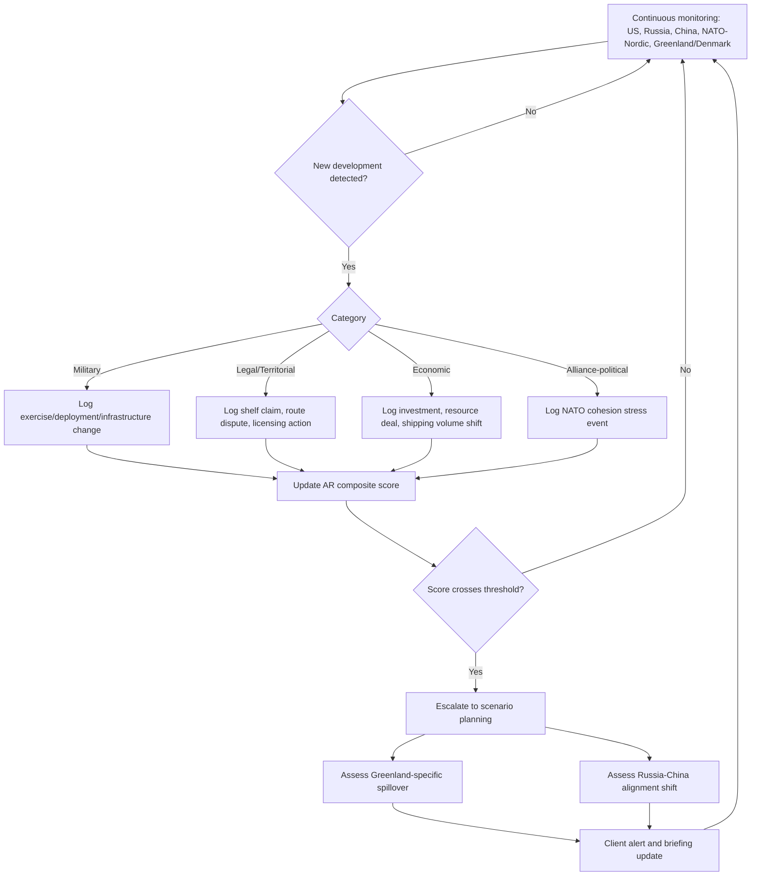

## The Arctic as an Emerging Strategic Frontier

### Strategic Overview and Drivers of Change

The Arctic has shifted, within roughly the past two decades and especially since 2022, from a zone of low-tension scientific cooperation into an active theater of great-power competition. Three structural forces drive this transition:

1. **Climate-driven access**: accelerating sea-ice loss is opening seasonal shipping lanes and extending the operating window for resource extraction and naval activity.
2. **Resource and route value**: the region holds substantial undiscovered hydrocarbon and critical-mineral potential alongside three emerging trans-Arctic shipping corridors that could shorten Asia-Europe transit times.
3. **Alliance realignment**: Finland's and Sweden's 2023–2024 NATO accessions mean seven of the eight Arctic Council states are now NATO members, leaving Russia as the sole non-aligned Arctic state — a structural change that has reshaped the region's security architecture more than any single incident.

Layered on top of these structural drivers is an acute, personality-driven flashpoint since January 2025: the return of the Trump administration and its explicit, repeated interest in acquiring Greenland, which has strained NATO cohesion even as it has accelerated US strategic attention to the High North.

### Geography and Legal Framework

The Arctic is governed by an unusually dense but incomplete legal architecture:

- **UNCLOS (UN Convention on the Law of the Sea)**: governs territorial waters, exclusive economic zones (EEZs), and extended continental shelf claims. Arctic coastal states (Russia, Canada, the US, Norway, Denmark via Greenland) have submitted or are pursuing extended continental shelf claims — notably overlapping claims to the Lomonosov Ridge by Russia, Canada, and Denmark — that remain formally unresolved. **[Unverified]** — the US has signed but not ratified UNCLOS, which analysts frequently flag as a structural handicap to formal US shelf claims relative to ratifying states.
- **The Arctic Council**: the primary multilateral forum (eight member states plus Indigenous Permanent Participant organizations), but it has no security mandate and its work was substantially disrupted following Russia's 2022 invasion of Ukraine, when the other seven members paused cooperation with Moscow.
- **The Svalbard Treaty (1920)**: grants Norway sovereignty over Svalbard while allowing signatory states (including Russia) commercial and scientific access — a long-standing source of friction given Russia's continued coal-mining presence there.
- **NATO's evolving Arctic posture**: the February 2026 launch of **Arctic Sentry**, an operational framework bringing allied Arctic activities under unified command, formalizes what had previously been a looser set of bilateral and multilateral exercises.

### The Militarization Track

Military buildup is the most measurable trend in the region:

- **NATO**: Finland's and Sweden's accession extended the alliance's Arctic land border with Russia substantially. **Arctic Sentry** (launched February 2026) and large-scale exercises such as **Arctic Shield 2026** (roughly 400 personnel from ten NATO nations training in Greenland from September 2026) reflect a shift from episodic exercises to standing operational frameworks.
- **Russia**: has reopened and expanded Soviet-era Arctic military infrastructure, including airfields and deep-water ports, and maintains the bulk of its nuclear submarine (SSBN) force under the Northern Fleet, which analysts consistently identify as the single most strategically significant Russian military asset in the region given its role in second-strike nuclear deterrence.
- **Dual-use ambiguity**: much Arctic infrastructure investment (ports, airstrips, research stations) carries latent military utility, making infrastructure-monitoring a core analytical task distinct from tracking formally declared military deployments.

### Russia's Arctic Posture

Russia holds by far the longest Arctic coastline and the largest Arctic population and economic footprint (including Yamal LNG and other hydrocarbon infrastructure), making the region central to Russian national strategy independent of the Ukraine war. Key elements:

- **Northern Sea Route (NSR) control**: Russia asserts extensive regulatory authority over NSR transit, including notification and icebreaker-escort requirements that other states (particularly the US) contest as exceeding lawful EEZ authority.
- **Icebreaker fleet dominance**: Russia operates the world's largest fleet of icebreakers, including nuclear-powered vessels, giving it an operational advantage in year-round Arctic access that no other state currently matches.
- **Post-2022 isolation and China dependency**: Western sanctions have pushed Russia toward deeper reliance on Chinese investment and shipping partnership for Arctic hydrocarbon projects, subtly shifting the power balance within the Russia-China Arctic relationship toward Beijing. **[Inference]** — the degree of this shift is debated among analysts and depends heavily on unresolved questions about Chinese investment appetite for Arctic projects under continued sanctions risk.

### China's "Near-Arctic State" Strategy

China, which has no Arctic territory, has since 2018 formally described itself as a **"near-Arctic state"** and pursues Arctic interests through several channels:

- **Polar Silk Road**: framed as an extension of the Belt and Road Initiative, emphasizing Chinese investment in Arctic shipping infrastructure, research stations, and resource projects, predominantly through partnership with Russia given Western states' increasing wariness of Chinese Arctic investment.
- **Scientific and observer status**: China holds observer status at the Arctic Council and operates research stations (e.g., in Svalbard and Iceland) that Western analysts frequently describe as serving dual scientific and strategic intelligence-gathering functions.
- **Icebreaker and shipping capacity building**: China has invested in its own icebreaker fleet (e.g., the Xue Long vessels) to reduce dependence on Russian escort services for NSR transit.
- **Blocked investment attempts**: Danish authorities, under sustained US pressure, have blocked multiple proposed Chinese infrastructure and mining projects in Greenland, illustrating how the Greenland flashpoint functions partly as a mechanism for excluding Chinese Arctic access.

### The Greenland Flashpoint

Greenland has moved from a peripheral Arctic governance issue to the region's most acute and closely watched flashpoint:

- **Strategic rationale**: Greenland sits between the North Atlantic and Arctic Ocean, hosts the **Pituffik Space Base** (formerly Thule Air Base) critical to US ballistic missile early warning and space surveillance, and holds substantial rare-earth and critical-mineral potential relevant to the broader US-China critical-minerals competition.
- **The Trump annexation push**: since returning to office in January 2025, President Trump has repeatedly and publicly expressed interest in the United States acquiring Greenland, at points not ruling out the use of military or economic pressure. This has been widely reported as straining relations with Denmark and unsettling NATO cohesion more broadly, since Greenland is Danish sovereign territory (an autonomous constituent country within the Kingdom of Denmark) and Denmark is a NATO ally. **[Unverified]** — reporting through mid-2026 suggests the administration has moderated its public rhetoric and ruled out invasion, but the durability and sincerity of that moderation has not been independently confirmed, and analysts continue to treat the issue as unresolved.
- **Greenlandic agency**: Greenland's home-rule government has pursued its own foreign-policy voice (articulated under the framing "Nothing About Us Without Us") and controls its own subsoil resource rights, meaning any US, Chinese, or Russian access ambitions must also contend with Greenlandic — not only Danish — political consent.
- **Resource dimension**: US Geological Survey assessments from the 2000s pointed to significant offshore oil and gas potential, though Greenland's government suspended new hydrocarbon licensing in 2021 on environmental grounds; the more active current interest centers on rare-earth and critical-mineral deposits relevant to defense and clean-energy supply chains.

### Maritime Routes and Resource Competition

Three emerging trans-Arctic corridors carry differing strategic and legal significance:

- **Northern Sea Route (NSR)**: along Russia's Arctic coast; currently the most navigable and most contested over regulatory jurisdiction.
- **Northwest Passage**: through the Canadian Arctic Archipelago; Canada claims it as internal waters, a position the US and other states dispute, treating it instead as an international strait.
- **Transpolar Sea Route**: a prospective future route directly across the central Arctic Ocean, currently largely theoretical given ice conditions but of long-term interest as ice loss continues. **[Speculation]** — the commercial viability timeline for this route beyond occasional seasonal transit remains genuinely uncertain and is sensitive to ice-melt trajectories that vary across climate models.

Resource competition centers on undiscovered hydrocarbon reserves (a frequently cited but dated USGS estimate suggests the Arctic may hold a substantial share of the world's undiscovered conventional oil and gas, though extraction economics and environmental constraints heavily discount practical near-term development) and critical minerals (rare earths, and in some assessments uranium and other strategic minerals) relevant to defense and clean-energy industrial policy in the US, EU, and China.

### Risk Modeling Framework for Arctic Competition

Because Arctic risk is multi-actor (US, Russia, China, and secondarily Canada, Nordic states, and Greenland/Denmark) rather than a clean bilateral dyad, analysts typically model it as a layered competition index rather than a single escalation ladder:

$$AR = \alpha M_r + \beta E_c + \gamma L_d + \delta A_p$$

Where $AR$ is a composite Arctic-risk score, $M_r$ captures militarization tempo (exercise frequency, force posture, infrastructure buildup), $E_c$ captures economic/resource competition intensity (investment flows, licensing disputes, shipping volume shifts), $L_d$ captures unresolved legal-dispute salience (continental shelf claims, strait/route jurisdiction disputes), and $A_p$ captures alliance-political stress (e.g., intra-NATO friction generated by the Greenland issue). Weights $\alpha, \beta, \gamma, \delta$ are analyst- or model-assigned based on the client's exposure profile. **[Inference]** — as with the composite indices presented elsewhere in this course, this is an illustrative pedagogical construct rather than a validated or industry-standardized model.

### Arctic Actors and Strategic Assets (svg_diagram)

<svg xmlns="http://www.w3.org/2000/svg" viewBox="0 0 760 460">
\<style\>
.title{font:bold 16px sans-serif;fill:#1a1a1a;}
.lbl{font:12px sans-serif;fill:#ffffff;}
.small{font:10px sans-serif;fill:#1a1a1a;}
.russia{fill:#8e44ad;}
.us{fill:#2874a6;}
.china{fill:#c0392b;}
.nato{fill:#117864;}
\</style\>
<text x="380" y="24" text-anchor="middle" class="title">Arctic Actors and Strategic Assets (svg_diagram)</text>

<circle cx="380" cy="240" r="70" fill="#d5d8dc" />
<text x="380" y="244" text-anchor="middle" class="small" font-weight="bold">Central Arctic Ocean</text>

<circle cx="200" cy="140" r="60" class="russia" />
<text x="200" y="135" text-anchor="middle" class="lbl">Russia</text>
<text x="200" y="150" text-anchor="middle" class="lbl" font-size="9">Northern Fleet / NSR</text>

<circle cx="560" cy="140" r="60" class="us" />
<text x="560" y="135" text-anchor="middle" class="lbl">United States</text>
<text x="560" y="150" text-anchor="middle" class="lbl" font-size="9">Alaska / Greenland push</text>

<circle cx="380" cy="380" r="55" class="nato" />
<text x="380" y="375" text-anchor="middle" class="lbl">NATO Nordic Front</text>
<text x="380" y="390" text-anchor="middle" class="lbl" font-size="9">Finland / Sweden / Norway</text>

<circle cx="150" cy="380" r="50" class="china" />
<text x="150" y="375" text-anchor="middle" class="lbl">China</text>
<text x="150" y="390" text-anchor="middle" class="lbl" font-size="9">Polar Silk Road</text>

<circle cx="610" cy="380" r="50" fill="#7d6608" />
<text x="610" y="375" text-anchor="middle" class="lbl" font-size="11">Greenland</text>
<text x="610" y="390" text-anchor="middle" class="lbl" font-size="9">Pituffik / minerals</text>

<line x1="260" y1="170" x2="330" y2="220" stroke="#1a1a1a" stroke-width="1.5" />
<line x1="500" y1="170" x2="430" y2="220" stroke="#1a1a1a" stroke-width="1.5" />
<line x1="380" y1="310" x2="380" y2="330" stroke="#1a1a1a" stroke-width="1.5" />
<line x1="200" y1="340" x2="330" y2="270" stroke="#1a1a1a" stroke-width="1.5" stroke-dasharray="4,3" />
<line x1="560" y1="330" x2="600" y2="335" stroke="#1a1a1a" stroke-width="1.5" />

<text x="380" y="440" text-anchor="middle" class="small">Solid lines: direct strategic contact/friction. Dashed line: China-Russia partnership channel. Positions illustrative, not to scale.</text>
</svg>

### Arctic Risk Monitoring Workflow


```

### **Key Points**

- The Arctic's transformation into a strategic frontier is driven by ice-loss-enabled access, resource and shipping-route value, and NATO's near-total Arctic membership following Finnish and Swedish accession, leaving Russia isolated but militarily entrenched via its Northern Fleet.
- China's "near-Arctic state" framing and Polar Silk Road strategy operate primarily through partnership with a sanctions-isolated Russia, alongside contested scientific and investment access to Nordic and Greenlandic territory.
- Greenland has become the region's sharpest flashpoint since January 2025 due to the Trump administration's explicit annexation interest, straining NATO cohesion even as it accelerates US strategic investment in the island's space, early-warning, and critical-minerals assets.
- Legal ambiguity — overlapping continental shelf claims, contested Northwest Passage and NSR jurisdiction, and incomplete US UNCLOS ratification — means Arctic risk analysis must track legal/diplomatic developments as closely as military ones.

### **Example**

A mining-sector client with rare-earth exploration interests in Greenland asks a risk analyst to assess political risk over an 18-month horizon. Rather than treating this as a single "Greenland risk" score, the analyst decomposes it: (1) *Alliance-political risk* — the probability that renewed US pressure on Denmark disrupts the existing licensing regime; (2) *Legal risk* — whether Greenlandic home-rule authorities alter subsoil resource policy independent of Copenhagen or Washington; (3) *Competitive-exclusion risk* — the likelihood that US pressure to block Chinese-linked capital affects the client's own financing options if any capital sources have Chinese exposure; and (4) *Military-infrastructure risk* — whether expanded NATO exercise activity (e.g., Arctic Shield-type deployments) affects site access or local logistics. This decomposition, rather than a single composite figure, is what the client's board actually needs to make a financing decision.

### **Conclusion**

The Arctic has moved decisively from a cooperative, low-tension periphery to a genuine strategic frontier where military posture, unresolved maritime law, resource competition, and now an unusually personalized great-power territorial dispute over Greenland intersect. Its risk profile differs from classic bilateral rivalries in being inherently multi-actor and multi-domain, requiring analysts to track legal, economic, and alliance-political indicators alongside conventional military signals, with Greenland currently functioning as the region's most acute and fastest-moving flashpoint.

### **Next Steps**

- Continental shelf claims and the Lomonosov Ridge dispute under UNCLOS
- NATO's Arctic Sentry framework and its implications for alliance burden-sharing
- Critical-minerals supply-chain competition and Greenlandic resource policy
- Russia's Northern Fleet and second-strike nuclear deterrence posture
- China-Russia Arctic partnership dynamics under sustained Western sanctions
- Comparative case study: Svalbard as a legacy multilateral-access regime under new strategic pressure