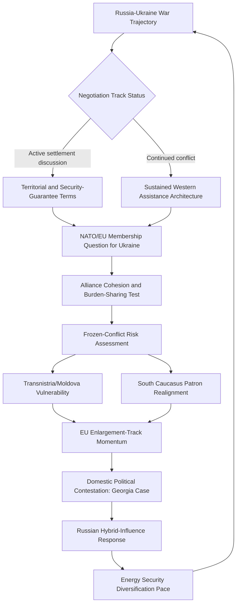

## Europe's Eastern Periphery

### Regional Structural Overview

Europe's eastern periphery—encompassing Ukraine, Belarus, Moldova, the South Caucasus (Georgia, Armenia, Azerbaijan), and the broader post-Soviet space bordering the European Union and NATO's eastern flank—constitutes the geographic theater most directly organized around the contemporary Russia-West structural confrontation, and is widely treated as the region where great-power competition dynamics have manifested in the most sustained and severe direct military conflict of the contemporary period.

[Inference] The region's analytical significance derives substantially from its position as a contested buffer zone between Russian-sphere and Euro-Atlantic institutional architecture (EU and NATO), a structural condition with roots in the post-Soviet settlement's failure to establish a stable, mutually accepted security architecture for the states positioned between the two blocs—a debate with continuing relevance to competing explanatory frameworks for the region's conflict trajectory.

---

### The Russia-Ukraine War

#### Structural and Historical Foundations

[Inference] The 2022 full-scale Russian invasion of Ukraine, following the 2014 annexation of Crimea and the initiation of conflict in the Donbas region, represents the most consequential contemporary test of the post-Cold War European security order, with competing analytical framings regarding root causes:

- **NATO-enlargement-centered framings**: [Inference] Emphasize Russian threat perception regarding NATO's post-Cold War eastward expansion and the prospect of further enlargement to include Ukraine as a primary driver of Russian security calculus and eventual invasion decision
- **Russian revisionism-centered framings**: [Inference] Emphasize Russian leadership's stated and inferred ambitions regarding Ukraine's independent statehood and civilizational alignment, treating the invasion as substantially driven by imperial-restorationist objectives rather than primarily defensive threat-response logic
- [Unverified] These framings are not mutually exclusive and are weighted differently across the analytical and policy literature; a comprehensive treatment should present both as contested explanatory frameworks rather than adjudicating a settled causal account

#### Western Response Architecture

[Inference] The Western response has centered on an unprecedented combination of sustained military assistance to Ukraine, an extensive economic sanctions architecture targeting the Russian financial system, energy exports, and technology access, and substantial diplomatic and humanitarian support, coordinated through both bilateral channels and multilateral frameworks (the Ramstein-format Ukraine Defense Contact Group, EU sanctions coordination, and G7 coordination mechanisms).

#### NATO Enlargement Response

[Inference] The invasion directly catalyzed a historically significant NATO enlargement response: Finland's 2023 and Sweden's 2024 accessions ended both states' long-standing formal neutrality/non-alignment postures, substantially extending NATO's direct border with Russia and representing one of the most consequential alliance-cohesion and burden-sharing developments discussed in this curriculum's earlier chapter, directly illustrating how threat-perception convergence can rapidly override previously durable strategic-autonomy doctrines.

#### War Trajectory and Negotiation Dynamics

[Unverified] The war's territorial, military, and diplomatic-negotiation trajectory has continued to evolve substantially since any given analytical snapshot; specific battlefield conditions, negotiation-track developments, and prospective settlement-framework proposals should be checked against current reporting rather than treated as static, given the pace of change characteristic of this conflict.

---

### Belarus's Structural Alignment

#### Deepening Dependency on Russia

[Inference] Belarus under the Lukashenko government has pursued a trajectory of deepening structural dependency on Russia, substantially accelerated following the contested 2020 Belarusian presidential election and subsequent Russian-backed regime-security support amid sustained domestic opposition and Western sanctions pressure, and further entrenched through Belarus's role as a staging area for the 2022 invasion of Ukraine and continued military-cooperation integration, including hosting of Russian tactical nuclear weapons under a 2023 agreement.

[Inference] Belarus is frequently analyzed as having transitioned from a historically balanced, if authoritarian, hedging posture between Russia and the West toward a substantially more constrained and dependent alignment, illustrating a case where hedging space—discussed in the earlier chapter on middle-power strategic hedging—can contract sharply under conditions of acute regime-security dependency on a single external patron.

---

### Moldova and Transnistria

#### Structural Overview

[Inference] Moldova presents a distinct case combining formal EU-candidacy-track Western alignment (reflecting substantial domestic pro-European political consolidation in recent years) with the unresolved presence of the Russian-backed breakaway territory of Transnistria, which hosts a residual Russian military presence and constitutes a persistent frozen-conflict vulnerability and potential leverage point for Russian regional influence, generating sustained Moldovan governmental attention to energy-security diversification (given historical dependency on Russian-linked gas supply routed through Transnistria) and hybrid-interference resilience.

---

### The South Caucasus

#### Nagorno-Karabakh Conflict Resolution and Its Aftermath

[Inference] The decades-long Armenia-Azerbaijan conflict over the Nagorno-Karabakh region reached a decisive turning point with Azerbaijan's September 2023 military offensive, resulting in the region's full reincorporation under Azerbaijani control and the near-total displacement of the ethnic Armenian population that had previously inhabited it—a development that fundamentally altered the conflict's structure from a protracted territorial dispute to a post-conflict settlement and reconciliation-negotiation phase between Armenia and Azerbaijan, the trajectory of which remains [Unverified] and should be checked against current reporting.

#### Shifting External Patron Dynamics

[Inference] The South Caucasus has experienced a notable reconfiguration of external-patron relationships: Russia's traditional role as security guarantor to Armenia has been substantially undermined by Russia's perceived failure to intervene on Armenia's behalf during the 2023 offensive (attributed in part to Russian military-resource constraints given the concurrent Ukraine conflict), driving increased Armenian diplomatic engagement with the EU, the United States, and France, while Azerbaijan has deepened its strategic partnership with Turkey (reflecting shared ethnic-Turkic identity framing) and maintained substantial energy-export relationships with European buyers seeking to diversify away from Russian gas dependency.

#### Georgia's Contested Trajectory

[Inference] Georgia presents a case of increasing domestic political contestation over the country's Western-integration trajectory, with the ruling Georgian Dream party facing sustained domestic protest and Western criticism over legislation and governance developments perceived by critics as authoritarian-consolidating and Russia-aligned, generating friction with Georgia's formal EU-candidacy status and illustrating how domestic political-economy dynamics (discussed as a general driver of alliance and alignment volatility earlier in this curriculum) can directly affect a state's external-alignment trajectory even absent direct external military pressure; current developments should be checked against recent reporting given the fluidity of this situation.

---

### Energy Security Realignment

#### European Diversification from Russian Gas

[Inference] The Russia-Ukraine war catalyzed a historically rapid European effort to diversify away from Russian pipeline gas dependency, involving substantially increased liquefied natural gas (LNG) import capacity development (particularly from the United States and Qatar), accelerated renewable-energy investment, and diplomatic engagement with alternative suppliers, representing a structurally significant shift in European energy-security architecture with direct bearing on the broader Russia-EU relationship trajectory and reduced Russian economic leverage over European energy policy relative to the pre-2022 baseline.

---

### Regional Risk Assessment Framework

The loop reflects that the war's trajectory, frozen-conflict vulnerabilities across the periphery, and EU/NATO enlargement momentum are mutually reinforcing variables rather than independent risk factors, with Russian hybrid-influence responses feeding back into the primary conflict dynamics through destabilization of adjacent alignment-contested states.

---

### Distinguishing Related Concepts

- **Frozen conflict vs. Active conflict**: Transnistria and the pre-2023 Nagorno-Karabakh situation exemplify frozen-conflict status (unresolved territorial dispute without sustained active combat); this status carries distinct risk-analysis implications from active-conflict zones, including latent escalation potential and utility as external-leverage instruments
- **EU accession track vs. NATO membership track**: These are distinct institutional processes with different membership criteria, security implications, and Russian threat-perception sensitivity—Ukraine's and Georgia's candidacies involve materially different accession requirements and geopolitical stakes for each institutional track, and progress on one does not imply parallel progress on the other
- **Hybrid interference vs. Conventional military threat**: Russian regional influence operations frequently combine disinformation, cyber activity, and political-financing interference with conventional military pressure, requiring distinct and complementary analytical and policy-response frameworks rather than treatment as a single undifferentiated threat category

---

**Related Topics**

- NATO Article 5 credibility and eastern-flank forward-deployment posture since 2022
- European energy security architecture: LNG diversification and renewable acceleration
- Post-Soviet frozen conflicts comparative analysis: Transnistria, Abkhazia, South Ossetia
- Sanctions architecture effectiveness: Russian financial-system and energy-export restrictions
- Armenia-Azerbaijan peace-treaty negotiation dynamics and regional connectivity proposals
- Georgia's EU-candidacy suspension risk and domestic political-contestation trajectory
- Belarus as a case study in hedging-space contraction under patron dependency
- Ukraine reconstruction financing and long-term EU-integration pathway design