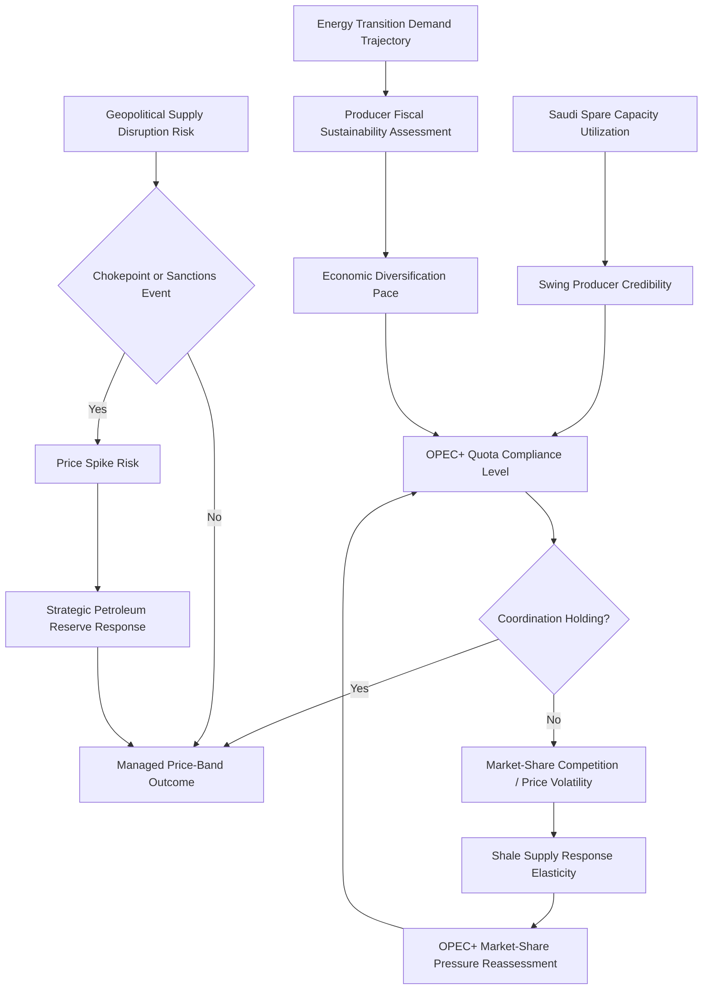

## Oil and Gas Geopolitics and OPEC Dynamics

### Structural Foundations of Hydrocarbon Geopolitics

#### Why Oil and Gas Remain Distinct Strategic Commodities

[Inference] Oil and, to a somewhat lesser degree, natural gas occupy a distinct category among traded commodities in geopolitical analysis due to a combination of factors: highly concentrated geographic reserve distribution relative to globally dispersed consumption, historically inelastic short-run demand (particularly for oil, given transportation-sector dependency), critical military and economic-security applications, and the resulting willingness of both producing and consuming states to treat hydrocarbon access and pricing as matters of core national-security policy rather than purely commercial concern.

#### Reserve Concentration and Structural Power

[Inference] The Middle East and Gulf region, discussed in the earlier regional chapter, holds a disproportionate share of global proven conventional oil reserves, generating structural bargaining leverage for Gulf producers in global energy markets that substantially exceeds what their aggregate economic or military weight alone would predict—a core driver of the region's disproportionate great-power strategic attention discussed previously in this curriculum.

---

### OPEC: Institutional Structure and Function

#### Founding Rationale and Membership

[Inference] The Organization of the Petroleum Exporting Countries, founded in 1960 by Iran, Iraq, Kuwait, Saudi Arabia, and Venezuela, was established primarily to coordinate member-state production and pricing policy in response to the pricing power previously held by major international oil companies (the "Seven Sisters"), shifting substantial pricing influence toward producer-state governments. Membership has expanded and, in some cases, contracted over time (including Qatar's 2019 withdrawal and Ecuador's 2020 withdrawal), reflecting evolving member-state strategic calculations regarding the value of coordinated-production membership versus independent production policy.

#### Production Quota Mechanism

[Inference] OPEC's primary policy instrument is coordinated production-quota setting among member states, intended to manage global oil-market supply and, by extension, price levels, requiring sustained internal negotiation given members' differing fiscal break-even price requirements, spare-capacity levels, and market-share versus price-level strategic preferences—generating persistent internal coordination-difficulty dynamics analytically comparable to the collective-action and free-riding challenges discussed in the alliance burden-sharing chapter, though applied to a market-coordination rather than security-provision context.

$$Q_{total} = \sum_{i=1}^{n} q_i$$

Where $Q_{total}$ represents aggregate coordinated production and $q_i$ represents each member state's individually negotiated quota. [Inference] The stability of this arrangement depends on members' compliance with negotiated quotas; historical OPEC market-management episodes have repeatedly demonstrated member incentive to exceed quota allocations when market conditions make individual defection profitable, generating a coordination-stability challenge structurally analogous to cartel-stability problems in industrial-organization economics.

#### OPEC+ and the Expanded Coordination Framework

[Inference] The 2016 formation of OPEC+, incorporating major non-OPEC producers—most significantly Russia—into the coordinated production-management framework, substantially expanded the coalition's aggregate market-share coverage and coordination complexity, introducing a major non-OPEC state actor with materially different fiscal, strategic, and (following 2022) sanctions-constrained circumstances into the core coordination mechanism, generating additional analytical complexity regarding the durability of Saudi-Russia coordination given their differing strategic contexts.

---

### Saudi Arabia's Swing Producer Role

#### Spare Capacity and Market Management

[Inference] Saudi Arabia's distinctive role within OPEC+ derives substantially from its relatively unique possession of meaningful spare production capacity—the ability to rapidly increase production beyond current output levels—which functions as the primary mechanism for OPEC+ market-management credibility, since quota-setting influence depends significantly on members' actual capacity to adjust production materially, a capability most other members possess to a much more limited degree.

#### Strategic Objectives in Price Management

[Inference] Saudi oil-market strategy is generally analyzed as balancing multiple, at times competing, objectives: maintaining sufficient price levels to support its substantial fiscal break-even requirements (particularly given large-scale domestic economic-diversification investment under Vision 2030, discussed in the earlier Gulf-geopolitics chapter), preserving long-run market share against competing supply sources (including U.S. shale production), and using production-policy flexibility as a diplomatic and strategic-signaling instrument in broader relations with major consuming powers and market participants including Russia.

---

### The U.S. Shale Revolution's Structural Impact

#### Transformation of Global Supply Dynamics

[Inference] The U.S. shale (tight oil and shale gas) production expansion, driven by hydraulic fracturing and horizontal-drilling technological advancement over the past roughly fifteen years, fundamentally altered global hydrocarbon-market structure, transforming the United States from a substantial net hydrocarbon importer into a major producer and, for gas specifically, a leading exporter, with several significant geopolitical implications:

- **Reduced U.S. Middle East energy-dependency framing**: [Inference] While U.S. Middle East strategic engagement has not been driven purely by direct energy-import dependency in recent years, the shale revolution has altered the traditional framing of U.S. Gulf engagement as primarily energy-security-motivated, contributing to broader policy debate regarding appropriate U.S. regional prioritization discussed in the earlier Middle East chapter
- **OPEC+ market-share pressure**: [Inference] Shale production's relatively short investment-cycle responsiveness to price signals (compared to conventional long-lead-time projects) has altered OPEC+ market-management calculus, since shale supply can respond more rapidly to price increases than traditional supply sources, constraining the price-elevation benefit OPEC+ can sustainably extract through coordinated production restriction
- **LNG export capacity growth**: [Inference] Associated U.S. natural gas production growth has driven substantial LNG export-capacity development, positioning the United States as a significant alternative gas supplier directly relevant to the European gas-diversification dynamics discussed in the Europe's eastern periphery chapter

---

### Natural Gas Geopolitics: Distinct Market Structure

#### Pipeline Dependency versus LNG Flexibility

[Inference] Natural gas geopolitics has historically differed structurally from oil geopolitics due to gas's traditional dependency on fixed pipeline infrastructure connecting specific producer-consumer pairs, generating durable bilateral dependency relationships (most notably historical European dependency on Russian pipeline gas) with distinct coercive-leverage potential compared to oil's more globally fungible, tanker-transportable market structure; the accelerating growth of LNG trade capacity is gradually increasing gas-market flexibility and reducing this structural pipeline-dependency vulnerability, though [Unverified] the pace of this transition and its completeness varies substantially by region and should be checked against current infrastructure-development reporting.

#### Russian Gas Leverage and Its Post-2022 Erosion

[Inference] Russia's historical use of pipeline gas-supply relationships as a source of diplomatic leverage over European consumer states, most acutely demonstrated through the 2022 supply disruptions following the full-scale invasion of Ukraine, catalyzed the substantial European gas-diversification response discussed in the Europe's eastern periphery chapter, illustrating how acute demonstration of coercive energy leverage can accelerate structural dependency-reduction responses that ultimately diminish the leverage-holder's long-run strategic position.

---

### Energy Transition's Geopolitical Implications

#### Demand-Side Structural Uncertainty

[Inference] The global energy transition toward renewable and electrified energy systems introduces substantial long-run demand-trajectory uncertainty for oil specifically, generating debate among producer states and analysts regarding optimal near-term production and investment strategy—whether to maximize near-term revenue extraction given uncertain long-run demand (sometimes termed a "produce it or lose it" strategic logic) or to pursue more conservative production management assuming sustained long-run demand resilience, particularly in sectors (aviation, petrochemicals, heavy industry) less amenable to near-term electrification.

#### Producer-State Fiscal and Political Stability Implications

[Inference] Sustained hydrocarbon-revenue uncertainty carries substantial implications for the fiscal sustainability of rentier-state political structures discussed in the earlier Gulf-geopolitics chapter, generating sustained analytical attention to the pace and effectiveness of economic-diversification strategies as a determinant of long-run political stability in hydrocarbon-dependent states beyond the Gulf specifically, including Russia, Venezuela, Nigeria, and Algeria.

#### Critical Minerals as an Emerging Parallel Geopolitical Domain

[Inference] The energy transition simultaneously generates a distinct but structurally analogous geopolitical domain centered on critical-mineral supply chains (lithium, cobalt, rare earth elements) required for renewable-energy and battery technology, discussed in the earlier Sub-Saharan Africa and Latin America chapters, exhibiting comparable dynamics of geographic reserve concentration, producer-state leverage potential, and great-power supply-chain-security competition to those historically associated with oil and gas.

---

### Analytical Framework: Oil Market Geopolitical Risk Assessment

The loop reflects that OPEC+ coordination stability, Saudi swing-capacity credibility, shale-supply responsiveness, and longer-run energy-transition demand uncertainty interact continuously to shape both near-term price volatility and longer-run producer-state strategic positioning.

---

### Distinguishing Related Concepts

- **OPEC vs. OPEC+**: OPEC refers to the original cartel membership; OPEC+ refers to the broader coordination framework incorporating major non-OPEC producers, most significantly Russia, with materially different member strategic circumstances and coordination dynamics
- **Spare capacity vs. Total production capacity**: Spare capacity specifically denotes readily available additional production beyond current output, the metric most relevant to market-management credibility and crisis-response capability, distinct from total theoretical production capacity which may not be rapidly deployable
- **Pipeline gas dependency vs. LNG market flexibility**: These represent structurally distinct gas-trade modalities with different coercive-leverage potential and infrastructure-investment requirements, a distinction central to understanding both historical Russian leverage over Europe and the ongoing diversification response

---

**Related Topics**

- Strategic Petroleum Reserve mechanisms and coordinated consumer-state stockpile policy
- U.S. shale production economics and break-even price sensitivity analysis
- OPEC+ internal quota-compliance disputes: historical case studies
- LNG infrastructure buildout: liquefaction and regasification capacity trends
- Rentier-state fiscal sustainability under energy-transition demand uncertainty
- Critical minerals supply-chain geopolitics as a structural parallel to hydrocarbon dynamics
- Petrodollar system origins and de-dollarization discourse in energy trade
- Sanctions architecture applied to hydrocarbon exports: Russia and Venezuela case comparisons