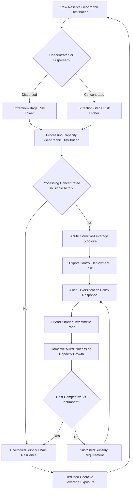

## Critical Minerals and Supply Chain Competition

### Structural Foundations

#### Defining Critical Minerals

[Inference] "Critical minerals" is a policy-defined rather than purely geological category, generally denoting minerals and elements assessed by a given government as both economically essential (particularly for energy-transition, defense, and advanced-technology applications) and subject to meaningful supply-disruption risk, typically due to concentrated production or processing geography, limited substitutability, and constrained near-term supply-expansion capacity. [Unverified] Specific critical-minerals lists vary by issuing government (the U.S. Geological Survey list, the EU's Critical Raw Materials Act list, and comparable lists from Japan, Australia, and other governments differ in composition) and are periodically revised, so specific list contents should be checked against current official sources rather than assumed stable.

#### Distinguishing Reserve Concentration from Processing Concentration

[Inference] A central analytical distinction in critical-minerals geopolitics, frequently underweighted in popular discourse, is the difference between raw ore/reserve geographic concentration and downstream processing/refining concentration: a mineral may have relatively globally dispersed raw reserves while refining and processing capacity is highly concentrated in a small number of states, meaning processing-stage rather than extraction-stage concentration frequently constitutes the more acute supply-chain vulnerability, since processing capacity requires substantial capital investment, specialized technical expertise, and, in some cases, environmentally intensive operations that have historically concentrated in specific jurisdictions willing to bear associated costs.

---

### China's Structural Position in Critical Minerals Supply Chains

#### Rare Earth Elements

[Inference] China holds a particularly pronounced structural position in rare earth elements—a group of seventeen elements essential to permanent magnets used in electric vehicle motors, wind turbines, and numerous defense applications—controlling a substantial majority share of global rare earth processing and refining capacity even in cases where raw-ore extraction is more geographically dispersed, a position built over several decades through sustained state-directed industrial policy, lower historical environmental-compliance costs, and resulting cost-competitiveness that progressively displaced processing capacity that had previously existed elsewhere (including historically significant U.S. rare earth processing capacity).

#### Battery Supply Chain Minerals

[Inference] China additionally holds substantial processing-capacity dominance across key battery-supply-chain minerals, including a majority share of global lithium refining and cobalt refining capacity, even though raw extraction for these minerals is more geographically distributed (Australia and the Lithium Triangle states for lithium; the Democratic Republic of Congo for cobalt, as discussed in the earlier Sub-Saharan Africa chapter), illustrating the reserve-versus-processing distinction discussed above.

#### Export Control Leverage

[Inference] China has, on several occasions, demonstrated willingness to deploy critical-minerals export restrictions as an instrument of economic and diplomatic leverage, including gallium and germanium export controls and periodic rare-earth-related trade restrictions in the context of broader bilateral trade and technology disputes, generating sustained analytical attention to the credibility and scope of critical-minerals coercive leverage as a parallel dynamic to the energy-supply coercion discussed in the oil and gas chapter, and substantially accelerating Western and allied diversification-policy responses.

---

### Western and Allied Diversification Strategies

#### "Friend-Shoring" and Allied Supply Chain Coordination

[Inference] The United States and allied governments (the EU, Japan, Australia, and others) have pursued a range of policy initiatives intended to diversify critical-minerals supply chains away from concentrated Chinese processing dominance, including direct government investment and subsidy programs for domestic and allied-country extraction and processing capacity, coordinated allied-government initiatives (such as the Minerals Security Partnership) intended to pool investment and technical cooperation among like-minded states, and trade-policy measures intended to incentivize supply-chain relocation—collectively frequently characterized under "friend-shoring" or "de-risking" framing, distinguished in official rhetoric from full "decoupling" given the practical difficulty of complete supply-chain separation given existing concentration.

#### Domestic Capacity Development Challenges

[Inference] Efforts to develop domestic or allied-country processing capacity face substantial practical constraints, including long project-development timelines for new extraction and processing facilities (frequently a decade or more from initial investment to production), significant capital-intensity requirements, environmental-permitting and community-opposition challenges particularly acute for processing facilities given their environmental-impact profile, and the difficulty of achieving cost-competitiveness against established, heavily-scaled Chinese processing capacity absent sustained subsidy or trade-protection support—generating [Unverified] ongoing debate regarding the realistic pace at which meaningful diversification can be achieved relative to policy ambitions.

#### Recycling and Circular Economy Approaches

[Inference] A complementary diversification strategy involves developing critical-minerals recycling capacity (recovering minerals from end-of-life batteries and electronic waste) as a longer-run supplementary supply source intended to reduce primary-extraction and processing dependency over time, though [Unverified] current recycling capacity remains a comparatively small contributor to overall supply relative to primary extraction and processing, with its scaling trajectory dependent on both technological maturation and sufficient end-of-life material volume becoming available as earlier-generation battery and electronics deployment reaches end-of-life.

---

### Resource-Rich Developing States: Leverage and Governance Risk

#### The Democratic Republic of Congo and Cobalt

[Inference] The DRC's dominant position in global cobalt extraction, discussed in the earlier Sub-Saharan Africa chapter, illustrates the intersection of critical-minerals supply-chain competition with governance-risk and conflict-financing concerns, given documented linkages between mineral-resource control and armed-conflict-actor financing in the country's eastern regions, generating sustained corporate-responsibility and supply-chain due-diligence attention alongside the broader great-power extraction-investment competition.

#### Indonesia and Nickel

[Inference] Indonesia has pursued an increasingly assertive resource-nationalist policy regarding its substantial nickel reserves (nickel being significant to certain battery-chemistry formulations), including export restrictions on raw nickel ore intended to compel domestic value-added processing investment rather than raw-material export, illustrating a broader pattern of resource-rich states seeking to capture greater value-chain share rather than remaining positioned solely as raw-material exporters—a strategy with mixed [Unverified] assessed effectiveness and significant attendant environmental-impact concerns given the energy-intensive processing methods predominantly employed.

#### The Lithium Triangle Revisited

[Inference] Argentina, Bolivia, and Chile's collective lithium-reserve position, discussed in the earlier Latin America chapter, illustrates varying national policy approaches to resource-leverage capture, ranging from more open foreign-investment frameworks (Argentina and Chile, with variation across their respective political cycles) to more state-controlled resource-nationalist approaches (Bolivia), generating differentiated external-investment patterns and diversification-relevant supply prospects across the three states despite their shared reserve geology.

---

### Defense-Sector Specific Vulnerabilities

#### Military Supply Chain Dependencies

[Inference] Critical-minerals supply-chain concentration carries particular strategic sensitivity for defense-industrial applications, given the use of rare earth elements and other critical minerals in precision-guided munitions, radar systems, and other advanced defense platforms, generating specific U.S. and allied policy attention to defense-supply-chain-specific diversification and stockpiling requirements distinct from broader civilian-economy supply-chain-security policy, reflecting the acute strategic-vulnerability concern of potential adversary leverage over defense-production inputs during a crisis or conflict scenario.

---

### Analytical Framework: Critical Minerals Risk Assessment

The loop reflects that diversification policy effectiveness is contingent on achieving genuine cost-competitiveness against concentrated incumbent processing capacity, absent which sustained subsidy dependency rather than structural resilience results, requiring continuous reassessment of diversification-policy pace against underlying processing-concentration risk.

---

### Distinguishing Related Concepts

- **Extraction-stage concentration vs. Processing-stage concentration**: As emphasized above, these represent analytically distinct vulnerability points requiring different policy responses—raw-material diversification alone does not resolve processing-stage dependency risk
- **Resource nationalism vs. Supply-chain diversification policy**: Resource-nationalist policies (export restrictions, mandated domestic processing) are pursued by producer states seeking to capture greater value-chain share; diversification policies are pursued by consumer/importing states seeking to reduce dependency risk—these can be complementary or can generate friction depending on whether producer-state value-capture ambitions align with consumer-state diversification-partner preferences
- **Friend-shoring vs. Reshoring vs. Decoupling**: Friend-shoring involves relocating supply-chain segments to allied or partner countries rather than necessarily the diversifying state's own territory; reshoring specifically means domestic relocation; decoupling implies more complete supply-chain separation from a specific state (typically China), a more extreme and, per most assessments, less practically achievable objective than the more commonly pursued friend-shoring or "de-risking" approaches

---

**Related Topics**

- Rare earth element processing chemistry and the technical barriers to capacity diversification
- Minerals Security Partnership and allied critical-minerals investment coordination mechanisms
- Battery chemistry evolution and its effect on specific-mineral demand trajectories
- Deep-sea mining as a prospective, environmentally contested, alternative mineral source
- Defense-industrial base critical-minerals stockpiling policy
- Indonesia's nickel downstream-processing strategy: effectiveness and environmental-cost assessment
- Congo cobalt supply-chain due-diligence frameworks and conflict-minerals certification
- Comparative resource-nationalist policy approaches across the Lithium Triangle states