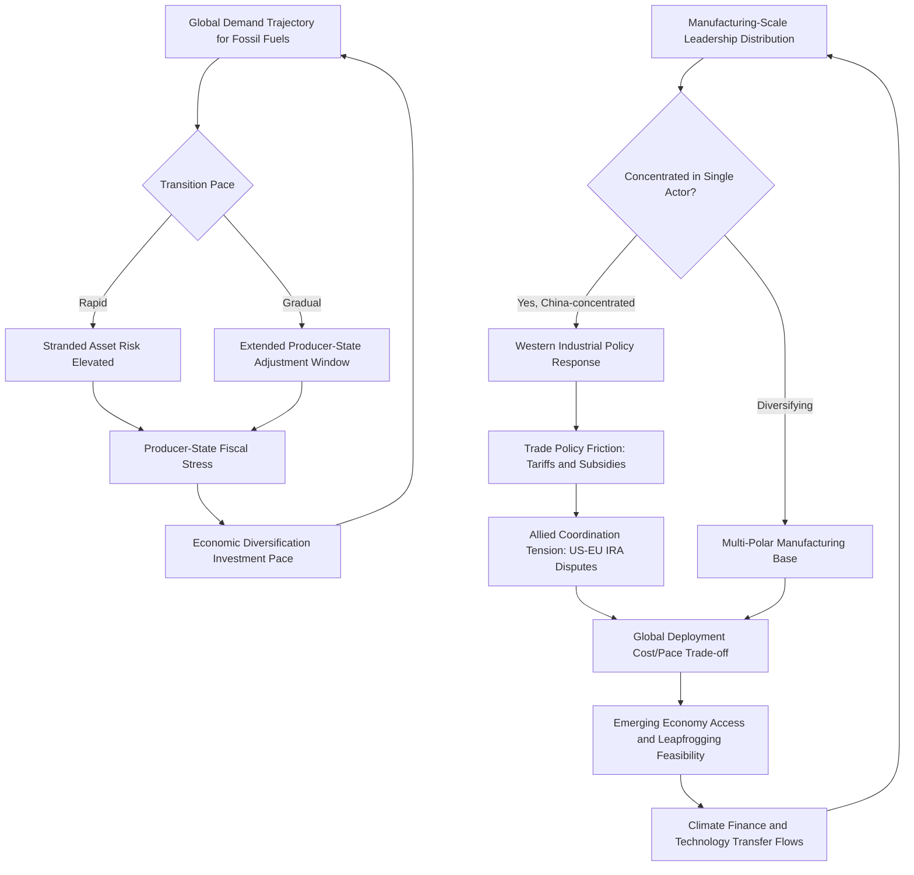

## The Geopolitics of the Energy Transition

### Structural Framing

#### The Energy Transition as a Geopolitical Reordering

[Inference] The global shift from fossil-fuel-dominant to renewable- and electrification-dominant energy systems constitutes not merely a technological and environmental-policy shift but a structurally significant reordering of geopolitical advantage, since the geographic and institutional foundations of energy-related power in a fossil-fuel-dominant system (reserve concentration, extraction infrastructure, transport chokepoints, discussed extensively in the earlier oil and gas chapter) differ substantially from the foundations of advantage in a renewable- and battery-dominant system (critical-mineral processing capacity, manufacturing-scale advantage, technology and intellectual-property leadership, discussed in the critical minerals chapter), generating winners and losers among states whose prior strategic position was built on the former foundation.

#### From Flow Resources to Stock-and-Technology Resources

[Inference] A useful analytical framing distinguishes the fossil-fuel system's dependence on continuously extracted "flow" resources (requiring sustained extraction and trade relationships) from the renewable-electrified system's greater dependence on manufactured-capital "stock" assets (solar panels, wind turbines, batteries, grid infrastructure) built substantially using critical-mineral inputs but, once constructed, requiring comparatively less ongoing trade-dependent fuel input—implying a potential long-run shift in the nature of energy-security vulnerability from sustained supply-flow interruption risk toward manufacturing-capacity, technology-access, and initial-material-input concentration risk.

---

### China's Manufacturing and Technology Leadership Position

#### Solar Photovoltaic Manufacturing Dominance

[Inference] China holds a particularly pronounced manufacturing-scale dominance across the solar photovoltaic supply chain, including polysilicon production, wafer and cell manufacturing, and module assembly, built through sustained state-directed industrial policy, substantial manufacturing-scale cost advantages, and resulting global market-share dominance that has driven a persistent trade-policy friction dynamic with the United States and EU, both of which have pursued tariff and trade-remedy measures intended to protect or rebuild domestic solar-manufacturing capacity against Chinese cost-competitiveness.

#### Battery and Electric Vehicle Manufacturing Position

[Inference] China additionally holds substantial manufacturing-scale leadership in battery-cell production and electric-vehicle manufacturing, combining the critical-minerals processing dominance discussed in the prior chapter with downstream battery-cell and vehicle-assembly manufacturing scale, generating a comparably structured trade-policy friction dynamic (including significant EU and U.S. tariff measures targeting Chinese-manufactured electric vehicles) reflecting both competitiveness concerns and broader industrial-policy and supply-chain-security considerations.

#### Wind Turbine and Grid Technology

[Inference] China has additionally developed substantial domestic wind-turbine manufacturing capacity and is pursuing expanding export market share in this sector, alongside developing capacity in grid-technology and transmission equipment manufacturing, extending the pattern of manufacturing-scale leadership across multiple energy-transition technology categories beyond solar and batteries specifically.

---

### Western Industrial Policy Response

#### Subsidy-Driven Reshoring and Friend-Shoring

[Inference] The United States (particularly through the 2022 Inflation Reduction Act's clean-energy and manufacturing-incentive provisions) and the European Union (through various Green Deal Industrial Plan and Net-Zero Industry Act measures) have pursued substantial subsidy and industrial-policy programs intended to rebuild domestic or allied-country manufacturing capacity across solar, battery, and related clean-energy-technology supply chains, reflecting both climate-policy objectives and explicit supply-chain-security and strategic-autonomy motivations distinct from pure market-efficiency considerations.

#### Trade Policy Tensions and Green Protectionism Debates

[Inference] These subsidy and tariff-protection measures have generated sustained trade-policy friction, including between the United States and traditional allies (EU concern regarding IRA subsidy provisions perceived as discriminating against non-U.S.-manufactured content) as well as between Western economies and China, generating broader analytical debate regarding whether escalating "green protectionism" measures risk slowing the overall pace of global energy-transition deployment by raising technology costs, against the competing consideration that supply-chain-security and domestic-industrial-base objectives are treated by proponents as independently justified policy goals even at some efficiency cost.

---

### Fossil-Fuel-Dependent State Transition Risk

#### Stranded Asset and Fiscal Transition Risk

[Inference] States with economic and fiscal structures heavily dependent on fossil-fuel export revenue face a structurally distinct transition-risk category, discussed in part in the earlier oil and gas chapter: sustained long-run demand uncertainty for oil and gas exports raises the prospect of "stranded assets" (fossil-fuel reserves and extraction infrastructure that become uneconomical to develop or operate before full resource depletion) and generates acute fiscal-sustainability pressure for rentier-state political structures whose domestic-legitimacy models depend substantially on hydrocarbon-revenue-funded distributive spending.

#### Differentiated Producer-State Responses

[Inference] Fossil-fuel-dependent states have pursued varying strategic responses to this transition risk: Gulf states have generally pursued the most substantial economic-diversification investment (discussed in the earlier Gulf-geopolitics chapter), leveraging currently available hydrocarbon-revenue surpluses to fund diversification before demand-decline pressure intensifies; other producer states (including several with weaker institutional and fiscal-management capacity) face [Unverified] greater diversification-implementation challenges given more constrained fiscal flexibility and governance capacity, generating a wider range of assessed transition-risk exposure across the producer-state universe.

---

### Emerging-Economy Development Pathway Implications

#### Leapfrogging Potential and Its Limits

[Inference] The energy transition generates debate regarding whether developing economies can "leapfrog" fossil-fuel-intensive development pathways historically followed by currently advanced economies, moving more directly toward renewable-electrified systems, potentially avoiding both the environmental costs and, in some framings, certain of the geopolitical fossil-fuel-dependency dynamics associated with the traditional development pathway; [Unverified] the practical feasibility of full leapfrogging is contested given continued near-term reliability, cost, and grid-infrastructure constraints in many developing-economy contexts, and most current analysis suggests a more gradual, blended-transition pathway is more empirically likely than complete leapfrogging in most cases.

#### Climate Finance and Technology Transfer as Geopolitical Instruments

[Inference] International climate-finance commitments and technology-transfer arrangements, negotiated substantially through UN Framework Convention on Climate Change-linked processes and bilateral/multilateral development-finance channels, increasingly function as instruments of broader geopolitical engagement and competition, with China, the United States, the EU, and multilateral development banks each pursuing climate-finance and clean-energy-technology-transfer engagement with developing economies that carries both genuine development-assistance content and broader strategic-influence and market-access objectives, generating a further dimension of great-power competitive engagement layered onto the core climate-policy objectives.

---

### Grid Infrastructure and Electrification as a Strategic Vulnerability Surface

#### Expanding Attack Surface

[Inference] The energy transition's dependence on substantially expanded and increasingly digitally-managed electrical grid infrastructure (to accommodate variable renewable generation, electric-vehicle charging load, and increased overall electrification of previously fossil-fuel-direct end uses such as heating) generates an expanding potential attack surface for both physical and cyber infrastructure-disruption risk, a consideration increasingly incorporated into critical-infrastructure-protection policy planning distinct from, but complementary to, the traditional fossil-fuel-infrastructure and chokepoint-security considerations discussed in the oil and gas chapter.

---

### Analytical Framework: Energy Transition Geopolitical Risk Assessment

The loop reflects that producer-state fiscal-adjustment pace, manufacturing-leadership concentration, and resulting trade-policy friction jointly determine the overall global pace and geopolitical-friction level of transition deployment, feeding back into both demand trajectories and technology-access patterns for emerging economies.

---

### Distinguishing Related Concepts

- **Flow-resource dependency vs. Stock-and-technology dependency**: As emphasized above, these represent structurally distinct vulnerability categories requiring different security-policy frameworks—the shift does not eliminate resource-dependency risk but relocates its primary locus from ongoing extraction/trade flows toward manufacturing capacity and initial critical-mineral inputs
- **Green protectionism vs. Genuine supply-chain security policy**: These motivations are frequently intertwined in practice and difficult to cleanly separate analytically; a given tariff or subsidy measure may simultaneously serve domestic-industry protection, genuine strategic-dependency-reduction, and climate-policy objectives in varying proportions
- **Leapfrogging vs. Blended transition pathways**: A leapfrogging framing implies developing economies can largely bypass fossil-fuel-intensive development stages; a blended-pathway framing (the more commonly supported assessment) anticipates continued substantial fossil-fuel use alongside accelerating renewable deployment over an extended transition period, a distinction with significant implications for emerging-economy energy-infrastructure investment planning

---

**Related Topics**

- Inflation Reduction Act and Net-Zero Industry Act: comparative industrial-policy design
- Stranded asset risk modeling for fossil-fuel-dependent sovereign and corporate balance sheets
- UNFCCC climate-finance architecture and loss-and-damage fund development
- Grid cybersecurity and critical-infrastructure protection in an electrification context
- Comparative Gulf-state versus other-producer-state economic-diversification trajectories
- China's solar and battery manufacturing policy: historical development and current trade-friction status
- Emerging-economy grid-infrastructure investment financing and leapfrogging feasibility case studies
- Electric vehicle trade-policy disputes: US, EU, and Chinese tariff-measure comparison