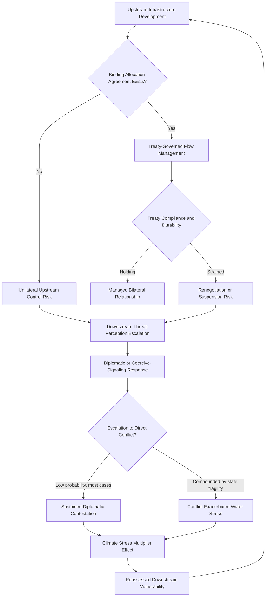

## Water Security and Transboundary Resource Disputes

### Structural Foundations

#### Water as a Distinct Category of Geopolitical Resource

[Inference] Water occupies a structurally distinct position among strategically significant natural resources: unlike oil, gas, or critical minerals, freshwater has no globally traded substitute-supply market of comparable scale, is essential to basic human survival and agricultural production rather than primarily industrial or energy application, and is overwhelmingly sourced from transboundary river basins, shared aquifers, and precipitation patterns that inherently link riparian states' resource availability to shared hydrological systems rather than to independently controllable national reserves.

#### Upstream-Downstream Structural Asymmetry

[Inference] Transboundary water disputes are characterized by a persistent structural asymmetry unique among resource-geopolitics categories: upstream riparian states possess inherent physical-infrastructure leverage (the capacity to construct dams, diversions, and other water-control infrastructure affecting downstream flow) that does not require reciprocal downstream capability, generating a structurally asymmetric bargaining position distinct from the more reciprocal interdependency patterns typically observed in energy or mineral-trade relationships.

---

### The Nile Basin

#### Historical Allocation Framework and Its Contestation

[Inference] The Nile River basin, spanning eleven riparian states with Egypt as the most downstream and historically most water-dependent state, has been governed by a colonial-era allocation framework (principally the 1929 and 1959 agreements) that allocated the overwhelming majority of Nile water rights to Egypt and Sudan while providing no meaningful allocation to upstream states including Ethiopia, generating a long-standing structural grievance among upstream riparians who were not party to the original allocation agreements.

#### The Grand Ethiopian Renaissance Dam Dispute

[Inference] Ethiopia's construction of the Grand Ethiopian Renaissance Dam on the Blue Nile, a major hydroelectric infrastructure project central to Ethiopia's domestic energy-development ambitions, has generated a sustained and high-profile dispute with Egypt (and, to a lesser degree, Sudan) regarding dam-filling and operational protocols, given Egyptian concern regarding potential reduced downstream flow during dam-reservoir filling and subsequent operational periods, particularly during drought conditions; the dispute has involved multiple rounds of trilateral negotiation without, as of the most recent widely reported developments, a comprehensive binding agreement, and [Unverified] the current negotiation status and dam-operational trajectory should be checked against recent reporting given the dispute's continued evolution.

#### Egyptian Threat-Perception Framing

[Inference] Egyptian officials have periodically characterized the dam dispute in existential national-security terms, reflecting Egypt's near-total dependence on Nile water for agricultural and municipal water supply given its arid geography, generating sustained diplomatic and, at various points, implicit-coercive-signaling engagement with Ethiopia, though direct military conflict has not materialized and [Unverified] most analytical assessment continues to characterize armed conflict as a low-probability though non-zero outcome given the severity of the underlying resource stakes for Egypt specifically.

---

### The Tigris-Euphrates Basin

#### Turkey's Upstream Infrastructure Position

[Inference] Turkey's position as the most upstream riparian on both the Tigris and Euphrates rivers, combined with its Southeastern Anatolia Project (GAP)—a large-scale dam and irrigation-infrastructure development program—has generated sustained downstream concern from Syria and Iraq regarding reduced water flow, particularly acute given Iraq's own severe water-stress conditions driven by a combination of reduced upstream flow, domestic water-infrastructure degradation, and climate-change-linked precipitation and temperature trends.

#### Conflict-Compounded Water Stress in Iraq and Syria

[Inference] Iraq and Syria's water-security challenges have been substantially compounded by sustained internal conflict and governance disruption over the past two decades, which has degraded water-infrastructure maintenance and management capacity independent of the upstream-allocation dispute itself, illustrating how transboundary resource disputes frequently interact with and are exacerbated by parallel state-fragility and conflict dynamics discussed in the earlier Middle East regional chapter, rather than functioning as an isolated bilateral or multilateral allocation dispute alone.

---

### South and Central Asian Transboundary Water Dynamics

#### The Indus Waters Treaty and India-Pakistan Water Relations

[Inference] The Indus River basin, shared primarily between India and Pakistan, has historically been governed by the 1960 Indus Waters Treaty, a World Bank-brokered agreement generally regarded in the water-diplomacy literature as one of the more durable transboundary water-sharing arrangements globally, having persisted through multiple subsequent India-Pakistan wars and sustained bilateral hostility discussed in the earlier South Asia chapter; however, the treaty has faced increasing strain and periodic suspension-threat signaling amid broader bilateral crisis episodes, and [Unverified] its current operational status should be checked against recent reporting given periodic diplomatic signaling regarding potential treaty modification or suspension in the context of broader bilateral tension.

#### Central Asian Water-Energy Tensions

[Inference] Central Asian transboundary water dynamics, particularly regarding the Amu Darya and Syr Darya river systems shared among Kazakhstan, Uzbekistan, Turkmenistan, Kyrgyzstan, and Tajikistan, involve a distinct structural tension between upstream states' (Kyrgyzstan and Tajikistan) hydroelectric-energy generation interests, which favor water release patterns optimized for winter electricity demand, and downstream states' (Uzbekistan, Turkmenistan, and Kazakhstan) agricultural-irrigation interests, which favor summer-concentrated water release, generating a persistent seasonal-allocation coordination challenge layered onto the basin's broader post-Soviet institutional fragmentation following the dissolution of Soviet-era centrally coordinated water-management infrastructure.

---

### China's Upstream Position Across Multiple Asian River Systems

#### Tibetan Plateau as a Continental Water Source

[Inference] China's control of the Tibetan Plateau, the source region for numerous major Asian river systems including the Mekong, Brahmaputra, Indus, and Salween, generates a distinctive and geographically extensive upstream-leverage position across multiple separate river basins and downstream riparian relationships simultaneously, a structural position without clear parallel among other major transboundary water actors given the scale and multiplicity of river systems originating within Chinese-controlled territory.

#### Mekong River Dam Development and Downstream Concerns

[Inference] Chinese hydroelectric dam construction on the upper Mekong River (known as the Lancang within China) has generated sustained concern among downstream Mekong River Commission member states (Laos, Thailand, Cambodia, and Vietnam) regarding altered seasonal flow patterns, sediment-transport disruption affecting downstream agricultural productivity (particularly in the Vietnamese Mekong Delta, a critical rice-production region), and the general absence of China as a full member of the Mekong River Commission's cooperative-management framework, limiting formal multilateral coordination mechanisms relative to China's substantial upstream infrastructure influence.

#### Brahmaputra Basin Dynamics

[Inference] Chinese hydroelectric development on the upper Brahmaputra River (known as the Yarlung Tsangpo within Chinese-controlled Tibet) has generated corresponding downstream concern in India, adding a resource-security dimension to the broader China-India rivalry discussed in the earlier South Asia chapter, and illustrating how water-security concerns can compound rather than substitute for existing territorial and strategic rivalry dynamics between the same state pairing.

---

### International Legal and Institutional Frameworks

#### Limitations of International Water Law

[Inference] International water-law frameworks, including the UN Watercourses Convention (which has achieved only limited ratification among major upstream and downstream riparian states relevant to the disputes discussed above) and customary-international-law principles regarding equitable and reasonable utilization, generally lack binding enforcement mechanisms comparable to more institutionalized international-legal regimes, meaning transboundary water disputes are predominantly managed through bilateral or basin-specific negotiated arrangements (such as the Indus Waters Treaty) rather than through a unified binding global legal framework, and dispute-resolution outcomes depend substantially on the relative bargaining leverage and diplomatic engagement willingness of the specific riparian states involved rather than consistent legal-framework application.

---

### Climate Change as a Compounding Stress Multiplier

#### Precipitation Variability and Glacial-Melt Dependency

[Inference] Climate change is widely assessed to compound existing transboundary water-stress dynamics through altered precipitation patterns, increased frequency of both drought and extreme-flooding events, and, for river systems substantially dependent on glacial and snowmelt sources (including the Indus, Brahmaputra, and other Himalayan-sourced systems), longer-run concern regarding altered glacial-melt-driven flow patterns as glacial mass changes over coming decades, generating a widely cited but [Unverified] regarding precise regional magnitude and timing "threat multiplier" framing in security-policy literature addressing water-resource disputes' prospective intensification.

---

### Analytical Framework: Transboundary Water Risk Assessment

The loop reflects that transboundary water disputes are rarely resolved permanently but rather continuously renegotiated as upstream infrastructure development, treaty-compliance dynamics, and climate-driven stress intensification jointly reshape the underlying risk calculus for downstream states.

---

### Distinguishing Related Concepts

- **Water scarcity vs. Water security**: Scarcity refers to the physical-availability dimension (insufficient water relative to demand); security is a broader concept incorporating governance capacity, infrastructure reliability, and geopolitical-dependency dimensions beyond raw physical availability, meaning water-abundant regions can still face water-security challenges driven by governance or transboundary-dependency factors
- **Upstream leverage vs. Downstream vulnerability**: These are related but analytically distinct—upstream states possess physical-infrastructure leverage, while downstream vulnerability depends additionally on the downstream state's degree of alternative-water-source availability and adaptive-infrastructure capacity, meaning downstream vulnerability is not a uniform function of upstream leverage alone
- **Binding treaty frameworks vs. Customary-law principles**: As emphasized above, the presence of a specific negotiated binding agreement (such as the Indus Waters Treaty) provides materially different dispute-management structure and predictability compared to reliance on more general and less consistently enforced customary-international-law principles

---

**Related Topics**

- Indus Waters Treaty suspension-threat signaling and its bearing on India-Pakistan crisis dynamics
- Grand Ethiopian Renaissance Dam negotiation history and trilateral mediation efforts
- Mekong River Commission institutional limitations and China's non-member upstream position
- Central Asian post-Soviet water-energy barter arrangements and their institutional fragmentation
- Glacial-melt-dependent river systems and long-run Himalayan water-security projections
- International Watercourses Convention ratification gaps and enforcement-mechanism limitations
- Water infrastructure as a conflict target: case studies from Iraq and Syria
- Desalination and water-recycling technology as demand-side transboundary-dependency mitigation