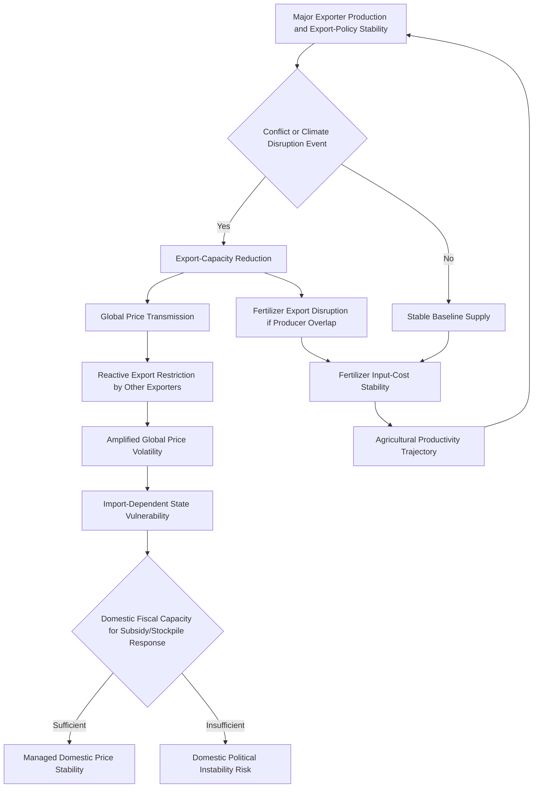

## Food Security and Agricultural Geopolitics

### Structural Foundations

#### Food Security as a Distinct Geopolitical Domain

[Inference] Food security shares structural characteristics with both energy and water security discussed in the preceding sections—geographic production concentration, transport-infrastructure dependency, and essential-good status generating acute political sensitivity—while introducing distinct dynamics specific to agricultural commodities: production vulnerability to weather and climate variability on shorter cycles than most mineral or energy resources, the central role of a small number of staple-grain exporters in global caloric-supply stability, and food security's uniquely direct linkage to domestic political stability given food-price sensitivity's documented historical association with civil unrest.

#### Grain Export Concentration

[Inference] Global staple-grain export markets, particularly wheat, corn, and rice, exhibit substantial geographic concentration among a relatively small number of major exporting states, generating structural vulnerability for import-dependent states—particularly in the Middle East, North Africa, and parts of Sub-Saharan Asia and Africa—whose food-security status depends significantly on the export-policy stability and production reliability of a concentrated set of external suppliers rather than domestic production self-sufficiency.

---

### The Black Sea Grain Corridor and the Russia-Ukraine War's Food-Security Impact

#### Ukraine and Russia's Combined Export Significance

[Inference] Ukraine and Russia collectively account for a substantial share of global wheat, corn, and sunflower-oil exports, making the Russia-Ukraine war's disruption of Black Sea shipping routes and Ukrainian agricultural production and export capacity a matter of direct global food-security consequence extending far beyond the immediate conflict zone, with particularly acute impact on import-dependent states across the Middle East, North Africa, and parts of Sub-Saharan Africa that had historically relied substantially on Black Sea grain supply.

#### The Black Sea Grain Initiative and Its Suspension

[Inference] The 2022 Black Sea Grain Initiative, a UN- and Turkey-brokered arrangement establishing a protected maritime corridor for Ukrainian grain exports despite the ongoing conflict, represented a significant, if ultimately [Unverified] regarding current operational status, attempt to insulate global food-security outcomes from the broader conflict dynamics; the initiative's subsequent suspension and the development of alternative export-route arrangements illustrate the continued vulnerability of conflict-adjacent agricultural export infrastructure, and current Black Sea export-corridor status should be checked against recent reporting given the situation's continued evolution.

#### Global Price Transmission and Import-Dependent State Vulnerability

[Inference] Disruption to Black Sea grain-export capacity generated documented global grain-price increases in 2022, with disproportionate impact on food-import-dependent lower-income states given the combination of direct supply-availability effects and broader global price-transmission dynamics, illustrating how regional conflict can generate food-security consequences with global reach independent of direct military or economic engagement by affected import-dependent states.

---

### China's Food Security Strategy

#### Domestic Self-Sufficiency Policy and Its Limits

[Inference] China has historically pursued an explicit food-self-sufficiency policy objective, particularly regarding staple grains, reflecting both food-security strategic concern and the political-legitimacy significance of stable food access given historical famine experience; however, China's rapidly growing demand for soybeans (substantially driven by livestock-feed requirements for its large and growing meat-consumption sector) has generated substantial and growing import dependency, particularly on U.S. and South American (Brazilian and Argentine) soybean production, illustrating that even a state pursuing an explicit self-sufficiency strategic objective faces practical limits given resource and land-availability constraints.

#### Overseas Agricultural Investment and Land Acquisition

[Inference] China has pursued substantial overseas agricultural investment and, in some cases, land-lease or acquisition arrangements across multiple regions including Sub-Saharan Africa, Latin America, and Southeast Asia, intended to secure diversified and, in some cases, more directly controlled agricultural-supply access, generating a parallel dynamic to the critical-minerals and energy-resource investment patterns discussed in earlier chapters, and drawing similar governance-risk and host-country political-sensitivity attention given concerns in some recipient countries regarding land-sovereignty and local-community displacement implications.

---

### Export Restriction Policy as a Recurrent Crisis Response

#### The Pattern of Reactive Export Restrictions

[Inference] Major food-exporting states have repeatedly demonstrated a pattern of imposing export restrictions or outright export bans during periods of domestic or global price volatility, intended to prioritize domestic food-price stability and availability over continued export-revenue generation, a pattern documented across multiple historical price-spike episodes (including the 2007–2008 and 2010–2011 global food-price crises, and again following the 2022 Russia-Ukraine war disruption) and widely assessed by economists as a collectively self-defeating dynamic, since widespread simultaneous export-restriction adoption by multiple major exporters tends to amplify rather than dampen global price volatility, even though each individual restricting state's domestic rationale may be locally sound.

#### India's Rice Export Policy as a Case Illustration

[Inference] India, as a major global rice exporter, has periodically imposed rice-export restrictions during domestic price-stability concerns, generating substantial global rice-price and availability impact given India's significant share of global rice-export markets, illustrating the outsized global consequence of individual major-exporter domestic-policy decisions in already concentration-prone staple-grain export markets.

---

### Fertilizer Geopolitics and Its Interaction with Food Security

#### Fertilizer Production Concentration and Input Dependency

[Inference] Global agricultural productivity depends substantially on synthetic fertilizer inputs (particularly nitrogen, phosphate, and potash-based fertilizers), whose production is itself geographically concentrated—nitrogen fertilizer production is heavily dependent on natural gas as a feedstock and energy input, directly linking fertilizer-cost and availability dynamics to the natural-gas-market dynamics discussed in the earlier oil and gas chapter, while potash production is substantially concentrated among a small number of major producing states including Russia, Belarus, and Canada.

#### Russia and Belarus Fertilizer Export Significance

[Inference] Russia and Belarus's combined significant share of global potash and nitrogen-fertilizer export markets generated substantial global fertilizer-price and availability disruption following the 2022 invasion of Ukraine and associated sanctions architecture, compounding the direct grain-export disruption discussed above through a distinct but interacting input-cost channel, illustrating how conflict-driven disruption to a single major producer-pair can generate food-security consequences through multiple simultaneous transmission channels—direct grain-export disruption and agricultural-input-cost disruption—rather than a single isolated effect.

---

### Climate Change and Agricultural Production Volatility

#### Yield Variability and Regional Production-Pattern Shifts

[Inference] Climate change is widely assessed to increase agricultural-yield variability through altered precipitation patterns, increased frequency of extreme-weather events affecting major growing regions, and longer-run shifts in the geographic viability of specific crop-production patterns, generating a compounding stress factor layered onto the existing structural concentration and conflict-vulnerability dynamics discussed above, though [Unverified] the precise regional magnitude and timing of climate-driven agricultural-production shifts remains an area of continued scientific refinement rather than settled precise projection.

#### Adaptation and Diversification Responses

[Inference] Import-dependent states have pursued varying food-security-resilience strategies in response to these compounding vulnerabilities, including strategic grain-reserve stockpiling, import-source diversification away from concentrated dependency on any single major exporter, and, in some cases, domestic agricultural-productivity investment intended to reduce import dependency, though [Unverified] the effectiveness and pace of these diversification strategies vary substantially across states given differing fiscal capacity, land and water-resource availability, and agricultural-infrastructure development levels.

---

### Analytical Framework: Food Security Risk Assessment

The loop reflects that disruption to major exporter stability propagates through both direct grain-supply and fertilizer-input-cost channels simultaneously, with reactive export-restriction behavior by unaffected exporters tending to amplify rather than dampen the resulting global price-volatility and import-dependent-state vulnerability.

---

### Distinguishing Related Concepts

- **Food security vs. Food self-sufficiency**: Food security refers to reliable access to adequate food, which can be achieved through either domestic production or stable trade-dependent import relationships; self-sufficiency specifically refers to domestic-production-based security, a stronger and more resource-intensive objective not necessarily required for adequate food security if trade relationships are sufficiently stable and diversified
- **Direct supply disruption vs. Price-transmission effects**: A state need not be a direct importer from a disrupted producer to experience food-security consequences, since global commodity-price transmission mechanisms propagate price effects across import-dependent states regardless of direct bilateral trade relationships with the specifically disrupted producer
- **Reactive export restriction vs. Strategic reserve stockpiling**: These represent distinct policy responses to food-security risk—export restriction is a producer-state reactive measure with documented collective-action problems as discussed above; strategic stockpiling is an importer-state proactive resilience measure without the same negative-externality dynamic for other states' food security

---

**Related Topics**

- Black Sea Grain Initiative suspension and alternative Ukrainian export-route development
- 2007–2008 and 2010–2011 global food-price crisis case studies and civil-unrest linkages
- China's soybean import dependency and Brazil/Argentina agricultural-trade relationship development
- Fertilizer market concentration: Russia, Belarus, and Canada potash-export dynamics
- India's rice-export policy history and global rice-market price-transmission effects
- Overseas agricultural land investment: governance-risk and host-country sovereignty concerns
- Climate-driven crop-yield projection modeling and regional agricultural-viability shifts
- Strategic grain-reserve policy design: comparative state approaches and effectiveness assessment