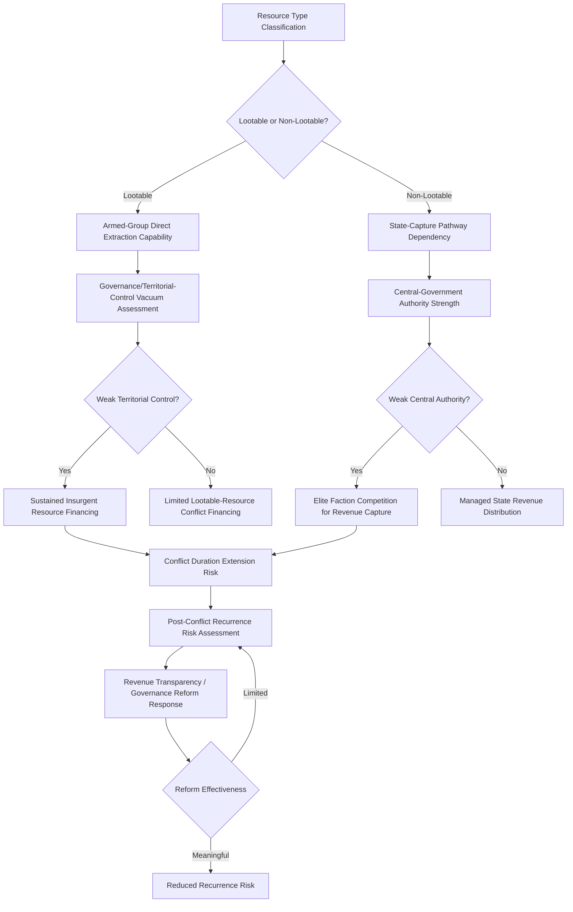

## Resource-Driven Conflict Patterns

### Theoretical Foundations

#### The Resource-Conflict Nexus Debate

[Inference] The relationship between natural-resource abundance and armed-conflict risk has been extensively studied in the conflict-economics and political-science literature, generating several competing but not mutually exclusive theoretical explanations for the empirically documented association between certain resource types and elevated civil-conflict risk, a body of research substantially distinct from, though related to, the interstate transboundary-resource dispute dynamics discussed in the water-security section.

#### Greed versus Grievance Framework

[Inference] A foundational analytical framing, associated substantially with the work of Paul Collier and Anke Hoeffler, distinguishes "greed"-based explanations—resource wealth providing a financeable objective and funding mechanism for rebellion, making conflict more economically viable and attractive to armed-group organizers independent of underlying political grievance—from "grievance"-based explanations—resource-extraction activity generating genuine local grievances (environmental damage, inequitable revenue distribution, displacement) that motivate conflict independent of resource wealth's financing function. [Unverified] Subsequent empirical research has generally found support for elements of both framings depending on resource type, extraction-industry structure, and local governance context, rather than clearly favoring one framework as universally dominant.

#### The Resource Curse and Conflict Risk

[Inference] The broader "resource curse" literature—documenting the frequently observed empirical association between resource abundance (particularly point-source resources like oil and minerals, as distinguished from more diffusely distributed agricultural resources) and adverse development, governance, and, in the conflict-specific literature, civil-war-risk outcomes—provides additional theoretical grounding, with several proposed mechanisms including reduced government accountability pressure given non-tax-based revenue sources (the "rentier effect," also discussed in the Gulf-geopolitics context), institutional-quality erosion, and the specific conflict-financing mechanism discussed under the greed framing above.

---

### Lootable versus Non-Lootable Resources

#### The Lootability Distinction

[Inference] A significant refinement within the resource-conflict literature distinguishes resources by their "lootability"—the ease with which armed non-state actors can extract, transport, and monetize a given resource without requiring large-scale, fixed, easily-targeted industrial infrastructure:

- **Lootable resources**: [Inference] Alluvial diamonds, artisanal gold, and certain other minerals extractable through comparatively low-technology, dispersed, small-scale methods are more readily captured and monetized by armed non-state groups operating in contested or ungoverned territory, generating the empirically documented pattern of "conflict resources" or "blood diamonds" financing sustained insurgent or warlord activity in multiple historical African conflicts
- **Non-lootable resources**: [Inference] Conventional oil extraction, requiring substantial fixed industrial infrastructure, technical expertise, and typically state or large-corporate control, is comparatively more difficult for dispersed non-state armed groups to directly capture and monetize, though non-lootable resource wealth can still finance conflict indirectly through state-capture dynamics (control of the state apparatus that controls resource-revenue distribution) rather than direct extraction-and-sale by armed groups themselves

[Inference] This distinction carries significant policy-response implications: lootable-resource conflict dynamics have generated supply-chain certification and due-diligence responses (the Kimberley Process for diamonds, conflict-minerals certification for certain minerals, discussed in the earlier critical-minerals chapter regarding the Democratic Republic of Congo), while non-lootable-resource conflict dynamics more typically implicate broader governance-reform, revenue-transparency, and anti-corruption policy responses targeting state-level rather than direct-extraction-level capture.

---

### Case Patterns Across Regions

#### Sub-Saharan Africa: Conflict Minerals and Insurgent Financing

[Inference] The Democratic Republic of Congo's eastern-region conflict dynamics, discussed in the earlier Sub-Saharan Africa and critical-minerals chapters, illustrate a sustained contemporary case of lootable-mineral conflict financing, with multiple documented armed-group and, in some assessments, neighboring-state-linked actors deriving significant revenue from artisanal mineral extraction (particularly tin, tantalum, tungsten, and gold, alongside cobalt-adjacent dynamics) in areas of contested territorial control, sustaining a protracted multi-actor conflict that has persisted through multiple nominal peace agreements.

#### Middle East: Oil Revenue and State-Capture Dynamics

[Inference] Middle Eastern conflict dynamics involving oil-resource control have more typically manifested through the non-lootable, state-capture pathway rather than direct lootable extraction by dispersed armed groups, illustrated by cases including the Islamic State's period of direct oil-facility control and black-market oil-sale revenue generation in Iraq and Syria (representing a partial hybrid case, since the group did achieve direct extraction-and-sale capability despite oil's generally non-lootable classification, reflecting the specific circumstances of weak state control over remote extraction infrastructure during that conflict period) and more broadly through contestation over control of state oil-revenue-distribution apparatus in contexts of weak central-government authority.

#### Latin America: Illicit Resource Extraction and Criminal-Conflict Financing

[Inference] Latin American conflict-adjacent dynamics have involved both lootable-resource patterns (illegal gold mining financing armed and criminal-organization activity in parts of the Amazon basin, particularly in Colombia, Peru, and Venezuela) and the broader narcotics-trafficking economy, which, while not a "natural resource" in the traditional geological sense, exhibits structurally similar lootable-commodity conflict-financing dynamics and has historically financed sustained insurgent and criminal-organization activity, most notably in Colombia's protracted internal conflict.

---

### Resource Wealth and Post-Conflict Recovery Risk

#### Conflict Recurrence and Resource-Revenue Capture

[Inference] Resource-rich states emerging from armed conflict face documented elevated risk of conflict recurrence relative to non-resource-rich post-conflict states, reflecting continued incentive for competing factions to seek control of resource-revenue streams during post-conflict political settlement negotiations, generating a distinct policy-design challenge for post-conflict resource-revenue-sharing and governance-institution design intended to reduce renewed-conflict incentive structures.

#### Revenue Transparency and Governance Reform Responses

[Inference] Policy responses to resource-conflict risk at the governance level have included international transparency initiatives (such as the Extractive Industries Transparency Initiative, promoting disclosure of resource-revenue flows to reduce state-capture and elite-diversion opportunities) and broader anti-corruption and public-financial-management reform efforts, generally assessed as necessary but insufficient in isolation given the deeper political-economy and institutional-capacity challenges underlying resource-conflict dynamics in the most severely affected states.

---

### Distinguishing Resource-Driven Civil Conflict from Interstate Resource Disputes

#### Structural Differences from the Transboundary Water-Dispute Pattern

[Inference] Resource-driven conflict patterns discussed in this section are predominantly intrastate (civil-conflict and non-state-armed-actor) phenomena, structurally distinct from the interstate transboundary-resource dispute dynamics discussed in the water-security section: while both categories involve resource-access competition as a core driver, intrastate resource-conflict dynamics typically involve competition for control of extraction-revenue streams within a single state's contested territory, whereas interstate disputes involve negotiation or contestation between sovereign governments over shared-resource allocation across recognized international boundaries, implicating different actors, different legal and institutional frameworks, and different policy-response toolkits.

---

### Analytical Framework: Resource-Conflict Risk Assessment

The loop reflects that resource-conflict risk trajectories depend jointly on resource lootability classification and territorial or central-governance control strength, with post-conflict recurrence risk remaining elevated absent meaningful revenue-transparency and governance reform.

---

### Distinguishing Related Concepts

- **Greed-based vs. Grievance-based conflict drivers**: As emphasized above, these represent distinct though non-exclusive causal mechanisms with different policy implications—greed-based dynamics point toward supply-chain and revenue-flow interventions, while grievance-based dynamics point toward extraction-industry governance and local-community engagement reform
- **Lootable vs. Non-lootable resource classification**: This distinction determines which policy toolkit (supply-chain certification versus state-governance reform) is more likely to meaningfully address the specific resource-conflict dynamic at hand, and misapplying one framework to the other resource type's dynamics is a documented source of policy-intervention ineffectiveness
- **Intrastate resource-conflict dynamics vs. Interstate transboundary-resource disputes**: As emphasized above, these are structurally distinct phenomena despite surface-level thematic similarity, implicating different actors, institutional frameworks, and appropriate analytical and policy toolkits

---

**Related Topics**

- Kimberley Process certification scheme: design, effectiveness, and documented limitations
- Extractive Industries Transparency Initiative: participation and assessed governance impact
- Islamic State oil-revenue financing: a hybrid lootable/non-lootable case study
- Colombian conflict financing: coca cultivation, illegal gold mining, and comparative commodity dynamics
- Post-conflict resource-revenue-sharing institutional design: comparative case studies
- Artisanal and small-scale mining formalization policy as a conflict-risk mitigation strategy
- Rentier-state theory's application to both interstate Gulf dynamics and intrastate conflict-financing contexts
- Amazon basin illegal resource extraction and its transnational organized-crime linkages