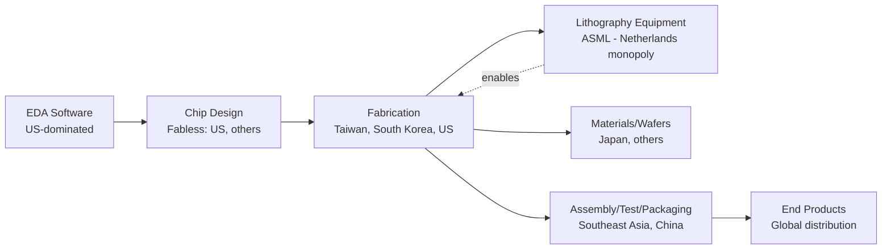

## Semiconductor Supply Chains and Chip Competition

### Overview

Semiconductor supply chains form one of the most geographically concentrated and geopolitically sensitive production systems in the global economy. A single advanced chip may cross 70+ international borders during fabrication, packaging, and testing, passing through a small number of chokepoint firms and jurisdictions. This concentration converts commercial dependencies into strategic leverage points, making semiconductors a central battleground in contemporary great-power competition, particularly between the United States and China.

### The Semiconductor Value Chain

#### Structural Segments

The industry divides into distinct stages, each with different geographic concentration:

- **Electronic Design Automation (EDA):** Software for chip design, dominated by Synopsys, Cadence, and Siemens EDA (formerly Mentor Graphics) — largely US/Western-controlled
- **Core IP:** Instruction set architectures and processor cores (Arm, x86 licensed by Intel/AMD)
- **Chip design (fabless):** Companies like Nvidia, Qualcomm, AMD, Apple design chips without owning fabrication capacity
- **Fabrication (foundry):** Physical manufacturing, extremely capital-intensive
- **Assembly, Testing, and Packaging (ATP):** Post-fabrication processes, historically labor-intensive and concentrated in Southeast Asia
- **Materials and equipment:** Wafers, photoresists, specialty gases, and lithography/deposition/etch tools

#### Geographic Concentration

**Key Points**

- Taiwan (primarily TSMC) fabricates roughly the majority of the world's logic chips overall and an outsized share of the most advanced sub-10nm nodes
- The Netherlands' ASML holds a global monopoly on extreme ultraviolet (EUV) lithography machines, essential for manufacturing chips at leading-edge nodes
- South Korea (Samsung, SK Hynix) dominates memory chip production (DRAM and NAND flash)
- China leads in mature-node (legacy) chip production and rare earth/gallium/germanium processing used in semiconductor materials
- Japan retains critical strength in photoresists, silicon wafers, and specialty chemicals

This creates a structure where no single country possesses end-to-end self-sufficiency, but a handful of firms — TSMC, ASML, Samsung — represent irreplaceable single points of failure in the near term.

### Why Semiconductors Became a Geopolitical Flashpoint

#### Dual-Use Nature

Advanced chips underpin both civilian technology (smartphones, data centers, electric vehicles) and military/strategic applications (missile guidance, radar, artificial intelligence training clusters, autonomous systems). This dual-use character means chip access directly affects military-technological balance, not merely commercial competitiveness.

#### The Taiwan Chokepoint

TSMC's fabrication dominance, especially at the most advanced process nodes, means a disruption to Taiwan's semiconductor output — through conflict, blockade, or natural disaster — would have cascading effects across global electronics, automotive, and defense-industrial production. This dependency is frequently termed the "Silicon Shield," referring to the argument that Taiwan's chip centrality deters external aggression by raising the economic cost of disruption for all parties, though this deterrence effect is [Speculation] regarding its actual strength as a security guarantee.

#### US-China Technology Competition

**Key Points**

- The US has progressively restricted China's access to advanced chip-manufacturing equipment, high-performance AI chips, and design software since 2018, escalating substantially with the October 2022 export controls
- China has responded with export controls on gallium, germanium, and graphite, retaliatory investigations into US chip firms, and massive state-directed investment in domestic semiconductor self-sufficiency (via vehicles such as the "Big Fund")
- Despite restrictions, Chinese firms such as SMIC and Huawei have achieved unexpected process-node milestones (e.g., 7nm-class chips), suggesting controls slow rather than fully halt progress [Inference based on observed outcomes; actual technical roadmaps are not fully verifiable]

### Key Policy Instruments

#### Export Controls

The US Commerce Department's Bureau of Industry and Security (BIS) uses the Entity List and Foreign Direct Product Rule (FDPR) to restrict:

- Sales of advanced logic chips and AI accelerators (e.g., Nvidia's China-specific chip variants)
- Export of EUV and certain deep ultraviolet (DUV) lithography tools
- Access by Chinese firms to US-origin design software and IP

The FDPR is particularly significant because it extends US jurisdiction extraterritorially: any product made anywhere using US-origin technology, software, or equipment can be subject to US export licensing requirements.

#### Industrial Policy and Reshoring

- **US CHIPS and Science Act (2022):** Approximately $52 billion in subsidies and tax incentives for domestic fabrication, R&D, and workforce development
- **EU Chips Act:** Aims to double the EU's global market share in semiconductor manufacturing
- **Japan, South Korea, India:** Each have launched domestic subsidy and incentive programs to attract fabs (e.g., TSMC's Kumamoto plant in Japan)
- **China:** State-directed investment exceeding $150 billion cumulatively across national and provincial funds to build indigenous capacity in fabrication, equipment, and materials

#### Allied Coordination Mechanisms

- **Chip 4 Alliance (informal, US-Japan-South Korea-Taiwan):** Coordination on supply chain resilience, though implementation has been uneven due to competing commercial interests
- **Wassenaar Arrangement:** Multilateral export control regime, though its consensus-based structure limits speed and coverage for fast-moving technology controls
- **US-Netherlands-Japan coordination:** Informal alignment restricting ASML and Japanese equipment makers (Tokyo Electron, Nikon) from selling advanced tools to China

### Risk Analysis Framework

#### Chokepoint Mapping

Geopolitical risk analysts typically assess semiconductor risk along several dimensions:

1. **Geographic concentration risk:** Single-country or single-firm dependency (e.g., TSMC's Taiwan concentration, ASML's Dutch monopoly)
2. **Chokepoint control risk:** Ability of one state to weaponize a control point (export controls, licensing)
3. **Substitution risk:** How quickly alternative suppliers or technologies could replace a disrupted source
4. **Conflict/disruption risk:** Probability and impact of military conflict, natural disaster, or infrastructure attack affecting production
5. **Second-order economic risk:** Downstream effects on automotive, consumer electronics, defense, and AI industries

#### Scenario Analysis: Taiwan Contingency

**Example**

A geopolitical risk assessment of a Taiwan Strait contingency would typically model:

- **Direct effects:** Loss or degradation of ~60-90% of advanced logic chip supply (node-dependent), depending on scenario severity
- **Second-order effects:** Automotive production halts (recalling 2021 chip shortage dynamics, but more severe), smartphone and data center hardware shortages, AI compute bottlenecks
- **Time-to-recovery:** Fab reconstruction or capacity reallocation elsewhere would likely take years, not months, given the specialized equipment and talent involved [Inference — no historical precedent exists at this scale to confirm exact recovery timelines]
- **Policy responses:** Likely acceleration of "friend-shoring" and stockpiling policies already underway

### Emerging Dynamics

#### AI Chip Competition

The rise of large-scale AI training has intensified competition specifically over high-end GPUs and AI accelerators (Nvidia H100/H200/B200-class chips and successors), since these chips are viewed as strategic enablers of military and economic AI advantage. US export controls have specifically targeted performance thresholds (measured via metrics like total processing performance) to restrict Chinese access to frontier AI compute.

#### Legacy Chip Competition

While attention concentrates on leading-edge nodes, China's rapid capacity expansion in mature-node (28nm and above) chips — used in automobiles, appliances, and industrial equipment — raises separate concerns about potential market flooding and long-term dependency, distinct from the advanced-node security debate.

#### Rare Earth and Materials Leverage

China's dominance in gallium, germanium, and rare earth processing (used in semiconductor substrates and compound semiconductors) provides an asymmetric counter-lever to Western equipment and design restrictions, illustrating how supply chain leverage runs in multiple directions simultaneously.

### Illustrative Supply Chain Chokepoint Map

<svg xmlns="http://www.w3.org/2000/svg" viewBox="0 0 800 420">
<text x="400" y="25" text-anchor="middle" font-size="16" font-weight="bold" fill="#1a1a1a">Semiconductor Chokepoint Concentration (svg_diagram)</text>
<rect x="30" y="60" width="160" height="70" rx="6" fill="#e8f0fe" stroke="#4285f4" stroke-width="1.5" />
<text x="110" y="85" text-anchor="middle" font-size="12" font-weight="bold" fill="#1a1a1a">EDA Software</text>
<text x="110" y="102" text-anchor="middle" font-size="10" fill="#333">Synopsys, Cadence</text>
<text x="110" y="116" text-anchor="middle" font-size="10" fill="#333">(US-dominated)</text>
<rect x="230" y="60" width="160" height="70" rx="6" fill="#fce8e6" stroke="#ea4335" stroke-width="1.5" />
<text x="310" y="85" text-anchor="middle" font-size="12" font-weight="bold" fill="#1a1a1a">Lithography</text>
<text x="310" y="102" text-anchor="middle" font-size="10" fill="#333">ASML (Netherlands)</text>
<text x="310" y="116" text-anchor="middle" font-size="10" fill="#333">EUV monopoly</text>
<rect x="430" y="60" width="160" height="70" rx="6" fill="#fef7e0" stroke="#fbbc04" stroke-width="1.5" />
<text x="510" y="85" text-anchor="middle" font-size="12" font-weight="bold" fill="#1a1a1a">Fabrication</text>
<text x="510" y="102" text-anchor="middle" font-size="10" fill="#333">TSMC (Taiwan)</text>
<text x="510" y="116" text-anchor="middle" font-size="10" fill="#333">Samsung (S. Korea)</text>
<rect x="630" y="60" width="140" height="70" rx="6" fill="#e6f4ea" stroke="#34a853" stroke-width="1.5" />
<text x="700" y="85" text-anchor="middle" font-size="12" font-weight="bold" fill="#1a1a1a">Materials</text>
<text x="700" y="102" text-anchor="middle" font-size="10" fill="#333">Japan (wafers,</text>
<text x="700" y="116" text-anchor="middle" font-size="10" fill="#333">photoresist)</text>
<line x1="190" y1="95" x2="230" y2="95" stroke="#666" stroke-width="1.5" marker-end="url(#arrow)" />
<line x1="390" y1="95" x2="430" y2="95" stroke="#666" stroke-width="1.5" marker-end="url(#arrow)" />
<line x1="590" y1="95" x2="630" y2="95" stroke="#666" stroke-width="1.5" marker-end="url(#arrow)" />
<rect x="230" y="180" width="360" height="90" rx="6" fill="#f3e8fd" stroke="#a142f4" stroke-width="1.5" />
<text x="410" y="205" text-anchor="middle" font-size="12" font-weight="bold" fill="#1a1a1a">Assembly, Test &amp; Packaging (ATP)</text>
<text x="410" y="225" text-anchor="middle" font-size="10" fill="#333">China, Taiwan, Malaysia, Vietnam</text>
<text x="410" y="242" text-anchor="middle" font-size="10" fill="#333">Labor-intensive, moderate substitutability</text>
<text x="410" y="259" text-anchor="middle" font-size="10" fill="#333">vs. capital-intensive upstream stages</text>
<line x1="510" y1="130" x2="410" y2="180" stroke="#666" stroke-width="1.5" marker-end="url(#arrow)" />
<rect x="120" y="310" width="560" height="90" rx="6" fill="#fff" stroke="#1a1a1a" stroke-width="1.5" />
<text x="400" y="335" text-anchor="middle" font-size="12" font-weight="bold" fill="#1a1a1a">Risk Concentration Legend</text>
<text x="140" y="355" font-size="10" fill="#333">■ Red/Orange = Single-firm or single-country chokepoint (highest strategic risk)</text>
<text x="140" y="372" font-size="10" fill="#333">■ Purple = Moderate substitutability, geographically distributed</text>
<text x="140" y="389" font-size="10" fill="#333">■ Blue/Green = Broader base but still regionally concentrated</text>
</svg>

### Quantitative Framing

Analysts sometimes model supply concentration using a Herfindahl-Hirschman Index (HHI) approach applied to production share by country or firm:

$$HHI = \sum_{i=1}^{n} s_i^2$$

where $s_i$ is the market share of producer $i$. Values approaching or exceeding 2500 (on a 0–10,000 scale) are conventionally considered highly concentrated; the advanced-node fabrication market's HHI substantially exceeds this threshold given TSMC's share, illustrating quantitatively why this segment draws disproportionate policy attention. [Inference — precise current HHI values depend on the specific node and dataset used, and are not fixed constants.]

### Conclusion

Semiconductor supply chains illustrate how deep specialization and efficiency-driven globalization can generate concentrated strategic vulnerabilities. The interlocking dependencies among Taiwan (fabrication), the Netherlands (lithography), the US (design/IP), Japan (materials), and China (legacy production and materials processing) mean that no major actor can achieve near-term supply chain independence, even as governments pursue partial reshoring and "friend-shoring" strategies. Geopolitical risk analysis in this domain requires tracking export control regimes, industrial policy subsidies, firm-level capacity expansions, and cross-strait military risk indicators simultaneously, since shocks in any one domain propagate rapidly across the others.

**Related Topics**

- Export control regimes and the Wassenaar Arrangement's limitations
- CHIPS Act implementation and subsidy effectiveness assessment
- Taiwan Strait contingency planning and cross-strait deterrence dynamics
- Critical minerals and rare earth element supply chains
- AI compute governance and chip performance export thresholds
- Friend-shoring versus reshoring strategies in industrial policy
- China's semiconductor self-sufficiency drive (SMIC, indigenous EUV alternatives)
- Economic statecraft and weaponized interdependence theory