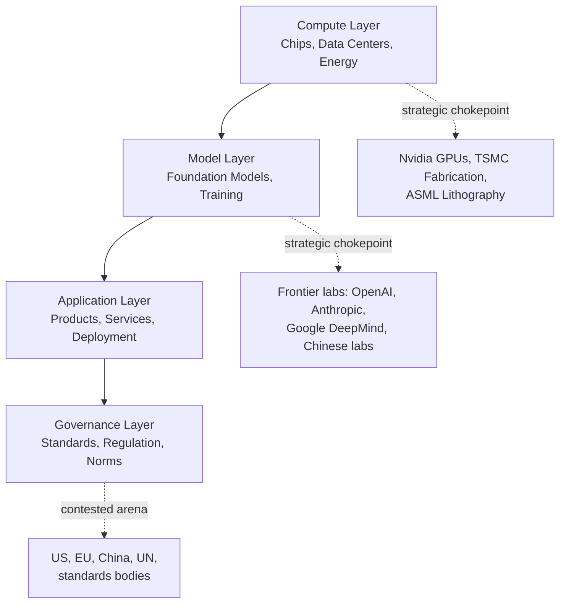

## The Global AI Race and Technology Sovereignty

### Overview

The global AI race refers to the strategic competition among states and blocs to develop, control, and derive advantage from advanced artificial intelligence capabilities. Technology sovereignty is the related pursuit of national or regional autonomy over the critical inputs — compute, data, talent, algorithms, and standards — needed to develop and deploy AI without dependency on rival powers. Together these dynamics are reshaping alliance structures, export control regimes, industrial policy, and the broader architecture of technological globalization.

### Core Concepts

#### Defining Technology Sovereignty

Technology sovereignty encompasses several overlapping dimensions:

- **Compute sovereignty:** Domestic access to advanced chips and data center capacity
- **Data sovereignty:** Control over where data is stored, processed, and by whom, often codified in law (e.g., data localization requirements)
- **Algorithmic/model sovereignty:** Ability to develop or access frontier models without dependency on a foreign vendor
- **Talent sovereignty:** Capacity to train, attract, and retain AI researchers and engineers domestically
- **Standards sovereignty:** Influence over the technical and governance standards that shape global AI deployment

**Key Points**

- No state currently possesses full sovereignty across all five dimensions simultaneously
- The EU frames its approach primarily around regulatory and data sovereignty; China emphasizes compute and algorithmic self-sufficiency; the US leverages first-mover advantage in frontier models and chip design but depends on Taiwan for fabrication

#### The AI Stack and Strategic Layers

Each layer represents a distinct site of geopolitical contest: compute is currently the tightest chokepoint due to chip fabrication concentration (see semiconductor supply chain dynamics), while governance is the most diffuse and contested, with competing regulatory philosophies emerging from Washington, Brussels, and Beijing.

### Major Actors and Strategic Postures

#### United States

**Key Points**

- Maintains leadership in frontier model development (OpenAI, Anthropic, Google DeepMind, Meta) and AI chip design (Nvidia, AMD)
- Uses export controls (BIS rules on advanced GPUs and semiconductor manufacturing equipment) as the primary tool to preserve relative advantage over China
- Domestic policy has shifted across administrations between innovation-first deregulation and calls for safety-oriented federal oversight; as of 2026 the general posture emphasizes maintaining competitive lead while managing frontier model risk through a mix of voluntary commitments and targeted federal actions [Unverified — policy specifics evolve rapidly and should be checked against current guidance]

#### China

- Pursues "self-reliance" (自主可控) in AI as part of broader technology sovereignty strategy following intensified US export controls since 2018
- State-directed investment channels significant capital into domestic chip design (Huawei's Ascend line), AI model development (Baidu, Alibaba, DeepSeek, Zhipu AI), and compute infrastructure buildout
- DeepSeek's emergence in early 2025 demonstrated that Chinese labs could achieve competitive model performance despite compute restrictions, using training efficiency innovations — a development widely interpreted as narrowing the perceived US-China AI gap [Inference regarding the strategic significance; benchmark comparisons across labs carry methodological caveats]

#### European Union

- Prioritizes regulatory sovereignty through the AI Act (risk-based regulatory framework, phased implementation through 2026-2027) and data governance instruments (GDPR, Data Act, Data Governance Act)
- Pursues "digital sovereignty" via initiatives like GAIA-X (federated cloud infrastructure) and public investment in European foundation model developers (e.g., Mistral AI, Aleph Alpha)
- Faces a structural gap between regulatory ambition and compute/model capacity relative to the US and China [Inference based on comparative investment and capability metrics]

#### Middle Powers and the Global South

- Gulf states (UAE, Saudi Arabia) are investing heavily in sovereign AI infrastructure and compute capacity, leveraging capital surpluses and energy access, while navigating US export control constraints on advanced chip access
- India emphasizes talent export and domestic model development (e.g., government-backed initiatives) while balancing relationships with both US and Chinese technology ecosystems
- Many Global South states face a structural risk of AI dependency, importing models, compute access, and standards from great powers without corresponding influence over their design — sometimes termed "AI colonialism" in policy discourse [this term reflects a contested normative framing rather than a settled technical classification]

### Mechanisms of Competition

#### Export Controls and Compute Restrictions

The US has progressively tightened controls on:

- Export of advanced AI accelerators (Nvidia H100/H200/B200-class and successors) to China, using performance-density thresholds
- Access to semiconductor manufacturing equipment (EUV/DUV lithography) needed to fabricate advanced AI chips
- Cloud compute access, restricting foreign entities from renting US-based advanced compute for AI training in certain circumstances

**Example**

A geopolitical risk assessment of compute restrictions would typically track: (1) the specific performance threshold defining "controlled" chips, (2) reported circumvention channels (smuggling, shell companies, cloud arbitrage), and (3) the pace of indigenous substitute development in the restricted country — since controls function as a *time-buying* strategy rather than a permanent barrier. [Inference — this framing reflects analyst consensus rather than a directly observable metric]

#### Industrial Policy and State Investment

- US CHIPS and Science Act channels subsidies toward domestic fabrication partly to secure AI-relevant chip supply
- China's national AI and semiconductor funds represent cumulative investment in the hundreds of billions of dollars across central and provincial vehicles
- EU's AI Continent Action Plan and associated funding mechanisms aim to close the compute and investment gap with the US and China
- Sovereign wealth-backed AI infrastructure investment (Gulf states, Singapore) represents a growing third pathway distinct from the US/China bipolar framing

#### Talent Competition

- Visa and immigration policy functions as an AI competition instrument; restrictive US immigration policy risks pushing talent toward competing ecosystems, while targeted visa pathways (e.g., specialized skilled-worker categories) aim to retain top researchers
- China has run repatriation programs (e.g., Thousand Talents-style initiatives, though the original program was renamed/restructured following US scrutiny) to attract overseas-trained researchers back to domestic institutions
- Research shows a significant share of top-tier AI researchers globally were trained in one country but work in another, creating structural interdependencies that complicate strict decoupling [Inference based on general talent-flow research patterns; specific current figures require verification]

### Technology Sovereignty as Risk Mitigation Strategy

#### Rationale

States pursue sovereignty to reduce exposure to:

1. **Supply disruption:** Denial of critical compute or components during crisis or conflict
2. **Coercive leverage:** A rival state using dependency as diplomatic or economic leverage
3. **Surveillance/data exposure:** Foreign access to sensitive domestic data via foreign-controlled AI systems
4. **Standards lock-in:** Being forced to adopt technical standards or governance norms set by a rival power

#### Trade-offs

**Key Points**

- Full sovereignty is economically costly, given the scale of capital investment required for competitive compute infrastructure and model training runs
- Sovereignty strategies can fragment global technology ecosystems, reducing beneficial interoperability and slowing beneficial diffusion of safety research
- Smaller and middle powers often face a binary choice between joining a US-aligned or China-aligned technology bloc, given the improbability of full independent sovereignty at their scale [Inference — reflects structural analysis rather than a documented policy declaration by any single state]

### Illustrative Risk Assessment Model

<svg xmlns="http://www.w3.org/2000/svg" viewBox="0 0 800 380">
<text x="400" y="25" text-anchor="middle" font-size="16" font-weight="bold" fill="#1a1a1a">AI Sovereignty Risk Dimensions by Bloc (svg_diagram)</text>
<line x1="100" y1="330" x2="100" y2="50" stroke="#333" stroke-width="1.5" />
<line x1="100" y1="330" x2="740" y2="330" stroke="#333" stroke-width="1.5" />
<text x="60" y="55" font-size="10" fill="#333">High</text>
<text x="60" y="335" font-size="10" fill="#333">Low</text>
<text x="40" y="190" font-size="11" fill="#333" transform="rotate(-90 40 190)">Sovereignty Level</text>
<text x="420" y="360" text-anchor="middle" font-size="11" fill="#333">Dependency Risk Exposure</text>
<circle cx="220" cy="120" r="34" fill="#4285f4" opacity="0.75" />
<text x="220" y="115" text-anchor="middle" font-size="10" fill="#fff" font-weight="bold">USA</text>
<text x="220" y="130" text-anchor="middle" font-size="8" fill="#fff">Model lead,</text>
<text x="220" y="140" text-anchor="middle" font-size="8" fill="#fff">fab dependent</text>
<circle cx="330" cy="150" r="34" fill="#ea4335" opacity="0.75" />
<text x="330" y="145" text-anchor="middle" font-size="10" fill="#fff" font-weight="bold">China</text>
<text x="330" y="160" text-anchor="middle" font-size="8" fill="#fff">Compute-</text>
<text x="330" y="170" text-anchor="middle" font-size="8" fill="#fff">constrained</text>
<circle cx="480" cy="230" r="30" fill="#fbbc04" opacity="0.85" />
<text x="480" y="225" text-anchor="middle" font-size="10" fill="#333" font-weight="bold">EU</text>
<text x="480" y="240" text-anchor="middle" font-size="8" fill="#333">Reg. strong,</text>
<text x="480" y="250" text-anchor="middle" font-size="8" fill="#333">compute weak</text>
<circle cx="620" cy="280" r="26" fill="#34a853" opacity="0.85" />
<text x="620" y="278" text-anchor="middle" font-size="9" fill="#fff" font-weight="bold">Middle</text>
<text x="620" y="290" text-anchor="middle" font-size="8" fill="#fff">Powers</text>
<circle cx="690" cy="305" r="22" fill="#a142f4" opacity="0.85" />
<text x="690" y="308" text-anchor="middle" font-size="8" fill="#fff">Global</text>
<text x="690" y="318" text-anchor="middle" font-size="8" fill="#fff">South</text>
</svg>

### Quantitative Framing: Compute as a Strategic Resource

Analysts increasingly track AI compute capacity using metrics such as aggregate FLOP/s (floating point operations per second) available for training, following a framing where effective compute scales approximately as:

$$C_{effective} = N_{chips} \times P_{chip} \times U$$

where $N_{chips}$ is the number of accelerators available, $P_{chip}$ is per-chip peak performance, and $U$ is average utilization efficiency. Export control policy increasingly targets $P_{chip}$ thresholds directly, since restricting per-chip performance is more enforceable than restricting aggregate national compute stock. [Inference — this represents a simplified analytical framing used in policy discourse rather than an official government formula]

### Scenario Considerations for Risk Analysts

**Example**

A technology sovereignty risk brief for a mid-sized economy would typically assess:

1. Current compute access channels (domestic capacity vs. cloud dependency on US/Chinese hyperscalers)
2. Exposure to export control secondary effects (e.g., risk of being caught in extraterritorial rule changes via the Foreign Direct Product Rule)
3. Data localization requirements and their enforceability
4. Talent pipeline sustainability (STEM graduate retention rates)
5. Bloc-alignment implications of infrastructure choices (e.g., adopting Huawei vs. Western telecom/cloud infrastructure)

### Conclusion

The global AI race and the pursuit of technology sovereignty represent a structural shift from AI as primarily a commercial technology toward AI as a core instrument of state power, akin to energy security or military-industrial capacity in earlier eras. Compute concentration, chip fabrication chokepoints, and frontier model capability gaps are driving both great-power decoupling efforts and a search by middle powers for viable non-aligned pathways. For geopolitical risk analysis, this domain requires continuous tracking of export control policy changes, capital investment flows into compute infrastructure, talent migration patterns, and the evolving regulatory postures of the US, EU, and China, since shifts in any one dimension can rapidly alter relative sovereignty positions.

**Related Topics**

- Semiconductor supply chains and chip competition (foundational chokepoint layer)
- Export control regimes: BIS rules, the Foreign Direct Product Rule, and Entity List dynamics
- Data localization and digital sovereignty frameworks (EU, China, India comparative approaches)
- Frontier AI governance and international coordination efforts (UN, G7 Hiroshima Process, AI Safety Institutes)
- Sovereign wealth-backed AI infrastructure investment (Gulf states case study)
- AI and military-strategic competition (autonomous systems, decision-support tools)
- Standards-setting competition in international bodies (ISO, ITU, IEEE)
- Talent migration and brain drain/circulation dynamics in strategic technology sectors