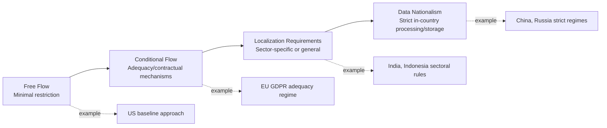

## Data Governance and Digital Sovereignty

### Overview

Data governance and digital sovereignty concern how states and blocs assert control over the collection, storage, processing, and cross-border flow of data, along with the digital infrastructure that carries it. As data has become a strategic economic and security asset — powering AI, surveillance, commerce, and critical infrastructure — governments have moved from treating data flows as a purely commercial matter to treating them as a domain of national security, regulatory contestation, and geopolitical leverage.

### Core Concepts

#### Defining Digital Sovereignty

Digital sovereignty is the principle that a state should exercise control over data, infrastructure, and digital services within its jurisdiction, rather than depending on foreign-controlled platforms and systems. It typically spans:

- **Data sovereignty:** Legal and physical control over where data resides and who can access it
- **Infrastructure sovereignty:** Domestic or trusted-partner control over cloud, telecom, and network infrastructure
- **Operational sovereignty:** Ability to maintain digital services during external shocks (sanctions, cyberattacks, supply disruptions)
- **Regulatory sovereignty:** Capacity to set and enforce rules over platforms operating within one's jurisdiction, regardless of where they are headquartered

**Key Points**

- Digital sovereignty is distinct from data localization: localization is one policy *instrument* used to pursue sovereignty, not the goal itself
- States pursue digital sovereignty for a mix of motives — privacy protection, economic protectionism, law enforcement access, and national security — often blended in ways that make policy intent difficult to disentangle [Inference regarding motive-blending; stated justifications vs. underlying drivers often diverge across jurisdictions]

#### Data Flow Regimes: A Spectrum

### Major Regulatory Frameworks

#### European Union

**Key Points**

- **GDPR (General Data Protection Regulation, 2018):** Establishes extraterritorial jurisdiction over any entity processing EU residents' data, requiring lawful basis for processing and enabling cross-border transfer only via adequacy decisions, standard contractual clauses, or binding corporate rules
- **Data Governance Act and Data Act:** Aim to build a single European data space, encouraging data sharing under EU-controlled terms while asserting rules over non-personal and industrial data (e.g., IoT-generated data)
- **Digital Markets Act (DMA) and Digital Services Act (DSA):** Regulate large platform "gatekeepers," indirectly asserting sovereignty over how dominant (often US-based) tech firms operate in the EU market
- The EU-US Data Privacy Framework (successor to Privacy Shield, which was invalidated by the *Schrems II* ruling in 2020) governs the legal basis for transatlantic data transfers, though it remains subject to ongoing legal challenge [Unverified — legal status of transatlantic transfer mechanisms shifts with court rulings and should be checked against current developments]

#### China

- **Cybersecurity Law (2017), Data Security Law (2021), Personal Information Protection Law/PIPL (2021):** Together establish a comprehensive data governance regime requiring data classification by sensitivity, mandatory security assessments for cross-border transfer of "important data," and localization requirements for critical information infrastructure operators
- Reflects a governance philosophy explicitly linking data control to national security and social stability, distinct from the EU's rights-based framing or the US's market-based approach
- Cross-border data transfer requires government security review for large-scale or sensitive data exports, giving the state significant discretionary control over international data flows

#### United States

- Lacks a comprehensive federal data protection law; relies on sectoral regulation (HIPAA for health, GLBA for finance, COPPA for children's data) plus a patchwork of state laws (California's CCPA/CPRA being the most prominent)
- Approaches digital sovereignty primarily through export controls on sensitive data flows to countries of concern (e.g., the 2024 Executive Order restricting bulk transfer of Americans' sensitive personal data to China, Russia, and other designated countries) rather than comprehensive localization
- Advocates internationally for "free flow of data with trust," reflecting commercial interests of major US cloud and platform providers

#### India

- **Digital Personal Data Protection Act (DPDPA, 2023):** Establishes a consent-based framework with government power to restrict cross-border transfers to specific countries via a notified list (a "negative list" or "blacklist" approach rather than the EU's adequacy model)
- Earlier draft frameworks proposed stricter localization for "critical personal data," reflecting a policy tension between attracting foreign digital investment and asserting data sovereignty [Inference — reflects observed policy oscillation across drafts rather than a fixed doctrine]

#### Other Notable Approaches

- **Russia:** Requires localization of Russian citizens' personal data on servers physically located within Russia (Federal Law No. 242-FZ)
- **Indonesia, Vietnam:** Sector-specific localization requirements, particularly for financial and government data
- **Gulf states:** Emerging frameworks blending free-flow commercial ambitions (as regional cloud/AI hubs) with selective localization for government and financial data

### Digital Sovereignty as Infrastructure Strategy

#### Cloud and Hyperscaler Dependency

**Key Points**

- Three US firms (AWS, Microsoft Azure, Google Cloud) hold a dominant share of global public cloud infrastructure, creating a structural dependency for states and firms worldwide
- The EU's **GAIA-X** initiative sought to build a federated, sovereignty-compliant cloud framework, though it has faced criticism over slow progress and continued reliance on US hyperscaler participation [Inference based on widely reported implementation challenges]
- "Sovereign cloud" offerings (e.g., Microsoft's EU Data Boundary, AWS European Sovereign Cloud) represent a compromise model: US-owned infrastructure operated under local legal and operational controls to satisfy regulators without fully excluding US providers

#### Submarine Cables and Physical Infrastructure

- Roughly the vast majority of intercontinental internet traffic travels via submarine fiber-optic cables, making them a critical and physically vulnerable chokepoint
- Cable ownership and routing decisions have become geopolitically contested — the US has pressured against Chinese state-linked firms (e.g., HMN Technologies, formerly Huawei Marine) participating in cable-laying consortia over espionage and sabotage concerns
- Cable-cutting incidents (whether accidental or attributed to deliberate action) have raised the profile of subsea infrastructure as a national security concern, particularly in the Baltic Sea and Taiwan Strait regions

### Mechanisms and Instruments

#### Data Localization Requirements

Legal mandates requiring certain data types to be stored and/or processed within national borders. Rationales include:

1. Law enforcement and intelligence access facilitation
2. Protection from foreign surveillance (post-Snowden dynamics significantly accelerated global localization trends)
3. Industrial policy — building domestic data center and cloud markets
4. National security for critical infrastructure data

#### Adequacy and Transfer Mechanisms

The EU's adequacy model requires the European Commission to formally determine that a third country's data protection standards are "essentially equivalent" to the EU's before permitting free data flow. This creates a de facto EU regulatory export effect (the "Brussels Effect"), where non-EU countries adjust domestic law to qualify for adequacy and preserve commercial access to the EU market.

#### Platform and Cross-Border Enforcement Actions

States increasingly use extraterritorial enforcement — fines, forced divestitures, or access bans — against foreign platforms:

**Example**

The EU has issued substantial GDPR fines against major US tech firms for unlawful cross-border data transfer practices, and several states (India, and previously considered in the US at various points) have pursued forced-divestiture or ban actions against apps like TikTok, citing data access risk to a foreign adversary government as the primary security rationale.

### Risk Analysis Framework

#### Key Risk Dimensions for Analysts

1. **Regulatory fragmentation risk:** Divergent data regimes increase compliance costs and legal uncertainty for multinational operations
2. **Access/surveillance risk:** Foreign government legal-access regimes (e.g., China's national security laws, US CLOUD Act) creating exposure for data held by firms subject to that jurisdiction, regardless of physical storage location
3. **Infrastructure resilience risk:** Cable, cloud, and data center concentration creating single points of failure
4. **Platform weaponization risk:** Use of dominant platforms for influence operations, espionage, or economic coercion
5. **Enforcement extraterritoriality risk:** Exposure to conflicting legal obligations when one jurisdiction's data access demand (e.g., US CLOUD Act warrants) conflicts with another's data protection law (e.g., GDPR)

#### The CLOUD Act–GDPR Conflict Case Study

The US CLOUD Act (2018) permits US law enforcement to compel US-based technology companies to produce data regardless of where it is physically stored, while EU GDPR restricts transfer of EU personal data outside the Union without a valid legal basis. This creates a direct legal conflict for any US-headquartered cloud provider operating in the EU, illustrating how overlapping sovereignty claims generate genuine compliance dilemmas rather than merely political friction.

### Illustrative Sovereignty Model Comparison

<svg xmlns="http://www.w3.org/2000/svg" viewBox="0 0 800 340">
<text x="400" y="25" text-anchor="middle" font-size="16" font-weight="bold" fill="#1a1a1a">Comparative Data Governance Models (svg_diagram)</text>
<rect x="40" y="60" width="170" height="240" rx="6" fill="#e8f0fe" stroke="#4285f4" stroke-width="1.5" />
<text x="125" y="85" text-anchor="middle" font-size="12" font-weight="bold" fill="#1a1a1a">United States</text>
<text x="125" y="110" text-anchor="middle" font-size="9" fill="#333">Market-based</text>
<text x="125" y="128" text-anchor="middle" font-size="9" fill="#333">Sectoral laws</text>
<text x="125" y="146" text-anchor="middle" font-size="9" fill="#333">Free-flow advocacy</text>
<text x="125" y="164" text-anchor="middle" font-size="9" fill="#333">Targeted export</text>
<text x="125" y="180" text-anchor="middle" font-size="9" fill="#333">controls (adversary</text>
<text x="125" y="196" text-anchor="middle" font-size="9" fill="#333">nations)</text>
<rect x="230" y="60" width="170" height="240" rx="6" fill="#e6f4ea" stroke="#34a853" stroke-width="1.5" />
<text x="315" y="85" text-anchor="middle" font-size="12" font-weight="bold" fill="#1a1a1a">European Union</text>
<text x="315" y="110" text-anchor="middle" font-size="9" fill="#333">Rights-based</text>
<text x="315" y="128" text-anchor="middle" font-size="9" fill="#333">GDPR/DMA/DSA</text>
<text x="315" y="146" text-anchor="middle" font-size="9" fill="#333">Adequacy regime</text>
<text x="315" y="164" text-anchor="middle" font-size="9" fill="#333">Brussels Effect</text>
<text x="315" y="182" text-anchor="middle" font-size="9" fill="#333">export of standards</text>
<rect x="420" y="60" width="170" height="240" rx="6" fill="#fce8e6" stroke="#ea4335" stroke-width="1.5" />
<text x="505" y="85" text-anchor="middle" font-size="12" font-weight="bold" fill="#1a1a1a">China</text>
<text x="505" y="110" text-anchor="middle" font-size="9" fill="#333">Security-based</text>
<text x="505" y="128" text-anchor="middle" font-size="9" fill="#333">DSL/PIPL/CSL</text>
<text x="505" y="146" text-anchor="middle" font-size="9" fill="#333">State security</text>
<text x="505" y="164" text-anchor="middle" font-size="9" fill="#333">review for transfer</text>
<text x="505" y="182" text-anchor="middle" font-size="9" fill="#333">Strong localization</text>
<rect x="610" y="60" width="160" height="240" rx="6" fill="#fef7e0" stroke="#fbbc04" stroke-width="1.5" />
<text x="690" y="85" text-anchor="middle" font-size="12" font-weight="bold" fill="#1a1a1a">India/Global South</text>
<text x="690" y="110" text-anchor="middle" font-size="9" fill="#333">Hybrid/emerging</text>
<text x="690" y="128" text-anchor="middle" font-size="9" fill="#333">Consent-based +</text>
<text x="690" y="144" text-anchor="middle" font-size="9" fill="#333">negative-list</text>
<text x="690" y="162" text-anchor="middle" font-size="9" fill="#333">transfer controls</text>
<text x="690" y="180" text-anchor="middle" font-size="9" fill="#333">Sectoral localization</text>
</svg>

### Conclusion

Data governance has evolved from a largely technical and commercial concern into a core arena of geopolitical contestation, reflecting the recognition that control over data flows shapes economic competitiveness, law enforcement capacity, national security, and the practical exercise of state authority in the digital realm. The absence of a unified global data governance regime — replaced instead by competing US, EU, and Chinese models plus a growing set of hybrid approaches — creates persistent friction for multinational firms and unresolved legal conflicts (such as the CLOUD Act–GDPR tension) that geopolitical risk analysts must track closely. As AI systems increase the strategic value of data as a training input, expect data governance and technology sovereignty debates to become increasingly intertwined rather than treated as separate policy domains.

**Related Topics**

- The global AI race and technology sovereignty (data as AI training input)
- Semiconductor supply chains and chip competition (infrastructure layer underlying data sovereignty)
- Submarine cable infrastructure security and geopolitical risk
- The "Brussels Effect" and extraterritorial regulatory diffusion
- Cross-border law enforcement access conflicts (CLOUD Act, mutual legal assistance treaties)
- Platform bans and forced-divestiture precedents (TikTok case studies)
- Cybersecurity law and critical infrastructure protection regimes
- Surveillance capitalism and state surveillance convergence debates