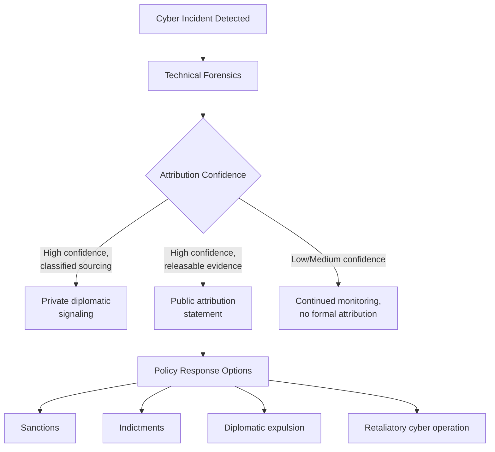

## Cybersecurity as a Geopolitical Risk Domain

### Overview

Cybersecurity has emerged as a distinct domain of state power and interstate conflict, sitting alongside diplomatic, military, and economic instruments of statecraft. Unlike conventional military domains, cyberspace is characterized by low barriers to entry, attribution difficulty, dual-use tooling, and a blurred line between criminal, espionage, and state-sanctioned activity. For geopolitical risk analysis, cybersecurity functions both as an independent risk vector (attacks on critical infrastructure, data theft, disruption) and as an amplifier of other geopolitical tensions (sanctions evasion, hybrid warfare, election interference).

### Core Concepts

#### The Cyber Threat Actor Landscape

**Key Points**

- **Nation-state actors:** Directly employed or sponsored by government intelligence/military agencies, pursuing espionage, sabotage, or strategic disruption
- **State-sponsored/state-affiliated groups:** Operate with varying degrees of official direction, deniability, or tacit tolerance (e.g., criminal groups allowed to operate domestically provided they avoid targeting the host government)
- **Cybercriminal organizations:** Financially motivated, increasingly operating as professionalized enterprises (ransomware-as-a-service models)
- **Hacktivists:** Ideologically motivated actors, sometimes aligned informally with state interests during conflicts (observed extensively during the Russia-Ukraine war)
- **Advanced Persistent Threats (APTs):** A classification term for sustained, sophisticated intrusion campaigns typically attributed to nation-state-level resourcing and patience

#### Attribution Challenges

Attribution — determining who conducted a cyber operation — remains technically and politically fraught:

- Technical indicators (malware signatures, infrastructure reuse, coding patterns, language artifacts) provide probabilistic rather than definitive evidence
- False flag operations deliberately mimic other actors' tradecraft to misdirect attribution
- Governments often possess higher-confidence attribution (via signals intelligence) than they can publicly disclose without compromising sources and methods
- Public attribution frequently serves diplomatic signaling purposes independent of prosecutorial or retaliatory intent [Inference — reflects general pattern observed in attribution statement timing and content, not a stated doctrine]

### Major State Cyber Programs and Postures

#### United States

- Cyber Command (USCYBERCOM) operates under a "defend forward" and "persistent engagement" doctrine, emphasizing proactive disruption of adversary capabilities before they reach US networks, articulated significantly since the 2018 Department of Defense Cyber Strategy
- CISA (Cybersecurity and Infrastructure Security Agency) serves as the primary civilian-facing coordinator for critical infrastructure protection and incident response coordination
- Sanctions and indictments (via DOJ) against foreign state-linked hackers function primarily as deterrence signaling rather than expectation of arrest, given limited extradition cooperation with adversary states

#### Russia

- Cyber operations are closely integrated with broader information warfare and hybrid conflict doctrine, particularly evident in operations preceding and during the 2022 invasion of Ukraine
- Groups such as those linked to the GRU (military intelligence) and FSB have been attributed to major incidents including the NotPetya attack (2017) and various election interference operations
- Russia has historically provided permissive operating environments for financially motivated ransomware groups, provided operations avoid targeting Russian or CIS-based entities [Inference based on pattern observed across multiple threat intelligence reports; formal state policy is not publicly codified]

#### China

- Cyber espionage historically emphasized intellectual property theft and economic espionage supporting industrial policy goals, alongside traditional political/military intelligence collection
- Groups linked to China's Ministry of State Security and People's Liberation Army have been attributed to major campaigns including sustained infrastructure pre-positioning activity (e.g., "Volt Typhoon," reported by Western intelligence agencies as targeting critical infrastructure for potential future disruption rather than immediate espionage)
- The 2015 US-China cyber agreement (committing both sides to refrain from cyber-enabled IP theft for commercial advantage) produced a temporary observed reduction in such activity, illustrating that bilateral cyber norms agreements can have measurable effect, though durability has been contested in subsequent years [Unverified — post-agreement compliance assessments vary across reporting periods and sources]

#### North Korea

- Cyber operations serve a distinctive dual purpose: intelligence collection/disruption alongside direct revenue generation for a sanctioned regime
- The Lazarus Group and affiliated units have been attributed to major cryptocurrency theft operations, generating substantial revenue reportedly channeled toward weapons programs, representing a unique case where cybercrime directly substitutes for conventional state financing under sanctions constraints

#### Iran

- Cyber capabilities have been used for regional disruptive operations (e.g., attacks on Gulf state critical infrastructure and financial systems) and retaliatory signaling tied to broader Middle East tensions
- Notable historical case: the Stuxnet operation (widely attributed to US-Israeli cooperation, though never formally acknowledged) against Iranian nuclear enrichment infrastructure represents a landmark case of cyber operations achieving physical sabotage effects

### Critical Infrastructure as a Target Domain

#### Why Infrastructure Is Prioritized

**Key Points**

- Energy grids, water systems, financial networks, and healthcare systems represent high-impact targets where disruption generates immediate, visible societal effects
- Operational Technology (OT) and Industrial Control Systems (ICS) often run on legacy protocols with weaker security postures than modern IT systems, creating persistent vulnerability
- Pre-positioning in critical infrastructure (establishing latent access without immediate disruptive action) is increasingly assessed by Western intelligence agencies as a deliberate strategic posture intended to enable future coercive leverage during crisis or conflict, rather than routine espionage [Inference reflecting stated assessments from agencies like CISA/NSA regarding Volt Typhoon-type activity; underlying intent cannot be independently verified by outside analysts]

#### Notable Infrastructure Incidents

- **Ukrainian power grid attacks (2015, 2016):** Attributed to Russian state-linked actors, representing among the first confirmed cyberattacks causing physical power outages
- **Colonial Pipeline ransomware attack (2021):** Criminal (DarkSide group, Russia-linked) rather than directly state-directed, but illustrated how criminal cyber activity against critical infrastructure can trigger national-security-level government response
- **NotPetya (2017):** Nominally ransomware but assessed as a Russian state-directed destructive attack targeting Ukraine that caused significant unintended global collateral damage to multinational corporations, illustrating the risk of cyber weapons propagating beyond intended targets

### Cyber Operations in Hybrid and Conventional Conflict

#### Integration with Military Operations

The Russia-Ukraine conflict has provided the most extensively documented case of cyber operations integrated with conventional warfare:

- Pre-invasion wiper malware attacks against Ukrainian government and infrastructure systems
- Satellite communication disruption (the Viasat KA-SAT hack, attributed to Russia, which had cascading effects on unrelated European wind turbine monitoring systems)
- Extensive use of both state and volunteer/hacktivist cyber operations by both sides throughout the conflict, including crowdsourced targeting efforts

#### Below-Threshold Operations

Much state cyber activity deliberately operates in a "gray zone" below the threshold that would trigger conventional military response or clear international law violation classification, exploiting ambiguity in how international law (particularly the UN Charter's prohibition on the use of force) applies to cyber operations. [This remains an area of ongoing legal and doctrinal debate rather than settled international consensus.]

### Governance and Norms Frameworks

#### International Efforts

- **UN Group of Governmental Experts (GGE) and Open-Ended Working Group (OEWG):** UN-affiliated processes attempting to establish voluntary norms of responsible state behavior in cyberspace; progress has been incremental and non-binding
- **Budapest Convention on Cybercrime (2001):** The primary binding international treaty on cybercrime cooperation, though notably not ratified by Russia or China
- **Paris Call for Trust and Security in Cyberspace:** A multistakeholder (state, private sector, civil society) initiative endorsing shared cyber norms, though non-binding and unevenly adopted

#### Public-Private Coordination

Because critical infrastructure and major digital platforms are predominantly privately owned (especially in Western economies), effective national cyber defense requires structured public-private information sharing (e.g., threat intelligence sharing frameworks, mandatory incident reporting requirements such as those under CISA's CIRCIA rules in the US or the EU's NIS2 Directive).

### Risk Analysis Framework

#### Assessing Cyber Geopolitical Risk

Analysts typically evaluate:

1. **Actor capability and intent:** Technical sophistication combined with assessed strategic motivation
2. **Target criticality:** Systemic importance of the targeted infrastructure or data
3. **Attribution confidence and likely response:** Probability of escalation versus tacit tolerance
4. **Escalation dynamics:** Risk that a cyber incident triggers kinetic or broader diplomatic/economic retaliation
5. **Spillover/collateral risk:** Potential for attacks to propagate beyond intended targets (as with NotPetya)

#### Example Scenario Assessment

**Example**

A risk analysis of potential Chinese pre-positioning activity in US critical infrastructure (in a Taiwan contingency context) would typically weigh: (1) confirmed technical evidence of persistent access in specific infrastructure sectors, (2) assessed strategic rationale (deterrence signaling vs. genuine disruption preparation), (3) likely US policy response thresholds (sanctions, diplomatic protest, defensive hardening mandates), and (4) the risk that detection itself alters adversary behavior, complicating forward-looking assessment. [Inference — assessment methodology reflects general open-source intelligence analysis practice; specific classified assessments are not accessible for verification]

### Illustrative Escalation Ladder

<svg xmlns="http://www.w3.org/2000/svg" viewBox="0 0 800 380">
<text x="400" y="25" text-anchor="middle" font-size="16" font-weight="bold" fill="#1a1a1a">Cyber Conflict Escalation Ladder (svg_diagram)</text>
<rect x="60" y="300" width="680" height="45" rx="4" fill="#e6f4ea" stroke="#34a853" stroke-width="1.5" />
<text x="400" y="327" text-anchor="middle" font-size="11" font-weight="bold" fill="#1a1a1a">1. Routine Espionage / Reconnaissance (persistent, low visibility)</text>
<rect x="60" y="245" width="680" height="45" rx="4" fill="#fef7e0" stroke="#fbbc04" stroke-width="1.5" />
<text x="400" y="272" text-anchor="middle" font-size="11" font-weight="bold" fill="#1a1a1a">2. Infrastructure Pre-positioning (latent access, no disruption)</text>
<rect x="60" y="190" width="680" height="45" rx="4" fill="#fde3cf" stroke="#f57c00" stroke-width="1.5" />
<text x="400" y="217" text-anchor="middle" font-size="11" font-weight="bold" fill="#1a1a1a">3. Disruptive Attack (DDoS, data theft, ransomware)</text>
<rect x="60" y="135" width="680" height="45" rx="4" fill="#fce8e6" stroke="#ea4335" stroke-width="1.5" />
<text x="400" y="162" text-anchor="middle" font-size="11" font-weight="bold" fill="#1a1a1a">4. Destructive Attack (wipers, physical/OT damage)</text>
<rect x="60" y="80" width="680" height="45" rx="4" fill="#f3e8fd" stroke="#a142f4" stroke-width="1.5" />
<text x="400" y="107" text-anchor="middle" font-size="11" font-weight="bold" fill="#1a1a1a">5. Integrated Hybrid Warfare (cyber + kinetic military operations)</text>
<line x1="400" y1="345" x2="400" y2="80" stroke="#666" stroke-width="1" stroke-dasharray="4,2" />
<text x="760" y="330" font-size="9" fill="#333" text-anchor="middle">Low</text>
<text x="760" y="95" font-size="9" fill="#333" text-anchor="middle">High</text>
<text x="765" y="215" font-size="9" fill="#333" text-anchor="middle" transform="rotate(-90 765 215)">Severity</text>
</svg>

### Conclusion

Cybersecurity has matured from a technical IT concern into a core dimension of geopolitical risk, blending espionage, sabotage, criminal enterprise, and information warfare into an integrated instrument of state competition. Its defining features — attribution ambiguity, dual-use tooling, private-sector infrastructure ownership, and a contested normative framework — make it distinct from traditional military or economic risk domains and demand specialized analytical frameworks. For geopolitical risk analysts, tracking this domain requires synthesizing technical threat intelligence, policy attribution statements, critical infrastructure vulnerability assessments, and the broader diplomatic context in which cyber operations occur, since cyber incidents rarely exist in isolation from wider strategic tensions.

**Related Topics**

- Critical infrastructure protection and resilience planning
- Ransomware ecosystems and cryptocurrency-enabled cybercrime financing
- Information warfare and disinformation operations
- International law applicability to cyberspace (Tallinn Manual framework)
- Sanctions regimes targeting cyber threat actors
- Hybrid warfare doctrine and gray-zone conflict
- Data governance and digital sovereignty (infrastructure and data exposure overlap)
- The global AI race and technology sovereignty (AI-enabled offensive/defensive cyber capabilities)