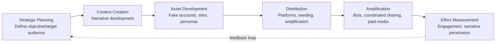

## Information Warfare and Disinformation Campaigns

### Overview

Information warfare refers to the strategic use of information — true, false, or misleading — to influence perceptions, decisions, and behavior of a target population or government in ways that advance a state or non-state actor's geopolitical objectives. Disinformation campaigns are a specific subset: the deliberate creation and spread of false or misleading content to deceive. This domain has become central to contemporary geopolitical risk analysis because it enables actors to achieve strategic effects — eroding trust, shaping elections, justifying military action, fracturing alliances — without crossing thresholds that would trigger conventional military or diplomatic escalation.

### Core Concepts and Terminology

#### Distinguishing Related Terms

**Key Points**

- **Misinformation:** False information spread without deliberate intent to deceive
- **Disinformation:** False information spread deliberately and knowingly to deceive
- **Malinformation:** Genuine information shared out of context or maliciously to cause harm (e.g., leaked private communications)
- **Influence operations:** The broader category encompassing coordinated efforts (using true, false, or mixed content) to shape opinion or behavior, of which disinformation is one tool
- **Propaganda:** Historically the broadest term, referring to any systematic effort to shape attitudes, not inherently deceptive but often used interchangeably with disinformation in popular usage

#### The DISARM/AMITT Framework Concept

Analysts increasingly use structured frameworks (such as the open-source DISARM framework, modeled on the MITRE ATT&CK approach used in cybersecurity) to categorize influence operations by tactics and techniques across a campaign lifecycle, enabling standardized cross-case comparison.

### Historical and Contemporary Case Studies

#### Russian Influence Operations

- **2016 US election interference:** Documented in the US Intelligence Community Assessment and the Mueller Report, involving social media manipulation (notably via the Internet Research Agency "troll farm") and hacked-material dissemination (DNC/Podesta emails), aimed at general discord-sowing alongside candidate-specific effects
- **Ongoing operations targeting Ukraine and European elections:** Consistent patterns of narrative amplification around war framing, refugee issues, and support-fatigue messaging in NATO and EU states, documented by EU DisinfoLab, the EU's EEAS StratCom division, and multiple national intelligence services
- Russian doctrine has historically framed information operations as part of an integrated "reflexive control" concept — shaping an adversary's perception environment to induce self-defeating decisions — though the degree to which this represents formal doctrine versus retrospective analytical framing is debated among specialists [Inference — reflects a contested academic interpretation rather than a single confirmed doctrinal document]

#### Chinese Influence Operations

- Increasingly assessed as shifting from primarily defensive/reactive messaging (protecting the CCP's international image) toward more proactive and covert influence operations, particularly regarding Taiwan, Hong Kong, Xinjiang, and South China Sea narratives
- State media (Xinhua, CGTN, Global Times) combined with covert coordinated inauthentic social media networks (documented in multiple platform takedown reports) form a layered "discourse power" (话语权) strategy aimed at reshaping international narrative dominance historically seen as Western-controlled
- Operations attributed to Chinese state-linked networks (e.g., "Spamouflage"/"Dragonbridge," as named in various platform and research reports) have shown persistent but historically low-engagement patterns, though sophistication and reach are assessed to be increasing [Inference based on trend analysis across multiple platform transparency reports; individual campaign effectiveness is difficult to verify independently]

#### Iranian Operations

- Focused significantly on regional Middle East narratives and, per multiple platform disclosures, periodic attempts at US domestic political influence, generally assessed as less sophisticated in execution than Russian operations but persistent in volume

#### State and Non-State Hybrid Cases

- The 2014 MH17 shootdown information environment illustrated extensive competing state-linked narrative campaigns following a kinetic incident, becoming a landmark case study in open-source investigation (Bellingcat) countering state disinformation
- COVID-19 pandemic-era disinformation involved both state-linked campaigns (e.g., competing narratives about vaccine origins and efficacy attributed variously to multiple state and non-state sources) and organic misinformation, illustrating the blurred boundary between coordinated campaigns and emergent public confusion

### Technical and Platform Dimensions

#### Coordinated Inauthentic Behavior (CIB)

Platforms (Meta, X/Twitter, YouTube) periodically publish takedown reports identifying "coordinated inauthentic behavior" — networks of accounts, often partially automated, working in concert to amplify narratives while misrepresenting their identity or coordination. These reports have become a primary open-source data source for researchers, though platform transparency and consistency in reporting varies considerably across companies and time periods. [Unverified — the completeness and methodology of platform-published takedown data cannot be independently audited by outside researchers]

#### Generative AI and Synthetic Media

**Key Points**

- Generative AI tools have lowered the cost and increased the scale at which synthetic text, images, audio (voice cloning), and video ("deepfakes") can be produced for influence operations
- Documented cases include AI-generated fake news anchors used in state-linked campaigns and synthetic audio used in localized political disinformation incidents
- Detection technology (forensic deepfake detection, provenance/watermarking standards such as the C2PA coalition's content credentials) is in an active arms-race dynamic with generation technology, and current detection reliability should not be assumed to keep pace with generation advances [Inference based on general cybersecurity arms-race pattern literature applied to this domain]

#### Bot Networks and Automation

Automated or semi-automated account networks amplify content to create an artificial impression of organic consensus or trending status, though platform bot-detection improvements have pushed some operations toward using authentic human "engagement farms" or unwitting amplifiers instead, complicating detection.

### State Responses and Countermeasures

#### Detection and Attribution Infrastructure

- Government-affiliated bodies (US State Department's Global Engagement Center — note: its congressional authorization lapsed in December 2024, altering the US institutional landscape [this is a documented institutional change and should be verified for current status]; EU's East StratCom Task Force/EUvsDisinfo) monitor and publicly document foreign influence operations
- Independent research organizations (Stanford Internet Observatory, Oxford Internet Institute, Atlantic Council's DFRLab, EU DisinfoLab) provide non-governmental analytical capacity, often collaborating with platforms and governments on specific investigations

#### Policy and Regulatory Responses

- **EU Digital Services Act (DSA):** Imposes systemic risk assessment and mitigation obligations on very large online platforms, including specific requirements addressing disinformation and civic discourse manipulation
- **EU Code of Practice on Disinformation:** A voluntary (now partially integrated into DSA obligations) commitment framework for platforms
- Election-specific measures: many democracies have implemented pre-election "quiet periods" for foreign-funded political advertising, mandatory ad-transparency libraries, and rapid-response coordination units within electoral commissions

#### Media Literacy and Societal Resilience

Longer-term resilience approaches emphasize media literacy education and "pre-bunking" (inoculation-style interventions that expose audiences to weakened forms of manipulation techniques before encountering real examples), which research suggests can build resistance to manipulation more durably than post-hoc fact-checking alone [Inference based on published inoculation-theory research; effect sizes and durability vary across studies and should not be treated as uniformly established]

### Risk Analysis Framework

#### Assessing Disinformation Campaign Risk

Analysts typically evaluate:

1. **Actor sophistication and resourcing:** State-directed campaigns typically show more persistence and resource investment than opportunistic actors
2. **Narrative-objective alignment:** Whether content clusters align with a plausible state strategic interest (a key attribution heuristic, though not conclusive alone)
3. **Target vulnerability:** Pre-existing societal polarization, institutional trust levels, and media literacy affect campaign potential impact independent of campaign sophistication
4. **Platform and channel exposure:** Which platforms and communities are being targeted, and their relative resistance/susceptibility characteristics
5. **Timing correlation:** Alignment with elections, referenda, military operations, or diplomatic crises

#### Example Assessment Structure

**Example**

A risk brief assessing a suspected influence operation ahead of a national election would typically structure findings around: (1) network mapping (account creation patterns, coordination indicators), (2) narrative content analysis (thematic clustering and consistency with known state strategic objectives), (3) amplification mechanics (bot vs. authentic engagement patterns), and (4) estimated audience reach and engagement — explicitly distinguishing measured exposure from actual attitude or behavior change, since the latter is significantly harder to establish empirically than reach metrics alone. [Inference — reflects standard practice in published academic and think-tank influence operation reports]

### Illustrative Actor-Motivation Matrix

<svg xmlns="http://www.w3.org/2000/svg" viewBox="0 0 800 360">
<text x="400" y="25" text-anchor="middle" font-size="16" font-weight="bold" fill="#1a1a1a">Information Warfare Actor Landscape (svg_diagram)</text>
<line x1="80" y1="310" x2="80" y2="50" stroke="#333" stroke-width="1.5" />
<line x1="80" y1="310" x2="750" y2="310" stroke="#333" stroke-width="1.5" />
<text x="30" y="55" font-size="10" fill="#333">High</text>
<text x="30" y="315" font-size="10" fill="#333">Low</text>
<text x="400" y="340" text-anchor="middle" font-size="11" fill="#333">Operational Sophistication</text>
<text x="20" y="180" font-size="11" fill="#333" transform="rotate(-90 20 180)">State Direction/Coordination</text>
<circle cx="620" cy="100" r="32" fill="#ea4335" opacity="0.8" />
<text x="620" y="97" text-anchor="middle" font-size="9" fill="#fff" font-weight="bold">Russia-linked</text>
<text x="620" y="110" text-anchor="middle" font-size="8" fill="#fff">(IRA-style)</text>
<circle cx="560" cy="150" r="30" fill="#fbbc04" opacity="0.85" />
<text x="560" y="147" text-anchor="middle" font-size="9" fill="#333" font-weight="bold">China-linked</text>
<text x="560" y="160" text-anchor="middle" font-size="8" fill="#333">(Spamouflage)</text>
<circle cx="450" cy="200" r="26" fill="#a142f4" opacity="0.85" />
<text x="450" y="198" text-anchor="middle" font-size="8" fill="#fff" font-weight="bold">Iran-linked</text>
<circle cx="250" cy="260" r="24" fill="#34a853" opacity="0.85" />
<text x="250" y="258" text-anchor="middle" font-size="8" fill="#fff" font-weight="bold">Domestic</text>
<text x="250" y="270" text-anchor="middle" font-size="7" fill="#fff">partisan actors</text>
<circle cx="150" cy="280" r="20" fill="#4285f4" opacity="0.85" />
<text x="150" y="283" text-anchor="middle" font-size="7" fill="#fff">Organic</text>
<text x="150" y="292" text-anchor="middle" font-size="7" fill="#fff">misinfo</text>
</svg>

### Conclusion

Information warfare and disinformation campaigns represent a low-cost, high-leverage instrument that allows states and non-state actors to pursue strategic objectives — eroding institutional trust, influencing elections, shaping conflict narratives — while largely operating below thresholds that trigger conventional retaliation. The domain's core analytical challenges (attribution ambiguity, effect measurement difficulty, and the accelerating capability of generative AI tools) mean that geopolitical risk assessment in this space requires combining technical network analysis, narrative content analysis, and contextual strategic-interest reasoning, while maintaining appropriate epistemic caution about claimed campaign effectiveness, which is considerably harder to establish than campaign existence or reach.

**Related Topics**

- Cybersecurity as a geopolitical risk domain (technical infrastructure overlap)
- The global AI race and technology sovereignty (generative AI's dual-use role in synthetic media)
- Election security and electoral interference risk assessment
- Platform governance and content moderation policy (EU DSA, comparative regulatory models)
- Hybrid warfare doctrine and gray-zone conflict
- Open-source intelligence (OSINT) methodology and investigative journalism's role in attribution
- Media literacy and societal resilience-building interventions
- Sanctions and diplomatic responses to attributed influence operations