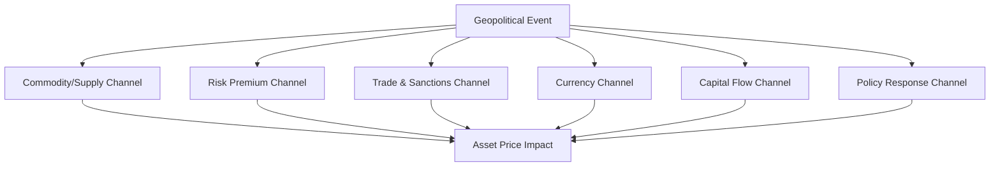

## Transmission Channels from Geopolitical Events to Asset Prices

### Overview

Geopolitical events affect financial markets through identifiable structural pathways rather than through diffuse, unmodelable uncertainty alone. Understanding these transmission channels allows analysts to move from qualitative geopolitical assessment to disciplined evaluation of which asset classes, sectors, and regions are likely to be affected, by how much, and over what time horizon. This is foundational for integrating geopolitical risk analysis into portfolio construction, hedging strategy, and macro forecasting.

### Core Conceptual Framework

#### Direct vs. Indirect Transmission

**Key Points**

- **Direct channels:** Immediate, mechanical effects — a sanctioned country's assets become frozen or untradeable; a war disrupts a specific commodity's physical supply
- **Indirect channels:** Effects operating through investor psychology, risk pricing, and macroeconomic feedback loops — a geopolitical shock raises perceived tail risk, prompting a broad repricing of risk assets independent of direct fundamental exposure
- Most major geopolitical market events involve both channels operating simultaneously, with indirect channels often producing larger and more persistent price effects than the direct fundamental impact alone would justify [Inference based on observed patterns across historical event studies; the precise decomposition between channels is not directly observable and requires modeling assumptions]

#### The Standard Transmission Taxonomy

Geopolitical risk analysts commonly organize transmission channels into the following categories:

### Channel 1: Commodity and Supply Disruption

#### Mechanism

Events affecting production, extraction, or transport of physical commodities (oil, natural gas, agricultural products, critical minerals) transmit directly to commodity prices, then propagate to related equities, currencies of commodity-exporting/importing nations, and broader inflation expectations.

**Example**

Russia's 2022 invasion of Ukraine disrupted global wheat and sunflower oil exports (both countries being major producers) and triggered a sharp European natural gas price spike following subsequent supply cuts, illustrating how a regional conflict transmits globally through commodity markets even to countries with no direct trade exposure to the conflicting parties.

#### Key Transmission Variables

- **Chokepoint exposure:** Physical transit points (Strait of Hormuz, Strait of Malacca, Suez Canal, Bab-el-Mandeb) where disruption affects global rather than merely bilateral trade
- **Producer concentration:** Markets with few dominant suppliers (e.g., OPEC+ spare capacity dynamics in oil) transmit shocks more sharply than diversified-supplier commodities
- **Substitutability and inventory buffers:** Strategic petroleum reserves and substitute-input availability dampen price transmission speed and magnitude

### Channel 2: Risk Premium and Volatility Repricing

#### Mechanism

Geopolitical shocks that increase perceived uncertainty — regardless of direct fundamental exposure — cause investors to demand higher compensation for holding risk assets, compressing valuations broadly. This operates through:

- **Equity risk premium expansion:** Higher required returns lower present-value calculations for future cash flows, depressing equity valuations market-wide
- **Volatility spikes:** Measured via instruments like the VIX (CBOE Volatility Index), which frequently jumps on major geopolitical surprise events independent of any specific sector exposure
- **Flight-to-quality flows:** Capital rotates toward perceived safe-haven assets (US Treasuries, gold, Swiss franc, Japanese yen) during acute uncertainty episodes

#### Quantitative Framing

Risk premium effects are often modeled through the discounted cash flow relationship, where an increase in the required discount rate directly compresses asset valuations:

$$P = \sum_{t=1}^{n} \frac{CF_t}{(1+r+\Delta r_{geo})^t}$$

where $\Delta r_{geo}$ represents the geopolitical risk premium component added to the baseline discount rate $r$. Academic geopolitical risk indices (such as the widely cited Caldara-Iacoviello GPR Index) attempt to quantify this premium empirically by measuring news-based geopolitical risk sentiment and correlating it with subsequent asset price and macro variable movements. [Inference regarding the general modeling approach — specific index methodologies and their predictive validity remain subjects of ongoing academic debate rather than settled consensus]

### Channel 3: Trade Disruption and Sanctions

#### Mechanism

Sanctions, tariffs, export controls, and trade restrictions directly alter revenue and cost structures for affected companies and sectors, with effects cascading through supply chains to seemingly unrelated firms with indirect exposure.

**Key Points**

- **Direct sanctions targets:** Entities explicitly named face immediate asset freezes, transaction bans, or exclusion from financial systems (e.g., SWIFT exclusion for major Russian banks in 2022)
- **Secondary sanctions risk:** Third-country firms transacting with sanctioned entities face their own exposure risk, creating a chilling effect that extends well beyond directly targeted firms
- **Supply chain contagion:** Firms dependent on inputs from sanctioned or trade-restricted regions face margin compression or production disruption even without being directly targeted (illustrated extensively in semiconductor and rare-earth-dependent industries following US-China trade restrictions)

### Channel 4: Currency and Capital Flow Effects

#### Exchange Rate Transmission

- Geopolitical instability in a specific country typically triggers capital flight, depreciating the local currency and raising import price inflation, which can trigger central bank tightening independent of underlying domestic economic conditions
- Reserve currency dynamics: the US dollar frequently strengthens during global geopolitical stress episodes due to its safe-haven and global trade-invoicing role, even when the shock originates outside the US — a pattern sometimes termed the "dollar smile" dynamic in FX analysis

#### Sovereign Debt and Capital Flight

Geopolitical risk affects sovereign bond yields directly through perceived default/restructuring risk (particularly for emerging market sovereigns with geopolitical exposure) and indirectly through capital flow reversals as international investors reduce emerging market allocations during global risk-off episodes, a pattern well-documented in emerging market finance literature under frameworks like the "sudden stop" phenomenon.

### Channel 5: Policy Response and Central Bank Reaction

#### Mechanism

Geopolitical shocks often trigger fiscal and monetary policy responses that become an independent transmission vector distinct from the original event:

- Central banks face a trade-off when geopolitical shocks are simultaneously inflationary (via commodity price spikes) and growth-negative (via uncertainty and trade disruption), complicating standard policy response frameworks
- Government fiscal responses (energy subsidies, defense spending increases, sanctions-related compensation programs) alter fiscal deficit trajectories and associated sovereign bond market dynamics
- Regulatory responses (e.g., new sanctions compliance requirements) can impose ongoing compliance costs that function as a persistent, low-grade transmission channel distinct from the acute event-driven shock

### Sector and Asset-Class Differentiation

#### Relative Sensitivity Patterns

**Key Points**

- **Defense and energy sectors:** Often see positive repricing following conflict-related geopolitical shocks, reflecting anticipated demand increases
- **Consumer discretionary and travel/tourism:** Typically see negative repricing due to demand-destruction expectations and risk-averse consumer behavior
- **Technology and semiconductor sectors:** Highly sensitive to trade policy and export control-related geopolitical events specifically, given global supply chain exposure
- **Financials:** Sensitive to sanctions-compliance exposure and capital flow volatility, particularly banks with significant cross-border exposure to affected regions
- Gold and other traditional safe-haven assets typically appreciate during acute geopolitical stress, though this relationship has shown some inconsistency in specific episodes, reflecting the influence of concurrent monetary policy conditions on gold pricing dynamics [Inference — reflects observed variability across historical episodes rather than a fixed, reliable rule]

### Temporal Dynamics: Shock vs. Persistent Risk

#### Distinguishing Event Types

Geopolitical risk analysts commonly distinguish:

1. **Acute shocks:** Sudden, discrete events (coup, invasion, terrorist attack) producing sharp, often short-lived market reactions that partially or fully reverse as uncertainty resolves
2. **Persistent/structural risk:** Slow-moving, ongoing tensions (great-power competition, prolonged sanctions regimes, unresolved territorial disputes) that embed into risk premiums over extended periods rather than producing discrete price jumps
3. **Realized vs. anticipated risk:** Markets often price geopolitical risk in advance of realization based on probability-weighted scenario assessment, meaning the eventual "surprise" component (and associated price reaction) can be smaller than the headline event might suggest if the market had already partially priced the risk [Inference — reflects standard efficient-markets reasoning applied to geopolitical events; actual pre-pricing accuracy varies significantly by event type and cannot be assumed uniform]

### Risk Analysis Framework for Practitioners

#### Building a Transmission Assessment

**Example**

A transmission channel analysis for a hypothetical escalation in the South China Sea would typically map: (1) **commodity channel** — potential disruption to shipping lanes carrying a substantial share of global seaborne trade; (2) **trade/sanctions channel** — potential export control escalation affecting technology and semiconductor supply chains; (3) **risk premium channel** — expected broad-based Asian equity market derating and safe-haven flows into US Treasuries and gold; (4) **currency channel** — expected depreciation pressure on regional currencies with high trade exposure to the affected shipping lanes; and (5) **policy channel** — anticipated central bank and government fiscal responses across affected economies. Each channel would then be assigned a probability-weighted magnitude and time-horizon estimate to construct a composite risk exposure map. [Inference — this represents a standard practitioner analytical framework rather than a specific documented case; actual outcomes for hypothetical scenarios cannot be verified in advance]

### Illustrative Transmission Speed and Magnitude Map

<svg xmlns="http://www.w3.org/2000/svg" viewBox="0 0 800 380">
<text x="400" y="25" text-anchor="middle" font-size="16" font-weight="bold" fill="#1a1a1a">Transmission Channel Speed vs. Magnitude (svg_diagram)</text>
<line x1="90" y1="330" x2="90" y2="60" stroke="#333" stroke-width="1.5" />
<line x1="90" y1="330" x2="750" y2="330" stroke="#333" stroke-width="1.5" />
<text x="400" y="360" text-anchor="middle" font-size="11" fill="#333">Transmission Speed (Fast → Slow, left to right)</text>
<text x="30" y="195" font-size="11" fill="#333" transform="rotate(-90 30 195)">Typical Price Impact Magnitude</text>
<circle cx="150" cy="110" r="34" fill="#ea4335" opacity="0.8" />
<text x="150" y="105" text-anchor="middle" font-size="9" fill="#fff" font-weight="bold">Risk Premium</text>
<text x="150" y="118" text-anchor="middle" font-size="8" fill="#fff">(volatility spike)</text>
<circle cx="230" cy="150" r="30" fill="#fbbc04" opacity="0.85" />
<text x="230" y="147" text-anchor="middle" font-size="9" fill="#333" font-weight="bold">Commodity</text>
<text x="230" y="160" text-anchor="middle" font-size="8" fill="#333">Supply Shock</text>
<circle cx="330" cy="190" r="28" fill="#4285f4" opacity="0.85" />
<text x="330" y="187" text-anchor="middle" font-size="9" fill="#fff" font-weight="bold">Currency</text>
<text x="330" y="200" text-anchor="middle" font-size="8" fill="#fff">Flight</text>
<circle cx="480" cy="240" r="32" fill="#34a853" opacity="0.85" />
<text x="480" y="237" text-anchor="middle" font-size="9" fill="#fff" font-weight="bold">Trade/Sanctions</text>
<text x="480" y="250" text-anchor="middle" font-size="8" fill="#fff">(phased impact)</text>
<circle cx="640" cy="280" r="30" fill="#a142f4" opacity="0.85" />
<text x="640" y="277" text-anchor="middle" font-size="9" fill="#fff" font-weight="bold">Policy Response</text>
<text x="640" y="290" text-anchor="middle" font-size="8" fill="#fff">(lagged)</text>
</svg>

### Conclusion

Transmission channels from geopolitical events to asset prices operate through distinct but interacting pathways — commodity disruption, risk premium repricing, trade and sanctions effects, currency and capital flow shifts, and policy responses — each with different speed, magnitude, and persistence characteristics. Effective geopolitical risk analysis for financial markets requires decomposing a given event across these channels rather than treating "geopolitical risk" as an undifferentiated variable, since the appropriate hedging, positioning, or forecasting response differs substantially depending on which channels dominate a given scenario. Analysts should maintain appropriate humility regarding precise magnitude prediction, given that historical relationships between geopolitical events and market reactions show meaningful variation across episodes and are not governed by fixed, reliably repeatable coefficients.

**Related Topics**

- The Caldara-Iacoviello Geopolitical Risk (GPR) Index and other quantitative geopolitical risk measures
- Safe-haven asset dynamics and the "dollar smile" framework in FX markets
- Sanctions regimes and their market-pricing mechanics (SWIFT exclusion, asset freezes, secondary sanctions)
- Commodity chokepoints and shipping lane disruption risk (Strait of Hormuz, Suez Canal)
- Event study methodology in empirical finance for geopolitical shock analysis
- Sovereign risk and emerging market capital flow reversal ("sudden stop") dynamics
- Central bank policy trade-offs under stagflationary geopolitical shocks
- Portfolio hedging strategies for geopolitical tail risk