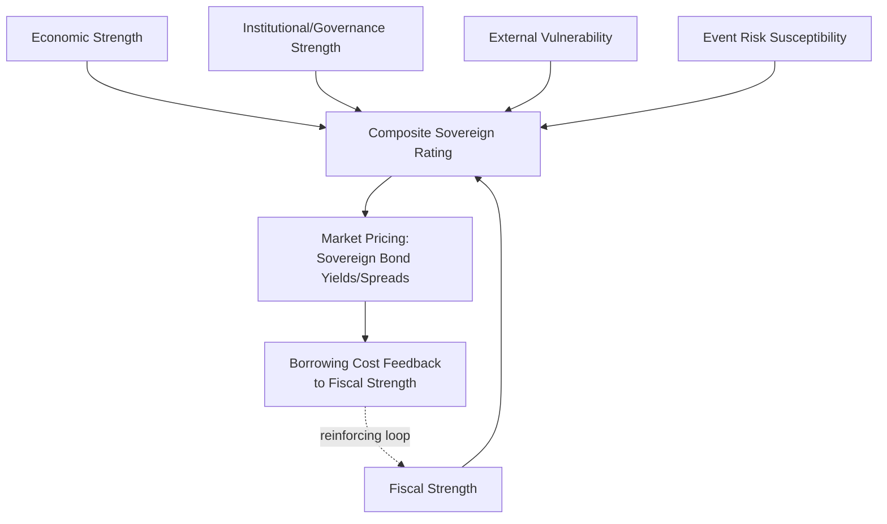

## Sovereign Credit Ratings and Risk Premiums

### Overview

Sovereign credit ratings are standardized assessments of a government's capacity and willingness to meet its debt obligations, produced primarily by credit rating agencies (CRAs) and used extensively by investors, regulators, and policymakers to price sovereign risk. Risk premiums — the additional yield investors demand to hold a given sovereign's debt relative to a risk-free benchmark — translate these assessments into concrete market pricing. For geopolitical risk analysis, sovereign ratings and premiums serve as both a *consequence* of geopolitical developments and a *leading indicator* that can itself trigger further economic and political stress through feedback loops.

### Core Concepts

#### The Rating Agency Landscape

**Key Points**

- The market is dominated by three major agencies: **S&P Global Ratings**, **Moody's**, and **Fitch Ratings**, collectively holding a substantial majority of global rating market share
- Ratings typically range from AAA/Aaa (highest quality) through progressively lower investment-grade tiers (down to BBB-/Baa3) to speculative-grade ("junk") categories (BB+/Ba1 and below), down to default categories (D/C)
- Regional and specialized agencies (e.g., China's Dagong Global Credit Rating, various regional agencies) exist but carry less influence in global capital markets, though this may shift as capital markets diversify away from purely Western-dominated systems [Inference regarding potential future shift; current market structure remains dominated by the traditional three agencies]

#### What Ratings Assess

Sovereign ratings incorporate assessment across several dimensions:

1. **Economic strength:** GDP growth trends, economic diversification, per-capita income levels
2. **Institutional and governance strength:** Rule of law, government effectiveness, policy predictability, corruption control
3. **Fiscal strength:** Debt-to-GDP ratios, deficit trends, debt structure (currency composition, maturity profile)
4. **External vulnerability:** Current account balances, foreign exchange reserves, external debt levels, currency reserve status
5. **Susceptibility to event risk:** Political instability, geopolitical conflict exposure, banking sector vulnerabilities

### Geopolitical Inputs to Sovereign Ratings

#### Direct Political and Conflict Risk Factors

**Key Points**

- Active or imminent armed conflict typically triggers immediate multi-notch downgrades, reflecting both direct economic disruption and elevated default/restructuring risk (as seen extensively with Russia and Ukraine following the 2022 invasion, and with Israel following the escalation beginning in October 2023)
- Sanctions exposure directly affects ratings by constraining a government's access to international capital markets, foreign exchange reserves, and trade revenue — Russia's ratings were withdrawn or downgraded to default/selective-default categories by major agencies following extensive sanctions and near-total capital market exclusion in 2022
- Political instability (coups, contested elections, constitutional crises) affects the institutional strength component even absent direct conflict, reflecting concerns about policy continuity and governance predictability

#### Indirect and Structural Geopolitical Factors

- **Alliance and bloc alignment:** A country's geopolitical alignment can affect perceived access to multilateral support (IMF, World Bank, allied bilateral assistance) during crisis, indirectly supporting or undermining rating stability
- **Trade dependency exposure:** Heavy reliance on a single trading partner or commodity export creates vulnerability to that partner's geopolitical actions (tariffs, sanctions, trade restrictions) or commodity price volatility
- **Reserve currency and dollar-funding exposure:** Countries with significant dollar-denominated debt face amplified vulnerability during dollar-strengthening episodes often triggered by global geopolitical stress, since debt service costs rise in local-currency terms even without new borrowing

### Rating Actions as Geopolitical Risk Indicators

#### Rating Outlook and Watch Mechanisms

Agencies use graduated signaling tools before formal rating changes:

- **Outlook (Positive/Stable/Negative):** Indicates likely direction of rating over a 1-2 year horizon
- **CreditWatch/Rating Watch (Positive/Negative/Developing):** Indicates a rating action is likely within a shorter timeframe (typically 90 days), often triggered by a specific pending event (election, referendum, debt restructuring negotiation)

This graduated signaling provides geopolitical risk analysts with an observable, quantified proxy for how rating agencies are weighing emerging political and conflict risk, functioning as a useful cross-check against independent geopolitical risk assessment.

#### Historical Case Patterns

**Example**

Ukraine's sovereign ratings were downgraded to selective default categories following its 2022 debt service suspension request, later followed by a formal restructuring agreement with private bondholders in 2024 that included state-contingent features (linking future payment obligations to Ukraine's post-war GDP recovery), illustrating an increasingly common pattern where geopolitically driven restructurings incorporate conflict-recovery-contingent payment terms rather than fixed schedules alone.

### Sovereign Risk Premiums: Measurement and Mechanics

#### Sovereign Spread Fundamentals

The sovereign risk premium is typically measured as the yield spread between a country's government bonds and a risk-free benchmark (US Treasuries for dollar-denominated debt, or German Bunds for euro-denominated debt within the EU context):

$$Spread = Y_{sovereign} - Y_{benchmark}$$

This spread compensates investors for default risk, liquidity risk, and currency/convertibility risk (for local-currency debt).

#### Credit Default Swaps as a Market-Based Alternative

Sovereign Credit Default Swap (CDS) spreads provide a real-time, market-derived measure of perceived default risk, often reacting to geopolitical developments faster than formal rating agency actions, since CDS markets trade continuously while rating reviews occur on agency-determined schedules. Analysts frequently use CDS spread movements as a leading indicator, watching for divergence between market-implied risk (CDS) and official agency ratings as a signal of pending formal rating action. [Inference — reflects standard market practice; the reliability of CDS as a leading indicator varies by market liquidity and specific country]

#### The EMBI and Emerging Market Spread Benchmarks

JPMorgan's Emerging Markets Bond Index (EMBI) family provides aggregated benchmark spread data widely used to track emerging market sovereign risk premium trends, allowing geopolitical risk analysts to compare a specific country's spread against broader emerging market conditions to isolate country-specific versus systemic risk components.

### The Sovereign-Bank Nexus and Feedback Loops

#### Doom Loop Dynamics

**Key Points**

- Domestic banks frequently hold substantial quantities of their own government's sovereign debt, creating a "doom loop" where sovereign rating downgrades reduce bank balance sheet quality, potentially triggering banking sector stress that further weakens the sovereign's fiscal position through bailout costs
- This dynamic was extensively documented during the Eurozone sovereign debt crisis (2010-2012), particularly in Greece, and remains a structural vulnerability tracked by rating agencies and regulators in banking systems with high sovereign debt concentration
- Geopolitical shocks that trigger capital flight can accelerate this loop by simultaneously reducing sovereign bond prices (raising yields) and creating bank funding stress (as foreign capital exits domestic banking systems)

### Multilateral and Institutional Backstops

#### Role of the IMF and Development Banks

Sovereign risk premium analysis must account for the mitigating effect of multilateral institutional support:

- IMF program access can significantly reduce perceived default risk by providing conditional liquidity support, though program conditionality (austerity measures, structural reforms) can itself become a source of domestic political risk
- Geopolitically aligned bilateral support (e.g., Gulf state support for allied governments, Chinese Belt and Road-related financing, US/allied support packages for strategically significant states like Ukraine) increasingly substitutes for or supplements traditional multilateral frameworks, introducing a geopolitical alignment dimension into what was historically a more technocratic support system [Inference based on observed pattern of bilateral support flows; comprehensive comparative data on motivations behind such support is not fully available in open sources]

### Risk Analysis Framework

#### Assessing Geopolitically-Driven Sovereign Risk

Analysts typically evaluate:

1. **Direct conflict/instability exposure:** Active conflict, coup risk, contested elections on the near-term horizon
2. **External financing dependency:** Reliance on external debt issuance, reserve adequacy relative to short-term external obligations
3. **Alliance/bloc support reliability:** Credibility and conditionality of expected multilateral or allied bilateral support in a stress scenario
4. **Sanctions exposure and secondary effects:** Direct sanctions risk plus indirect exposure through trade or financial relationships with sanctioned entities
5. **Rating momentum indicators:** Outlook trajectory, CDS-rating divergence, and peer-country comparative positioning

#### Example Assessment Structure

**Example**

A sovereign risk assessment for a frontier market with significant Chinese Belt and Road-related debt exposure would typically evaluate: (1) debt sustainability metrics under both baseline and stress scenarios, (2) the government's diplomatic alignment and associated likelihood of receiving supplementary bilateral support during a liquidity crisis, (3) comparative treatment precedent from prior Chinese sovereign debt restructuring cases (which have shown variable transparency and terms compared to traditional Paris Club processes), and (4) potential secondary effects from broader US-China tensions affecting the country's position between competing spheres of financial influence. [Inference — reflects a standard analytical framework; specific country outcomes depend on case-specific negotiations not generalizable from framework alone]

### Illustrative Rating-to-Spread Relationship

<svg xmlns="http://www.w3.org/2000/svg" viewBox="0 0 800 360">
<text x="400" y="25" text-anchor="middle" font-size="16" font-weight="bold" fill="#1a1a1a">Stylized Rating-to-Spread Relationship (svg_diagram)</text>
<line x1="90" y1="310" x2="90" y2="60" stroke="#333" stroke-width="1.5" />
<line x1="90" y1="310" x2="750" y2="310" stroke="#333" stroke-width="1.5" />
<text x="400" y="340" text-anchor="middle" font-size="11" fill="#333">Credit Rating (AAA → Default, left to right)</text>
<text x="35" y="185" font-size="11" fill="#333" transform="rotate(-90 35 185)">Sovereign Spread (bps)</text>
<path d="M 110 290 Q 300 285 450 250 Q 600 200 730 90" stroke="#4285f4" stroke-width="3" fill="none" />
<circle cx="150" cy="288" r="5" fill="#34a853" />
<text x="150" y="270" text-anchor="middle" font-size="9" fill="#333">AAA</text>
<circle cx="350" cy="270" r="5" fill="#fbbc04" />
<text x="350" y="255" text-anchor="middle" font-size="9" fill="#333">BBB</text>
<circle cx="550" cy="220" r="5" fill="#f57c00" />
<text x="550" y="205" text-anchor="middle" font-size="9" fill="#333">BB/B</text>
<circle cx="700" cy="100" r="6" fill="#ea4335" />
<text x="700" y="85" text-anchor="middle" font-size="9" fill="#333">CCC/Default</text>

<text x="400" y="360" text-anchor="middle" font-size="9" fill="#666" />

</svg>

Note: this curve is illustrative of the generally accepted non-linear (convex) relationship between rating category and spread — spreads widen disproportionately at lower rating tiers — rather than a precise empirical fit, since actual spread levels vary substantially with prevailing global liquidity conditions and market risk appetite. [Inference — the convexity pattern is well-documented in fixed income literature, but exact spread magnitudes at any point in time depend on contemporaneous market conditions]

### Conclusion

Sovereign credit ratings and risk premiums translate geopolitical developments — conflict, sanctions, political instability, alliance shifts — into standardized, market-observable pricing signals that both reflect and amplify underlying risk. The interaction between formal rating agency assessments, market-based measures like CDS spreads, and structural feedback loops such as the sovereign-bank doom loop means that geopolitical shocks rarely produce isolated, one-time repricing events; instead they typically trigger a cascade through institutional, fiscal, and banking channels that can persist well beyond the resolution of the initial triggering event. For geopolitical risk analysts, monitoring rating outlook changes, CDS-rating divergence, and multilateral/bilateral support credibility provides a disciplined, quantifiable complement to qualitative political risk assessment.

**Related Topics**

- Transmission channels from geopolitical events to asset prices (broader market pricing framework)
- Sovereign debt restructuring mechanics and Paris Club/private creditor negotiation dynamics
- The Eurozone sovereign debt crisis and banking-sovereign doom loop case study
- Sanctions regimes and their direct impact on sovereign creditworthiness
- IMF program conditionality and its domestic political risk implications
- China's Belt and Road Initiative debt sustainability and restructuring precedents
- Currency crisis dynamics and the role of foreign exchange reserve adequacy
- Credit rating agency methodology transparency and criticism (procyclicality debates)