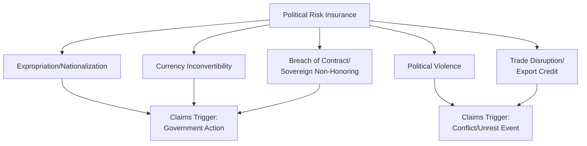

## Political Risk Insurance Markets and Underwriting

### Overview

Political risk insurance (PRI) is a specialized insurance category that protects investors, lenders, and exporters against financial losses arising from government or political actions — expropriation, currency inconvertibility, political violence, breach of contract, or trade disruption. It functions as a critical risk-transfer mechanism enabling cross-border investment and trade in politically volatile or higher-risk jurisdictions that would otherwise attract insufficient capital, and it represents a distinct market segment with its own underwriting methodology, capacity constraints, and pricing dynamics relative to conventional insurance lines.

### Core Concepts

#### Defining Political Risk Insurance

**Key Points**

- PRI covers losses from *government or politically motivated actions* rather than purely commercial or operational risk, distinguishing it from standard credit insurance, though the two are often bundled or purchased alongside each other
- Primary buyers include multinational corporations with foreign direct investment exposure, commercial banks financing cross-border projects, export credit agencies, and institutional investors in emerging and frontier markets
- Coverage is typically structured per-project or per-country-exposure rather than as a blanket global policy, reflecting the highly localized nature of political risk

#### Standard Coverage Categories

1. **Expropriation/Nationalization:** Loss from government seizure, forced divestiture, or creeping expropriation (regulatory actions that progressively strip investment value without formal seizure)
2. **Currency Inconvertibility/Transfer Restriction:** Inability to convert local currency profits/proceeds into hard currency or transfer funds outside the host country
3. **Political Violence:** War, civil war, terrorism, insurrection, and civil disturbance causing physical damage or business interruption
4. **Breach of Contract/Sovereign Non-Honoring:** Government failure to honor contractual obligations, including arbitral award non-payment
5. **Trade Disruption:** Export credit-related coverage for non-payment risk tied to political events in the buyer's country

### Market Structure and Key Providers

#### Public/Multilateral Providers

**Key Points**

- **Multilateral Investment Guarantee Agency (MIGA):** A World Bank Group member providing PRI specifically to encourage foreign direct investment into developing countries, with a developmental mandate alongside commercial underwriting discipline
- **National Export Credit Agencies (ECAs):** Government-backed agencies (e.g., US EXIM Bank, UK Export Finance, Euler Hermes in Germany, Nippon Export and Investment Insurance in Japan) that provide PRI primarily to support their own countries' exporters and outward investors, often as part of broader economic statecraft objectives
- **US International Development Finance Corporation (DFC):** Provides political risk insurance and financing explicitly tied to US development and strategic policy objectives, reflecting the increasing integration of PRI provision with broader geopolitical and industrial policy goals (e.g., supply chain diversification initiatives)

#### Private Market Providers

- **Lloyd's of London syndicates:** A significant portion of private-market political risk and political violence capacity is underwritten through the Lloyd's market, given its specialized and syndicated risk-sharing structure
- **Specialized private insurers and reinsurers:** Firms such as AIG, Chubb, Zurich, and specialized political risk underwriters (e.g., Beazley, and other Lloyd's-affiliated managing agents) provide commercial capacity, often working alongside public providers in syndicated structures
- **Berne Union:** The international association of export credit and investment insurance providers, both public and private, which publishes aggregate market data and coordinates on underwriting standards, though members retain independent underwriting decisions

#### Public-Private Co-Insurance Structures

Large or particularly complex political risk exposures are frequently structured as syndicated placements combining multilateral (MIGA), export credit agency, and private market capacity, spreading exposure across multiple underwriters and reducing concentration risk for any single provider. This layered structure is especially common for large infrastructure and extractive industry projects in higher-risk jurisdictions.

### Underwriting Methodology

#### Risk Assessment Inputs

Political risk underwriters typically synthesize:

1. **Country risk ratings:** Both proprietary in-house assessments and external inputs (sovereign credit ratings, specialized political risk indices such as those from the Economist Intelligence Unit, Verisk Maplecroft, or Control Risks)
2. **Sector-specific vulnerability:** Extractive industries, infrastructure, and telecommunications historically show different expropriation risk profiles than, for example, light manufacturing, given differing strategic and nationalist sensitivities
3. **Historical precedent analysis:** Track record of the specific host government (or its predecessors) regarding treatment of foreign investment, contract honoring, and past expropriation or currency control episodes
4. **Investment structure:** Ownership structure, financing arrangements, and the presence of local partners or government co-investment, which can materially affect actual expropriation risk exposure
5. **Bilateral investment treaty (BIT) coverage:** Whether the investment is protected under a BIT or investment treaty providing legal recourse (e.g., ICSID arbitration access), which underwriters factor into overall risk and potential claims-recovery calculations

#### Pricing and Capacity Constraints

**Key Points**

- Premium rates vary significantly by country risk tier, project sector, tenor (coverage duration), and specific coverage scope, with rates for higher-risk frontier markets substantially exceeding those for stable emerging markets [Inference — specific rate levels are proprietary and vary by underwriter, market cycle, and individual risk assessment; no single published rate schedule exists]
- Market capacity for any single country or risk event can become constrained following a major loss event or escalating regional tension, as underwriters reduce aggregate exposure limits — a dynamic similar to capacity contraction seen in catastrophe reinsurance following major natural disaster losses
- Coverage tenors for PRI are typically longer than conventional insurance (often 10-20 years for major infrastructure projects), reflecting the long investment horizons typical of the underlying transactions, which creates unique long-duration risk assessment challenges for underwriters

### Claims History and Notable Precedents

#### Historical Claims Patterns

- Political violence and currency inconvertibility claims have historically been more frequent than outright expropriation claims in recent decades, reflecting a broader global shift away from formal nationalization toward more gradual regulatory and currency-control-based state interventions [Inference based on general industry claims trend commentary; comprehensive claims data is largely proprietary to underwriters and industry associations]
- The Berne Union and MIGA periodically publish aggregate claims and exposure data, providing the most accessible public benchmarking sources for tracking sectoral and regional political risk claims trends

#### Case Pattern: Currency Inconvertibility Events

**Example**

A typical currency inconvertibility claim scenario involves a host government imposing capital controls during a balance-of-payments or currency crisis (as seen periodically in countries facing acute foreign exchange reserve shortages), preventing an insured investor from repatriating profits despite the underlying business remaining operationally sound — illustrating how PRI claims often arise from macroeconomic crisis management measures rather than hostile intent toward the specific foreign investor.

### Geopolitical Risk Integration in Underwriting

#### Dynamic Repricing During Crisis Escalation

**Key Points**

- Underwriters actively monitor escalating geopolitical indicators (troop movements, sanctions announcements, diplomatic breakdowns, election-related instability signals) to adjust country risk tiers and, where policy terms allow, restrict new capacity or tighten terms for renewal business ahead of anticipated deterioration
- The Russia-Ukraine conflict triggered substantial PRI market repricing and capacity withdrawal across Eastern Europe and Central Asia, illustrating how regional contagion effects extend underwriting caution well beyond the directly conflict-affected countries [Inference based on general market commentary patterns following major regional conflicts; specific underwriter capacity decisions are proprietary]
- Emerging practice increasingly incorporates specialized geopolitical risk consultancies and intelligence services directly into underwriting workflows, reflecting growing recognition that traditional country-risk ratings alone may lag fast-moving geopolitical developments

#### The War Exclusion and Cyber-Conflict Boundary Problem

A persistent and increasingly significant underwriting challenge involves defining the boundary between covered "political violence" and excluded "war" risk, particularly as hybrid warfare, state-sponsored cyberattacks, and gray-zone conflict blur traditional definitional lines developed for conventional interstate war. This tension became particularly prominent following major cyber-insurance disputes where insurers invoked war exclusion clauses against claims arising from state-attributed cyberattacks, with resulting litigation shaping how "war" is defined for insurance purposes in an era of ambiguous, deniable state action. [This reflects a genuinely unsettled and evolving area of insurance law and market practice, appropriately flagged given active legal development]

### Risk Analysis Framework

#### Key Considerations for Investors and Analysts

1. **Coverage adequacy assessment:** Whether policy terms actually match the investor's specific structural exposure (ownership percentage, financing structure, sector-specific risks)
2. **Provider concentration risk:** Reliance on a single underwriter versus syndicated coverage spreading claims-paying capacity risk
3. **Definitional boundary risk:** Careful attention to policy exclusions, particularly around the war/political violence boundary and any cyber-related carve-outs
4. **Claims process and dispute resolution:** Historical claims-payment track record and dispute resolution mechanisms (arbitration clauses, governing law) built into policy terms
5. **Market capacity trend monitoring:** Tracking whether capacity for a specific country/sector is expanding or contracting as a leading indicator of underwriter-assessed risk trajectory

### Illustrative Provider Ecosystem

<svg xmlns="http://www.w3.org/2000/svg" viewBox="0 0 800 340">
<text x="400" y="25" text-anchor="middle" font-size="16" font-weight="bold" fill="#1a1a1a">Political Risk Insurance Provider Ecosystem (svg_diagram)</text>
<rect x="40" y="60" width="220" height="220" rx="6" fill="#e8f0fe" stroke="#4285f4" stroke-width="1.5" />
<text x="150" y="85" text-anchor="middle" font-size="12" font-weight="bold" fill="#1a1a1a">Multilateral</text>
<text x="150" y="110" text-anchor="middle" font-size="9" fill="#333">MIGA (World Bank Group)</text>
<text x="150" y="130" text-anchor="middle" font-size="9" fill="#333">Developmental mandate</text>
<text x="150" y="150" text-anchor="middle" font-size="9" fill="#333">+ commercial discipline</text>
<rect x="290" y="60" width="220" height="220" rx="6" fill="#e6f4ea" stroke="#34a853" stroke-width="1.5" />
<text x="400" y="85" text-anchor="middle" font-size="12" font-weight="bold" fill="#1a1a1a">Export Credit Agencies</text>
<text x="400" y="110" text-anchor="middle" font-size="9" fill="#333">US EXIM, UKEF,</text>
<text x="400" y="128" text-anchor="middle" font-size="9" fill="#333">Euler Hermes, NEXI</text>
<text x="400" y="150" text-anchor="middle" font-size="9" fill="#333">National strategic</text>
<text x="400" y="166" text-anchor="middle" font-size="9" fill="#333">interest alignment</text>
<rect x="540" y="60" width="220" height="220" rx="6" fill="#fef7e0" stroke="#fbbc04" stroke-width="1.5" />
<text x="650" y="85" text-anchor="middle" font-size="12" font-weight="bold" fill="#1a1a1a">Private Market</text>
<text x="650" y="110" text-anchor="middle" font-size="9" fill="#333">Lloyd's syndicates,</text>
<text x="650" y="128" text-anchor="middle" font-size="9" fill="#333">AIG, Chubb, Zurich</text>
<text x="650" y="150" text-anchor="middle" font-size="9" fill="#333">Commercial pricing,</text>
<text x="650" y="166" text-anchor="middle" font-size="9" fill="#333">syndicated capacity</text>

<text x="400" y="310" text-anchor="middle" font-size="10" fill="#666">Large/complex exposures typically syndicated across all three categories</text>

</svg>

### Conclusion

Political risk insurance provides a specialized and increasingly strategically significant risk-transfer mechanism for cross-border investment in politically volatile jurisdictions, blending multilateral development objectives, national economic statecraft, and private commercial underwriting into a layered market structure. Its underwriting methodology increasingly must account for hybrid and gray-zone geopolitical risks that strain traditional definitional boundaries (particularly the war/political violence distinction), while capacity availability itself functions as a useful real-time indicator of aggregate market-assessed geopolitical risk for specific countries and sectors. For geopolitical risk analysts, PRI market data — capacity trends, pricing shifts, and claims patterns — offers a complementary, market-disciplined data source alongside sovereign ratings and qualitative political risk assessment.

**Related Topics**

- Sovereign credit ratings and risk premiums (complementary risk-pricing mechanism)
- Bilateral investment treaties and investor-state dispute settlement (ICSID arbitration)
- Export credit agencies as instruments of economic statecraft
- Expropriation and nationalization case studies in extractive industries
- Cyber-insurance war exclusion litigation and hybrid warfare definitional challenges
- Sanctions regimes and their interaction with political risk insurance claims
- Multilateral development finance and the World Bank Group's risk mitigation role
- Currency crisis dynamics and capital control implementation patterns