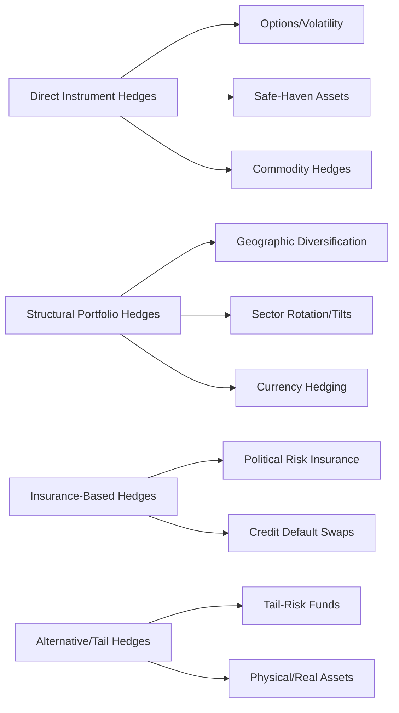

## Geopolitical Hedging Strategies for Investors

### Overview

Geopolitical hedging refers to the set of portfolio construction techniques, financial instruments, and strategic allocation decisions investors use to reduce exposure to losses from geopolitical events while preserving upside participation in normal market conditions. Unlike hedging conventional financial risks (interest rate, credit, equity beta), geopolitical hedging faces distinctive challenges: the underlying risk is difficult to quantify probabilistically, correlations between geopolitical shocks and asset classes shift depending on the specific event type, and many geopolitical tail risks lack liquid, direct hedging instruments.

### Core Conceptual Framework

#### Why Geopolitical Risk Is Difficult to Hedge

**Key Points**

- Geopolitical events are largely non-recurring and heterogeneous (a war, a coup, a sanctions regime each transmit differently), unlike statistically stable risks such as interest rate duration, limiting the applicability of standard historical-correlation-based hedging models
- Many geopolitical risks are "fat-tailed" — low probability but potentially severe impact — making standard options-pricing and volatility-based hedging costly to maintain persistently
- Geopolitical shocks frequently exhibit regime-dependent correlations: an asset that serves as an effective hedge in one crisis type may behave differently in another (e.g., gold's safe-haven behavior has shown inconsistency across specific episodes depending on concurrent monetary policy conditions) [Inference based on general observation of correlation instability across historical crisis episodes; this is a well-documented challenge in the risk management literature rather than a fully solved problem]

#### The Hedging Instrument Spectrum

### Direct Instrument-Based Hedges

#### Volatility and Options Strategies

**Key Points**

- Long volatility positions (VIX futures/options, or equity index put options) provide direct payoff during acute geopolitical stress episodes, since volatility spikes are a near-universal feature of major surprise geopolitical shocks regardless of the specific transmission channel
- Persistent long-volatility positioning carries a well-documented negative carry cost (volatility tends to mean-revert downward during calm periods, causing option premiums to decay), making it expensive to maintain as a continuous hedge rather than a tactical, event-specific position
- Tail-risk-specific option structures (far out-of-the-money puts, "black swan" option strategies) reduce carry cost relative to at-the-money hedges while still providing convex payoff during extreme tail events, though they provide little protection against moderate, non-extreme geopolitical drawdowns

#### Safe-Haven Asset Allocation

- **US Treasuries:** Historically the primary global safe-haven asset during risk-off episodes, benefiting from the dollar's reserve currency status and deep market liquidity, though this relationship has faced increasing scrutiny given rising US fiscal deficits and periodic episodes of simultaneous equity and Treasury selloffs [Inference — reflects ongoing debate in market commentary about potential erosion of traditional safe-haven correlation patterns; not a settled empirical conclusion]
- **Gold:** A traditional non-sovereign store of value with no counterparty risk, historically appreciating during geopolitical stress, though its behavior can be complicated by concurrent real interest rate movements and dollar strength dynamics
- **Swiss Franc and Japanese Yen:** Traditional safe-haven currencies reflecting political stability and, historically, current account surplus positions, though yen dynamics have shown increasing complexity given Bank of Japan policy normalization in recent years
- **Currency diversification more broadly:** Reducing concentration in any single currency reduces exposure to country-specific geopolitical shocks transmitting through currency channels

#### Commodity-Based Hedges

Direct commodity exposure (energy, agricultural futures, strategic minerals) can hedge portfolios against the commodity-channel transmission of geopolitical shocks, particularly relevant for investors with liabilities or spending needs correlated with energy or food price inflation (e.g., pension funds with inflation-linked liabilities).

### Structural Portfolio Construction Approaches

#### Geographic and Sovereign Diversification

**Key Points**

- Reducing concentration in any single country or geopolitical bloc limits exposure to country-specific shocks, though this must be balanced against the reality that major geopolitical shocks (US-China tension, global conflict escalation) increasingly transmit across supposedly diversified regions simultaneously via trade, supply chain, and risk-sentiment channels
- "Bloc-based" diversification — deliberately allocating across US-aligned, China-aligned, and non-aligned economic blocs — has gained analytical attention as globalization fragmentation increases correlation within blocs while potentially preserving diversification benefits across blocs [Inference — this represents an emerging analytical framework in institutional investment literature rather than a fully validated, long-track-record strategy]

#### Sector and Thematic Positioning

Investors seeking geopolitical hedge exposure often overweight sectors that benefit from specific geopolitical trend lines rather than attempting to hedge against unpredictable discrete events:

- Defense and aerospace equities benefiting from sustained global defense spending increases
- Domestic reshoring/friend-shoring beneficiaries in semiconductor, critical minerals, and manufacturing sectors benefiting from supply chain diversification trends
- Energy security and infrastructure investments benefiting from energy independence-focused policy trends across multiple jurisdictions

This approach functions more as thematic positioning aligned with structural geopolitical trends than as a hedge against specific tail-risk events, and should be understood as a distinct strategy from acute-shock hedging.

#### Currency Hedging Considerations

For international portfolios, the decision to hedge currency exposure interacts directly with geopolitical risk assessment: unhedged foreign currency exposure can either amplify or offset equity losses during a geopolitical shock depending on whether the affected currency depreciates alongside (amplifying losses) or independently of (potentially offsetting) the equity market decline, requiring scenario-specific rather than static hedging ratio decisions.

### Insurance and Derivative-Based Approaches

#### Political Risk Insurance for Direct Investment Exposure

For investors with direct foreign investment or project finance exposure (as opposed to portfolio/securities exposure), political risk insurance (covering expropriation, currency inconvertibility, and political violence) provides a more targeted hedge than public market instruments, though it addresses a fundamentally different exposure type than securities portfolio risk.

#### Sovereign and Corporate CDS

Credit default swap positions on specific sovereign or corporate exposures can provide targeted hedges for investors with concentrated exposure to a specific geopolitically vulnerable issuer, functioning as insurance against a specific default scenario rather than broad market risk.

### Tail-Risk and Alternative Strategies

#### Dedicated Tail-Risk Hedge Funds

Specialized fund strategies focus explicitly on convex payoff structures during extreme market dislocations, often combining options strategies, volatility trading, and correlation-based structures. These strategies typically underperform during calm markets (representing an ongoing cost of protection) in exchange for outsized returns during crisis episodes, requiring investors to evaluate them within a total-portfolio risk-adjusted return framework rather than in isolation.

#### Real and Physical Assets

- Real assets (real estate, infrastructure, physical commodities) can provide partial geopolitical hedging value through their generally lower correlation with financial market sentiment-driven selloffs, though they carry their own distinct geopolitical exposures (e.g., infrastructure assets in geopolitically contested regions face direct expropriation or disruption risk)
- Precious metals held in physically allocated, geographically diversified custody arrangements address a specific sub-risk: counterparty and custodial risk during severe crisis scenarios where financial system access itself becomes uncertain

### Scenario-Based Hedging Framework

#### Building a Scenario-Weighted Hedge Portfolio

Practitioners increasingly construct hedging strategies around explicit scenario analysis rather than relying solely on historical correlation-based models, given the non-stationary nature of geopolitical risk relationships:

**Example**

An institutional investor conducting geopolitical hedging analysis for Taiwan Strait contingency risk would typically model multiple scenarios (diplomatic status quo, economic coercion short of conflict, blockade, direct conflict) with associated probability weights, then evaluate candidate hedge instruments (semiconductor sector puts, Taiwan-specific CDS if available, broader Asian equity volatility positions, defense sector longs) against each scenario's expected payoff, explicitly comparing the cost of maintaining each hedge against its scenario-weighted expected protective value. [Inference — this represents a standard scenario-based risk management approach; specific institutional practices and instrument selections vary considerably and are largely proprietary]

### Risk Analysis Framework for Practitioners

#### Key Hedging Design Considerations

1. **Cost of carry versus protection value:** Persistent hedges (long volatility, safe-haven overweights) impose an ongoing return drag that must be weighed against tail-protection value, requiring explicit investor risk tolerance and time horizon input
2. **Correlation instability:** Historical hedge relationships (e.g., gold-equity correlation, currency safe-haven patterns) should be treated as probabilistic tendencies rather than reliable constants, given documented regime-dependent variation
3. **Instrument liquidity during crisis:** Some hedging instruments (certain OTC derivatives, less liquid EM CDS) may experience liquidity deterioration precisely during the crisis conditions when the hedge is most needed, a critical practical consideration often underweighted in theoretical hedge design
4. **Basis risk:** Broad hedges (e.g., general EM equity puts) may not perfectly offset losses from a geographically or sector-specific geopolitical shock, requiring assessment of hedge specificity versus cost trade-offs
5. **Rebalancing discipline:** Tail-risk hedges require systematic rebalancing rules (profit-taking during crisis payoff, re-establishing positions during calm periods) to avoid both under-protection and excessive persistent cost drag

### Illustrative Hedge Instrument Positioning Map

<svg xmlns="http://www.w3.org/2000/svg" viewBox="0 0 800 380">
<text x="400" y="25" text-anchor="middle" font-size="16" font-weight="bold" fill="#1a1a1a">Hedge Instrument Cost vs. Tail Protection (svg_diagram)</text>
<line x1="90" y1="330" x2="90" y2="60" stroke="#333" stroke-width="1.5" />
<line x1="90" y1="330" x2="750" y2="330" stroke="#333" stroke-width="1.5" />
<text x="400" y="360" text-anchor="middle" font-size="11" fill="#333">Ongoing Carry Cost (Low → High)</text>
<text x="35" y="195" font-size="11" fill="#333" transform="rotate(-90 35 195)">Tail-Event Protection Strength</text>
<circle cx="180" cy="270" r="30" fill="#4285f4" opacity="0.85" />
<text x="180" y="267" text-anchor="middle" font-size="9" fill="#fff" font-weight="bold">Geographic</text>
<text x="180" y="280" text-anchor="middle" font-size="8" fill="#fff">Diversification</text>
<circle cx="280" cy="200" r="28" fill="#34a853" opacity="0.85" />
<text x="280" y="197" text-anchor="middle" font-size="9" fill="#fff" font-weight="bold">Safe-Haven</text>
<text x="280" y="210" text-anchor="middle" font-size="8" fill="#fff">Allocation</text>
<circle cx="420" cy="150" r="30" fill="#fbbc04" opacity="0.85" />
<text x="420" y="147" text-anchor="middle" font-size="9" fill="#333" font-weight="bold">Sector</text>
<text x="420" y="160" text-anchor="middle" font-size="8" fill="#333">Tilts/PRI</text>
<circle cx="600" cy="100" r="32" fill="#ea4335" opacity="0.85" />
<text x="600" y="97" text-anchor="middle" font-size="9" fill="#fff" font-weight="bold">Long Volatility</text>
<text x="600" y="110" text-anchor="middle" font-size="8" fill="#fff">/Tail Options</text>
<circle cx="700" cy="80" r="26" fill="#a142f4" opacity="0.85" />
<text x="700" y="77" text-anchor="middle" font-size="8" fill="#fff" font-weight="bold">Dedicated</text>
<text x="700" y="88" text-anchor="middle" font-size="8" fill="#fff">Tail Funds</text>
</svg>

### Conclusion

Geopolitical hedging requires a fundamentally different toolkit and mindset than conventional financial risk hedging, given the heterogeneous, non-stationary, and fat-tailed nature of geopolitical shocks. Effective approaches typically combine structural portfolio diversification, tactical instrument-based hedges calibrated to specific scenario analysis, and explicit acknowledgment that persistent, comprehensive hedging carries substantial ongoing costs that must be weighed against investor-specific risk tolerance and time horizon. Given the well-documented instability of historical correlation relationships during genuinely novel geopolitical events, investors and analysts should treat any specific hedging strategy's past performance as informative but not predictive, and build in regular reassessment as the geopolitical risk landscape evolves.

**Related Topics**

- Transmission channels from geopolitical events to asset prices (foundational framework for hedge design)
- Sovereign credit ratings and risk premiums (informing CDS and sovereign hedge instrument selection)
- Political risk insurance markets and underwriting (direct investment hedging complement)
- The Caldara-Iacoviello Geopolitical Risk Index and quantitative risk measurement tools
- Safe-haven asset correlation stability debates in academic finance literature
- Scenario analysis and stress-testing methodologies in institutional portfolio management
- Bloc-based diversification and the fragmentation of global capital markets
- Tail-risk fund strategies and convex payoff structure design