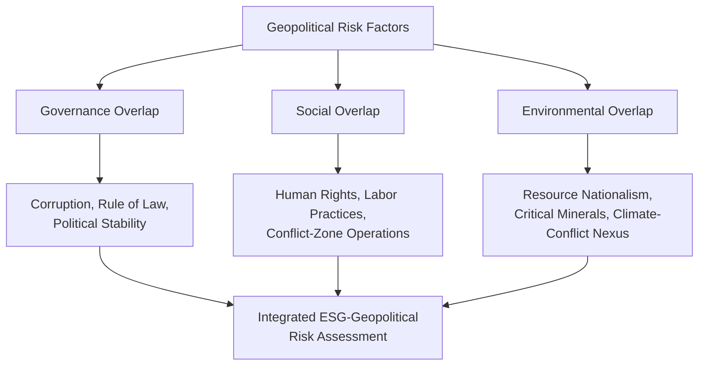

## Integrating Geopolitical Risk into ESG Frameworks

### Overview

Environmental, Social, and Governance (ESG) frameworks were originally developed to assess corporate sustainability and ethical impact factors largely separate from traditional geopolitical risk analysis. However, growing recognition that geopolitical events — conflict, sanctions, resource nationalism, authoritarian governance shifts — materially affect both the "G" (governance) and increasingly the "S" and "E" dimensions of ESG has driven convergence between these previously distinct analytical disciplines. This integration reflects both a genuine recognition of overlapping risk factors and, in some jurisdictions, an evolving regulatory push to formalize geopolitical considerations within ESG disclosure and assessment regimes.

### Core Conceptual Framework

#### Where Geopolitical Risk and ESG Intersect

**Key Points**

- **Governance dimension overlap:** Sovereign governance quality, corruption levels, rule-of-law strength, and political stability are foundational inputs to both geopolitical risk assessment and ESG governance scoring, making this the most naturally integrated dimension
- **Social dimension overlap:** Human rights conditions, labor practices in conflict-affected or authoritarian jurisdictions, and community relations in resource-extraction contexts connect directly to both geopolitical stability assessment and ESG social scoring
- **Environmental dimension overlap:** Resource nationalism, critical mineral supply chain geopolitics, and climate-related conflict risk (water scarcity, climate migration) increasingly link environmental risk factors to geopolitical stability analysis
- Despite these conceptual overlaps, ESG and geopolitical risk analysis have historically operated with different methodologies, time horizons, and institutional homes within investment organizations, creating a persistent integration challenge [Inference based on widely observed organizational structure patterns in asset management; specific firm practices vary]

### Governance Dimension Integration

#### Sovereign and Corporate Governance Linkages

**Key Points**

- Traditional ESG governance metrics (board independence, executive compensation, shareholder rights) apply primarily at the corporate level, while geopolitical risk analysis emphasizes sovereign-level governance (rule of law, corruption control, political stability) — integration requires explicitly connecting these two levels of analysis
- Corporate exposure to weak sovereign governance environments (operating in jurisdictions with high corruption risk, weak judicial independence, or authoritarian political control) is increasingly incorporated into corporate governance risk scoring, reflecting recognition that a company cannot fully insulate its own governance practices from a weak host-country institutional environment
- State-owned enterprises (SOEs) and companies with significant government ownership stakes present a distinctive governance-geopolitical overlap challenge, since their strategic decisions may reflect state political objectives rather than purely commercial governance logic, complicating standard corporate governance assessment frameworks

#### Sanctions and Regulatory Compliance as Governance Risk

Sanctions exposure and export control compliance have increasingly been incorporated into corporate governance risk assessment, reflecting recognition that inadequate compliance infrastructure represents a material governance failure with direct financial consequences (fines, reputational damage, market access loss), functioning as a natural bridge between traditional governance assessment and geopolitical risk monitoring.

### Social Dimension Integration

#### Human Rights and Conflict-Affected Operations

**Key Points**

- ESG frameworks increasingly incorporate assessment of corporate operations in conflict-affected or high-risk jurisdictions, drawing on frameworks such as the UN Guiding Principles on Business and Human Rights and the OECD Due Diligence Guidance for conflict-affected areas
- Supply chain human rights due diligence (addressing forced labor, conflict minerals sourcing) represents a specific and increasingly regulated intersection point, exemplified by frameworks such as the EU's Corporate Sustainability Due Diligence Directive (CSDDD) and existing conflict minerals disclosure requirements under frameworks like the US Dodd-Frank Act Section 1502 (targeting minerals sourced from conflict-affected Central Africa)
- Labor practice assessment in authoritarian or politically unstable jurisdictions increasingly incorporates broader political risk context (state labor policy, freedom of association restrictions) rather than assessing labor conditions purely at the individual facility level

#### The Xinjiang and Forced Labor Case Pattern

**Example**

ESG frameworks addressing supply chain exposure to Xinjiang-region forced labor allegations illustrate the integration challenge directly: investors and companies must combine traditional ESG supply chain due diligence methodology with geopolitically informed assessment of state-level policy context, given that the allegations involve government-directed labor practices rather than isolated corporate misconduct, requiring engagement with export control regimes (such as the US Uyghur Forced Labor Prevention Act) that function simultaneously as trade policy and ESG compliance instruments.

### Environmental Dimension Integration

#### Critical Minerals and Resource Nationalism

**Key Points**

- The energy transition's dependence on critical minerals (lithium, cobalt, rare earths, copper) concentrated in a relatively small number of geopolitically significant jurisdictions creates a direct link between environmental/climate investment themes and geopolitical supply chain risk
- Resource nationalism — host government actions to increase domestic value capture from resource extraction (royalty increases, local processing requirements, outright nationalization) — represents a growing risk category that ESG frameworks are increasingly incorporating into environmental-transition-related investment risk assessment
- Environmental due diligence in extractive industries increasingly incorporates geopolitical stability assessment of the host jurisdiction, recognizing that environmental compliance and remediation capacity can degrade significantly during periods of political instability or conflict

#### Climate-Conflict Nexus

Emerging analytical frameworks explore linkages between climate stress (water scarcity, agricultural disruption, climate migration) and conflict risk, though the specific causal mechanisms and predictive reliability of this linkage remain areas of active academic research and debate rather than settled consensus. [This represents a genuinely contested area of climate-security scholarship; specific causal claims linking climate change to conflict outcomes vary considerably in strength and methodology across studies]

### Regulatory and Disclosure Framework Developments

#### EU Regulatory Integration

- The EU's Sustainable Finance Disclosure Regulation (SFDR) and Corporate Sustainability Reporting Directive (CSRD) increasingly require disclosure of "double materiality" — both how sustainability factors affect financial performance and how the company's activities affect broader sustainability outcomes — creating disclosure obligations that naturally capture geopolitical risk exposure in conflict-affected or sanctioned jurisdictions
- The EU Taxonomy for sustainable activities has faced ongoing debate regarding how to treat activities in geopolitically sensitive sectors (e.g., defense sector inclusion debates, reflecting tension between traditional ESG exclusionary screening of defense/weapons and growing recognition of defense spending's role in supporting democratic security architecture) [Unverified — specific EU Taxonomy treatment of defense-sector activities has evolved and should be checked against current regulatory text]

#### Divergent Regulatory Philosophies

- US ESG regulatory approach has remained comparatively less prescriptive and has faced significant political contestation regarding the appropriate scope of ESG disclosure mandates, creating a more fragmented state-level and voluntary-disclosure landscape compared to the EU's more centralized regulatory approach
- This regulatory divergence itself represents a geopolitical dimension of ESG integration, as multinational investors and companies must navigate materially different disclosure and assessment obligations depending on jurisdiction, complicating global ESG framework standardization efforts

### Practical Integration Approaches for Investors

#### Methodological Approaches

**Key Points**

- **Overlay models:** Applying a separate geopolitical risk screen alongside traditional ESG scoring, flagging exposures where geopolitical risk factors may not be fully captured by standard ESG metrics (e.g., a company with strong environmental practices but significant operational exposure to an escalating conflict zone)
- **Integrated scoring models:** Attempting to build unified scoring frameworks that incorporate geopolitical risk factors directly into composite ESG scores, though this approach faces methodological challenges given the different time horizons and volatility characteristics of geopolitical versus traditional ESG factors
- **Scenario-based stress testing:** Applying geopolitical scenario analysis (similar to climate scenario stress testing already common in ESG risk management) to assess portfolio-level ESG-geopolitical risk exposure under specific conflict, sanctions, or political transition scenarios

#### Example Integration Framework

**Example**

An institutional investor conducting integrated ESG-geopolitical due diligence on a mining sector investment would typically assess: (1) traditional environmental compliance and remediation practices, (2) labor and community relations, (3) corporate governance structure and transparency, (4) sovereign-level governance and political stability risk in the host jurisdiction, (5) resource nationalism risk trajectory (recent or anticipated regulatory/fiscal changes affecting the specific resource sector), and (6) supply chain exposure to any sanctions or export control regimes affecting the extracted mineral. This integrated approach explicitly connects traditional ESG due diligence categories with geopolitical risk factors that could materially affect both financial returns and sustainability outcome claims. [Inference — this reflects an emerging best-practice framework described in industry commentary rather than a single standardized methodology adopted uniformly across the investment industry]

### Illustrative Integration Model

<svg xmlns="http://www.w3.org/2000/svg" viewBox="0 0 800 360">
<text x="400" y="25" text-anchor="middle" font-size="16" font-weight="bold" fill="#1a1a1a">ESG-Geopolitical Risk Integration Model (svg_diagram)</text>
<circle cx="250" cy="180" r="110" fill="#4285f4" opacity="0.55" />
<text x="200" y="130" text-anchor="middle" font-size="13" font-weight="bold" fill="#fff">Traditional ESG</text>
<text x="200" y="150" text-anchor="middle" font-size="9" fill="#fff">Corporate governance,</text>
<text x="200" y="165" text-anchor="middle" font-size="9" fill="#fff">emissions, labor</text>
<text x="200" y="180" text-anchor="middle" font-size="9" fill="#fff">practices, board</text>
<text x="200" y="195" text-anchor="middle" font-size="9" fill="#fff">composition</text>
<circle cx="550" cy="180" r="110" fill="#ea4335" opacity="0.55" />
<text x="600" y="130" text-anchor="middle" font-size="13" font-weight="bold" fill="#fff">Geopolitical Risk</text>
<text x="600" y="150" text-anchor="middle" font-size="9" fill="#fff">Sovereign stability,</text>
<text x="600" y="165" text-anchor="middle" font-size="9" fill="#fff">sanctions, conflict,</text>
<text x="600" y="180" text-anchor="middle" font-size="9" fill="#fff">resource nationalism</text>

<text x="400" y="185" text-anchor="middle" font-size="11" font-weight="bold" fill="`#1a1a1a`">Integrated</text>

<text x="400" y="200" text-anchor="middle" font-size="11" font-weight="bold" fill="`#1a1a1a`">Assessment</text>

<text x="400" y="220" text-anchor="middle" font-size="8" fill="#333">Sovereign governance,</text>

<text x="400" y="233" text-anchor="middle" font-size="8" fill="#333">conflict-zone human rights,</text>

<text x="400" y="246" text-anchor="middle" font-size="8" fill="#333">critical minerals sourcing</text>

</svg>

### Conclusion

Integrating geopolitical risk into ESG frameworks reflects a maturing recognition that sovereign-level political conditions, conflict dynamics, and resource geopolitics materially shape corporate governance quality, social impact, and environmental outcomes in ways that traditional company-level ESG metrics alone do not fully capture. This integration remains methodologically uneven — more developed in the governance dimension than in environmental or social dimensions — and continues to be shaped by diverging regulatory philosophies between major jurisdictions, particularly the EU's more prescriptive disclosure-based approach versus more fragmented approaches elsewhere. For geopolitical risk analysts working alongside ESG teams, the most productive integration point is typically scenario-based stress testing that explicitly connects specific geopolitical contingencies to their downstream governance, social, and environmental effects, rather than attempting to compress fundamentally different risk types into a single composite score.

**Related Topics**

- Sovereign credit ratings and risk premiums (governance-dimension methodological overlap)
- Critical minerals supply chains and resource nationalism trends
- Sanctions regimes and their interaction with corporate compliance and governance assessment
- The EU's Corporate Sustainability Due Diligence Directive and conflict minerals regulation
- Climate-conflict nexus research and its contested causal mechanisms
- State-owned enterprises and governance assessment challenges
- Human rights due diligence frameworks (UN Guiding Principles, OECD guidance)
- Regulatory divergence between EU and US sustainable finance disclosure regimes