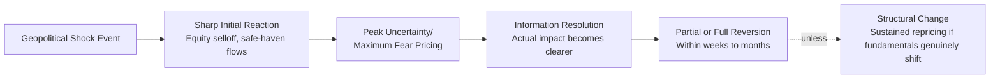

## Historical Market Reactions to Geopolitical Shocks

### Overview

Studying historical market reactions to geopolitical shocks provides the empirical foundation for the transmission-channel and hedging frameworks used in geopolitical risk analysis. Rather than treating each crisis as *sui generis*, analysts examine past episodes to identify recurring patterns — which asset classes move first, how large initial reactions typically are, how quickly markets recover, and under what conditions historical patterns fail to hold. This case-study approach complements quantitative modeling by grounding abstract transmission-channel theory in observed, documented market behavior.

### Core Analytical Pattern: Shock, Overreaction, Reversion

#### The General Pattern

**Key Points**

- Across most historical geopolitical shocks, markets exhibit a sharp initial reaction (equity selloff, flight to safe havens, commodity price spikes) followed by a meaningful partial or full reversal within weeks to months, once initial uncertainty resolves into clearer information
- A review of nine major geopolitical shocks since 1990 found that the direction in which gold and stocks moved on day one matched the direction they'd moved a month later less than 56% of the time, indicating that immediate market reactions are a weak predictor of medium-term direction [realinvestmentadvice](https://realinvestmentadvice.com/resources/blog/crisis-will-test-our-mettle-lessons-from-9-11/)
- This pattern reflects that initial market reactions tend to price maximum uncertainty and worst-case scenarios, which are then revised as concrete information about actual economic and military consequences emerges [Inference — this is the standard interpretation offered in event-study literature, though the precise degree of "overreaction" versus rational repricing under evolving information remains debated]

### Case Study: September 11, 2001 Attacks

#### Market Closure and Reopening

**Key Points**

- Following the attacks, the stock market did not open on Tuesday September 11, 2001 and remained closed for the rest of the week, reopening on Monday September 17 — the longest unplanned closure since the Great Depression [blackbull](https://research.blackbull.com/?p=9739)
- Upon reopening, the S&P 500 fell 4.9% on September 17, while gold jumped 6.5% in a flight-to-safety trade [realinvestmentadvice](https://realinvestmentadvice.com/resources/blog/crisis-will-test-our-mettle-lessons-from-9-11/)
- By the end of that week, the S&P 500 had closed 11.4% down, with the Dow Jones down 14%, and an estimated $1.4 trillion in value lost over five trading days [blackbull](https://research.blackbull.com/?p=9739)

#### Recovery Pattern

**Example**

Following the initial selloff, the S&P 500 continued falling in subsequent days, bottoming at nearly 12% below the pre-attack close, before both the S&P 500 and gold began reversing their initial moves within a couple of weeks. Within a month, the S&P 500 had completely recouped its loss, and gold's spike had faded — a textbook illustration of the shock-overreaction-reversion pattern, with the important caveat that sector-specific effects (airlines, insurance, and travel-related equities) showed much more persistent, structurally justified repricing rather than full reversion, given genuinely altered long-term risk and cost structures in those industries. [realinvestmentadvice](https://realinvestmentadvice.com/resources/blog/crisis-will-test-our-mettle-lessons-from-9-11/)[realinvestmentadvice](https://realinvestmentadvice.com/resources/blog/crisis-will-test-our-mettle-lessons-from-9-11/)

### Case Study: 1990 Gulf War (Iraqi Invasion of Kuwait)

#### Oil Market Shock

**Key Points**

- Following Iraq's August 2, 1990 invasion of Kuwait, the average monthly price of oil rose from $17 per barrel in July to $36 per barrel in October 1990, reflecting the removal of two major OPEC producers' combined output from the market [Wikipedia](https://en.wikipedia.org/wiki/1990_oil_price_shock)
- The spot price rose quickly after the invasion, reaching about $28 a barrel on August 6, and went as high as $40 a barrel in mid-October before generally declining through the end of 1990 [econlib](https://www.econlib.org/?p=18584)
- Soon after the start of Operation Desert Storm in mid-January 1991, the spot price fell to about $20 a barrel, not far from its level just before the invasion — illustrating that once the military and supply-disruption uncertainty resolved (coalition success became clear), prices reverted close to pre-crisis levels despite the intervening extreme volatility [econlib](https://www.econlib.org/?p=18584)

#### Macroeconomic Spillover

This episode is notable for demonstrating that a geopolitical commodity shock can transmit into broader macroeconomic outcomes beyond the direct asset-price effect: the oil price spike is widely credited with contributing to tipping the US economy into the early 1990s recession, illustrating the distinction between a transient market-pricing shock and a shock with genuine lagged macroeconomic transmission effects.

### Case Study: 2022 Russian Invasion of Ukraine

#### Multi-Asset Simultaneous Reaction

**Key Points**

- On the day of the invasion (February 24, 2022), oil surged more than 8%, with Brent crude briefly crossing $105 per barrel for the first time since 2014, while the ruble sank to an all-time low, initially losing more than 10% against the dollar [alaraby](https://english.alaraby.co.uk/news/oil-tops-105-stocks-slump-russia-invades-ukraine)[CNBC](https://www.cnbc.com/2022/02/24/global-markets-roiled-as-russia-invades-ukraine.html)
- The Moscow Exchange briefly suspended trading entirely as Russian stocks nosedived, with the MOEX Russia Index down 24% and the RTS Moscow index down almost 28% shortly after reopening [CNBC](https://www.cnbc.com/2022/02/24/global-markets-roiled-as-russia-invades-ukraine.html)
- Spot gold jumped above $1,945 per troy ounce as investors sought safe havens, while wheat futures spiked to their highest level since 2012 and soybean futures hit an all-time high, reflecting Russia and Ukraine's combined significance as global agricultural exporters [CNBC](https://www.cnbc.com/2022/02/24/global-markets-roiled-as-russia-invades-ukraine.html)
- European equity markets fell sharply, with Germany's DAX falling 3.7% — bearing the brunt of the selloff due to heavy reliance on Russian energy supplies — while the UK's commodity-heavy FTSE 100 slumped less (2.3%) as the oil price surge partially offset broader risk-off pressure, illustrating differentiated sector/country exposure within a single shock event [businessday](https://www.businessday.co.za/bd/markets/2022-02-24-global-markets-slump-as-traders-digest-russian-invasion-of-ukraine)[businessday](https://www.businessday.co.za/bd/markets/2022-02-24-global-markets-slump-as-traders-digest-russian-invasion-of-ukraine)
- More than $150 billion was wiped out of the cryptocurrency market within 24 hours, indicating that even relatively new, ostensibly "uncorrelated" asset classes were swept into the broad risk-off reaction [Axios](https://www.axios.com/2022/02/24/markets-russia-invasion-ukraine)

#### Sanctions-Driven Structural Change

Unlike the 9/11 and Gulf War cases, the Russia-Ukraine shock produced a more structurally persistent repricing for Russia-specific assets, since extensive Western sanctions and the Moscow Exchange's extended closure/restructuring meant Russian equities and the ruble did not follow the typical rapid-reversion pattern — illustrating that sanctions-driven shocks can behave differently from conflict-driven shocks affecting third-party markets, since sanctions represent a deliberate, sustained policy choice rather than a resolving uncertainty.

### Comparative Pattern Analysis: Largest Historical Market Moves

#### Ranking Geopolitical Shocks Against All Market Shocks

**Key Points**

- Among the largest S&P 500 one-day percentage declines since 1950, geopolitically-driven events are notably outnumbered by financial-crisis and pandemic-driven events: the largest decline remains October 19, 1987's "Black Monday" at -20.5%, followed by multiple 2008 financial crisis dates and 2020 COVID-19 pandemic dates [calculatedriskblog](https://calculatedriskblog.com/2011/08/dow-down-500-s-500-down-44.html)
- September 17, 2001 (the 9/11 reopening day) ranks only 25th among the largest S&P 500 one-day declines since 1950, at -4.9% — indicating that even a landmark geopolitical shock produced a market reaction smaller in immediate magnitude than numerous financial-system-driven crisis days [calculatedriskblog](https://calculatedriskblog.com/2011/08/dow-down-500-s-500-down-44.html)
- This comparative ranking suggests that purely financial/credit-system shocks have historically produced larger single-day equity market reactions than most geopolitical shocks, though geopolitical shocks can still produce more persistent, multi-asset-class effects (currency, commodity, sector-specific) that a single-day equity percentage figure does not fully capture [Inference — this comparative observation reflects the specific historical sample examined; it should not be read as a general law governing all future geopolitical shocks, particularly higher-severity scenarios like a major-power conflict]

### Distinguishing Shock Types by Recovery Pattern

#### Typology of Historical Recovery Speed

| Shock Type | Example | Recovery Pattern |
| --- | --- | --- |
| Terrorist attack (no lasting economic structural change) | 9/11 (2001) | Full S&P 500 recovery within about one month |
| Commodity supply shock (resolved militarily) | 1990-91 Gulf War | Oil prices reverted to near pre-invasion levels once war outcome clarified |
| Sanctions-driven, sustained policy shock | 2022 Russia-Ukraine | Russia-specific assets did not follow typical rapid-reversion pattern given ongoing sanctions |

**Example**

This typology suggests that geopolitical risk analysts assessing a new shock should first classify it: is the shock primarily a resolving-uncertainty event (military outcome becomes clear, then prices normalize) or a sustained-structural-change event (sanctions, permanent trade realignment, lasting alliance shifts)? The former historically supports a reversion-based trading and hedging approach, while the latter requires treating the new pricing level as a genuine regime shift rather than a temporary dislocation to fade. [Inference — this represents an analytical framework derived from the case pattern comparison above, not a guaranteed predictive rule for future events]

### Risk Analysis Framework

#### Applying Historical Patterns to Current Assessment

1. **Identify the shock category:** Acute/resolving versus structural/sustained (see typology above)
2. **Map likely first-mover assets:** Historical patterns consistently show safe havens (gold, government bonds, the US dollar, Swiss franc, yen) and directly affected commodities move first and most sharply
3. **Distinguish headline magnitude from durable impact:** As the comparative ranking above shows, a geopolitical event's immediate equity market percentage move is not a reliable proxy for its ultimate economic significance
4. **Watch for sector bifurcation:** Historical episodes consistently show sharp divergence between broadly-affected indices and specifically-exposed sectors (airlines/insurance post-9/11; European energy-dependent equities post-2022 invasion) — aggregate index moves can mask more severe, more persistent sector-specific effects
5. **Apply appropriate epistemic humility:** Given the well-documented <56% predictive reliability of day-one market direction for month-later direction, analysts should resist over-interpreting initial market reactions as definitive signals of ultimate impact

### Illustrative Comparative Shock Magnitude Chart

<svg xmlns="http://www.w3.org/2000/svg" viewBox="0 0 800 400">
<text x="400" y="25" text-anchor="middle" font-size="16" font-weight="bold" fill="#1a1a1a">Selected Historical Geopolitical Shock Reactions (svg_diagram)</text>
<line x1="100" y1="350" x2="100" y2="60" stroke="#333" stroke-width="1.5" />
<line x1="100" y1="350" x2="750" y2="350" stroke="#333" stroke-width="1.5" />
<text x="60" y="65" font-size="9" fill="#333">-30%</text>
<text x="65" y="355" font-size="9" fill="#333">0%</text>
<rect x="150" y="300" width="60" height="50" fill="#4285f4" opacity="0.8" />
<text x="180" y="370" text-anchor="middle" font-size="9" fill="#333">S&amp;P 500</text>
<text x="180" y="382" text-anchor="middle" font-size="8" fill="#333">9/17/01 (-4.9%)</text>
<rect x="250" y="285" width="60" height="65" fill="#34a853" opacity="0.8" />
<text x="280" y="370" text-anchor="middle" font-size="9" fill="#333">S&amp;P 500</text>
<text x="280" y="382" text-anchor="middle" font-size="8" fill="#333">Week post-9/11 (-11.4%)</text>
<rect x="350" y="150" width="60" height="200" fill="#ea4335" opacity="0.8" />
<text x="380" y="370" text-anchor="middle" font-size="9" fill="#333">MOEX Russia</text>
<text x="380" y="382" text-anchor="middle" font-size="8" fill="#333">2/24/22 (-24%)</text>
<rect x="450" y="90" width="60" height="45" fill="#fbbc04" opacity="0.8" />
<text x="480" y="65" text-anchor="middle" font-size="9" fill="#333">Oil price</text>
<text x="480" y="55" text-anchor="middle" font-size="8" fill="#333">rise (+112%)</text>
<text x="480" y="370" text-anchor="middle" font-size="9" fill="#333">Oil Jul-Oct 1990</text>
<rect x="550" y="310" width="60" height="40" fill="#a142f4" opacity="0.8" />
<text x="580" y="370" text-anchor="middle" font-size="9" fill="#333">DAX</text>
<text x="580" y="382" text-anchor="middle" font-size="8" fill="#333">2/24/22 (-3.7%)</text>

<text x="420" y="410" text-anchor="middle" font-size="9" fill="#666">Bar heights are illustrative scale, not to a single uniform axis (mixed units: % decline vs. % price increase)</text>

</svg>

### Conclusion

Historical market reactions to geopolitical shocks reveal a consistent general pattern — sharp initial multi-asset reaction followed by substantial reversion within weeks to months — that nonetheless breaks down under specific conditions, particularly when a shock triggers sustained structural change (comprehensive sanctions regimes, permanent trade realignment) rather than merely resolving acute uncertainty. Case studies of 9/11, the 1990-91 Gulf War, and the 2022 Russia-Ukraine invasion each confirm the multi-channel transmission framework (equity risk premium, commodity, currency, safe-haven flows) operating simultaneously, while also demonstrating that headline single-day equity index moves can understate a shock's true economic significance relative to sector-specific and structural effects. For geopolitical risk analysts, the central practical lesson is to resist over-weighting initial market reactions as predictive of ultimate impact, while carefully distinguishing resolving-uncertainty shocks from durable regime-change shocks when calibrating expected recovery timelines.

**Related Topics**

- Transmission channels from geopolitical events to asset prices (underlying mechanism framework)
- Geopolitical hedging strategies for investors (applying historical patterns to hedge design)
- Sovereign credit ratings and risk premiums (Russia's 2022 rating actions as a case study)
- The Caldara-Iacoviello Geopolitical Risk Index and other event-study methodologies
- Oil price shock history and OPEC+ supply response dynamics
- Sanctions regimes and their differentiated market impact versus conventional conflict shocks
- Behavioral finance and overreaction/underreaction literature in event studies
- Safe-haven asset correlation stability across differing crisis types