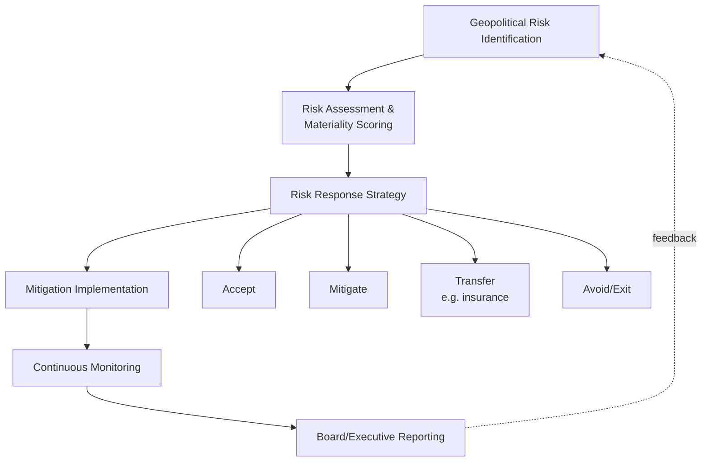

## Enterprise Risk Management for Geopolitical Exposure

### Overview

Enterprise Risk Management (ERM) for geopolitical exposure adapts established corporate risk management frameworks — traditionally built around operational, financial, and compliance risk — to systematically identify, assess, monitor, and respond to risks arising from political instability, interstate conflict, sanctions, trade policy shifts, and state actions affecting business operations. Unlike financial market geopolitical risk analysis, which focuses on asset pricing, corporate ERM for geopolitical exposure focuses on operational continuity, supply chain resilience, regulatory compliance, and strategic decision-making under geopolitical uncertainty.

### Core Framework: Integrating Geopolitical Risk into ERM Structures

#### The COSO ERM Framework as a Foundation

**Key Points**

- Most large organizations build geopolitical risk management on top of the widely adopted COSO (Committee of Sponsoring Organizations) ERM Framework, which organizes risk management into governance, strategy, performance, review, and information/communication components
- Geopolitical risk integration typically requires augmenting standard COSO categories with specialized inputs: political risk ratings, sanctions screening, supply chain geographic mapping, and scenario-based stress testing specific to geopolitical contingencies
- A key structural challenge is that geopolitical risk often cuts across traditional ERM risk silos (operational, financial, compliance, reputational) simultaneously, requiring cross-functional coordination that many organizations' existing risk governance structures are not natively designed to support [Inference — reflects widely observed organizational design challenges described in risk management literature; specific organizational structures vary considerably by firm]

### Governance Structures for Geopolitical Risk

#### Board and Executive-Level Oversight

**Key Points**

- Leading organizations increasingly establish dedicated geopolitical risk committees or expand existing risk committee mandates to explicitly include geopolitical risk oversight, reflecting board-level recognition that geopolitical exposure can materially affect enterprise value
- Chief Risk Officer (CRO) functions are increasingly expected to incorporate geopolitical expertise, either through dedicated geopolitical risk analyst hires, specialized advisory retainers, or partnerships with external geopolitical intelligence providers
- Some multinational corporations have created dedicated "Geopolitical Risk" or "Global Risk Intelligence" functions reporting directly to the CRO or Chief Strategy Officer, reflecting the discipline's maturation from an ad hoc advisory function toward a formalized organizational capability [Inference based on observed organizational trends in large multinational risk functions; the specific prevalence and structure of such units across the broader corporate population is not comprehensively documented]

#### Three Lines of Defense Model Applied to Geopolitical Risk

1. **First line (business units):** Operational managers responsible for day-to-day awareness of geopolitical exposure in their specific markets and supply chains
2. **Second line (risk and compliance functions):** Centralized geopolitical risk monitoring, sanctions compliance, and policy-setting functions providing oversight and challenge to first-line risk-taking
3. **Third line (internal audit):** Independent assurance that geopolitical risk management processes are functioning as designed and align with board-approved risk appetite

### Risk Identification and Assessment Methodologies

#### Mapping Geopolitical Exposure

**Key Points**

- **Direct operational exposure:** Physical assets, facilities, and personnel located in politically volatile or high-risk jurisdictions
- **Supply chain exposure:** Dependency on suppliers, components, or logistics routes passing through geopolitically sensitive regions or chokepoints
- **Market/revenue exposure:** Revenue concentration in specific countries or regions subject to political instability, sanctions risk, or trade policy shifts
- **Counterparty exposure:** Financial and commercial relationships with entities that could become subject to sanctions or export control restrictions
- **Regulatory/compliance exposure:** Operations subject to multiple, potentially conflicting jurisdictional requirements (e.g., US export control law versus EU data protection law)

#### Materiality and Heat-Mapping Approaches

Organizations commonly use heat-mapping techniques plotting likelihood against impact severity to prioritize geopolitical risks for deeper analysis and mitigation resource allocation, similar to standard operational risk heat-mapping but incorporating specialized geopolitical inputs (country risk indices, conflict probability assessments, sanctions trend analysis).

**Example**

A heat-mapping exercise for a multinational manufacturer might plot risks such as "Taiwan Strait escalation affecting semiconductor supply" (moderate likelihood, severe impact given supply chain dependency) against "currency inconvertibility in a specific frontier market subsidiary" (higher likelihood, moderate impact given limited revenue concentration there), directing more intensive scenario planning and mitigation resources toward the higher-composite-risk-score items.

### Scenario Planning and Stress Testing

#### Building Geopolitical Scenarios

**Key Points**

- Leading practice involves developing multiple named scenarios (e.g., base case, moderate escalation, severe disruption) for key geopolitical risk factors relevant to the organization's specific exposure profile, rather than relying on a single point-forecast assumption
- Scenario planning should explicitly model second-order and third-order effects — not just direct impact (e.g., a facility closure) but cascading effects (logistics rerouting costs, customer contract penalties, insurance claim processes, workforce relocation)
- Regular scenario-plan refresh cycles (typically annual or semi-annual, with ad hoc updates triggered by significant geopolitical developments) help ensure planning remains aligned with evolving risk conditions rather than becoming a static, outdated exercise

#### Tabletop Exercises

Many organizations supplement written scenario plans with tabletop exercises — simulated crisis response drills involving relevant executives and functional leads — to test decision-making processes, communication protocols, and identify gaps in actual operational response capability under simulated geopolitical crisis conditions.

### Supply Chain Resilience Strategies

#### Diversification and Redundancy

**Key Points**

- **Supplier diversification:** Reducing single-source or single-country dependency for critical components, particularly relevant given semiconductor, critical minerals, and rare earth concentration risks
- **Geographic redundancy:** Maintaining production capacity across multiple regions to enable rapid reallocation if one location becomes inaccessible or unreliable
- **Inventory buffering:** Strategic stockpiling of critical inputs, trading off carrying costs against supply disruption resilience — a strategy that gained significant corporate attention following COVID-19-era supply chain disruptions and has extended into geopolitical risk planning
- **Nearshoring/friend-shoring:** Relocating production or sourcing toward geographically closer or geopolitically aligned jurisdictions, reflecting corporate response to both geopolitical risk concerns and government industrial policy incentives (see semiconductor and critical minerals supply chain dynamics)

#### Mapping Multi-Tier Supply Chain Exposure

A persistent challenge in supply chain risk management is that many organizations have robust visibility into direct (Tier 1) suppliers but limited visibility into Tier 2, Tier 3, and beyond, where significant geopolitical concentration risk (e.g., a critical mineral processing chokepoint several tiers upstream) may be hidden. Leading practice increasingly involves supply chain mapping technology and supplier disclosure requirements extending visibility deeper into the supply chain specifically to identify these hidden geopolitical concentration risks.

### Sanctions and Trade Compliance Integration

#### Compliance Infrastructure Requirements

**Key Points**

- Effective geopolitical ERM requires robust sanctions screening infrastructure (screening counterparties, transactions, and ownership structures against evolving sanctions lists such as OFAC's Specially Designated Nationals list, EU sanctions lists, and UN Security Council designations)
- Export control compliance (particularly for technology, dual-use goods, and defense-related products) requires ongoing monitoring of evolving restriction lists (e.g., the US Commerce Department's Entity List) and classification of products/technologies against applicable control regimes
- Given the pace of sanctions and export control changes in the current geopolitical environment, organizations increasingly require near-real-time compliance monitoring capability rather than periodic manual review cycles, reflecting the operational tempo mismatch between traditional compliance review cadences and rapidly evolving restriction regimes [Inference based on general trend commentary regarding sanctions regime pace of change; specific organizational monitoring cadences vary]

### Crisis Management and Business Continuity

#### Geopolitical Crisis Response Protocols

**Key Points**

- Distinct from general business continuity planning (typically oriented toward natural disasters or IT outages), geopolitical crisis response protocols must account for factors such as personnel evacuation planning in conflict-affected regions, communication protocols under potential government monitoring or restriction, and asset protection/divestiture decision frameworks under rapidly evolving sanctions or expropriation risk
- Duty-of-care obligations toward employees in geopolitically volatile locations have become an increasingly prominent legal and reputational consideration, requiring clear protocols for security risk assessment, evacuation logistics, and communication with affected personnel and their families
- Post-crisis review processes (after-action reviews) following actual geopolitical disruption events help refine organizational response capability for future incidents, capturing lessons learned regarding decision speed, information quality, and cross-functional coordination effectiveness

### Risk Transfer and Insurance Integration

#### Combining Insurance with Broader ERM

Political risk insurance (covering expropriation, currency inconvertibility, political violence, and contract breach) functions as one risk-transfer tool within a broader ERM toolkit rather than a standalone solution, requiring coordination between risk management, treasury, and legal functions to ensure policy coverage terms genuinely align with the organization's actual structural exposure as identified through the broader risk assessment process.

### Risk Analysis Framework for Practitioners

#### Building an Integrated Geopolitical ERM Program

1. **Establish clear governance and ownership:** Define which function/committee owns geopolitical risk oversight and how it integrates with existing ERM governance structures
2. **Conduct comprehensive exposure mapping:** Identify direct, supply chain, market, counterparty, and regulatory geopolitical exposure across the organization
3. **Develop scenario-based stress tests:** Build multiple named scenarios for key geopolitical risk factors relevant to the specific organization, modeling cascading second-order effects
4. **Build resilience through diversification:** Reduce single-point-of-failure geographic and supplier concentration where economically feasible
5. **Integrate compliance infrastructure:** Ensure sanctions and export control monitoring capability matches the pace of regulatory change in the current environment
6. **Test crisis response capability:** Conduct regular tabletop exercises and maintain updated crisis response protocols specifically calibrated to geopolitical contingencies
7. **Establish continuous monitoring:** Move from periodic risk review cycles toward continuous or near-continuous geopolitical risk monitoring given the accelerating pace of relevant developments

#### Example Application

**Example**

A multinational technology company's geopolitical ERM program would typically integrate: semiconductor supply chain concentration risk assessment (mapping Taiwan and South Korea fabrication dependency), export control compliance monitoring (tracking evolving US-China technology restriction lists affecting product classification and sales eligibility), data sovereignty compliance across multiple jurisdictions with divergent data governance requirements, and scenario planning for a Taiwan Strait contingency affecting both direct supply chain access and broader market disruption. Each risk category would feed into a consolidated executive risk dashboard enabling board-level oversight of aggregate geopolitical exposure alongside traditional financial and operational risk metrics. [Inference — this represents a synthesized illustrative framework based on general patterns described in corporate risk management and technology sector disclosure literature, not a documented case of a specific named company's internal program]

### Illustrative ERM Integration Model

<svg xmlns="http://www.w3.org/2000/svg" viewBox="0 0 800 380">
<text x="400" y="25" text-anchor="middle" font-size="16" font-weight="bold" fill="#1a1a1a">Geopolitical Risk ERM Integration Structure (svg_diagram)</text>
<rect x="300" y="50" width="200" height="50" rx="6" fill="#4285f4" opacity="0.9" />
<text x="400" y="80" text-anchor="middle" font-size="12" font-weight="bold" fill="#fff">Board Risk Committee</text>
<rect x="300" y="130" width="200" height="50" rx="6" fill="#34a853" opacity="0.9" />
<text x="400" y="160" text-anchor="middle" font-size="12" font-weight="bold" fill="#fff">Chief Risk Officer</text>
<rect x="80" y="220" width="160" height="60" rx="6" fill="#fbbc04" opacity="0.9" />
<text x="160" y="245" text-anchor="middle" font-size="10" font-weight="bold" fill="#333">Geopolitical Risk</text>
<text x="160" y="260" text-anchor="middle" font-size="10" font-weight="bold" fill="#333">Intelligence Function</text>
<rect x="260" y="220" width="160" height="60" rx="6" fill="#ea4335" opacity="0.9" />
<text x="340" y="245" text-anchor="middle" font-size="10" font-weight="bold" fill="#fff">Sanctions/Export</text>
<text x="340" y="260" text-anchor="middle" font-size="10" font-weight="bold" fill="#fff">Control Compliance</text>
<rect x="440" y="220" width="160" height="60" rx="6" fill="#a142f4" opacity="0.9" />
<text x="520" y="245" text-anchor="middle" font-size="10" font-weight="bold" fill="#fff">Supply Chain Risk</text>
<text x="520" y="260" text-anchor="middle" font-size="10" font-weight="bold" fill="#fff">Management</text>
<rect x="620" y="220" width="140" height="60" rx="6" fill="#f57c00" opacity="0.9" />
<text x="690" y="245" text-anchor="middle" font-size="10" font-weight="bold" fill="#fff">Business Continuity</text>
<text x="690" y="260" text-anchor="middle" font-size="10" font-weight="bold" fill="#fff">/Crisis Response</text>
<line x1="400" y1="100" x2="400" y2="130" stroke="#666" stroke-width="1.5" />
<line x1="400" y1="180" x2="160" y2="220" stroke="#666" stroke-width="1.5" />
<line x1="400" y1="180" x2="340" y2="220" stroke="#666" stroke-width="1.5" />
<line x1="400" y1="180" x2="520" y2="220" stroke="#666" stroke-width="1.5" />
<line x1="400" y1="180" x2="690" y2="220" stroke="#666" stroke-width="1.5" />

<text x="400" y="330" text-anchor="middle" font-size="10" fill="#333">First-line business units feed exposure data upward; second-line functions</text>

<text x="400" y="345" text-anchor="middle" font-size="10" fill="#333">provide oversight and consolidated reporting to CRO and board</text>

</svg>

### Conclusion

Enterprise risk management for geopolitical exposure requires extending traditional ERM frameworks to address risk types — sanctions, supply chain chokepoint concentration, conflict-related operational disruption, cross-jurisdictional regulatory conflict — that often cut across conventional risk silos and demand specialized monitoring capability given their rapid pace of change. Effective programs combine clear governance ownership, comprehensive multi-tier exposure mapping, scenario-based stress testing, supply chain resilience investment, and integrated compliance infrastructure, supported by regular crisis response testing. As geopolitical volatility continues to affect corporate operations across sectors, the maturity of an organization's geopolitical ERM capability increasingly functions as a genuine competitive differentiator rather than a purely defensive compliance function.

**Related Topics**

- Semiconductor supply chains and chip competition (illustrative high-concentration supply chain risk case)
- Political risk insurance markets and underwriting (risk transfer component of ERM)
- Sanctions regimes and export control compliance program design
- Supply chain diversification and friend-shoring corporate strategy
- Scenario planning and tabletop exercise methodology for crisis preparedness
- Duty-of-care obligations and employee security risk management in volatile regions
- Data governance and digital sovereignty (cross-jurisdictional compliance conflict management)
- Board-level risk governance and geopolitical risk committee structures