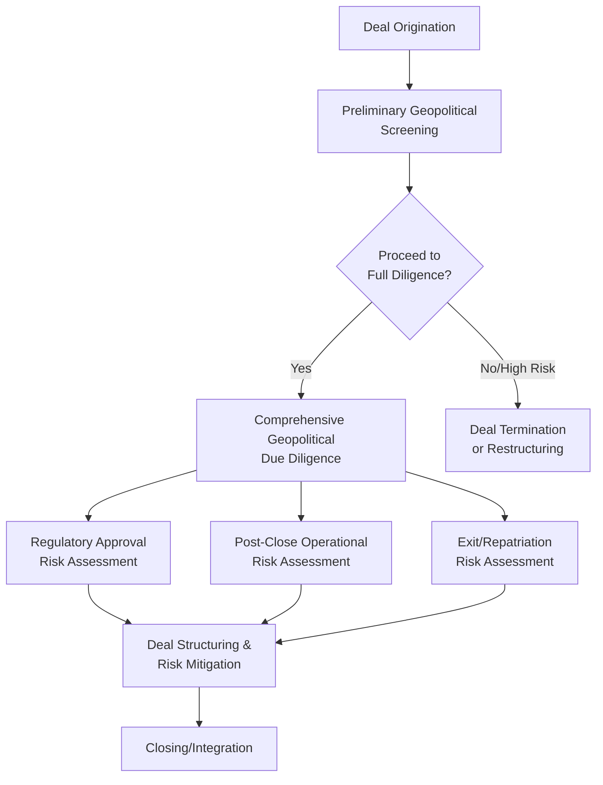

## Geopolitical Due Diligence in Market Entry and M&A

### Overview

Geopolitical due diligence is the systematic process of assessing political, regulatory, and geostrategic risk factors before a company enters a new market or executes a merger, acquisition, or joint venture involving cross-border exposure. Unlike traditional financial and legal due diligence, geopolitical due diligence focuses on forward-looking political stability, regulatory trajectory, sanctions and export control exposure, and the strategic alignment risk that could affect deal value, deal completion, or post-transaction operations over time horizons that traditional due diligence timeframes often underweight.

### Core Rationale and Positioning Within Deal Process

#### Why Geopolitical Due Diligence Is Distinct

**Key Points**

- Traditional M&A due diligence (financial, legal, tax, operational) is backward-looking and confirmatory, verifying stated facts about a target's historical performance and current legal standing, while geopolitical due diligence is inherently forward-looking and probabilistic, assessing how political and regulatory conditions might evolve over the investment holding period
- Geopolitical factors can affect deal value through multiple channels simultaneously: regulatory approval risk (national security reviews), post-close operational risk (sanctions exposure, expropriation risk), and exit risk (future regulatory or political constraints on divestiture or repatriation of returns)
- Geopolitical due diligence has grown in prominence as national security-based investment screening regimes have expanded significantly across major economies, making regulatory approval risk itself a primary geopolitical due diligence workstream rather than a purely procedural legal matter [Inference based on widely observed expansion of CFIUS-style regimes globally; specific approval statistics and denial rates vary by jurisdiction and are not comprehensively centralized]

### Regulatory and National Security Screening Risk

#### Foreign Investment Screening Regimes

**Key Points**

- **CFIUS (Committee on Foreign Investment in the United States):** Reviews foreign investment transactions for national security risk, with expanded jurisdiction since the 2018 FIRRMA legislation covering non-controlling investments in critical technology, infrastructure, and sensitive personal data companies
- **EU Foreign Direct Investment Screening Regulation:** Establishes a coordination mechanism among EU member states for screening foreign investment, though individual member states retain primary screening authority under their own national regimes (Germany's AWV, France's decree-based screening, etc.)
- **China's national security review regime and Anti-Monopoly Law review:** Increasingly significant for deals involving Chinese counterparties or Chinese market access, particularly following heightened scrutiny of cross-border technology transactions
- **UK National Security and Investment Act (2021):** Established a mandatory notification regime for investments in 17 specified sensitive sectors, reflecting the broader global trend toward expanded and more formalized investment screening

#### Assessing Approval Risk

Geopolitical due diligence for regulatory approval risk typically involves:

1. Determining which screening regimes apply based on target sector, technology sensitivity, and acquirer nationality/ownership structure
2. Assessing historical precedent for similar transactions (approval rates, required mitigation measures, or denials in comparable sector/nationality combinations)
3. Evaluating current bilateral political relationship trajectory between relevant jurisdictions, since screening outcomes can be influenced by broader diplomatic and strategic competition dynamics beyond the transaction's specific technical merits
4. Structuring transactions proactively to address anticipated concerns (e.g., voluntary mitigation agreements, technology firewalls, governance restrictions) where precedent suggests such measures improve approval likelihood

### Target Country and Jurisdiction Risk Assessment

#### Political Stability and Institutional Quality

**Key Points**

- Assessment typically incorporates sovereign governance indicators (rule of law, corruption control, regulatory quality, political stability indices such as the World Bank's Worldwide Governance Indicators), combined with country-specific political trajectory analysis (upcoming elections, succession risk in personalist regimes, coalition stability)
- Historical precedent regarding the host country's treatment of foreign investment specifically (expropriation history, contract sanctity track record, currency control history) provides a more targeted risk signal than generic governance indices alone
- Sector-specific political sensitivity varies significantly by jurisdiction — extractive industries, critical infrastructure, telecommunications, and financial services typically face higher political risk and more intensive regulatory scrutiny than, for example, light consumer goods manufacturing, given differing strategic and nationalist sensitivities

#### Sanctions and Export Control Screening

**Example**

A geopolitical due diligence workstream for an acquisition target with operations in multiple emerging markets would typically screen: (1) the target's ownership structure and beneficial owners against sanctions lists (OFAC SDN list, EU and UN sanctions lists), (2) the target's customer and supplier relationships for exposure to sanctioned entities or restricted-technology end-users, (3) historical compliance track record including any prior sanctions violations or export control enforcement actions, and (4) forward-looking exposure to jurisdictions where sanctions expansion is plausible given current diplomatic trajectory, since a currently-compliant target could become materially impaired if sanctions expand during the investment holding period.

### Supply Chain and Operational Geopolitical Exposure

#### Assessing Target Supply Chain Concentration

Geopolitical due diligence increasingly requires mapping a target's supply chain geographic concentration, particularly for manufacturing, technology, and industrial targets, to identify hidden chokepoint dependencies (e.g., reliance on Taiwan-based semiconductor fabrication, Chinese rare earth processing, or Russian energy inputs) that may not be apparent from standard financial due diligence but could materially affect post-acquisition operational continuity and valuation assumptions.

#### Labor and Human Rights Exposure

Increasingly, geopolitical due diligence incorporates human rights and forced labor exposure assessment, particularly for targets with supply chains touching regions subject to forced labor allegations (reflecting frameworks such as the US Uyghur Forced Labor Prevention Act and the EU's Corporate Sustainability Due Diligence Directive), since such exposure carries both direct compliance risk and reputational risk that can affect post-acquisition brand value and regulatory standing.

### Currency, Capital Control, and Repatriation Risk

#### Assessing Exit and Return Repatriation Risk

**Key Points**

- Geopolitical due diligence must assess not only entry conditions but the likelihood of being able to repatriate dividends, royalties, or eventual exit proceeds over the anticipated investment holding period, particularly for jurisdictions with a history of currency inconvertibility or capital control implementation during crisis periods
- This assessment often incorporates scenario analysis around specific plausible triggers (currency crisis, balance-of-payments stress, escalating sanctions) that could prompt capital control implementation, rather than relying solely on current-state currency convertibility conditions
- For minority or joint-venture investments, exit risk assessment must additionally account for partner-specific and governance-structure risk, since minority investors typically have less control over the timing and terms of eventual exit compared to majority or wholly-owned structures

### Deal Structuring as Risk Mitigation

#### Structural Mechanisms to Address Geopolitical Risk

**Key Points**

- **Political risk insurance:** Covering expropriation, currency inconvertibility, and political violence risk for the specific transaction, often structured as a condition precedent to closing for higher-risk jurisdictions
- **Staged/earn-out structures:** Phasing capital deployment or purchase consideration based on achievement of milestones, reducing upfront exposure to geopolitical deterioration
- **Governance and board protections:** Negotiating specific minority protection rights, board representation, or veto rights over key decisions to reduce exposure to adverse local partner or government action
- **Bilateral investment treaty structuring:** Structuring the investment through a jurisdiction with an applicable, favorable bilateral investment treaty with the target country, providing potential recourse (e.g., ICSID arbitration access) in the event of expropriation or discriminatory treatment
- **Local partnership requirements:** In some jurisdictions, mandatory or strategically advisable local partnership or joint-venture structures can reduce political risk exposure (by aligning local stakeholder interests with the investment's success) while introducing distinct governance and partner-risk considerations of their own

### Timing and Integration Within Deal Process

#### When Geopolitical Due Diligence Should Occur

**Key Points**

- Leading practice increasingly incorporates preliminary geopolitical screening at the earliest stages of deal origination (before significant transaction costs are incurred), rather than treating geopolitical assessment as a late-stage confirmatory exercise alongside final legal documentation
- Given that geopolitical conditions can shift meaningfully during typically lengthy M&A processes (regulatory approval timelines for cross-border deals involving national security review can extend 6-18 months or longer), geopolitical due diligence should be treated as a continuously monitored workstream through signing and closing, not a one-time assessment frozen at the deal's initial diligence phase [Inference based on general observed CFIUS and similar regime timeline patterns; specific timelines vary considerably by jurisdiction, sector, and case complexity]
- Post-closing integration planning should incorporate geopolitical risk monitoring as an ongoing function, recognizing that the risk assessment conducted pre-closing represents a point-in-time snapshot requiring continuous reassessment throughout the investment holding period

### Risk Analysis Framework for Practitioners

#### Structuring a Comprehensive Geopolitical Due Diligence Workstream

1. **Preliminary screening:** Rapid initial assessment of obvious red flags (target/counterparty sanctions exposure, applicable foreign investment screening regime triggers, sector-specific national security sensitivity)
2. **Regulatory approval risk assessment:** Detailed analysis of applicable screening regimes, historical precedent, and likely mitigation requirements
3. **Target jurisdiction political risk assessment:** Sovereign governance quality, political stability trajectory, and historical treatment of foreign investment
4. **Supply chain and operational exposure mapping:** Identification of hidden geographic concentration risk in the target's supply chain and customer base
5. **Sanctions and compliance history review:** Both the target's historical compliance record and forward-looking exposure given plausible sanctions regime evolution
6. **Repatriation and exit risk assessment:** Currency convertibility history and capital control risk over the anticipated holding period
7. **Deal structuring recommendations:** Translating identified risks into specific structural mitigation mechanisms (insurance, staged consideration, governance protections, treaty structuring)

### Illustrative Due Diligence Workstream Map

<svg xmlns="http://www.w3.org/2000/svg" viewBox="0 0 800 360">
<text x="400" y="25" text-anchor="middle" font-size="16" font-weight="bold" fill="#1a1a1a">Geopolitical Due Diligence Workstream Structure (svg_diagram)</text>
<rect x="40" y="60" width="170" height="90" rx="6" fill="#4285f4" opacity="0.85" />
<text x="125" y="90" text-anchor="middle" font-size="11" font-weight="bold" fill="#fff">Regulatory</text>
<text x="125" y="105" text-anchor="middle" font-size="11" font-weight="bold" fill="#fff">Approval Risk</text>
<text x="125" y="125" text-anchor="middle" font-size="9" fill="#fff">CFIUS, EU FDI screening,</text>
<text x="125" y="138" text-anchor="middle" font-size="9" fill="#fff">national security review</text>
<rect x="230" y="60" width="170" height="90" rx="6" fill="#34a853" opacity="0.85" />
<text x="315" y="90" text-anchor="middle" font-size="11" font-weight="bold" fill="#fff">Jurisdiction</text>
<text x="315" y="105" text-anchor="middle" font-size="11" font-weight="bold" fill="#fff">Political Risk</text>
<text x="315" y="125" text-anchor="middle" font-size="9" fill="#fff">Governance quality,</text>
<text x="315" y="138" text-anchor="middle" font-size="9" fill="#fff">expropriation history</text>
<rect x="420" y="60" width="170" height="90" rx="6" fill="#fbbc04" opacity="0.85" />
<text x="505" y="90" text-anchor="middle" font-size="11" font-weight="bold" fill="#333">Sanctions/</text>
<text x="505" y="105" text-anchor="middle" font-size="11" font-weight="bold" fill="#333">Compliance</text>
<text x="505" y="125" text-anchor="middle" font-size="9" fill="#333">Ownership screening,</text>
<text x="505" y="138" text-anchor="middle" font-size="9" fill="#333">export control exposure</text>
<rect x="610" y="60" width="150" height="90" rx="6" fill="#ea4335" opacity="0.85" />
<text x="685" y="90" text-anchor="middle" font-size="11" font-weight="bold" fill="#fff">Supply Chain</text>
<text x="685" y="105" text-anchor="middle" font-size="11" font-weight="bold" fill="#fff">Exposure</text>
<text x="685" y="125" text-anchor="middle" font-size="9" fill="#fff">Chokepoint mapping,</text>
<text x="685" y="138" text-anchor="middle" font-size="9" fill="#fff">multi-tier visibility</text>
<rect x="230" y="200" width="360" height="90" rx="6" fill="#a142f4" opacity="0.85" />
<text x="410" y="230" text-anchor="middle" font-size="12" font-weight="bold" fill="#fff">Repatriation &amp; Exit Risk</text>
<text x="410" y="250" text-anchor="middle" font-size="9" fill="#fff">Currency convertibility history, capital control</text>
<text x="410" y="264" text-anchor="middle" font-size="9" fill="#fff">scenario risk, minority/JV governance exposure</text>
<line x1="125" y1="150" x2="410" y2="200" stroke="#666" stroke-width="1.5" />
<line x1="315" y1="150" x2="410" y2="200" stroke="#666" stroke-width="1.5" />
<line x1="505" y1="150" x2="410" y2="200" stroke="#666" stroke-width="1.5" />
<line x1="685" y1="150" x2="410" y2="200" stroke="#666" stroke-width="1.5" />
<rect x="230" y="310" width="360" height="40" rx="6" fill="#fff" stroke="#333" stroke-width="1.5" />
<text x="410" y="335" text-anchor="middle" font-size="11" font-weight="bold" fill="#1a1a1a">Deal Structuring &amp; Risk Mitigation Recommendations</text>
<line x1="410" y1="290" x2="410" y2="310" stroke="#666" stroke-width="1.5" />
</svg>

### Conclusion

Geopolitical due diligence has evolved from a peripheral consideration into a core M&A and market-entry workstream, reflecting the expansion of national security-based investment screening regimes, the growing prominence of sanctions and export control exposure, and heightened awareness of supply chain concentration risk. Effective geopolitical due diligence requires forward-looking, scenario-based assessment distinct from traditional confirmatory financial and legal diligence, continuous monitoring through what are often lengthy deal timelines, and translation of identified risks into concrete deal structuring mechanisms rather than purely descriptive risk reporting. As foreign investment screening regimes continue to expand and geopolitical fragmentation increases, this discipline is likely to become an increasingly central and formalized component of cross-border transaction practice.

**Related Topics**

- Enterprise risk management for geopolitical exposure (ongoing post-close monitoring framework)
- Political risk insurance markets and underwriting (deal structuring risk transfer mechanism)
- CFIUS and comparative foreign investment screening regime analysis
- Sovereign credit ratings and risk premiums (jurisdiction-level risk assessment input)
- Sanctions regimes and their interaction with M&A ownership and counterparty screening
- Bilateral investment treaties and investor-state dispute settlement mechanisms
- Supply chain due diligence and multi-tier chokepoint mapping methodology
- Human rights and forced labor due diligence frameworks in cross-border transactions