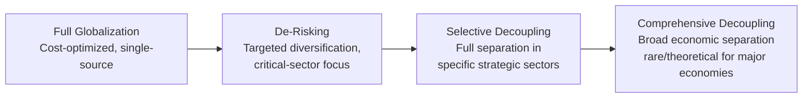

## Supply Chain Resilience and De-Risking Strategies

### Overview

Supply chain resilience and de-risking strategies encompass the deliberate corporate and policy actions taken to reduce vulnerability to geopolitically-driven supply chain disruption — while preserving cost efficiency, quality, and operational performance to the greatest extent possible. Following a succession of major disruptions (COVID-19, the Russia-Ukraine war, escalating US-China trade restrictions, and Red Sea shipping disruptions), supply chain resilience has moved from a peripheral operations concern to a board-level strategic priority, giving rise to the specific policy and corporate discourse around "de-risking" as distinct from full "decoupling."

### Core Conceptual Distinctions

#### De-Risking vs. Decoupling

**Key Points**

- **Decoupling** refers to a comprehensive separation of economic ties between geopolitical rivals or blocs, effectively ending trade and investment interdependency
- **De-risking** refers to a more targeted approach — reducing concentration risk and critical dependency in specific strategically sensitive sectors while maintaining broader economic engagement, a framing explicitly adopted by the European Commission and subsequently echoed by the G7 in describing their approach to China specifically
- This distinction matters analytically because de-risking strategies are typically sector-specific and proportionate (targeting critical minerals, semiconductors, or specific dual-use technologies) rather than comprehensive, reflecting a policy and corporate consensus that full decoupling from major trading partners like China would be economically costly and largely impractical for most sectors [Inference — reflects the stated policy framing from EU and G7 sources; actual corporate implementation varies considerably by sector and firm risk tolerance]

### Drivers of Supply Chain De-Risking

#### Compounding Disruption Events

**Key Points**

- **COVID-19 pandemic (2020-2022):** Exposed the fragility of just-in-time, single-source manufacturing models, particularly for medical supplies, semiconductors, and shipping/logistics capacity
- **US-China trade tensions and export controls (2018-present):** Created direct compliance risk and cost exposure for companies with concentrated China-based manufacturing or sourcing, particularly in technology and semiconductor-adjacent sectors
- **Russia-Ukraine war (2022-present):** Disrupted energy supplies, agricultural exports, and specific industrial inputs (e.g., neon gas for semiconductor lithography, of which Ukraine was a significant global supplier), demonstrating how regional conflicts can affect seemingly unrelated global industries
- **Red Sea shipping disruptions (2023-present):** Houthi attacks on commercial shipping forced widespread rerouting around the Cape of Good Hope, adding significant transit time and cost for Asia-Europe trade routes, illustrating chokepoint vulnerability beyond the traditionally discussed Strait of Hormuz and Taiwan Strait

#### The "Just-in-Case" Shift

The cumulative effect of these disruptions has driven a broader philosophical shift in supply chain management from "just-in-time" (minimizing inventory and cost through tight coordination) toward "just-in-case" (building in redundancy and buffer capacity), reflecting a reassessment of the risk-adjusted cost of pure efficiency optimization. [Inference — this represents a widely discussed conceptual shift in supply chain management literature; the actual extent of implementation varies considerably across industries and individual firms, and many companies continue to prioritize cost efficiency where disruption risk is assessed as lower]

### Core De-Risking Strategies

#### Supplier and Geographic Diversification

**Key Points**

- **Multi-sourcing:** Establishing multiple qualified suppliers for critical components rather than relying on a single source, even where this involves higher per-unit costs
- **China+1 (or China+N) strategies:** Maintaining Chinese manufacturing/sourcing capacity while simultaneously developing production capability in alternative locations (Vietnam, India, Mexico, and others), rather than complete exit from Chinese supply chains
- **Friend-shoring:** Relocating sourcing and production toward countries considered geopolitically aligned or reliable partners, reflecting both risk management and, in some cases, government industrial policy incentive alignment
- **Nearshoring:** Relocating production closer to end markets (e.g., Mexico for US-market manufacturing) to reduce transit time, logistics complexity, and exposure to distant geopolitical flashpoints, while also addressing separate cost and speed-to-market considerations

#### Multi-Tier Supply Chain Visibility

A persistent structural challenge in de-risking efforts is that most organizations have relatively strong visibility into direct (Tier 1) suppliers but significantly reduced visibility into Tier 2, Tier 3, and further upstream suppliers, where critical geopolitical concentration risk often actually resides (e.g., a rare earth processing chokepoint several tiers removed from the final assembler). Leading practice increasingly involves:

1. Supply chain mapping technology and platforms designed to trace multi-tier supplier relationships
2. Contractual disclosure requirements obligating direct suppliers to provide visibility into their own upstream sourcing
3. Industry consortium and government-supported mapping initiatives (particularly for critical minerals and semiconductor supply chains) to establish shared baseline visibility where individual companies lack full independent capability

#### Inventory and Buffer Strategies

- Strategic stockpiling of critical inputs with long lead times or high geopolitical concentration risk, explicitly trading inventory carrying costs against disruption resilience
- Government-level strategic reserves (e.g., national semiconductor stockpile initiatives discussed in some jurisdictions, longstanding strategic petroleum reserves) complement corporate-level buffering, reflecting recognition that some critical input risks exceed what any single company can reasonably self-insure against

### Sector-Specific De-Risking Case Patterns

#### Semiconductors

Semiconductor supply chain de-risking has driven substantial reshoring and diversification investment (US CHIPS Act-supported fabrication capacity, Japan's TSMC Kumamoto facility, EU Chips Act initiatives), though the extreme capital intensity and specialization of advanced-node fabrication means genuine diversification away from Taiwan concentration for the most advanced nodes remains a multi-year to decade-long undertaking rather than a rapidly achievable near-term de-risking outcome. [Inference based on widely reported capital investment and construction timelines for major fabrication facilities; specific completion and ramp-up timelines are subject to ongoing revision]

#### Critical Minerals

**Key Points**

- Critical mineral supply chains (lithium, cobalt, rare earths, graphite) present particularly acute de-risking challenges given extreme geographic concentration in extraction and, especially, processing capacity — China's dominance in rare earth processing specifically (even where raw extraction occurs elsewhere) represents a processing-stage chokepoint that is more difficult to diversify than mining alone
- De-risking strategies in this sector include developing alternative processing capacity (Australia, US, and allied-country initiatives), recycling and circular economy approaches to reduce primary extraction dependency, and materials substitution research to reduce reliance on the most geopolitically concentrated specific minerals
- Government-supported initiatives such as the Minerals Security Partnership (a US-led coalition of countries seeking to develop diversified critical minerals supply chains) reflect the increasingly government-coordinated nature of de-risking in this sector, given the scale of investment and long development timelines involved in establishing new mining and processing capacity

#### Pharmaceuticals and Medical Supplies

The COVID-19 pandemic specifically exposed concentration risk in active pharmaceutical ingredient (API) manufacturing, with significant global capacity concentrated in China and India, prompting various government initiatives (stockpiling requirements, domestic manufacturing incentives) aimed at reducing single-country dependency for critical medical supply categories.

### Cost and Trade-Off Considerations

#### The De-Risking Cost Calculus

**Key Points**

- Supply chain de-risking generally involves real cost trade-offs — diversified sourcing, geographic redundancy, and inventory buffering typically increase per-unit costs relative to fully optimized single-source, just-in-time models, requiring companies to explicitly weigh disruption-risk-adjusted total cost against pure unit-cost optimization
- Some de-risking investments are supported or subsidized by government industrial policy (reshoring tax incentives, CHIPS Act-style subsidies), partially offsetting the private cost of diversification and reflecting government recognition that pure market incentives may under-invest in resilience relative to the socially optimal level given externalities associated with supply chain concentration risk
- Companies face a genuine strategic tension between de-risking investment and near-term competitiveness, particularly in sectors where competitors continue to prioritize cost optimization over resilience investment, creating potential first-mover cost disadvantage for companies that de-risk more aggressively than the broader industry [Inference — reflects a widely discussed strategic tension in supply chain management literature rather than a documented universal outcome]

### Risk Analysis Framework

#### Assessing Supply Chain De-Risking Priorities

1. **Criticality assessment:** Which inputs, components, or supplier relationships are genuinely mission-critical (no viable short-term substitute) versus readily substitutable
2. **Concentration risk mapping:** Geographic and single-supplier concentration analysis across all relevant tiers, not merely direct suppliers
3. **Chokepoint exposure:** Assessment of exposure to specific physical or processing chokepoints (Taiwan Strait, Strait of Hormuz, Chinese rare earth processing, Red Sea shipping lanes)
4. **Substitutability and alternative source development timeline:** Realistic assessment of how quickly alternative sourcing could be developed if primary sources were disrupted
5. **Cost-benefit calibration:** Explicit comparison of diversification/resilience investment cost against probability-weighted disruption cost, avoiding both under-investment (excessive concentration risk) and over-investment (unnecessary cost burden relative to actual risk level)

#### Example Assessment Structure

**Example**

A supply chain de-risking assessment for an electric vehicle manufacturer would typically prioritize battery-grade lithium and cobalt sourcing (given extreme geographic concentration and rapidly growing demand), semiconductor sourcing for vehicle electronics (given the well-documented 2021-2022 automotive chip shortage precedent), and rare earth magnet sourcing for electric motors (given Chinese processing dominance), while treating more geographically diversified inputs (steel, aluminum, glass) as lower near-term de-risking priorities despite their significant volume in the overall bill of materials — illustrating that de-risking prioritization should follow concentration and criticality risk rather than input volume or cost share alone. [Inference — this represents a standard risk-prioritization logic applied to a well-documented sector; specific company sourcing strategies are proprietary and not independently verifiable from public sources alone]

### Illustrative De-Risking Strategy Spectrum

<svg xmlns="http://www.w3.org/2000/svg" viewBox="0 0 800 360">
<text x="400" y="25" text-anchor="middle" font-size="16" font-weight="bold" fill="#1a1a1a">Supply Chain De-Risking Strategy Spectrum (svg_diagram)</text>
<line x1="90" y1="310" x2="90" y2="60" stroke="#333" stroke-width="1.5" />
<line x1="90" y1="310" x2="750" y2="310" stroke="#333" stroke-width="1.5" />
<text x="400" y="340" text-anchor="middle" font-size="11" fill="#333">Implementation Cost/Complexity</text>
<text x="35" y="185" font-size="11" fill="#333" transform="rotate(-90 35 185)">Resilience Gained</text>
<circle cx="160" cy="270" r="28" fill="#4285f4" opacity="0.85" />
<text x="160" y="267" text-anchor="middle" font-size="8" fill="#fff" font-weight="bold">Inventory</text>
<text x="160" y="279" text-anchor="middle" font-size="8" fill="#fff">Buffering</text>
<circle cx="270" cy="220" r="30" fill="#34a853" opacity="0.85" />
<text x="270" y="217" text-anchor="middle" font-size="8" fill="#fff" font-weight="bold">Multi-Tier</text>
<text x="270" y="229" text-anchor="middle" font-size="8" fill="#fff">Visibility</text>
<circle cx="400" cy="170" r="32" fill="#fbbc04" opacity="0.85" />
<text x="400" y="167" text-anchor="middle" font-size="8" fill="#333" font-weight="bold">Multi-Sourcing/</text>
<text x="400" y="179" text-anchor="middle" font-size="8" fill="#333">China+1</text>
<circle cx="550" cy="120" r="34" fill="#ea4335" opacity="0.85" />
<text x="550" y="117" text-anchor="middle" font-size="8" fill="#fff" font-weight="bold">Friend-shoring/</text>
<text x="550" y="129" text-anchor="middle" font-size="8" fill="#fff">Nearshoring</text>
<circle cx="680" cy="80" r="34" fill="#a142f4" opacity="0.85" />
<text x="680" y="77" text-anchor="middle" font-size="8" fill="#fff" font-weight="bold">New Capacity</text>
<text x="680" y="89" text-anchor="middle" font-size="8" fill="#fff">Build-Out</text>
</svg>

### Conclusion

Supply chain resilience and de-risking strategies reflect a maturing corporate and policy response to accumulated evidence that concentrated, cost-optimized global supply chains carry meaningful geopolitical tail risk that traditional supply chain management approaches underweighted. The prevailing "de-risking" framing — targeted diversification in strategically critical sectors rather than comprehensive decoupling — reflects a pragmatic balance between resilience investment and the substantial economic cost of full separation from major trading partners. Effective implementation requires multi-tier supply chain visibility (extending well beyond direct suppliers), sector-specific prioritization based on genuine criticality and concentration risk rather than uniform treatment, and explicit acknowledgment of the real cost trade-offs involved, since resilience investment that ignores cost discipline risks undermining the competitiveness it aims to protect.

**Related Topics**

- Semiconductor supply chains and chip competition (leading de-risking case study)
- Enterprise risk management for geopolitical exposure (broader corporate risk framework)
- Critical minerals supply chains and the Minerals Security Partnership
- Geopolitical due diligence in market entry and M&A (assessing target supply chain exposure)
- The global AI race and technology sovereignty (compute and chip supply chain de-risking overlap)
- Red Sea shipping disruptions and maritime chokepoint vulnerability
- Friend-shoring versus nearshoring: comparative corporate strategy analysis
- Government industrial policy and subsidy programs supporting supply chain diversification