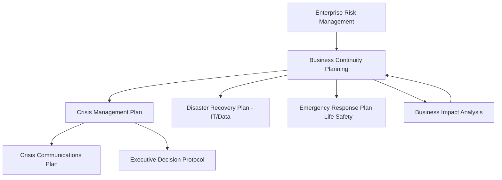
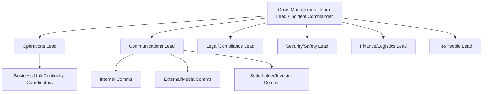

## Crisis Management and Business Continuity Planning

### Definition and Scope

Crisis management (CM) and business continuity planning (BCP) are related but distinct disciplines within corporate geopolitical risk management. Crisis management is the real-time organizational response to an acute, high-impact disruptive event (its detection, decision-making, and communication). Business continuity planning is the pre-established set of processes, resources, and procedures designed to maintain or rapidly restore critical business functions during and after a disruption. Geopolitical risk contexts — war, sanctions, coups, civil unrest, expropriation, border closures — are a major driver of both disciplines because they can be sudden, severe, and largely outside a firm's control.

**Key Points**

- Crisis management is episodic and time-bound (activated on event onset, deactivated on stabilization)
- BCP is a standing capability maintained continuously, tested and updated on a recurring cycle
- The two are sequential and overlapping: BCP defines *what* the organization must protect and *how*; crisis management governs *who decides what* during the live event
- Distinct from disaster recovery (DR), which is a narrower technical subset of BCP focused specifically on IT/data systems restoration

### Relationship Among Crisis Management, BCP, and DR

- **Emergency response plan**: immediate life-safety actions (evacuation, shelter-in-place)
- **Crisis management plan**: command structure and decision authority during the event
- **Crisis communications plan**: internal/external messaging protocols
- **Disaster recovery plan**: technical restoration of IT infrastructure and data
- **Business continuity plan**: the umbrella plan ensuring critical business processes continue or resume within tolerable timeframes

### Governing Standards

- **ISO 22301**: Security and resilience — Business continuity management systems — Requirements (the primary international standard; supersedes BS 25999)
- **ISO 22320**: Emergency management — Guidelines for incident management
- **NFPA 1600**: Standard on Continuity, Emergency, and Crisis Management (US-originated, widely adopted)
- **NIST SP 800-34**: Contingency Planning Guide for Federal Information Systems (IT-focused, US federal standard, commonly referenced by private-sector IT/DR teams)

[Inference] Adoption of ISO 22301 certification versus informal adherence to its principles varies significantly by industry and jurisdiction; certification is more common in financial services and critical infrastructure sectors than in, for example, mid-size manufacturing firms, though comprehensive comparative adoption statistics are not something I can verify with confidence here.

### Business Continuity Planning: Core Process

#### Step 1: Business Impact Analysis (BIA)

The BIA identifies critical business functions, quantifies the impact of their disruption over time, and establishes recovery targets. Core metrics:

- **Recovery Time Objective (RTO)**: the maximum tolerable duration a function can be unavailable before unacceptable harm occurs
- **Recovery Point Objective (RPO)**: the maximum tolerable data loss, measured in time (e.g., "no more than 4 hours of transaction data may be lost")
- **Maximum Tolerable Downtime (MTD)**: the absolute ceiling beyond which the organization suffers irrecoverable damage (RTO must always be less than MTD)
- **Minimum Business Continuity Objective (MBCO)**: the minimum acceptable level of service during disruption, distinct from full restoration

$$RTO < MTD$$

**Example**

A commodities trading firm's BIA might classify its trade settlement system as Tier 1 (RTO = 2 hours, RPO = 15 minutes) because extended downtime creates direct counterparty default risk, while its internal HR portal is classified Tier 3 (RTO = 5 business days) because its disruption has no immediate revenue or safety impact.

#### Step 2: Risk Assessment and Threat Scenario Mapping

For geopolitical risk specifically, threat scenarios typically include:

| Threat Category | Example Triggers |
| --- | --- |
| Armed conflict / war | Interstate conflict, civil war, insurgency escalation |
| Political instability | Coup, contested election, mass protest/unrest |
| Sanctions/trade restriction | New export controls, asset freezes, secondary sanctions exposure |
| Expropriation/nationalization | Forced divestment, asset seizure |
| Civil unrest | Riots, strikes, infrastructure sabotage |
| Terrorism | Attacks on personnel, facilities, or supply routes |
| Cyber-geopolitical | State-sponsored attacks tied to geopolitical tension |
| Border/logistics disruption | Closed borders, blockades, chokepoint disruption (e.g., strait closures) |

Each threat is scored on likelihood and impact, typically via a heat-map/risk matrix, to prioritize which scenarios warrant dedicated continuity plans versus generic response protocols.

#### Step 3: Strategy Development

Continuity strategies map to the resources needed to meet BIA-derived RTOs:

- **Workforce continuity**: cross-training, remote work capability, alternate staffing pools, succession planning for key personnel (critical for geopolitical events involving personnel evacuation)
- **Facility continuity**: alternate site arrangements (hot site, warm site, cold site), geographic diversification of operations
- **Supply chain continuity**: dual/multi-sourcing, safety stock policies, alternate logistics routing
- **IT/data continuity**: backup and replication architecture, failover systems, cloud redundancy across geographic/jurisdictional zones
- **Financial continuity**: liquidity reserves, contingent credit facilities, insurance (political risk insurance, business interruption insurance)

**Site Recovery Tiers**

| Tier | Description | Typical RTO |
| --- | --- | --- |
| Cold site | Empty facility with power/connectivity, no active systems | Days to weeks |
| Warm site | Partially configured with some hardware/data, requires activation | Hours to 1-2 days |
| Hot site | Fully mirrored, live or near-live replication | Minutes to hours |

#### Step 4: Plan Development

The written BCP typically includes:

- Activation criteria and triggers (who declares an incident, at what threshold)
- Roles, responsibilities, and delegation of authority (including line-of-succession if senior leadership is unreachable — a specific concern in geopolitical crises involving travel restrictions or communications blackouts)
- Step-by-step recovery procedures per critical function
- Contact trees and notification protocols
- Resource inventories (alternate sites, vendor contacts, equipment)
- Plan activation, escalation, and stand-down procedures

#### Step 5: Testing, Exercising, and Maintenance

BCPs degrade in value if untested. Common exercise types, in increasing order of complexity:

- **Tabletop exercise**: discussion-based walkthrough of a scenario with key stakeholders, no physical simulation
- **Walkthrough/structured drill**: team performs specific procedural steps (e.g., testing the notification tree)
- **Functional exercise**: simulates a specific function's failure and recovery (e.g., failing over to a backup data center)
- **Full-scale/simulation exercise**: end-to-end simulation involving multiple functions, sometimes unannounced, testing the complete response chain

Industry practice generally recommends annual tabletop exercises at minimum, with more frequent testing for Tier 1 critical functions. [Inference] Specific testing cadence requirements vary by regulatory regime (e.g., financial services regulators often mandate more frequent testing than general commercial guidance), so cadence should be treated as sector-dependent rather than a single universal standard.

### Crisis Management: Core Process

#### Incident Command Structure

Most corporate crisis management structures adapt the Incident Command System (ICS), originally developed for emergency services, into a corporate Crisis Management Team (CMT) structure:

Key design principles:

- **Single point of decision authority** during the crisis window, to avoid conflicting or delayed decisions
- **Pre-designated alternates** for every CMT role, addressing the geopolitical-specific risk that a key decision-maker may be in an affected region and unreachable
- **Escalation thresholds** defined in advance (e.g., "Level 1" local incident manager, "Level 2" regional CMT activation, "Level 3" global/board-level activation)

#### Crisis Decision-Making Under Uncertainty

Geopolitical crises are characterized by incomplete, rapidly-changing, and sometimes contradictory information. Structured decision frameworks commonly applied:

- **OODA loop** (Observe–Orient–Decide–Act): originally a military decision cycle (John Boyd), adapted for crisis response to emphasize decision speed and iterative reassessment as new information arrives
- **Decision under uncertainty framing**: explicit tracking of what is known, what is assumed, and what is unknown, updated on a fixed battle-rhythm (e.g., every 4–6 hours during acute phase)
- **Pre-delegated decision authority**: certain decisions (e.g., "evacuate personnel if host government issues travel advisory level 4") are pre-authorized so the CMT does not need real-time sign-off for time-critical, previously-scenario-tested actions

#### Crisis Communications

Communications during geopolitical crises must address multiple audiences simultaneously, often with conflicting information needs and regulatory disclosure obligations:

- **Employees/personnel** (especially those in the affected region): safety instructions, evacuation logistics, welfare check-ins
- **Customers/clients**: service continuity status, contractual impact
- **Investors/shareholders**: material impact disclosure (subject to securities law disclosure obligations in publicly listed firms)
- **Media/public**: reputational management, factual public statements
- **Regulators/government**: compliance notifications, sanctions-related reporting where applicable
- **Host government/local authorities**: coordination, especially where security or evacuation assistance is needed

**Key Points**

- Message discipline (a single verified source of truth) is critical to avoid contradictory statements across channels, which itself becomes a secondary reputational crisis
- Legal review of public statements is typically required pre-release in geopolitical crises due to sanctions, export control, or securities disclosure exposure
- "Dark site" web pages (pre-built, unpublished crisis communication pages) are a common preparedness tool, allowing rapid publication without live-building content during the crisis

### Personnel Safety and Duty of Care

Geopolitical crises frequently implicate an organization's **duty of care** obligation toward employees, particularly expatriate staff, business travelers, and local national staff in affected regions.

- **Travel risk management systems**: real-time traveler tracking, pre-travel risk briefings, geofenced alerting when personnel enter elevated-risk zones
- **Evacuation planning**: pre-negotiated relationships with security/evacuation providers, defined evacuation trigger levels tied to government travel advisories or internal risk thresholds
- **Local national staff considerations**: distinct legal and ethical considerations apply to locally-hired staff who may not have the same relocation options as expatriate employees — a frequently cited gap in corporate duty-of-care planning
- [Inference] Legal liability exposure for inadequate duty-of-care provisions varies substantially by jurisdiction and employment contract structure; firms operating in higher-risk regions typically consult specialized legal counsel on this exposure rather than relying on generic global policy, and I would not generalize a single liability standard across jurisdictions.

### Integration with Geopolitical Risk Intelligence

Effective BCP/CM in a geopolitical context depends on upstream intelligence and early-warning capability, closing the loop with scenario planning and risk monitoring functions:

- **Risk intelligence feeds**: commercial geopolitical risk monitoring services, government travel advisories, open-source intelligence (OSINT) monitoring
- **Threshold-based activation**: pre-defined indicators (e.g., specific advisory levels, defined unrest indicators) that automatically trigger BCP/CM plan review or activation, reducing reliance on ad hoc judgment calls during a fast-moving event
- **Feedback loop to scenario planning**: post-crisis reviews should feed back into the organization's scenario planning process (see Scenario-Based Corporate Strategic Planning) to refine future driving-force assumptions and early warning indicators

### Post-Crisis: Recovery and Lessons Learned

- **After-action review (AAR)**: structured debrief comparing planned response to actual response, identifying gaps in plan design, activation speed, communication effectiveness, and resource adequacy
- **Plan revision cycle**: AAR findings formally incorporated into the next BCP/CM plan revision, closing the continuous-improvement loop
- **Financial and insurance claims process**: documentation of losses for business interruption insurance and, where applicable, political risk insurance claims
- **Reputational recovery**: longer-horizon communications and stakeholder engagement beyond the acute crisis window

### Common Organizational Pitfalls

- **Plans that exist only on paper**: untested plans frequently fail on activation due to outdated contact information, unavailable alternates, or unrealistic assumptions about resource availability
- **Single points of failure in leadership**: no defined alternate when the primary decision-maker is unreachable, a particularly acute risk when the crisis itself involves communications infrastructure disruption
- **Underestimating duration**: many BCPs are designed around short-duration outages (days) but geopolitical crises (sanctions regimes, prolonged conflict, extended unrest) can persist for months or years, requiring different continuity strategies than short-term disruption planning
- **Fragmented ownership**: BCP owned by IT/operations in isolation from corporate security, legal, and government affairs functions, producing gaps at the geopolitical-specific risk boundary
- **Static plans in a dynamic threat environment**: geopolitical risk factors change faster than typical annual plan review cycles in volatile regions, arguing for more frequent review triggers tied to risk-level changes rather than fixed calendar dates alone

### Illustrative Metrics for Program Maturity

| Maturity Indicator | Immature | Mature |
| --- | --- | --- |
| BIA currency | Not updated in 2+ years | Updated annually or on major business change |
| Testing frequency | Ad hoc/never | Scheduled, tiered by criticality |
| Leadership succession | Undefined | Pre-designated with tested alternates |
| Communications readiness | Built during crisis | Pre-built templates/dark sites ready |
| Cross-functional integration | Siloed (IT-only) | Integrated across security, legal, HR, ops |
| Geopolitical intelligence linkage | None/reactive | Threshold-based automated triggers |

**Related Topics**

- Business Impact Analysis methodology and RTO/RPO modeling in depth
- Political risk insurance and business interruption insurance instruments
- Travel risk management and duty-of-care program design
- Crisis communications planning and dark-site content strategy
- Incident Command System (ICS) adaptation for corporate use
- Supply chain resilience and multi-sourcing strategy
- Scenario-based corporate strategic planning (early warning indicator integration)
- Sanctions compliance and export control crisis triggers