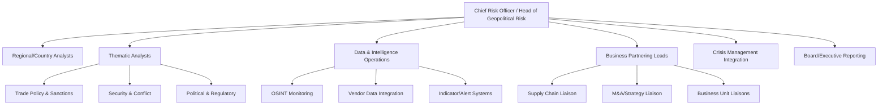
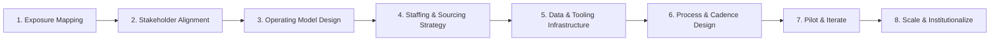
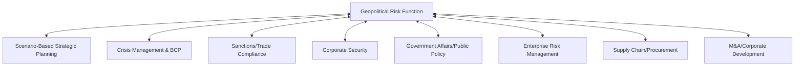

## Building an Internal Geopolitical Risk Function

### Purpose and Organizational Rationale

An internal geopolitical risk function is a dedicated organizational capability responsible for monitoring, analyzing, and advising on political, security, and policy developments that materially affect a firm's operations, assets, personnel, and strategy. Its purpose is to convert diffuse geopolitical signal into actionable input for business decisions — capital allocation, market entry/exit, supply chain design, and crisis response — rather than to produce geopolitical analysis as an end in itself.

Firms typically formalize this function when geopolitical exposure crosses a threshold where ad hoc, externally-sourced analysis (consultants, news monitoring by individual executives) becomes too slow, too generic, or too disconnected from the firm's specific asset footprint to support timely decisions.

**Key Points**

- The function's value is measured by decision influence, not analytical volume — a common early failure mode is producing reports that are read but not acted upon
- Distinct from (but must integrate with) corporate security, compliance/sanctions, government affairs, and enterprise risk management functions
- Scale and structure vary widely by firm size, industry exposure, and geographic footprint; there is no single universal organizational template

### Triggers for Establishing the Function

Organizations typically formalize a geopolitical risk function in response to one or more of the following:

- Expansion into higher-risk or strategically contested markets
- A material loss event (asset seizure, sanctions violation exposure, supply chain disruption from conflict)
- Increasing regulatory/sanctions complexity across multiple jurisdictions
- Board or investor pressure following a peer-firm incident or broader market volatility
- Growth in cross-border supply chain dependency creating concentrated geopolitical exposure

### Organizational Placement

There is no single correct reporting line; placement involves tradeoffs between independence, resourcing, and proximity to decision-making.

| Reporting Line | Advantages | Tradeoffs |
| --- | --- | --- |
| Chief Risk Officer / Enterprise Risk | Strong integration with formal risk governance, ERM frameworks | Can be treated as compliance-adjacent rather than strategic |
| Corporate Strategy | Close proximity to strategic decision-making, M&A, capital allocation | May be deprioritized relative to core strategy deliverables |
| General Counsel / Legal & Compliance | Strong linkage to sanctions, regulatory exposure | Risk of being perceived narrowly as a legal-compliance function |
| CEO/Board direct | Highest visibility and independence | Resourcing and staffing can be inconsistent without an operating home |
| Corporate Security | Strong linkage to physical risk, personnel safety | May underweight economic/financial/regulatory dimensions |

[Inference] Larger multinational firms with significant geopolitical exposure (extractives, defense, global finance, semiconductor supply chains) more frequently place this function at or near board/C-suite level with dual reporting lines (e.g., to both CRO and Corporate Strategy), while mid-size firms more often embed a smaller function within existing risk or security teams; this reflects general practitioner observation rather than a benchmarked industry census.

### Core Organizational Model

#### Core Roles

- **Head of Geopolitical Risk**: sets analytical priorities, owns escalation to leadership, translates geopolitical developments into business-relevant framing
- **Regional/country analysts**: deep subject-matter expertise on specific geographies aligned to the firm's asset footprint
- **Thematic analysts**: cross-regional expertise in specific risk domains (sanctions/trade policy, security/conflict, regulatory/political systems)
- **Data and intelligence operations**: manages monitoring infrastructure, vendor data feeds, and alerting systems (distinct analytical-support role, not primary analysis)
- **Business partnering leads**: embedded liaisons ensuring outputs reach the business units that need them (supply chain, M&A/strategy, specific business lines) in decision-relevant format and timing

Small or early-stage functions often collapse several of these roles into a single generalist team of 1–5 analysts; larger, more mature functions (particularly at large multinationals) can scale to dozens of staff with specialized regional and thematic coverage.

### Core Function Activities

#### Monitoring and Early Warning

Continuous tracking of political, security, and policy developments relevant to the firm's footprint, typically combining:

- **Open-source intelligence (OSINT)** monitoring: news, government statements, official gazettes, social media signal
- **Commercial risk intelligence vendors**: firms such as Verisk Maplecroft, Control Risks, Eurasia Group, S&P Global Market Intelligence, and similar providers offering country risk scoring, alerts, and analyst access
- **Government and multilateral sources**: state department travel advisories, sanctions lists (OFAC, EU, UK OFSI), UN/WTO reporting
- **Proprietary indicator systems**: firm-specific early warning indicators tied to scenario planning outputs (see Scenario-Based Corporate Strategic Planning), triggering review or escalation when thresholds are crossed

#### Analysis and Assessment

Core analytical outputs typically include:

- **Country/regional risk assessments**: structured periodic assessments of political stability, regulatory trajectory, and security conditions for markets where the firm operates or is considering entry
- **Issue-specific deep dives**: analysis of a specific development (e.g., an election outcome, a sanctions expansion, a trade policy shift) and its implications for the firm
- **Scenario and horizon-scanning products**: forward-looking analysis feeding into strategic planning cycles
- **Exposure mapping**: linking geopolitical risk factors to specific firm assets, revenue streams, supply chain nodes, and personnel locations — this mapping is what differentiates internal analysis from generic external geopolitical commentary

**Example**

Rather than producing a generic report titled "Tensions Rising in the South China Sea," a mature internal function would produce an assessment specifically identifying which of the firm's shipping routes, supplier facilities, or customer relationships in the region carry exposure, quantify the revenue or cost impact of specific disruption scenarios, and recommend concrete mitigation options (rerouting, inventory buffers, contract renegotiation) with owners and timelines.

#### Advisory and Decision Support

- **Structured input into capital allocation and M&A processes**: geopolitical risk assessment as a standing input alongside financial and commercial due diligence
- **Supply chain risk input**: informing sourcing diversification and nearshoring/friend-shoring decisions
- **Government affairs coordination**: aligning risk analysis with the firm's advocacy and engagement strategy
- **Board and executive briefing**: regular (often quarterly) briefings plus ad hoc escalation for acute developments

#### Crisis Support

The function typically feeds directly into the firm's crisis management structure (see Crisis Management and Business Continuity Planning) as the analytical/intelligence arm during acute events — providing situational awareness, monitoring developments in real time, and supporting the Crisis Management Team's decision-making, without itself holding crisis decision authority.

### Building the Function: Implementation Roadmap

#### Step 1: Exposure Mapping

Before building the function, map the firm's actual geopolitical exposure: physical assets, revenue concentration by geography, supply chain dependency nodes, personnel footprint, and regulatory/sanctions touchpoints. This mapping determines required regional/thematic coverage and prevents the function from being built around generic risk categories disconnected from the firm's actual footprint.

#### Step 2: Stakeholder Alignment

Secure sponsorship and define the function's mandate with key stakeholders (CEO, board risk committee, CFO, business unit heads) — clarifying what decisions the function is meant to inform, its escalation authority, and its relationship to existing risk, security, legal, and government affairs functions to avoid mandate overlap or gaps.

#### Step 3: Operating Model Design

Decide the balance between in-house capability and external vendor/consultant reliance. Common models:

- **Fully in-house**: maximum control and firm-specific tailoring, highest cost and slowest ramp-up
- **Hybrid**: core in-house team supplemented by commercial data feeds and on-demand external expert networks for depth on specific issues
- **Outsourced with internal coordinator**: minimal in-house headcount, a single internal role coordinating external providers and translating output for internal stakeholders

Most mature functions converge on a hybrid model: internal staff provide firm-specific exposure knowledge and business relationships, while external vendors provide broad monitoring infrastructure and specialized regional/thematic depth that would be inefficient to replicate internally.

#### Step 4: Staffing and Sourcing Strategy

Typical hiring pools include former government/intelligence analysts, area studies and international relations specialists, political risk consultancy alumni, and military/defense background hires for security-focused roles. [Inference] The relative mix of these backgrounds varies by industry — extractives and infrastructure firms often skew toward security/political risk consultancy backgrounds, while financial institutions more often hire from government economic/sanctions policy backgrounds — though I would treat this as a general pattern rather than a quantified hiring statistic.

#### Step 5: Data and Tooling Infrastructure

- Commercial risk intelligence platform subscriptions (country risk scoring, alerting)
- OSINT monitoring tools and social media/news aggregation platforms
- Sanctions/watchlist screening tools, often shared infrastructure with compliance functions
- Internal knowledge management system for exposure mapping, past assessments, and indicator tracking
- Integration with enterprise risk management (ERM) systems and dashboards for executive/board reporting

#### Step 6: Process and Cadence Design

- Standing reporting cadence (e.g., weekly monitoring digest, quarterly deep-dive briefings, ad hoc escalation protocol)
- Defined escalation thresholds and pathways into crisis management activation
- Formal integration points into capital allocation, M&A, and strategic planning calendars — geopolitical risk assessment should be a standing gate in these processes, not an optional add-on requested inconsistently

#### Step 7: Pilot and Iterate

Many functions begin with a narrow pilot scope (e.g., covering only the highest-exposure region or business line) to demonstrate decision impact before requesting broader resourcing — building internal credibility through demonstrated value ahead of full scale-out.

#### Step 8: Scale and Institutionalize

Expand regional/thematic coverage, formalize reporting lines and governance, and embed the function's outputs into standing business processes (board risk reporting, M&A due diligence checklists, supply chain review cycles) so its influence does not depend on individual relationships alone.

### Measuring Function Effectiveness

Effectiveness is difficult to quantify directly (geopolitical risk mitigation is inherently about avoided or reduced losses, which are hard to counterfactually measure), so most functions rely on a combination of leading and lagging indicators:

| Indicator Type | Examples |
| --- | --- |
| Process indicators | Assessment output timeliness, escalation response time, stakeholder engagement frequency |
| Decision-influence indicators | Number of capital allocation/M&A decisions with documented geopolitical risk input, business unit uptake of recommendations |
| Outcome indicators (lagging) | Reduced unplanned disruption cost, avoided losses in stress-tested scenarios, post-incident AAR findings on early-warning effectiveness |
| Stakeholder feedback | Executive/board satisfaction surveys, business unit perception of relevance and usefulness |

[Speculation] Attempts to build a single composite ROI metric for geopolitical risk functions are common in practitioner discussions but are inherently limited by the counterfactual measurement problem noted above; I would treat any specific ROI figure cited by a vendor or consultancy with caution absent transparent methodology.

### Common Organizational Pitfalls

- **Analysis without decision linkage**: reports produced on a standing cadence but not tied to specific decision processes, leading to the function being perceived as generating "interesting reading" rather than actionable input
- **Overreliance on generic commercial data without firm-specific exposure mapping**: country risk scores alone do not tell a firm which of its assets or contracts are actually exposed
- **Isolation from crisis management, security, and compliance functions**: duplicated effort or, worse, contradictory assessments reaching leadership from different functions during an acute event
- **Understaffing relative to mandate**: a function given broad global coverage responsibility without proportionate headcount, resulting in shallow, reactive output rather than proactive analysis
- **Misaligned reporting cadence**: monitoring output disconnected from the actual cadence of capital allocation or strategic planning decisions it is meant to inform
- **Conflating geopolitical risk with political opinion**: credibility damage when outputs are perceived as reflecting analyst political bias rather than rigorous, evidence-based assessment — mitigated by structured analytical methodologies (e.g., structured analytic techniques, red-teaming of assessments) and clear separation of analysis from advocacy

### Integration Points with Other Risk Disciplines

**Related Topics**

- Scenario-based corporate strategic planning (function's role generating driving-force and indicator inputs)
- Crisis management and business continuity planning (function's role in crisis support)
- Commercial geopolitical risk intelligence vendor landscape and evaluation criteria
- Structured analytic techniques for reducing analytical bias
- Sanctions and export control compliance program design
- Country risk assessment methodologies and scoring frameworks
- Supply chain exposure mapping and geopolitical risk-adjusted sourcing strategy
- Board-level risk governance and geopolitical risk reporting frameworks