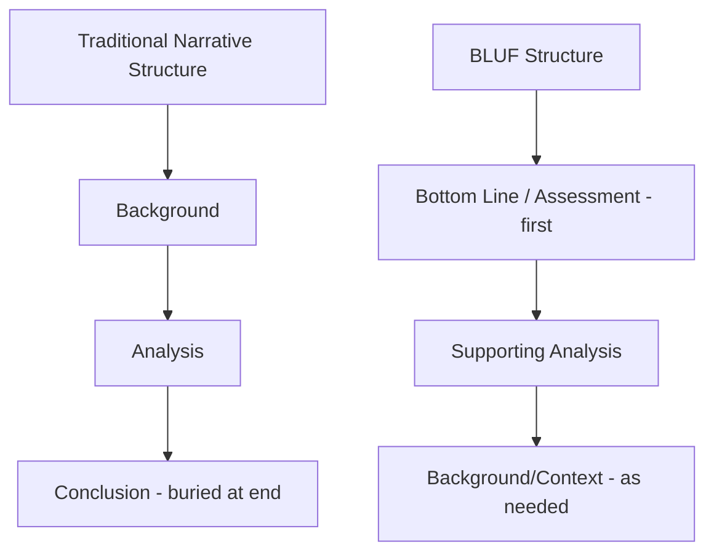

## Structuring an Effective Geopolitical Risk Report

### Purpose and Design Philosophy

A geopolitical risk report is a decision-support artifact, not a general-interest current-affairs briefing. Its structure should be optimized for the reader to extract the relevant conclusion and required action within seconds, with supporting analytical depth available for those who need it. This inverts the structure of most journalistic or academic writing, which builds toward a conclusion; effective risk reporting states the conclusion first (the "Bottom Line Up Front" principle) and then substantiates it.

**Key Points**

- Structure should match reader time constraints: an executive reads the first paragraph; an analyst reads the full document
- Every report should answer three questions explicitly: What is happening? Why does it matter to us? What should we do?
- Reports that fail to connect analysis to firm-specific exposure and recommended action are a leading cause of geopolitical risk functions being perceived as low-value (see Building an Internal Geopolitical Risk Function)

### The BLUF Principle (Bottom Line Up Front)

Originating in military and intelligence writing doctrine, BLUF structures place the most important conclusion — the assessment and its implication — in the first one to three sentences, before any supporting context or background.

**Example**

Weak (buried conclusion): "Following months of negotiations between the ruling coalition and opposition parties over electoral reform, and amid growing public demonstrations in the capital that have drawn international media attention, sources close to the government suggest that a snap election may be called as early as next quarter, which could result in..."

Strong (BLUF): "We assess a 60–70% likelihood of a snap election being called within the next quarter, which would trigger a 90-day regulatory freeze affecting our pending license renewal. Recommend accelerating renewal filing before any election announcement."

### Core Report Architecture

A standard structure, scalable from a one-page brief to a full assessment:

#### 1. Header/Metadata Block

- Title (specific, not generic — "Election-Driven Regulatory Freeze Risk: [Country]" rather than "Political Update: [Country]")
- Date and analyst/team attribution
- Classification/distribution level (internal use, board-only, etc.)
- Confidence level and time horizon of the assessment (see Structured Estimative Language below)

#### 2. Bottom Line / Key Judgment

One to three sentences containing the core assessment, its confidence level, and the primary implication for the firm. This section must be readable in isolation — many recipients will read only this section.

#### 3. Firm-Specific Impact Statement

Explicitly connects the development to the firm's assets, operations, revenue, personnel, or contracts. This is the section most frequently missing from weak reports, and the one that most differentiates internal geopolitical risk reporting from external commercial or media commentary.

**Example**

"This affects: (1) our manufacturing facility in [location] — est. 15% of regional production capacity; (2) the pending [contract name] renewal, valued at [magnitude]; (3) approximately [N] expatriate personnel currently assigned to the region."

#### 4. Key Judgments / Analysis

The substantive analytical content, typically organized as:

- What has changed or is changing (the development itself)
- Why it is happening (drivers, underlying dynamics)
- What happens next (trajectory, likely scenarios)
- Confidence and evidence basis for each judgment

#### 5. Scenario/Trajectory Outlook

Forward-looking outlook, often structured as base case / upside / downside scenarios rather than a single-point prediction, consistent with scenario planning principles (see Scenario-Based Corporate Strategic Planning). Each trajectory should carry an approximate likelihood band and associated indicators.

#### 6. Recommended Actions

Concrete, owned, time-bound recommendations — not generic statements like "continue to monitor." Each recommendation should specify what should be done, by whom, and by when.

**Example**

Weak: "The situation should be monitored closely and the business should remain prepared to respond."

Strong: "Recommend Treasury increase local-currency hedging coverage from 40% to 70% within two weeks (owner: Treasury); Supply Chain to confirm alternate routing capacity with backup logistics provider by [date] (owner: Supply Chain Lead)."

#### 7. Early Warning Indicators

Specific, observable indicators that would signal the situation is escalating or de-escalating, enabling readers to track developments between formal report updates without needing a new full report each time.

#### 8. Sourcing and Confidence Basis

Transparent note on the evidentiary basis for the assessment (open-source reporting, vendor intelligence, on-the-ground contacts, official statements), supporting reader calibration of how much weight to place on the judgment.

### Structured Estimative Language

A critical technical practice borrowed from intelligence analysis tradecraft: separating the *likelihood* of a judgment from the *confidence* in that judgment, and using standardized language so readers interpret probability terms consistently across reports and analysts.

#### Likelihood Language (Words of Estimative Probability)

| Probability Range | Standard Term |
| --- | --- |
| ~95-99% | Almost certain |
| ~80-95% | Highly likely / very likely |
| ~55-80% | Likely |
| ~45-55% | Roughly even chance |
| ~20-45% | Unlikely |
| ~5-20% | Highly unlikely / very unlikely |
| ~1-5% | Almost no chance |

[Inference] These specific percentage bands follow the widely-cited "Kesselman/Sherman kent" style probability-language framework used across intelligence community writing standards (formalized in various forms, including the ICD 203 standard in the US intelligence community); private-sector adoption often adapts these bands, and firms do not always adopt identical thresholds, so a specific report should always define its own scale explicitly rather than assume the reader shares an implicit standard.

#### Confidence Language (distinct from likelihood)

Confidence reflects the quality, consistency, and volume of the underlying evidence — a judgment can be stated as "likely" with either low or high confidence, and the two dimensions should never be conflated:

- **High confidence**: well-corroborated by multiple independent, credible sources
- **Moderate confidence**: credibly sourced but with some gaps, single-sourcing, or plausible alternative interpretations
- **Low confidence**: fragmentary, contradictory, or unverified sourcing; judgment should be treated as provisional

**Key Points**

- "Likely, high confidence" and "likely, low confidence" carry the same probability estimate but very different reliability — reports must convey both dimensions
- Analysts should explicitly flag when a judgment rests on a single source or unconfirmed reporting, resisting the temptation to present tentative information with false certainty

### Distinguishing Facts, Analysis, and Speculation

Effective reports typographically or structurally separate:

- **Established facts**: verifiable, sourced events (e.g., "the central bank raised interest rates by 200bps on [date]")
- **Analytical judgment**: the analyst's interpretation and forecast, clearly flagged as assessment rather than fact
- **Speculation/low-confidence inference**: explicitly labeled where evidence is thin, avoiding the common failure mode of presenting speculative claims with the same authoritative tone as documented facts

This separation protects both analytical credibility and decision quality — readers who cannot distinguish fact from inference in a report are prone to over-weighting speculative content in downstream decisions.

### Visual and Data Presentation

- **Risk heat maps**: likelihood-impact matrices for multiple concurrent risks, allowing at-a-glance prioritization across a portfolio of geopolitical exposures
- **Timeline graphics**: sequencing of key upcoming events (elections, sanctions deadlines, court rulings) relevant to the assessment window
- **Geographic/asset overlay maps**: physical exposure visualization overlaying firm assets against risk zones
- **Trend indicators**: simple directional arrows or trend lines showing whether a risk is escalating, stable, or de-escalating since the prior reporting period, allowing readers tracking a recurring risk to quickly identify change

#### Illustrative Risk Heat Map Structure

<svg xmlns="http://www.w3.org/2000/svg" viewBox="0 0 620 460" font-family="Arial, sans-serif">
<text x="310" y="26" text-anchor="middle" font-size="16" font-weight="bold">Risk Heat Map Structure (svg_diagram)</text>
<line x1="100" y1="400" x2="580" y2="400" stroke="#333" stroke-width="2" />
<line x1="100" y1="400" x2="100" y2="60" stroke="#333" stroke-width="2" />
<text x="340" y="430" text-anchor="middle" font-size="12" font-weight="bold">Likelihood →</text>
<text x="40" y="230" text-anchor="middle" font-size="12" font-weight="bold" transform="rotate(-90 40 230)">Impact →</text>
<rect x="100" y="313" width="160" height="87" fill="#c6e7c6" />
<rect x="260" y="313" width="160" height="87" fill="#f4e28a" />
<rect x="420" y="313" width="160" height="87" fill="#f4c28a" />
<rect x="100" y="227" width="160" height="86" fill="#f4e28a" />
<rect x="260" y="227" width="160" height="86" fill="#f4c28a" />
<rect x="420" y="227" width="160" height="86" fill="#f2a3a3" />
<rect x="100" y="140" width="160" height="87" fill="#f4c28a" />
<rect x="260" y="140" width="160" height="87" fill="#f2a3a3" />
<rect x="420" y="140" width="160" height="87" fill="#e57373" />
<rect x="100" y="60" width="160" height="80" fill="#f2a3a3" />
<rect x="260" y="60" width="160" height="80" fill="#e57373" />
<rect x="420" y="60" width="160" height="80" fill="#c0392b" />

<text x="180" y="416" text-anchor="middle" font-size="11">Low</text>

<text x="340" y="416" text-anchor="middle" font-size="11">Medium</text>

<text x="500" y="416" text-anchor="middle" font-size="11">High</text>

<text x="90" y="360" text-anchor="end" font-size="11">Low</text>

<text x="90" y="273" text-anchor="end" font-size="11">Medium</text>

<text x="90" y="187" text-anchor="end" font-size="11">High</text>

<text x="90" y="103" text-anchor="end" font-size="11">Critical</text>

<circle cx="500" cy="90" r="6" fill="#000" />
<text x="512" y="94" font-size="10">Risk A (this period)</text>
<circle cx="340" cy="187" r="6" fill="#000" fill-opacity="0.5" />
<text x="352" y="191" font-size="10">Risk B</text>
<circle cx="180" cy="360" r="6" fill="#000" fill-opacity="0.5" />
<text x="192" y="364" font-size="10">Risk C</text>
</svg>

### Report Cadence and Tiering

Reports are typically tiered by urgency and scope rather than produced in a single uniform format:

| Report Type | Cadence | Length | Purpose |
| --- | --- | --- | --- |
| Flash alert | Ad hoc, event-triggered | 1 paragraph–half page | Immediate notification of a significant, time-sensitive development |
| Weekly monitoring digest | Weekly | 1-2 pages | Ongoing situational awareness across tracked risks |
| Deep-dive assessment | As needed / monthly-quarterly | 3-10 pages | Substantive analysis of a specific issue or market |
| Quarterly/board briefing | Quarterly | Varies (often slide format) | Strategic-level synthesis for senior leadership/board |
| Scenario/outlook report | Semi-annual/annual | Extended | Forward-looking strategic planning input |

**Key Points**

- Flash alerts should be structurally minimal (BLUF plus immediate action item) — added analytical depth can wait for a follow-up product
- Board-level materials typically compress analytical detail into visual summary formats (heat maps, one-line-per-risk tables) with detailed analysis available as appendix or on request
- Report tiering should map to the organizational escalation structure defined in the firm's crisis management framework (see Crisis Management and Business Continuity Planning) so that flash alerts feed directly into activation decision processes when thresholds are crossed

### Tailoring Reports to Audience

| Audience | Emphasis | Format Tendency |
| --- | --- | --- |
| Board/C-suite | Strategic implication, financial materiality, recommended decision | Highly condensed, visual, BLUF-dominant |
| Business unit/operational leaders | Specific operational impact, concrete action items | Moderate length, operationally focused |
| Legal/compliance | Regulatory/sanctions exposure, documentation for disclosure obligations | Precise, source-documented, conservative language |
| Treasury/finance | Financial/FX/liquidity impact, quantified exposure | Data-heavy, scenario-quantified |
| Analyst/specialist peers | Full analytical reasoning, methodology, source evaluation | Longest form, most technical |

[Inference] Producing genuinely distinct audience-tailored versions of the same underlying assessment (rather than a single report sent to all audiences) is generally considered a mark of a more mature reporting function, since single-format-for-all-audiences reporting tends to either overwhelm executive readers or under-serve specialist ones; this reflects practitioner consensus rather than a formally benchmarked finding.

### Common Structural Pitfalls

- **Burying the assessment**: leading with narrative background rather than BLUF, forcing time-constrained readers to search for the conclusion
- **Missing firm-specific linkage**: reporting geopolitical developments without connecting them to the firm's actual exposure, reading as generic news commentary
- **Conflating likelihood and confidence**: stating a probability without conveying how well-evidenced that probability estimate actually is
- **Vague recommendations**: "monitor the situation" without an owner, specific trigger, or timeline provides no actionable decision support
- **Overlength for the audience**: sending a 10-page analytical deep-dive to a board that needs a one-paragraph strategic summary, reducing the likelihood the report is read in full
- **Inconsistent estimative language across analysts**: different analysts using "likely" to mean different probability ranges undermines cross-report comparability and reader calibration over time
- **Static reporting with no update discipline**: initial assessment issued but not revisited as the situation evolves, leaving decision-makers to act on stale judgments

### Report Review and Quality Control

Mature reporting functions typically implement structured review processes:

- **Peer review**: a second analyst reviews the assessment for logical consistency, source quality, and clarity before distribution
- **Red-teaming**: a structured devil's-advocate review specifically challenging the primary judgment and testing alternative explanations, reducing confirmation bias and groupthink risk
- **Editorial/style consistency review**: ensuring estimative language, formatting, and structure remain consistent across analysts and over time, supporting the cross-report comparability noted above

**Related Topics**

- Structured analytic techniques (Analysis of Competing Hypotheses, red-teaming, devil's advocacy)
- Building an internal geopolitical risk function (organizational context producing these reports)
- Scenario-based corporate strategic planning (scenario/outlook report integration)
- Crisis management and business continuity planning (flash alert escalation linkage)
- Risk heat map and quantitative risk scoring methodologies
- Briefing senior executives and boards on geopolitical risk
- Intelligence community writing tradecraft and estimative language standards (e.g., ICD 203)
- Data visualization best practices for risk communication