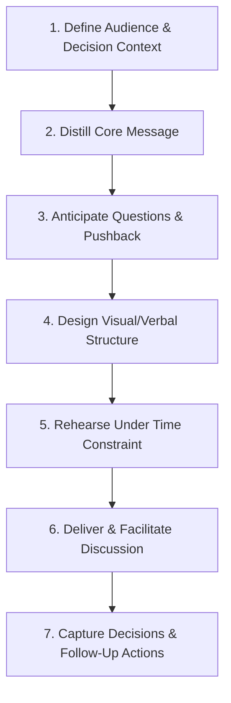

## Executive Briefing and Stakeholder Communication

### Purpose and Distinction from Written Reporting

Executive briefing is the live, interactive complement to written geopolitical risk reporting (see Structuring an Effective Geopolitical Risk Report). Where a written report is read asynchronously and at the recipient's own pace, a briefing is a synchronous, time-boxed interaction where the analyst must convey the core judgment, defend it under real-time questioning, and translate it into decision-relevant terms for an audience with limited geopolitical subject-matter background but deep authority to act.

**Key Points**

- Briefings are judged on decision impact and clarity under time pressure, not analytical comprehensiveness
- The briefer, not the written material, carries primary responsibility for audience comprehension in a live setting
- Different stakeholder audiences (board, C-suite, business unit leaders, investors, government counterparts) require materially different framing, even when the underlying analysis is identical

### The Briefing Preparation Process

#### Step 1: Define Audience and Decision Context

Before content development, clarify: What decision is this briefing meant to inform? Who in the room has actual decision authority versus advisory presence? What does the audience already know, and what are their likely existing assumptions or biases about the topic? Briefings prepared without a clear decision context tend to drift into general education, consuming limited executive time without producing action.

#### Step 2: Distill the Core Message

Executive attention spans for any single topic in a multi-item meeting are typically measured in minutes. The briefer must identify the single most important judgment and its implication, discarding secondary findings that do not change the decision at hand — a much more aggressive filtering process than is typically applied to written reports.

**Example**

An analyst may have a rich 8-page written assessment on a regulatory change, but the executive briefing might compress to: "We assess it is highly likely, with high confidence, that the new foreign investment screening law passes next month. This would delay our joint venture closing by an estimated 4-6 months. We recommend we begin parallel-path discussions with the alternate partner now, at low incremental cost, to preserve optionality."

#### Step 3: Anticipate Questions and Pushback

Executives commonly probe: How confident are we, and why? What's the worst case? What are our competitors doing? What does this cost us if we act, and what does it cost us if we don't? Preparing structured, concise answers to these predictable questions in advance prevents the briefer from being caught improvising under scrutiny, which can undermine credibility even when the underlying analysis is sound.

#### Step 4: Design Visual and Verbal Structure

Live briefings favor different visual density than written reports — fewer words per slide/page, larger visual elements (heat maps, simple trend arrows, timelines), and verbal elaboration carrying more of the analytical nuance than the visual material itself.

#### Step 5: Rehearse Under Time Constraint

Briefings should be rehearsed to fit materially under the allotted time, reserving the majority of the slot for questions and discussion rather than monologue delivery — a live briefing that consumes its full allotted time in delivery, leaving no room for executive questions, has generally failed at its interactive purpose.

#### Step 6: Deliver and Facilitate Discussion

The briefer's role during delivery extends beyond presenting content to facilitating a productive discussion — reading the room, adjusting depth based on questions asked, and steering discussion back toward the decision at hand if it drifts into tangential territory.

#### Step 7: Capture Decisions and Follow-Up

A briefing without documented outcomes (decisions made, follow-up actions assigned, open questions requiring further analysis) loses much of its value. Structured capture and circulation of a brief follow-up summary is standard practice among mature risk functions.

### The BLUF Principle in Verbal Delivery

The Bottom-Line-Up-Front structure applies even more strictly to verbal briefings than written reports, because a live audience cannot skim ahead to find the conclusion. A well-structured verbal briefing opens with the assessment and its implication in the first 15-30 seconds, before any context-setting or background.

### Audience-Specific Briefing Design

#### Board of Directors

- Emphasis on strategic and fiduciary materiality, not operational detail
- Framing typically ties to enterprise risk management categories the board already tracks, situating the geopolitical issue within familiar risk governance language
- Time allocation is often severely constrained (a single geopolitical risk item may receive 5-10 minutes within a broader board agenda), demanding maximal message compression
- Materials should anticipate board members' fiduciary and disclosure concerns (e.g., "does this require an SEC disclosure consideration") even if the briefer is not personally the disclosure decision-maker

#### C-Suite / Executive Committee

- Greater tolerance for operational and financial detail than board settings, but still time-constrained
- Framing should explicitly connect to metrics the executive already owns (e.g., CFO: cash flow/liquidity impact; COO: operational continuity impact; CHRO: personnel safety and workforce impact)
- More opportunity for interactive back-and-forth and scenario discussion than board settings

#### Business Unit / Operational Leaders

- Highest tolerance for specific, ground-level operational detail
- Framing should translate geopolitical analysis into operational triggers and thresholds relevant to their specific function (supply chain rerouting triggers, hiring freezes, contract renegotiation timing)
- Often the audience most capable of surfacing on-the-ground information that refines the analyst's assessment — briefings with this audience should be genuinely two-way, not purely one-directional delivery

#### Investors and Analysts (Public Disclosure Context)

- Subject to securities law disclosure constraints; content must typically be reviewed by legal/investor relations before external communication
- Framing emphasizes materiality thresholds and previously-disclosed risk factor language, avoiding new material non-public information disclosure outside sanctioned channels
- [Inference] The specific disclosure review workflow and materiality threshold determination process varies by jurisdiction and by the firm's own disclosure controls policy; this is a legal/compliance determination that should not be treated as a standardized cross-jurisdictional process, and geopolitical risk analysts are generally not the appropriate final decision-maker on public disclosure materiality.

#### Government and External Stakeholders

- Distinct register: government counterparts, industry associations, and other external parties require careful calibration of what internal analysis can be shared, often mediated through government affairs/public policy functions rather than delivered directly by risk analysts
- Framing typically shifts from "what should we do" (internal) to "what is the shared interest or common ground" (external), reflecting the different objective of external engagement versus internal decision support

### Handling Uncertainty and Pushback in Live Settings

Executives frequently push for greater certainty than the underlying analysis supports ("just tell me yes or no"). Effective briefers maintain analytical integrity while remaining decision-useful:

- Restate the confidence and likelihood framing explicitly rather than collapsing it into false certainty under pressure (see estimative language standards in Structuring an Effective Geopolitical Risk Report)
- Reframe "how certain are you" questions toward decision-relevant framing: "even under our lower-confidence downside scenario, the recommended action remains the same because..." — demonstrating that the recommendation is robust to residual uncertainty, which is often more reassuring to executives than a false point-estimate
- Distinguish explicitly between what is known, what is assessed, and what remains genuinely unknown when directly challenged, rather than defaulting to hedged non-answers that fail to serve the decision need

**Key Points**

- Maintaining calibrated honesty about uncertainty under executive pressure to "just give me a number" is a core professional skill distinguishing credible risk analysts from those who erode trust by overpromising certainty
- Analysts should avoid the opposite failure mode as well — excessive hedging that provides no actionable guidance is itself a communication failure, not evidence of rigor

### Crisis-Mode Briefing Cadence

During active crisis events (see Crisis Management and Business Continuity Planning), briefing cadence and format shift substantially from steady-state reporting:

| Dimension | Steady-State Briefing | Crisis-Mode Briefing |
| --- | --- | --- |
| Frequency | Weekly/monthly/quarterly | Hourly to daily, tied to battle rhythm |
| Length | Structured, moderate depth | Extremely compressed, situation-update format |
| Format | Scheduled meeting, prepared materials | Often ad hoc, verbal, minimal slides |
| Focus | Trend and strategic implication | Immediate situational awareness and next decision point |
| Attendee set | Standing governance audience | Crisis Management Team, expanded/contracted as needed |

### Written Support Materials for Briefings

- **One-pager/leave-behind**: condensed written summary distributed before or after the briefing, allowing executives to reference key points without needing to recall verbal delivery
- **Slide deck**: visual support material, generally minimal-text and visually led (heat maps, timelines, trend indicators) rather than dense paragraph text
- **Pre-read**: optional longer written material circulated in advance for executives who prefer to arrive with background already absorbed, allowing the live session to focus on discussion rather than initial exposition

[Inference] Practice varies on whether pre-reads are effective in practice; some practitioners report that pre-reads are frequently unread before executive meetings given time constraints, in which case the live briefing must be able to stand fully on its own without assuming the pre-read was absorbed — this is a commonly cited practitioner caution rather than a formally studied finding.

### Common Pitfalls in Executive Briefing

- **Leading with background/context instead of the assessment**: consuming limited time before reaching the point that matters to the decision
- **Overloading slides with text**: verbal delivery should carry nuance; dense text-heavy slides compete with the briefer for audience attention rather than supporting delivery
- **Insufficient preparation for pushback**: appearing unprepared for predictable executive questions undermines credibility regardless of underlying analytical quality
- **Failure to translate into the audience's own metrics and vocabulary**: presenting geopolitical analysis in geopolitical terms rather than the financial, operational, or strategic terms the specific audience already thinks in
- **No clear recommended action**: briefings that describe a risk without a recommendation leave executives to independently derive next steps, reducing the briefing's decision value
- **Not capturing and circulating outcomes**: decisions made in the room are lost or inconsistently remembered without structured follow-up documentation
- **False certainty under pressure**: collapsing calibrated uncertainty into an oversimplified answer to satisfy executive demand for certainty, which can produce poor decisions if the situation later diverges from the falsely-certain framing

### Building Long-Term Stakeholder Trust

Briefing effectiveness compounds over repeated interactions — stakeholder trust in a risk function's judgment is built cumulatively through a track record of calibrated, decision-useful communication rather than through any single briefing:

- **Track record transparency**: periodically revisiting past assessments against actual outcomes, openly acknowledging both accurate and inaccurate prior judgments, builds long-term credibility more effectively than only highlighting successes
- **Consistency of estimative language**: stakeholders learn to interpret an analyst's or function's calibration over time only if probability and confidence language is used consistently across briefings
- **Appropriate humility paired with decisiveness**: stakeholders trust functions that are honest about uncertainty while still willing to make clear, actionable recommendations — the combination, rather than either trait alone, is what sustains credibility over repeated engagements

**Related Topics**

- Structuring an effective geopolitical risk report (written counterpart to briefings)
- Structured estimative language and confidence communication under pressure
- Crisis communications planning and crisis-mode briefing cadence
- Board-level risk governance and fiduciary reporting obligations
- Securities disclosure materiality and investor relations coordination
- Building an internal geopolitical risk function (organizational context for briefing practice)
- Facilitation and executive presence skills for technical briefers
- Post-event track record review and calibration assessment