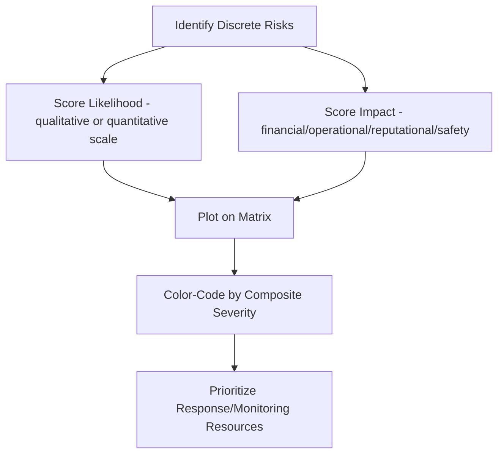
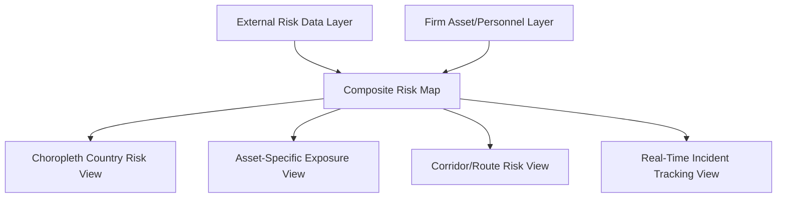

## Visualizing Risk Through Maps and Risk Matrices

### Purpose of Risk Visualization

Visualization converts multidimensional, often qualitative geopolitical risk assessments into forms that support rapid comparison, prioritization, and pattern recognition — tasks that dense prose handles poorly. Two visualization families dominate geopolitical risk communication: **geographic visualization** (maps), which conveys spatial distribution and asset exposure, and **matrix visualization** (risk matrices/heat maps), which conveys relative prioritization across a portfolio of discrete risks. Effective risk communication typically uses both in combination, since neither format alone answers all the questions a decision-maker needs answered.

**Key Points**

- Maps answer "where is this risk, and what of ours sits there?"
- Matrices answer "how does this risk compare in priority to our other risks?"
- Both are compression tools — they necessarily discard analytical nuance in exchange for rapid comprehension, which creates specific, well-documented failure modes discussed below
- Visualization should never replace the underlying written or verbal analysis; it is a navigation aid into that analysis, not a substitute for it

### Risk Matrices

#### Basic Structure

A risk matrix (heat map) plots discrete risks on two axes — typically **likelihood** and **impact** — with color-coded cells indicating relative priority (commonly green/yellow/orange/red, low to critical).

#### Axis Design

- **Likelihood axis**: typically a 3-5 point ordinal scale (e.g., rare/unlikely/possible/likely/almost certain), sometimes mapped to explicit probability bands consistent with the firm's estimative language standard (see Structuring an Effective Geopolitical Risk Report)
- **Impact axis**: typically also ordinal (negligible/minor/moderate/major/severe), but impact for geopolitical risk is frequently multidimensional — financial, operational, personnel safety, regulatory/legal, and reputational impact do not always move together, which creates a common design problem addressed below

#### The Multidimensional Impact Problem

A single geopolitical event can carry very different severities across impact categories — a regulatory delay might be financially minor but reputationally significant, while a security incident might be financially minor but carry severe personnel safety implications. Common design solutions:

- **Composite scoring**: combine dimensions into a single impact score via weighted formula, sacrificing dimensional detail for simplicity
- **Multiple matrices**: produce separate matrices per impact dimension (financial matrix, safety matrix, reputational matrix), preserving detail at the cost of requiring the reader to synthesize across multiple visuals
- **Worst-dimension scoring**: impact score reflects the single highest-severity dimension, ensuring high-severity risks in any category are never diluted by averaging against lower-severity dimensions — commonly used where safety or existential risks must never be obscured by netting against merely financial considerations

$$I_{composite} = \max(I_{financial}, I_{operational}, I_{safety}, I_{regulatory}, I_{reputational})$$

[Inference] The choice among these approaches is a design decision that varies by firm risk culture and regulatory context rather than having a single correct standard; firms in safety-critical industries more frequently favor worst-dimension scoring specifically to prevent safety risk from being diluted by composite averaging, though I would treat this as a general pattern rather than a documented industry-wide rule.

#### Illustrative Matrix Layout

<svg xmlns="http://www.w3.org/2000/svg" viewBox="0 0 640 480" font-family="Arial, sans-serif">
<text x="320" y="26" text-anchor="middle" font-size="16" font-weight="bold">5x5 Risk Matrix Layout (svg_diagram)</text>
<line x1="110" y1="420" x2="600" y2="420" stroke="#333" stroke-width="2" />
<line x1="110" y1="420" x2="110" y2="60" stroke="#333" stroke-width="2" />
<text x="355" y="450" text-anchor="middle" font-size="12" font-weight="bold">Likelihood →</text>
<text x="45" y="240" text-anchor="middle" font-size="12" font-weight="bold" transform="rotate(-90 45 240)">Impact →</text>
<rect x="110" y="348" width="98" height="72" fill="#a9d18e" />
<rect x="208" y="348" width="98" height="72" fill="#a9d18e" />
<rect x="306" y="348" width="98" height="72" fill="#ffe699" />
<rect x="404" y="348" width="98" height="72" fill="#ffe699" />
<rect x="502" y="348" width="98" height="72" fill="#f4b183" />
<rect x="110" y="276" width="98" height="72" fill="#a9d18e" />
<rect x="208" y="276" width="98" height="72" fill="#ffe699" />
<rect x="306" y="276" width="98" height="72" fill="#ffe699" />
<rect x="404" y="276" width="98" height="72" fill="#f4b183" />
<rect x="502" y="276" width="98" height="72" fill="#f4b183" />
<rect x="110" y="204" width="98" height="72" fill="#ffe699" />
<rect x="208" y="204" width="98" height="72" fill="#ffe699" />
<rect x="306" y="204" width="98" height="72" fill="#f4b183" />
<rect x="404" y="204" width="98" height="72" fill="#f4b183" />
<rect x="502" y="204" width="98" height="72" fill="#e06666" />
<rect x="110" y="132" width="98" height="72" fill="#ffe699" />
<rect x="208" y="132" width="98" height="72" fill="#f4b183" />
<rect x="306" y="132" width="98" height="72" fill="#f4b183" />
<rect x="404" y="132" width="98" height="72" fill="#e06666" />
<rect x="502" y="132" width="98" height="72" fill="#e06666" />
<rect x="110" y="60" width="98" height="72" fill="#f4b183" />
<rect x="208" y="60" width="98" height="72" fill="#f4b183" />
<rect x="306" y="60" width="98" height="72" fill="#e06666" />
<rect x="404" y="60" width="98" height="72" fill="#e06666" />
<rect x="502" y="60" width="98" height="72" fill="#c00000" />

<text x="159" y="435" text-anchor="middle" font-size="10">Rare</text>

<text x="257" y="435" text-anchor="middle" font-size="10">Unlikely</text>

<text x="355" y="435" text-anchor="middle" font-size="10">Possible</text>

<text x="453" y="435" text-anchor="middle" font-size="10">Likely</text>

<text x="551" y="435" text-anchor="middle" font-size="10">Almost Certain</text>

<text x="100" y="388" text-anchor="end" font-size="10">Negligible</text>

<text x="100" y="316" text-anchor="end" font-size="10">Minor</text>

<text x="100" y="244" text-anchor="end" font-size="10">Moderate</text>

<text x="100" y="172" text-anchor="end" font-size="10">Major</text>

<text x="100" y="100" text-anchor="end" font-size="10">Severe</text>

</svg>

#### Known Limitations of Risk Matrices

Risk matrices are widely used but carry well-documented methodological criticisms that a technically literate practitioner should understand:

- **False precision**: color-coded cells imply a rigor the underlying qualitative scoring often does not possess, particularly when likelihood/impact ratings are subjective analyst judgments rather than statistically derived
- **Range compression at boundaries**: risks near a cell boundary can be discontinuously reclassified (e.g., from yellow to red) based on marginal scoring differences, creating an illusion of a sharp threshold that does not reflect real-world risk continuity
- **Poor handling of correlated risks**: matrices typically treat risks as independent, but geopolitical risks are frequently correlated or cascading (a currency crisis increasing the likelihood of political instability); simple matrices do not visually convey these interdependencies
- **Risk aggregation problems**: a matrix showing individual risks does not indicate portfolio-level aggregate exposure — several "medium" risks concentrated in a single geography or asset can represent a "severe" aggregate exposure the matrix does not surface
- **Vulnerability to inconsistent scoring across analysts**: without calibration training and consistent scoring rubrics, different analysts populate matrices with systematically different severity judgments, undermining comparability across the risk portfolio

[Inference] These critiques are well-established in the risk management academic and practitioner literature (particularly associated with critiques of qualitative risk matrices in safety-critical industries), though the degree to which any given organization's matrix suffers from these specific flaws depends on its scoring methodology and analyst calibration practices, which I cannot assess in general terms.

#### Mitigating Matrix Limitations

- **Calibration training**: structured analyst training and periodic inter-rater reliability checks to reduce scoring inconsistency across analysts
- **Quantitative anchoring**: defining scale bands with explicit numeric or financial thresholds (e.g., "major impact = greater than $50M revenue exposure") rather than leaving severity levels to unanchored subjective judgment
- **Trend/directional overlay**: adding arrows or movement indicators showing whether a risk has moved cells since the prior period, partially addressing the static-snapshot limitation
- **Correlation/cluster annotation**: supplementing the matrix with narrative or a secondary network diagram highlighting known risk correlations not visible in the grid format itself
- **Portfolio aggregation view**: supplementing individual-risk matrices with a geography- or asset-level rollup showing cumulative exposure concentration

### Geographic Risk Maps

#### Core Map Types

- **Choropleth risk maps**: countries or regions shaded by an aggregate risk score (political stability index, security risk rating), providing a broad comparative overview across a firm's full geographic footprint
- **Asset overlay maps**: firm-specific facilities, offices, supply chain nodes, and personnel locations plotted directly onto risk-relevant geographic layers (conflict zones, sanctions jurisdictions, natural hazard zones), directly connecting external risk data to firm exposure
- **Route/corridor maps**: shipping lanes, pipeline routes, and logistics corridors overlaid with chokepoint and disruption risk, particularly relevant for supply chain-dependent geopolitical exposure
- **Dynamic/real-time tracking maps**: live-updating maps showing personnel locations (via travel risk management systems), in-transit shipments, or unfolding incident geography during active crisis events

#### Data Sources for Geographic Risk Maps

- Commercial risk intelligence vendor country-level indices (e.g., political stability, conflict intensity, regulatory risk scoring)
- Government travel advisory levels and consular data
- Conflict event databases (e.g., ACLED-style event-level conflict tracking) for granular sub-national resolution rather than country-level averages
- Firm-internal asset registries, supply chain mapping data, and personnel location/travel systems

**Key Points**

- Country-level (choropleth) resolution can obscure significant sub-national variation — a country with a "moderate" aggregate risk score may have both very low-risk and very high-risk regions within its borders, which is why granular, sub-national event-level data sources are often layered beneath national averages for operationally meaningful mapping
- Map utility depends entirely on the quality of the underlying asset/exposure layer — a sophisticated external risk data layer provides limited decision value if the firm's own asset location data is incomplete or outdated

#### Design Considerations for Maps

- **Color scale consistency**: risk severity color scales should match the conventions used in the firm's matrices (e.g., the same green-to-red gradient) to support intuitive cross-referencing between map and matrix products
- **Appropriate zoom/resolution**: strategic/board-level maps typically show global or regional overview; operational maps for specific business units zoom to asset- or facility-level detail
- **Avoiding data staleness signals**: maps should clearly date-stamp the underlying data, since geographic risk visualizations are particularly prone to being reused past their currency without the viewer realizing the underlying conditions have since changed
- **Legend and methodology transparency**: given the well-documented risk of overinterpreting visually simple color-coded maps, clear legends and brief methodology notes help prevent readers from over-trusting apparent precision in the underlying risk scoring

### Combining Maps and Matrices in a Reporting Workflow

A common integrated workflow: the geographic map identifies *where* firm exposure and elevated risk conditions intersect; the risk matrix then prioritizes the *specific discrete risks* identified within those geographies for resource allocation and monitoring attention. Neither visualization alone typically answers both the "where" and "how urgent" questions a decision-maker needs.

**Example**

A board briefing might open with a global asset overlay map highlighting three facilities located in elevated-risk regions, then transition to a risk matrix plotting the five most significant specific risks affecting those three facilities (e.g., currency controls, labor unrest, border closure risk, regulatory nationalization risk, security incident risk), allowing the board to see both the geographic concentration of exposure and the relative priority among the specific threats.

### Software and Tooling Landscape

- **GIS platforms**: ArcGIS, QGIS (open-source) for building custom choropleth and asset-overlay maps from underlying risk and asset data
- **Commercial risk intelligence platform dashboards**: many vendors (Verisk Maplecroft, Control Risks, Dataminr, and similar) provide built-in mapping and matrix visualization tools integrated with their proprietary risk scoring data, reducing the need for firms to build custom GIS pipelines
- **Business intelligence tools**: Power BI, Tableau commonly used to build interactive internal risk matrices and dashboards that integrate firm-specific asset and exposure data with externally sourced risk scores
- **Real-time tracking platforms**: specialized travel risk management and crisis tracking software (e.g., integrated with duty-of-care programs, see Crisis Management and Business Continuity Planning) for live personnel and asset location tracking during active events

[Unverified] Specific product feature comparisons and current pricing across these platforms change frequently and are best verified directly against current vendor documentation rather than treated as fixed technical specifications, since vendor capabilities in this space evolve on a roughly annual product cycle.

### Common Pitfalls in Risk Visualization

- **False precision and overconfidence in color-coded outputs**: treating a heat map cell placement as more rigorous than the underlying subjective scoring actually supports
- **Static snapshots presented as current**: reusing a map or matrix from a prior period without clear date-stamping, misleading readers about the currency of the assessment
- **Ignoring risk correlation and aggregation**: a matrix or map showing individually moderate risks without surfacing that they are correlated or geographically concentrated, understating true portfolio exposure
- **Inconsistent scoring across time or analysts**: undermining the ability to meaningfully compare current risk position against prior periods or across different risk categories
- **Visualization without narrative support**: presenting a map or matrix in isolation without the accompanying analytical narrative needed to interpret and act on it, particularly risky given the well-documented tendency of visual risk tools to be over-trusted at face value
- **Overloading a single visual with too much information**: attempting to convey likelihood, impact, trend, correlation, and financial magnitude all within one matrix cell, producing a visual too dense to parse quickly — defeating the core purpose of visualization as a rapid-comprehension tool

**Related Topics**

- Structuring an effective geopolitical risk report (integration of visuals into written reporting)
- Executive briefing and stakeholder communication (visual design for live delivery)
- Country risk assessment methodologies and scoring frameworks
- Structured estimative language and calibration of qualitative risk scoring
- GIS and geospatial technology fundamentals
- Travel risk management and real-time personnel tracking systems
- Risk aggregation and portfolio-level exposure analysis
- Data visualization best practices and common misinterpretation pitfalls