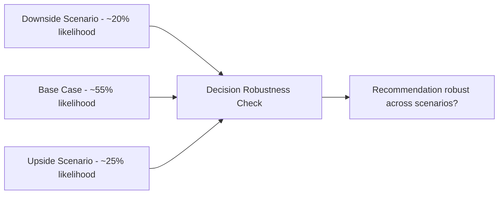
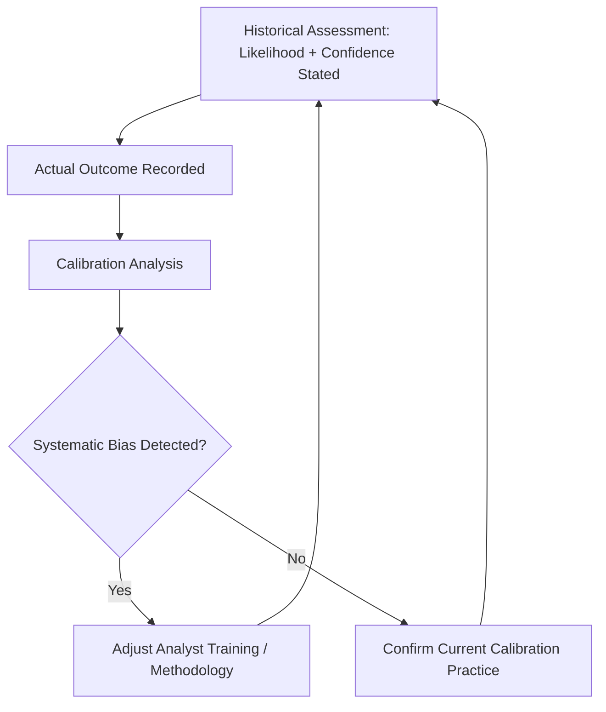

## Communicating Uncertainty and Confidence Levels

### Why Uncertainty Communication Is a Distinct Discipline

Geopolitical risk analysis rarely produces certainty — outcomes depend on the decisions of political actors, the interaction of multiple unpredictable variables, and information environments that are incomplete or deliberately obscured. The discipline of communicating uncertainty is concerned with a specific technical problem: how to convey genuine epistemic uncertainty to decision-makers in a way that is precise, consistently interpretable, and actionable, rather than either false precision (unwarranted certainty) or unhelpful vagueness (hedging so extensive that no actionable judgment is conveyed).

**Key Points**

- Analytical rigor and decision-usefulness are not in tension when uncertainty communication is done well — the goal is calibrated confidence, not maximal caution
- Two failure modes bound this discipline: overconfidence (stating judgments more definitively than evidence supports) and excessive hedging (refusing to commit to any assessable judgment)
- This is a bidirectional communication problem: the analyst must both accurately represent their own uncertainty, and the recipient must correctly interpret that representation — failure at either end degrades decision quality

### Two Distinct Dimensions: Likelihood and Confidence

A foundational technical distinction, introduced in Structuring an Effective Geopolitical Risk Report, warrants deeper treatment here because it is the single most common source of miscommunication in geopolitical risk products.

- **Likelihood**: the probability that a given outcome occurs
- **Confidence**: the analyst's certainty in that probability estimate, driven by the quality, volume, and consistency of underlying evidence

These are orthogonal. A judgment can occupy any combination:

|  | Low Confidence | High Confidence |
| --- | --- | --- |
| **High Likelihood** | "Likely, but based on thin/single-source evidence — treat as provisional" | "Likely, well-corroborated across multiple independent sources" |
| **Low Likelihood** | "Unlikely, but based on thin/single-source evidence — treat as provisional" | "Unlikely, well-corroborated across multiple independent sources" |

**Example**

"We assess it is likely (55-80% probability) that the new tariff schedule will be delayed, based on a single unconfirmed source within the trade ministry — low confidence" carries a fundamentally different decision implication than "We assess it is likely that the tariff schedule will be delayed, based on the ministry's own public statement, corroborated by two independent industry sources and consistent with the government's stated fiscal timeline — high confidence." A reader acting on the first judgment should build more contingency and monitoring into their response than a reader acting on the second, even though both carry the identical likelihood label.

### Standardized Estimative Language

#### Words of Estimative Probability

Consistent, pre-defined probability language prevents the well-documented problem (identified in intelligence tradecraft literature going back to Sherman Kent's foundational work) that different readers interpret words like "likely" or "probable" as corresponding to very different numeric probability ranges absent an explicit shared scale.

| Term | Typical Probability Range |
| --- | --- |
| Almost certain | ~95-99% |
| Highly likely / very likely | ~80-95% |
| Likely | ~55-80% |
| Roughly even chance | ~45-55% |
| Unlikely | ~20-45% |
| Highly unlikely / very unlikely | ~5-20% |
| Almost no chance | ~1-5% |

[Inference] These bands broadly follow probability-language conventions used across various intelligence community writing standards (e.g., variants of the framework formalized in US Intelligence Community Directive 203); private-sector risk functions commonly adapt rather than adopt these verbatim, and any given firm's report should explicitly define its own scale rather than assume readers share an unstated convention — inconsistent adoption across the industry means this table should be treated as an illustrative, widely-referenced convention rather than a single universal standard.

#### Confidence Level Definitions

| Confidence Level | Typical Basis |
| --- | --- |
| High confidence | Multiple independent, credible, and consistent sources; strong analytic tradecraft applied; low ambiguity in interpretation |
| Moderate confidence | Credibly sourced but with some gaps — single-sourcing on key elements, some plausible alternative interpretations, or partially dated information |
| Low confidence | Fragmentary, contradictory, unconfirmed, or single-sourced information; significant plausible alternative explanations remain; judgment should be treated as provisional and subject to revision |

### Communicating Confidence in Practice

#### Explicit Labeling

The most direct technique: attach both likelihood and confidence labels directly to each key judgment, rather than embedding uncertainty qualifiers loosely within prose where they are easily skimmed past.

**Example**

"Key Judgment 1 (Likely, High Confidence): The central bank will maintain current capital controls through year-end."

"Key Judgment 2 (Roughly Even Chance, Low Confidence): Whether the controls extend into next year depends on currency reserve trajectory, which current data does not clearly resolve."

#### Scenario-Based Uncertainty Communication

Rather than compressing uncertainty into a single point estimate, presenting multiple explicit scenarios (base/upside/downside) with associated likelihood bands communicates the shape of the uncertainty distribution, not just its central tendency — directly connecting to scenario planning methodology (see Scenario-Based Corporate Strategic Planning).

This format is particularly valuable when a single point-estimate likelihood would obscure a genuinely bimodal or discontinuous outcome distribution (e.g., "coup succeeds" vs. "coup fails and triggers crackdown" are both plausible but produce very different downstream implications, poorly captured by a single blended probability).

#### Sensitivity/Robustness Framing

Rather than only stating confidence in the underlying judgment, effective communication states how sensitive the *recommendation* is to that uncertainty — often more decision-relevant than the raw confidence level itself.

**Example**

"Even under our low-confidence downside case, the recommended action (accelerating the alternate-supplier qualification process) remains correct, because the cost of proceeding is low relative to the cost of being unprepared under the downside scenario. This recommendation is robust to our current uncertainty." This framing directly addresses the common executive instinct to demand more certainty before acting, by showing that the decision does not actually require resolving the uncertainty first.

#### Numeric Versus Verbal Probability Expression

Some risk functions supplement or replace verbal probability language with explicit numeric ranges or point estimates (e.g., "we assess a 65% probability" rather than "likely"), which can reduce interpretive ambiguity but introduces a different risk: numeric precision can itself convey false confidence in judgments that are fundamentally qualitative in origin.

[Inference] Practitioner opinion is genuinely divided on this point: intelligence-tradecraft-influenced practice tends to favor verbal probability bands specifically to avoid implying spurious numeric precision, while some corporate risk and quantitative finance-influenced practice favors explicit numeric estimates for compatibility with financial modeling and scenario-weighting processes; neither convention is universally "correct," and the choice should be made deliberately based on audience and downstream use rather than defaulted to without consideration.

### Common Failure Modes

#### Overconfidence and False Certainty

Occurs when analysts or briefers, often under executive pressure for definitive answers, state judgments with more certainty than the evidence supports. This is a well-documented risk in high-pressure briefing environments (see Executive Briefing and Stakeholder Communication) where executives may explicitly push for a "yes or no" answer to a genuinely uncertain question.

**Mitigations:**

- Maintain the discipline of separating likelihood from confidence even under pressure to simplify
- Use the sensitivity/robustness framing above to redirect the conversation from "how certain are you" toward "does the recommendation change based on this uncertainty" — often the more decision-relevant question
- Institutionalize post-hoc calibration review (see below) to create organizational accountability against a pattern of overconfidence

#### Excessive Hedging

The inverse failure: qualifying every statement so heavily that no assessable judgment is actually conveyed, leaving decision-makers without usable guidance. This often stems from an understandable but miscalibrated instinct to avoid the reputational risk of being wrong, but it transfers all analytical work back onto the reader while providing the appearance of having "covered" the analyst.

**Example**

Unhelpful hedging: "It is possible that the situation could develop in various ways, and while some indicators suggest one direction, other factors could push the outcome differently, so continued monitoring is advised."

Calibrated alternative: "We assess a likely (55-80%), moderate-confidence probability of escalation within 60 days, based on [specific evidence]. This confidence is moderate because [specific gap] — we would raise confidence to high if [specific additional indicator] were confirmed."

#### Probability Neglect and Anchoring

Readers of risk communication are subject to well-documented cognitive biases that distort their interpretation of probability information even when it is well-communicated — a dimension of uncertainty communication concerning the *recipient* rather than the *analyst*:

- **Probability neglect**: tendency to underweight probability information and overweight vivid outcome severity (a low-probability, high-severity outcome can dominate decision-making disproportionately to its actual likelihood)
- **Anchoring on initial estimates**: once an initial probability judgment is communicated, subsequent revisions (even well-evidenced ones) may be under-weighted by the reader relative to the anchor
- **Availability bias in interpreting likelihood language**: readers' interpretation of terms like "likely" can be anchored by recent salient events, even when the analyst's stated scale is explicit

[Inference] These biases are well-established in the general behavioral decision-making literature; their specific magnitude and manifestation in geopolitical risk communication contexts specifically has not been extensively isolated in dedicated empirical study as far as I am aware, so I would treat the general direction of these effects as well-supported while treating any specific claimed magnitude in this domain with appropriate caution.

### Organizational Practices Supporting Calibration

#### Analyst Calibration Training

Structured exercises where analysts make probability forecasts on verifiable near-term questions and later review outcomes against their stated confidence, building both individual and organizational awareness of systematic biases (overconfidence, anchoring) in their own judgment patterns over time.

#### Track Record Review

Periodic, structured review comparing past assessments against actual outcomes — not to punish individual analysts for being wrong (a single wrong call under appropriate uncertainty is not itself a failure), but to identify systematic patterns (e.g., consistent overconfidence in a particular risk category, or consistent underestimation of a particular actor's willingness to escalate).

#### Structured Analytic Techniques

Formal methodologies designed specifically to counter overconfidence and groupthink in the judgment formation process itself, upstream of the communication step:

- **Analysis of Competing Hypotheses (ACH)**: systematically evaluating evidence against multiple explicit alternative hypotheses rather than seeking confirming evidence for a single favored explanation
- **Red-teaming / devil's advocacy**: dedicated structured challenge to a draft assessment before finalization
- **Key assumptions check**: explicitly listing and interrogating the assumptions underlying a judgment, since unstated assumptions are a common hidden source of overconfidence

### Uncertainty Communication Across Different Audiences

| Audience | Typical Preference | Risk If Miscalibrated |
| --- | --- | --- |
| Board/C-suite | Wants clear recommendation despite uncertainty | Overconfidence pressure highest here; sensitivity/robustness framing most valuable |
| Legal/compliance | Wants precise, defensible, conservative language | Overstatement creates disclosure/liability exposure; understatement creates compliance risk |
| Operational business units | Wants actionable thresholds, not abstract probability | Excessive hedging least useful here; concrete trigger-based framing preferred |
| Specialist/analyst peers | Wants full methodology and evidentiary basis | Best audience for full nuance; least risk of oversimplification here |

**Related Topics**

- Structuring an effective geopolitical risk report (estimative language application in written form)
- Executive briefing and stakeholder communication (uncertainty communication under live pressure)
- Structured analytic techniques (Analysis of Competing Hypotheses, red-teaming, key assumptions checks)
- Intelligence community tradecraft standards (e.g., ICD 203-style estimative language conventions)
- Cognitive biases in risk perception and decision-making
- Scenario-based corporate strategic planning (scenario-based uncertainty representation)
- Analyst calibration training and forecasting tournaments (e.g., Superforecasting-style methodologies)
- Track record review and organizational learning in risk functions