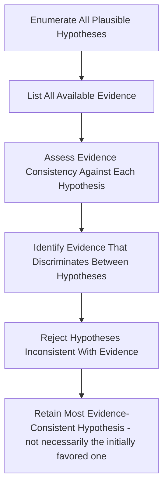

## Maintaining Analytical Rigor and Avoiding Politicization

### Definition and Core Tension

Politicization in intelligence and risk analysis refers to the distortion of analytical judgments — consciously or unconsciously — to conform to a preferred conclusion, whether that preference originates from organizational leadership, the analyst's own political views, client expectations, or institutional incentives. Maintaining analytical rigor means producing judgments that follow from the evidence and established analytical methodology regardless of whether the conclusion is convenient, expected, or welcome to the audience receiving it. This is widely regarded as the central professional and ethical challenge of the geopolitical risk analysis discipline, distinguishing it from advocacy, public relations, or motivated reasoning dressed in analytical language.

**Key Points**

- Politicization can flow in either direction: pressure to tell leadership what it wants to hear, or pressure to justify a decision leadership has already made
- Analytical rigor is not neutrality on every question — it is fidelity to evidence and methodology, which sometimes produces politically uncomfortable or commercially inconvenient conclusions
- This is a well-studied problem in the intelligence community (with documented historical failures used as case studies) and translates directly to corporate risk functions, which face analogous — if less publicly scrutinized — pressures

### Sources of Politicization Pressure in Corporate Settings

#### Pressure from Leadership or Sponsors

Corporate risk functions are typically embedded within — and dependent on — the organizations whose decisions they are meant to inform objectively. This creates structural incentive misalignment: leadership that has already committed to a market entry, an M&A deal, or a strategic direction may implicitly or explicitly prefer analysis that supports rather than challenges that decision.

**Example**

A risk function asked to assess political stability in a market where the firm has already announced a major investment faces implicit pressure to produce a reassuring assessment, since a negative or cautionary finding could be read internally as contradicting a decision senior leadership has publicly staked reputation on.

#### Confirmation-Seeking Requests

Requests framed to elicit a predetermined answer ("give me the case for why this deal makes sense" rather than "assess whether this deal makes sense") can subtly shift an analyst's framing even when the request is not made in explicit bad faith — the framing of the question itself can bias the analytical process before evidence gathering even begins.

#### Career and Organizational Incentives

Analysts whose assessments are perceived as consistently obstructive to business objectives may face implicit career risk, creating incentive pressure toward analytical caution or softened judgments over time, independent of any single explicit instruction to bias an assessment.

#### Analyst's Own Priors and Political Views

Politicization is not only externally imposed — analysts bring their own political priors, risk tolerances, and interpretive frameworks, which can unconsciously shape which evidence is weighted more heavily or which alternative explanations are seriously considered, absent deliberate methodological safeguards.

### Historical Case Studies (Intelligence Community Context)

The corporate risk discipline draws heavily on lessons from documented intelligence community politicization failures, most prominently:

- **2002 Iraq WMD assessment**: widely studied as a case where analytical processes failed to adequately convey uncertainty, alternative hypotheses were insufficiently weighted, and (per subsequent official reviews, including the US Senate Select Committee on Intelligence and the UK's Butler Review) institutional and political pressures contributed to overconfident collective judgments that were not well-supported by the underlying intelligence
- **Team B exercise (1976)**: a Cold War-era competitive analysis exercise intended to challenge CIA assessments of Soviet military capability, frequently cited in methodology literature as both a model for structured alternative analysis and, per subsequent critique, a case where the "challenge" process itself was influenced by the political priors of those selected to conduct it — illustrating that even structured rigor techniques are not immune to politicization if their design or staffing is itself compromised

[Inference] These cases are extensively documented in declassified government reviews and are standard reference points in intelligence analysis methodology training; the specific causal weight attributed to politicization versus other contributing factors (collection gaps, technical misjudgments) in the Iraq WMD case in particular remains a subject of ongoing historical and methodological debate rather than a single settled consensus, and I would present it as a widely-cited cautionary case rather than a fully resolved historical judgment.

### Structured Techniques for Maintaining Rigor

#### Analysis of Competing Hypotheses (ACH)

A structured methodology (developed within the CIA, most associated with Richards Heuer) requiring analysts to explicitly enumerate multiple plausible hypotheses before evaluating evidence, then systematically assess each piece of evidence against every hypothesis rather than only seeking evidence that confirms an initially favored explanation. This directly counters confirmation bias, a primary mechanism through which unconscious politicization occurs.

#### Devil's Advocacy and Red Teaming

Formally assigning an individual or team to construct the strongest possible case against the prevailing or emerging assessment, independent of whether that team personally believes the counter-case. Effective implementation requires genuine organizational authority for the red team's findings to reach decision-makers, not merely a symbolic exercise whose conclusions are quietly set aside if inconvenient.

#### Key Assumptions Check

Explicitly listing every assumption underlying an assessment and interrogating whether each remains valid, since unstated or unexamined assumptions are a common vector through which political or motivated bias enters an assessment without being visible to either the analyst or the reader.

#### Structured Peer Review

Independent review of assessments by analysts not involved in the original analysis, checking specifically for logical consistency, evidentiary support, and whether alternative explanations were adequately considered — providing an institutional check independent of any single analyst's individual biases.

#### Separation of Analysis from Advocacy

A core professional norm: the analyst's role is to assess what is most likely to be true and communicate calibrated uncertainty about that assessment, not to advocate for a particular business decision. Recommendations can and should follow from analysis, but the analytical judgment itself should be defensible independent of which business decision it happens to support.

### Organizational Design Safeguards

#### Reporting Line Independence

Placing the geopolitical risk function's reporting line with sufficient independence from the business units or deal teams whose decisions its analysis evaluates — while still maintaining enough proximity to be relevant and decision-connected (see Building an Internal Geopolitical Risk Function for the broader tradeoffs in reporting line design). Excessive independence can render the function irrelevant to decisions; insufficient independence creates direct politicization exposure.

#### Protecting Minority/Dissenting Views

Formal mechanisms for capturing and elevating dissenting analytical views rather than requiring false consensus — a documented lesson from intelligence community post-mortems, where analytical products that suppressed internal disagreement in favor of a single unified judgment were later found to have obscured genuine uncertainty that, if visible, would have better served decision-makers.

**Example**

Rather than a report stating a single unified judgment, a rigor-preserving format might state: "The majority analytical view assesses [X] as likely; however, [N] of [M] analysts on this assessment team assess [Y] as more likely, based on [specific alternative weighting of evidence]. Both views are presented because the underlying evidence does not clearly resolve this disagreement."

#### Firewalling Analysis from Deal/Transaction Incentives

Particularly relevant where geopolitical risk analysis feeds M&A or major capital allocation decisions — structural separation between the risk function's incentive structure (compensation, career advancement) and the success or approval of specific deals it is asked to assess, reducing the incentive to produce favorable analysis to support deal completion.

#### Sourcing Diversity Requirements

Institutional requirements for multi-sourcing key judgments (rather than relying on a single source, particularly a single source with potential incentive to shape the narrative — e.g., a local government contact with interest in attracting foreign investment) as a structural safeguard against both external manipulation and internal confirmation bias.

### Distinguishing Rigor from False Balance

A common misapplication of "avoiding politicization" is false balance — treating all viewpoints or all evidence as equally weighted regardless of underlying evidentiary quality, in a misguided effort to appear neutral. Genuine analytical rigor is not the same as never reaching a clear conclusion; it means reaching conclusions that are proportionate to the actual weight and quality of evidence, clearly flagging genuine uncertainty where it exists, while still being willing to state a well-supported judgment clearly rather than hedging purely to avoid controversy.

**Key Points**

- Rigor sometimes requires stating an unambiguous, well-evidenced judgment even when it is politically or commercially uncomfortable — avoiding that conclusion in the name of "balance" is itself a form of distortion
- Rigor also requires flagging genuine uncertainty rather than manufacturing false confidence to appear decisive — the goal is calibration, not the appearance of neutrality or the appearance of decisiveness for its own sake (see Communicating Uncertainty and Confidence Levels)

### Warning Signs of Politicization in a Risk Function

- Assessments that consistently align with whatever business decision has already been made, regardless of the specific evidence in each case
- Softening or removal of unfavorable findings between draft and final versions without a clear evidentiary basis for the change
- Selective sourcing that favors sources aligned with a preferred narrative while giving less weight to credible contrary sources
- Analysts reporting informal pressure ("make this more positive," "leadership won't want to hear this") to alter conclusions absent new evidence
- Absence of any documented instance of the risk function delivering an unwelcome or business-inconvenient assessment over an extended period — in a genuinely rigorous function operating across enough decisions, some assessments should be expected to diverge from what stakeholders hoped to hear

[Inference] This last point is a heuristic commonly cited in practitioner and intelligence-community discussions of politicization risk (the reasoning being that a perfect track record of convenient conclusions is itself statistically improbable and therefore a plausible indicator of bias), but its absence is not conclusive proof of politicization on its own, since it is also possible for a well-functioning analytical process to happen to reach favorable conclusions across a specific run of assessments; it should be treated as one input into broader institutional self-assessment rather than a standalone diagnostic test.

### Balancing Rigor with Organizational Relevance

A purely academic or maximally cautious analytical posture that never commits to clear, decision-useful judgments risks organizational marginalization just as much as politicized analysis risks credibility loss — the discipline requires holding both standards simultaneously: rigorous, bias-resistant methodology, combined with a genuine commitment to producing actionable, decision-relevant conclusions (see Executive Briefing and Stakeholder Communication on the parallel failure mode of excessive hedging). The two goals are not actually in conflict when the methodology is sound — well-calibrated rigor produces clearer, more defensible, more useful judgments than either politicized reassurance or reflexive hedging.

### Building an Institutional Culture of Rigor

- **Explicit tradecraft standards**: documented, firm-specific standards for evidentiary sourcing, estimative language, and structured analytic technique application, reducing reliance on individual analyst judgment alone to maintain rigor
- **Leadership modeling**: senior leadership within the risk function visibly protecting and rewarding analysts who deliver well-evidenced but unwelcome findings, rather than only rewarding analysts whose conclusions prove convenient
- **Regular methodology training**: ongoing training in cognitive bias awareness, structured analytic techniques, and case-study review of historical politicization failures
- **Track record transparency**: periodic honest review of past assessments (see Communicating Uncertainty and Confidence Levels), which both improves calibration and reinforces an institutional norm that being wrong under genuine uncertainty is acceptable, while being systematically biased is not

**Related Topics**

- Communicating uncertainty and confidence levels (estimative language as a rigor-supporting practice)
- Structured analytic techniques (Analysis of Competing Hypotheses, red-teaming, key assumptions checks) in depth
- Building an internal geopolitical risk function (reporting-line independence design)
- Historical intelligence community politicization case studies and post-mortem reviews
- Cognitive bias awareness training for analysts
- Executive briefing and stakeholder communication (balancing rigor with decision-usefulness under pressure)
- Ethics and professional standards in risk and intelligence analysis
- Organizational incentive design and analyst independence safeguards