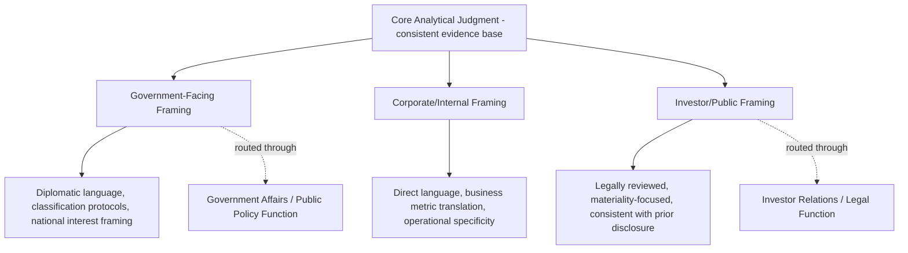

## Tailoring Analysis for Government, Corporate, and Investor Audiences

### Why Audience Determines Analytical Framing

Geopolitical risk analysis is not a single fixed product distributed unchanged across all consumers — the same underlying evidence base and analytical judgment must be reframed substantially depending on who is receiving it, because each audience type has a distinct decision context, risk tolerance, vocabulary, time horizon, and set of institutional constraints governing how information can be used. Failing to tailor analysis appropriately produces two common failure modes: content that is technically accurate but practically unusable by its recipient, or content that inadvertently creates legal, diplomatic, or reputational exposure by not accounting for audience-specific constraints.

**Key Points**

- The underlying analytical judgment (the assessed likelihood, confidence, and evidence base) should remain consistent across audiences — what changes is framing, emphasis, vocabulary, and level of detail, not the underlying truth claim itself
- Audience-inappropriate framing is a leading cause of analysis being ignored, misapplied, or creating unintended institutional exposure
- Many risk functions serve multiple audience types simultaneously and must maintain internal consistency across differently-tailored products derived from the same analysis

### Government Audiences

#### Decision Context and Institutional Environment

Government consumers of geopolitical risk analysis include policymakers, regulators, diplomatic and defense officials, and legislative staff. Their decision context differs fundamentally from corporate audiences: government actors are typically weighing national interest, public accountability, legal authority, and multilateral relationships rather than shareholder value or operational continuity.

- **Public accountability**: government decisions are subject to public scrutiny, legislative oversight, and (in democracies) electoral consequence in ways corporate decisions generally are not, which shapes both what government audiences need from analysis and how cautiously they may act on it
- **Formal authority and legal constraint**: government action is bounded by statutory authority, international law, and treaty obligations in ways that shape what recommendations are even actionable
- **Multi-stakeholder coordination**: government decisions frequently require interagency or multilateral coordination, meaning analysis may need to be framed for downstream use by audiences the original analyst never directly engages

#### Framing Considerations

- **National security and public interest framing**: government audiences generally expect analysis framed around national interest, security, and public welfare implications rather than commercial or shareholder-value framing
- **Formal classification and handling protocols**: where a corporate risk function engages with government counterparts (e.g., through public-private information sharing arrangements, industry security liaison programs), analysis must respect classification markings, handling caveats, and sourcing protection requirements that differ substantially from internal corporate report conventions
- **Diplomatic sensitivity**: language must account for the fact that government recipients may need to act on or reference the analysis in diplomatically sensitive contexts, requiring more conservative, precisely-worded characterizations of foreign governments or actors than might appear in an internal corporate report
- **Longer institutional memory and cross-referencing**: government analytical products are often expected to be consistent with, and explicitly reference, prior assessments and the broader body of existing government analysis on a topic, in ways less common in fast-moving corporate reporting

**Example**

A corporate report might state plainly: "The ruling party is likely losing its grip on power due to economic mismanagement." A version of the same underlying assessment tailored for a government audience might instead read: "Economic conditions are contributing to declining public confidence in the current government, which multiple indicators suggest could affect political stability over the coming 6-12 months" — preserving the analytical substance while adopting more measured, diplomatically calibrated language appropriate to a government consumer's institutional context.

[Inference] The specific degree of language calibration required varies substantially depending on whether the government audience is domestic or foreign, and whether the engagement is informal information-sharing versus a formal government relations/public policy channel; firms typically route any formal government-facing analytical products through dedicated government affairs or public policy functions rather than having risk analysts engage government audiences directly and without that review, given the specialized diplomatic and legal considerations involved.

### Corporate/Internal Business Audiences

This audience type and its tiered structure (board, C-suite, business unit, operational) is treated in depth in Executive Briefing and Stakeholder Communication; the key tailoring principles specific to distinguishing this audience from government and investor audiences are summarized here for comparative context.

#### Decision Context

- Corporate audiences are oriented toward operational continuity, financial performance, competitive positioning, and shareholder value — analysis should be framed in terms of these concrete business metrics rather than abstract geopolitical significance
- Internal corporate audiences generally have the highest tolerance for candid, unhedged internal-only framing, since corporate risk reporting is typically privileged, non-public, and intended purely for internal decision support (subject to legal privilege and disclosure considerations noted below)
- Time horizons vary sharply by sub-audience: board/strategic audiences think in quarters to years; operational audiences may need day-to-day or week-to-week actionable framing

#### Framing Considerations

- **Metric translation**: geopolitical judgments should be explicitly connected to the specific financial, operational, or strategic metrics the receiving business function already owns (see Executive Briefing and Stakeholder Communication for detailed audience-by-audience framing guidance)
- **Internal-only candor with legal awareness**: while corporate audiences generally support more direct language than government or investor-facing products, legal/compliance review is still often warranted for sensitive assessments (e.g., those touching sanctions exposure, potential securities materiality, or characterizations of specific counterparties) given that internal documents can become discoverable in litigation or regulatory proceedings

### Investor and Public Market Audiences

#### Decision Context and Legal Constraints

Investor-facing communication of geopolitical risk operates under a materially different legal and regulatory framework than internal corporate or government-facing analysis, because it intersects directly with securities disclosure law.

- **Materiality and disclosure obligations**: publicly listed firms have specific legal obligations regarding what geopolitical risk information must be disclosed to investors, and the threshold and process for that determination is a legal/compliance judgment, not one the risk analyst typically makes independently
- **Regulation FD and selective disclosure prohibitions**: in relevant jurisdictions (e.g., US Regulation Fair Disclosure), material non-public information generally cannot be selectively shared with some investors and not others outside of specific sanctioned public disclosure channels, meaning geopolitical risk analysts must be acutely aware of which information can be shared in which forum
- **Forward-looking statement safe harbor considerations**: investor-facing risk communication (e.g., risk factor disclosures in regulatory filings) is often crafted with specific legal safe-harbor language conventions that differ substantially from internal analytical writing style
- **Consistency with prior public disclosure**: investor communications must be consistent with a firm's previously disclosed risk factors and public statements, requiring coordination with investor relations and legal functions to ensure new analysis does not create inconsistency with existing public disclosure

[Inference] The specific disclosure process, materiality threshold, and legal review workflow varies meaningfully by jurisdiction, listing venue, and the firm's own internal disclosure controls policy; this is fundamentally a legal and compliance determination, and geopolitical risk analysts should generally treat investor-facing communication as requiring mandatory legal/IR review rather than independent judgment on their part, given the significant regulatory exposure involved in getting this wrong.

#### Framing Considerations

- **Risk factor language conventions**: public disclosure documents (e.g., annual report risk factor sections) typically use standardized, legally-reviewed, deliberately general risk factor language rather than the specific, evidence-detailed framing appropriate for internal reporting
- **Analyst/investor briefing context**: where risk functions support earnings calls or investor briefings (typically through IR-mediated channels rather than direct analyst-to-investor communication), framing emphasizes financial materiality and previously-disclosed risk categories
- **Rating agency and institutional investor engagement**: credit rating agencies and large institutional investors sometimes engage directly with corporate risk functions (often through structured, legally-supervised channels) requiring yet another register — more technical and evidence-detailed than public risk factor language, but still bounded by disclosure and consistency constraints

**Example**

The same underlying assessment of elevated political risk in a specific operating market might appear as: (internal) "We assess a likely, moderate-confidence probability of new capital controls within six months, driven by [specific evidence], with an estimated $[X]M revenue impact — recommend accelerating cash repatriation"; (investor-facing risk factor) "Our operations in [region] are subject to the risk of adverse changes in foreign exchange and capital control regulations, which could materially affect our results of operations" — the investor-facing version is legally reviewed, more general, and consistent with standard risk factor conventions, while preserving the same underlying substantive concern.

### Comparative Summary Table

| Dimension | Government | Corporate/Internal | Investor/Public Market |
| --- | --- | --- | --- |
| Primary decision frame | National interest, security, public welfare | Operational continuity, financial performance | Materiality, portfolio risk |
| Legal governing framework | Statutory authority, international law, classification | Corporate governance, litigation discoverability | Securities law, disclosure regulation |
| Candor/specificity level | Moderate — diplomatically calibrated | Highest — most direct and detailed | Lowest — legally reviewed, general |
| Typical mediating function | Government affairs/public policy | Direct risk function delivery | Investor relations/legal |
| Time horizon orientation | Policy cycle, often longer-term | Varies by sub-audience (days to years) | Quarterly/annual reporting cycle |
| Core communication risk if mismanaged | Diplomatic incident, credibility loss with government counterparts | Poor decision uptake, operational misalignment | Securities law violation, disclosure liability |

### Cross-Audience Consistency Discipline

A critical technical requirement underlying all audience tailoring: the underlying analytical judgment must remain substantively consistent across differently-framed products derived from it. Producing materially different underlying assessments for different audiences (rather than the same assessment reframed) crosses from legitimate audience tailoring into a form of the politicization risk discussed in Maintaining Analytical Rigor and Avoiding Politicization — particularly acute where a firm might be tempted to present a more reassuring assessment to investors than the one used internally for operational planning, which carries significant legal and reputational exposure if the discrepancy becomes apparent.

**Key Points**

- Maintain a single, version-controlled source analytical judgment, with audience-specific communication products treated as derived reframings — not independently generated assessments
- Any material divergence between internally-used and externally-communicated risk assessments for the same underlying issue should trigger legal and compliance review, given the disclosure and consistency risks involved
- Cross-functional coordination (risk function, legal, investor relations, government affairs) is typically required precisely at the audience-tailoring stage, since this is where legal and diplomatic risk is most likely to be introduced if handled without appropriate specialized review

### Common Pitfalls

- **Using internal-register language in external-facing products**: direct, unhedged internal framing accidentally carried into investor or government-facing communication, creating disclosure or diplomatic risk
- **Excessive uniformity across audiences**: applying the same generic framing to all audiences, resulting in government audiences receiving commercially-irrelevant framing, or business audiences receiving overly diplomatic, insufficiently actionable language
- **Bypassing mandated review channels**: risk analysts directly engaging investor or government audiences without appropriate legal, IR, or government affairs review, given the specialized regulatory and diplomatic considerations involved
- **Allowing audience preference to alter the underlying judgment**: tailoring framing is legitimate; tailoring the actual assessed likelihood or confidence level to suit what a particular audience wants to hear is a politicization failure, not a communication skill
- **Inconsistency between disclosed and internally-used assessments**: creating legal and reputational exposure if internal risk management decisions rely on a materially different assessment than what has been publicly disclosed to investors

**Related Topics**

- Structuring an effective geopolitical risk report (base report structure this tailoring builds from)
- Executive briefing and stakeholder communication (detailed corporate sub-audience tailoring)
- Maintaining analytical rigor and avoiding politicization (consistency discipline across audiences)
- Securities disclosure law and materiality determination processes
- Government affairs and public policy function coordination
- Investor relations coordination for risk-related public disclosure
- Classification and information handling protocols in public-private information sharing
- Building an internal geopolitical risk function (organizational placement affecting audience access)