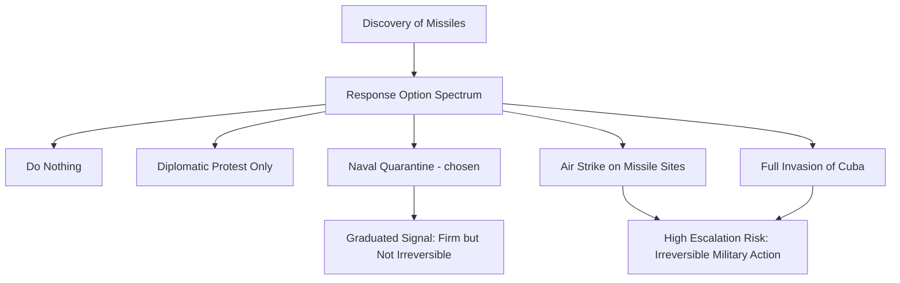

## The Cuban Missile Crisis as a Deterrence Case Study

### Overview and Significance

The Cuban Missile Crisis (October 16–28, 1962) is the most extensively studied case in the deterrence and crisis-management literature, treated as a near-canonical text for geopolitical risk analysts because it combines documented decision-making records (via later-declassified materials and participant memoirs), a genuinely existential stakes environment (nuclear war between the United States and Soviet Union), and a resolution achieved through a combination of deterrent signaling, coercive diplomacy, and negotiated off-ramps rather than military conflict. It remains a foundational reference point for understanding escalation dynamics, misperception risk, and crisis decision-making under extreme uncertainty and time pressure.

**Key Points**

- Widely used as the empirical basis for formal deterrence theory and crisis bargaining models in political science and strategic studies
- Graham Allison's *Essence of Decision* (1971, revised 1999) is the most influential analytical treatment, introducing three competing explanatory models (rational actor, organizational process, bureaucratic politics) still taught as a core framework
- Declassified materials (including White House tapes) released well after the crisis substantially revised the historical understanding of key decisions, illustrating a recurring risk-analysis lesson: contemporaneous public/official narratives of a crisis can diverge significantly from what internal decision-making records later reveal

### Factual Sequence

- **Background**: Following the failed 1961 Bay of Pigs invasion and the ongoing Cold War arms competition, the Soviet Union under Nikita Khrushchev secretly began deploying nuclear-capable medium- and intermediate-range ballistic missiles to Cuba in mid-1962
- **October 14, 1962**: US U-2 reconnaissance flights photograph missile installations under construction in Cuba, confirmed by CIA analysis
- **October 16-22**: President Kennedy convenes an ad hoc advisory group (later known as ExComm, the Executive Committee of the National Security Council) for secret deliberation over the response
- **October 22**: Kennedy publicly announces the discovery and declares a naval "quarantine" of Cuba (a deliberately chosen term, avoiding "blockade," which would constitute an act of war under international law)
- **October 24-25**: Soviet vessels approach the quarantine line; some turn back, easing immediate confrontation risk
- **October 26-27**: The most acute phase — including a Soviet SA-2 missile shooting down a US U-2 over Cuba on October 27, and back-channel negotiations running in parallel with public messaging
- **October 26-28**: A resolution is negotiated: the Soviet Union agrees to withdraw missiles from Cuba in exchange for a US public pledge not to invade Cuba, plus a secret, undisclosed-at-the-time US commitment to remove Jupiter missiles from Turkey

### Deterrence Theory Concepts Illustrated

#### Deterrence vs. Compellence

A foundational distinction (most associated with Thomas Schelling's strategic bargaining theory): **deterrence** aims to prevent an adversary from taking an action not yet begun, while **compellence** aims to force an adversary to reverse or stop an action already underway. The crisis is frequently analyzed as a compellence case (the US sought to compel Soviet missile withdrawal) layered atop broader Cold War deterrence dynamics (mutual nuclear deterrence preventing full-scale war even amid the crisis).

#### Signaling and Credibility

The quarantine was deliberately designed as a graduated, visible signal of resolve — calibrated to demonstrate credible commitment without an immediate, irreversible act of war, preserving space for negotiated resolution while still conveying seriousness of intent.

[Inference] ExComm deliberations reportedly considered a wide spectrum of options including air strikes and invasion, with the quarantine selected partly for its graduated, reversible character; the specific internal weighting of considerations behind this choice is documented in declassified ExComm transcripts and subsequent scholarship, but reconstructing the precise decision calculus of each individual participant necessarily involves some interpretive judgment by historians, and different scholarly accounts (e.g., Allison's competing models) offer differing emphases on which factors were most decisive.

#### The Security Dilemma and Misperception

The crisis is frequently cited as an illustration of the security dilemma — actions taken by one side for defensive reasons (from the Soviet perspective, offsetting a US missile and conventional advantage, including US Jupiter missiles already deployed in Turkey and Italy) were perceived by the other side as unacceptably offensive and threatening, escalating tension despite neither side's stated intent to initiate war.

#### Off-Ramps and Face-Saving Resolution

The eventual resolution is a paradigm case in crisis-bargaining literature for the importance of providing an adversary a face-saving exit rather than demanding unconditional capitulation. The public Cuba non-invasion pledge, combined with the secret Turkey missile withdrawal (undisclosed publicly for decades, which allowed the US to avoid appearing to have negotiated under duress), allowed both sides to claim a version of success to their respective domestic and allied audiences.

**Key Points**

- The secret Turkey-for-Cuba missile trade was not publicly acknowledged by the US government for many years, and its absence from the contemporaneous public narrative shaped a subsequent (and, per later scholarship, somewhat inaccurate) popular understanding of the crisis as a case of unilateral American resolve rather than a negotiated mutual concession
- This illustrates a recurring risk-analysis caution: the publicly observable resolution of a crisis may not fully reveal the actual terms or concessions involved, which can distort later analogical reasoning if analysts rely only on the public record

### Allison's Three Models (Essence of Decision)

Graham Allison's analysis remains the most widely taught framework for understanding how government decisions during the crisis were actually made, arguing that no single model fully explains observed outcomes:

| Model | Core Assumption | Explanatory Focus |
| --- | --- | --- |
| Rational Actor Model | Government as a unitary rational agent maximizing strategic objectives | Explains broad strategic logic (why a quarantine, not invasion) |
| Organizational Process Model | Outcomes shaped by standard operating procedures of large bureaucracies | Explains specific implementation details (e.g., how the naval quarantine was actually executed) |
| Governmental/Bureaucratic Politics Model | Outcomes shaped by bargaining among competing officials/agencies with distinct interests | Explains internal disagreements and compromises within ExComm deliberations |

**Example**

A rational-actor-only analysis might struggle to explain certain operational details of how the naval quarantine was executed (which followed pre-existing Navy blockade doctrine and procedures, an organizational-process explanation) or specific compromises in the final messaging (which reflected internal ExComm bargaining among officials with different institutional perspectives and risk tolerances, a bureaucratic-politics explanation) — illustrating why Allison argued multiple explanatory lenses are needed rather than a single unified model.

[Inference] Allison's framework remains highly influential but has also been subject to extensive academic critique and refinement in subsequent decades (including revisions in his own 1999 second edition incorporating newly declassified material); it should be understood as an influential analytical lens rather than an uncontested, final account of the crisis, and other scholars have proposed alternative or supplementary frameworks.

### Applications to Corporate Geopolitical Risk Analysis

While the crisis involved existential nuclear stakes far removed from typical corporate risk exposure, several transferable analytical lessons are commonly drawn in geopolitical risk practitioner training:

#### Lesson: Distinguish Signaling from Substance

Corporate risk analysts assessing government actions (sanctions announcements, military posturing, trade threats) should ask whether an action is primarily a calibrated signal intended to shape adversary behavior short of full escalation, versus a substantive, less-reversible commitment — the distinction materially affects likelihood assessments of further escalation.

#### Lesson: Beware Single-Source or Incomplete Information Environments

ExComm deliberations occurred under significant information uncertainty and time pressure, with initial intelligence assessments evolving rapidly as new reconnaissance data arrived — a direct parallel to the corporate risk analyst's frequent challenge of forming judgments under incomplete, evolving information (see Communicating Uncertainty and Confidence Levels), reinforcing the importance of explicitly flagging confidence levels and remaining willing to revise judgments as new evidence emerges.

#### Lesson: Value of Multiple Explanatory Models

Allison's multi-model approach is directly relevant to corporate assessments of foreign government behavior — a purely "rational strategic actor" lens on a foreign government's actions can miss bureaucratic, organizational, or domestic-political dynamics that better explain specific decisions, particularly relevant when assessing regulatory or sanctions decisions that may reflect internal bureaucratic dynamics as much as unified strategic intent.

#### Lesson: Preserve Off-Ramps in High-Stakes Negotiation

The crisis's resolution underscores a broadly applicable negotiation and crisis-management principle (also central to Negotiation Theory — see Trust, Ethics, and Fairness in Negotiation and related chapters): preserving a face-saving path to de-escalation for a counterparty, rather than demanding unconditional capitulation, materially improves the likelihood of achieving a stable resolution without further escalation, relevant to corporate crisis scenarios involving government counterparties (regulatory disputes, expropriation threats, sanctions negotiations).

#### Lesson: Public Narrative May Not Reflect Full Terms

Corporate risk analysts should apply appropriate skepticism toward publicly available accounts of how a prior geopolitical crisis or negotiation was actually resolved, since — as the decades-long non-disclosure of the Turkey missile trade illustrates — the full terms of a resolution are not always immediately or fully public, which has implications for how confidently analysts should draw analogies from publicly reported past crisis resolutions to current situations.

### Methodological Caution on Historical Analogy

[Inference] While the Cuban Missile Crisis is an extremely well-documented and pedagogically valuable case, risk analysts should exercise caution in directly transposing its specific dynamics to contemporary situations — nuclear deterrence between two Cold War superpowers with specific command-and-control structures, alliance commitments, and strategic doctrines differs substantially from most contemporary corporate-relevant geopolitical scenarios (regional conflicts, sanctions disputes, regulatory confrontations), and over-reliance on any single historical analogy, however well-studied, risks anchoring bias if applied without careful assessment of how the current situation's specific actors, stakes, and strategic context actually differ. This caution is itself a widely emphasized principle in structured analytic technique training (see Maintaining Analytical Rigor and Avoiding Politicization) rather than a critique specific to this case alone.

### Primary and Secondary Sources for Further Study

- Graham Allison and Philip Zelikow, *Essence of Decision: Explaining the Cuban Missile Crisis* (2nd ed., 1999)
- Declassified ExComm meeting tapes and transcripts, held by the John F. Kennedy Presidential Library
- Thomas Schelling, *Arms and Influence* (1966) — foundational deterrence/compellence theoretical framework
- Sheldon Stern, *The Cuban Missile Crisis in American Memory* — a historiographical treatment examining how the public narrative diverged from the declassified record over time

**Related Topics**

- Deterrence theory and compellence: theoretical foundations
- Thomas Schelling and the theory of strategic bargaining
- Graham Allison's three models of decision-making in depth
- Communicating uncertainty and confidence levels (parallels to crisis decision-making under incomplete information)
- Maintaining analytical rigor and avoiding politicization (historical analogy risk and structured analytic technique application)
- Security dilemma theory in international relations
- Crisis management and business continuity planning (corporate crisis decision structures)
- Additional Cold War crisis case studies (Berlin Crisis, Able Archer 83) for comparative analysis