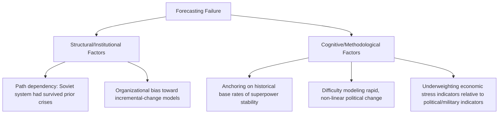

## The Soviet Collapse and Transition Risk

### Overview and Significance for Risk Analysis

The dissolution of the Soviet Union (1985–1991) is a foundational case study in the analysis of state collapse, regime transition risk, and — critically for geopolitical risk practitioners — the documented failure of most contemporaneous intelligence and expert assessments to anticipate the speed and manner of collapse. It is used less as a deterrence case (unlike the Cuban Missile Crisis) and more as a canonical case study in forecasting failure, transition risk assessment, and the operational challenges multinational firms face when a major state undergoes systemic political and economic transformation.

**Key Points**

- Widely cited as a case where near-consensus expert and intelligence community assessments substantially underestimated the likelihood of Soviet collapse until very close to the event itself
- Provides a rich case study in the distinct risk categories firms faced during the transition: asset expropriation risk, currency and contract instability, legal/regulatory vacuum, and personnel security
- Frequently used alongside other regime-transition cases (Arab Spring, Eastern Bloc transitions) to build general frameworks for assessing transition and state-fragility risk

### Factual Sequence (Condensed)

- **1985**: Mikhail Gorbachev becomes General Secretary, introducing *glasnost* (political openness) and *perestroika* (economic restructuring) reforms intended to reinvigorate, not dismantle, the Soviet system
- **1989**: Eastern Bloc communist governments fall in rapid succession (Poland, Hungary, East Germany, Czechoslovakia, Romania, Bulgaria) with limited Soviet military intervention, diverging sharply from prior Soviet practice (e.g., 1956 Hungary, 1968 Czechoslovakia)
- **1990–1991**: Baltic states (Lithuania, Latvia, Estonia) and other Soviet republics move toward independence; economic conditions within the USSR deteriorate sharply, including shortages and inflation
- **August 1991**: A coup attempt by Communist Party hardliners against Gorbachev fails within days, significantly accelerating the delegitimization of central Soviet authority and elevating Boris Yeltsin's political standing
- **December 1991**: The Soviet Union formally dissolves into fifteen independent states; Gorbachev resigns as President of the USSR on December 25, 1991

### The Forecasting Failure: A Core Case Study in Analytical Humility

#### Nature of the Failure

A substantial body of retrospective analysis — including reviews by the US intelligence community itself — found that mainstream Sovietological and intelligence assessments through the late 1980s generally treated Soviet collapse as a low-probability outcome, focusing analytical attention instead on the relative success or failure of Gorbachev's reforms within a continuing Soviet framework, rather than seriously weighting outright dissolution as a near-term possibility.

[Inference] The degree and nature of this forecasting failure has itself been a subject of extensive academic and intelligence-community post-mortem debate; some scholars and former officials have argued that specific individual analysts and reports did flag elevated instability risk, and that the failure was less a uniform absence of warning than an institutional and structural failure to appropriately weight and elevate more pessimistic assessments within a broader consensus that skewed toward continuity — this is a genuinely contested historiographical question rather than a fully settled account, and I would treat strong claims about "no one saw it coming" with some caution given this nuance.

#### Contributing Factors to the Forecasting Failure (as commonly analyzed)

- **Historical base-rate anchoring**: the Soviet system had survived numerous prior internal crises and external pressures over seven decades, leading many analysts to reasonably (if ultimately incorrectly) weight continuity more heavily than discontinuity
- **Difficulty modeling non-linear, cascading political change**: rapid, self-reinforcing legitimacy collapse (where each visible sign of central weakness further accelerated defection by regional and republic-level elites) is a dynamic that traditional linear-trend forecasting handles poorly — a methodological challenge highly relevant to scenario planning practice (see Scenario-Based Corporate Strategic Planning)
- **Underweighting of economic stress relative to political/military indicators**: some retrospective analysis suggests economic deterioration (falling oil revenues, fiscal strain, consumer shortages) was a more reliable leading indicator of systemic fragility than was fully appreciated at the time relative to more closely-watched political and military signals

### Transition Risk: A Distinct Risk Category

The Soviet collapse is frequently used to define and illustrate "transition risk" as a distinct category within geopolitical risk analysis, separate from both stable-state political risk and acute conflict risk — characterized by prolonged institutional uncertainty, contested legal authority, and rapid, unpredictable rule changes.

#### Characteristics of Transition Risk Environments

- **Legal and regulatory discontinuity**: existing contracts, property rights, and regulatory frameworks may become unenforceable or ambiguous as the issuing authority itself loses legitimacy or is superseded by successor entities
- **Currency and monetary instability**: the ruble underwent severe instability and hyperinflation in the early transition period, illustrating the acute currency and contract-value risk multinational firms face during systemic transitions
- **Asset and property rights ambiguity**: newly independent successor states inherited or contested Soviet-era assets, creating extended uncertainty over ownership, licensing, and concession validity for firms with existing Soviet-era agreements
- **Fragmented sovereign authority**: firms operating during the transition faced the practical challenge of determining which authority (union-level, republic-level, or emergent new national government) held actual enforceable jurisdiction at any given moment — a problem distinct from typical political risk analysis, which usually assumes a single identifiable sovereign counterparty
- **Personnel and security risk**: economic collapse and institutional breakdown created elevated personnel security risk (crime, social instability) distinct from, though sometimes compounding, the political and legal risks

**Example**

A Western firm holding a joint venture agreement signed with Soviet central ministries in the late 1980s faced, by late 1991, the practical question of which successor entity (the Russian Federation government, a regional authority, or a privatized successor company) actually held enforceable authority over that agreement — a genuine transition-risk scenario requiring the firm to reassess counterparty legitimacy and contract enforceability essentially from first principles, distinct from the kind of political risk analysis applicable to a stable, continuously-recognized government.

### Corporate and Investment Impacts During the Transition

- **Privatization risk and windfall/loss asymmetry**: the subsequent 1990s Russian privatization process created a highly volatile environment where asset ownership could be gained or lost through processes with limited transparency and rapidly evolving rules, a pattern relevant to firms assessing risk in other post-transition privatization environments
- **Contract and debt succession disputes**: successor states faced (and disputed amongst themselves) questions of which entities inherited Soviet-era international debts, assets, and treaty obligations, creating protracted uncertainty for creditors and counterparties
- **Market entry timing risk**: firms that entered the Russian and post-Soviet markets at different points during and after the transition experienced very different risk-reward profiles, illustrating the significance of transition-phase timing as a distinct variable in market entry risk assessment (see related market entry strategy frameworks)
- [Inference] Detailed firm-level outcome data from this period is unevenly documented and often anecdotal in the available literature relative to more recent, data-rich corporate risk episodes; broad directional patterns (elevated volatility, asymmetric outcomes between early and late entrants) are widely discussed in retrospective business literature on the period, but I would treat specific quantitative claims about aggregate investor outcomes during this specific period with caution absent a clearly sourced study.

### Analytical Lessons for Geopolitical Risk Practice

#### Lesson: Weight Low-Probability, High-Impact Discontinuity Scenarios More Seriously

The case is a primary reference point for the argument that risk analysis methodologies should not systematically underweight structural break/collapse scenarios merely because a system has exhibited long historical persistence — directly reinforcing the value of scenario planning's explicit construction of divergent, non-consensus futures (see Scenario-Based Corporate Strategic Planning) rather than relying solely on trend extrapolation from historical stability.

#### Lesson: Monitor Economic Stress Indicators as Leading Political Indicators

Retrospective analysis commonly emphasizes that economic fundamentals (fiscal strain, currency pressure, consumer shortages) provided earlier and arguably clearer warning signals of systemic fragility than were fully incorporated into mainstream political assessments at the time — reinforcing the practice of integrating economic and political indicator streams in early warning systems rather than treating them as separate analytical tracks.

#### Lesson: Prepare for Non-Linear, Cascading Legitimacy Collapse

Unlike gradual policy shifts, systemic political collapse can proceed through rapid, self-reinforcing dynamics (visible weakness begets further defection and loss of authority) that are poorly captured by linear forecasting — reinforcing the value of maintaining contingency plans for low-probability discontinuity scenarios even when base-rate historical persistence argues against their likelihood.

#### Lesson: Build Explicit Transition-Risk Playbooks, Distinct from Standard Political Risk Playbooks

Firms operating in states exhibiting elevated fragility indicators benefit from distinct contingency planning for transition-risk conditions specifically — addressing fragmented sovereign authority, contract/legal discontinuity, and currency instability — rather than relying solely on standard political risk or business continuity frameworks designed around a continuously-functioning single sovereign authority (see Crisis Management and Business Continuity Planning for general BCP frameworks, which should be adapted for transition-specific contingencies).

#### Lesson: Maintain Analytical Humility and Institutionalize Dissent

Given the documented tendency for expert consensus to underweight collapse scenarios in this case, the episode is frequently cited in support of structured analytic techniques designed to surface minority or dissenting analytical views (see Maintaining Analytical Rigor and Avoiding Politicization) rather than allowing institutional consensus to suppress lower-probability but high-impact alternative assessments.

### Comparative Context: Other State Transition/Collapse Cases

Practitioners commonly study the Soviet collapse alongside other transition cases to build a broader comparative framework for state-fragility risk assessment, including the broader wave of Eastern Bloc transitions in 1989, the Yugoslav dissolution (which, unlike the largely peaceful Soviet dissolution, involved extensive violent conflict), and the 2011 Arab Spring transitions — each illustrating different pathways, speeds, and violence levels associated with systemic political transition, cautioning against treating any single case (including this one) as a universal template for how state transitions unfold.

**Related Topics**

- Scenario-based corporate strategic planning (structural break and discontinuity scenario construction)
- Maintaining analytical rigor and avoiding politicization (institutionalizing dissenting/minority assessments)
- State fragility and failed-state risk indices and assessment frameworks
- The Yugoslav dissolution as a comparative violent-transition case study
- The Arab Spring as a comparative modern transition risk case study
- Sovereign debt succession and international law in state dissolution
- Currency crisis and hyperinflation risk analysis
- Crisis management and business continuity planning (adapting BCP for transition-specific risk)