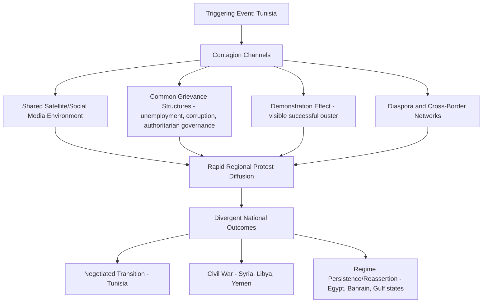

## The Arab Spring and Regional Contagion Dynamics

### Overview and Significance

The Arab Spring (late 2010–2012, with extended aftershocks continuing through the decade) is the primary modern case study for analyzing regional political contagion — the rapid diffusion of protest movements and regime destabilization across national borders within a shared cultural, linguistic, and media environment. It is a central reference case for geopolitical risk practitioners because it demonstrates both the speed at which political risk can transmit across a region that appeared, to most contemporaneous risk models, to be a set of relatively distinct and separately-assessed country risks, and the highly divergent outcomes that superficially similar triggering events produced across different states.

**Key Points**

- Illustrates that country-by-country risk assessment models can significantly understate regional systemic risk when contagion channels (shared media, migration, diaspora networks, economic interdependence) are not explicitly modeled
- Produced starkly divergent outcomes across affected states — from relatively orderly transition (Tunisia) to prolonged civil war (Syria, Libya, Yemen) to reasserted authoritarian control (Egypt, Bahrain) — cautioning against treating "the Arab Spring" as a single uniform case rather than a family of related but distinct national trajectories
- Widely used alongside the Eastern Bloc 1989 transitions and the Soviet collapse as a comparative case in contagion and transition-risk methodology

### Factual Sequence (Condensed)

- **December 2010**: Self-immolation of Mohamed Bouazizi in Tunisia following an altercation with local authorities catalyzes widespread protest against economic conditions and government corruption
- **January 2011**: Tunisian President Zine El Abidine Ben Ali flees the country after weeks of escalating protest, marking the first successful ouster of a long-standing authoritarian leader in the wave
- **January–February 2011**: Large-scale protests spread to Egypt (culminating in President Hosni Mubarak's resignation in February), and subsequently to Libya, Yemen, Bahrain, Syria, and with lesser-intensity protest activity in numerous other regional states (Jordan, Morocco, Algeria, Oman, and others)
- **2011–2012**: Divergent national trajectories emerge — Libya descends into civil war following NATO-supported intervention and Gaddafi's fall; Syria's protest movement escalates into a prolonged, internationalized civil war; Yemen experiences a negotiated transition that later collapses into civil war; Bahrain's protest movement is suppressed with regional (GCC) military assistance; Egypt undergoes a contested transition followed by a 2013 military-led change of government
- **Ongoing aftershocks**: Effects (civil war, mass displacement, state fragmentation) continued to shape regional geopolitics and global risk considerations (notably the European migration crisis, linked in part to the Syrian conflict) well beyond the initial 2010-2012 wave

### Contagion Mechanisms: How Political Risk Transmitted Regionally

#### Shared Media Environment

Pan-Arab satellite television (notably Al Jazeera) and, distinctively for this case relative to earlier historical contagion episodes, social media platforms (Facebook, Twitter) provided rapid, largely uncensorable cross-border transmission of both grievance narratives and, critically, the demonstration effect of successful protest outcomes elsewhere in the region — a novel contagion channel relative to prior historical waves of regional political change, which relied more heavily on slower diplomatic, print-media, and organizational transmission.

#### Common Structural Grievances

Many affected states shared underlying structural conditions — youth unemployment, food price inflation (itself connected to global commodity price dynamics), perceived corruption, and long-tenured authoritarian governance — creating a regional population primed to respond to a demonstration effect once one state's protest movement succeeded, rather than the contagion being purely a media-driven phenomenon absent underlying grievance conditions.

#### Demonstration Effect

The visible, rapid success of the Tunisian and then Egyptian protest movements in removing long-entrenched leaders is widely analyzed as providing a powerful demonstration effect, shifting other populations' assessment of the feasibility of successful protest against previously assumed-durable authoritarian regimes — a documented dynamic in social movement theory generally, here operating at an unusually rapid, cross-border, multi-country scale.

### Why Outcomes Diverged Sharply Despite a Shared Contagion Trigger

A central analytical lesson of the case: shared contagion mechanisms produced starkly different national outcomes, driven by factors specific to each state's institutional structure rather than by the contagion mechanism itself. Commonly cited differentiating factors include:

| Factor | Influence on Outcome |
| --- | --- |
| Military institutional cohesion and loyalty | States where the military remained cohesive and willing to force leader departure without fragmenting (Tunisia, Egypt) saw faster resolution than states where security forces fractured along factional/sectarian lines (Libya, Syria, Yemen) |
| Sectarian/ethnic/tribal fragmentation | States with significant pre-existing sectarian or tribal fault lines saw protest movements more readily escalate into fragmented civil conflict as competing factions mobilized along those lines |
| External intervention | International military intervention (NATO in Libya) and regional intervention (GCC forces in Bahrain, various external actors in Syria and Yemen) substantially shaped outcomes in ways not reducible to purely domestic dynamics |
| Resource dependence and regime capacity to buy stability | Gulf monarchies with substantial hydrocarbon revenue were able to deploy targeted economic concessions and security spending to dampen unrest in ways lower-resource states could not |
| Institutional strength of the state itself (versus the specific regime) | Tunisia's relatively developed civil society and state institutions (independent of the departed leader) are frequently cited as contributing to a comparatively more orderly transition than in states where state capacity was more closely fused with the personal authority of the departing leader |

[Inference] This comparative explanatory framework represents a broadly-shared synthesis across academic and policy analysis of the period, but the relative weighting of these factors remains genuinely debated in the scholarly literature, and single-factor explanations for any given country's specific trajectory are generally viewed with skepticism by specialists — the divergent outcomes are best understood as resulting from the interaction of multiple factors specific to each case rather than any single dominant variable applicable uniformly across the region.

### Corporate and Investment Risk Implications

#### Failure of Siloed Country Risk Models

Firms and risk models that assessed each regional state independently, without explicitly modeling cross-border contagion channels, were more likely to be caught underprepared by the speed and breadth of regional destabilization — a widely cited lesson driving subsequent adoption of explicit regional contagion modeling and correlation analysis within corporate country risk frameworks, supplementing rather than replacing individual country assessments.

#### Supply Chain and Operational Disruption

Firms with regional operations or supply chain dependencies (energy, logistics corridors, regional manufacturing) faced simultaneous, correlated disruption across multiple markets rather than an isolated single-country event, illustrating the risk of geographic concentration even across nominally "diversified" multi-country regional footprints if contagion channels are not accounted for in diversification strategy.

#### Extended Duration and the Limits of Short-Horizon Contingency Planning

Several national trajectories (Syria, Libya, Yemen) extended into multi-year conflicts rather than resolving within the weeks-to-months horizon many initial corporate contingency plans were designed around — reinforcing a lesson also drawn from Crisis Management and Business Continuity Planning: firms should not assume geopolitical disruptions will resolve within typically-modeled short-duration BCP horizons, particularly in cases exhibiting the fragmentation risk factors noted above.

#### Downstream Global Effects

Beyond the directly affected states, the conflict-driven displacement (particularly from Syria) contributed to the subsequent European migration crisis, illustrating how regional contagion events can generate significant second-order geopolitical and economic effects well beyond the initially affected geography and well beyond the initial risk-assessment time horizon.

### Analytical Lessons for Geopolitical Risk Practice

#### Lesson: Model Regional Correlation and Contagion Channels Explicitly

Country risk models should incorporate explicit assessment of contagion channels (shared media environment, diaspora networks, common structural grievances, demonstration effects) rather than treating geographically and culturally proximate countries as independent risk events — directly informing more sophisticated regional risk correlation approaches in contemporary country risk methodology.

#### Lesson: Differentiate National Outcomes Even Within a Shared Contagion Event

Analysts should resist treating a regional contagion wave as producing uniform outcomes across affected states, and should instead prioritize rapid, differentiated assessment of state-specific factors (military cohesion, sectarian fragmentation, external intervention likelihood, regime fiscal capacity) as the wave unfolds, since these factors — not the initial triggering contagion mechanism — are what determine each state's specific trajectory.

#### Lesson: Plan for Extended-Duration, Not Just Acute-Phase, Disruption

Given the documented tendency for a subset of contagion-affected states to enter prolonged conflict rather than resolve quickly, contingency and business continuity planning for regions exhibiting contagion risk should explicitly model extended-duration disruption scenarios, not only short-acute-phase scenarios.

#### Lesson: Monitor Second-Order and Downstream Effects Beyond the Directly Affected Region

The migration crisis linkage illustrates that a regional contagion event's risk-relevant effects can extend well beyond the directly affected geography and well beyond the initial assessment time horizon — reinforcing the value of broader horizon-scanning practices that track downstream and adjacent-region effects of a primary contagion event, not only the initially affected states themselves.

### Comparative Context

The Arab Spring is commonly studied alongside the 1989 Eastern Bloc transitions (see The Soviet Collapse and Transition Risk) as a comparative contagion case — both involved rapid, cross-border diffusion of political change against superficially similar authoritarian regime types, but produced markedly different violence profiles (the 1989 transitions were, with limited exceptions, comparatively peaceful, while several Arab Spring trajectories escalated into prolonged civil conflict), offering a useful comparative lens for examining which structural and institutional factors differentiate largely peaceful contagion-driven transitions from those that escalate into sustained violent conflict.

**Related Topics**

- The Soviet collapse and transition risk (comparative contagion case study)
- Regional risk correlation modeling in country risk frameworks
- State fragility, sectarian conflict, and civil war risk assessment
- Scenario-based corporate strategic planning (regional contagion scenario construction)
- Crisis management and business continuity planning (extended-duration disruption planning)
- Migration and displacement risk as a downstream geopolitical effect
- Social movement theory and demonstration effects in political science
- Energy and commodity market impacts of regional conflict