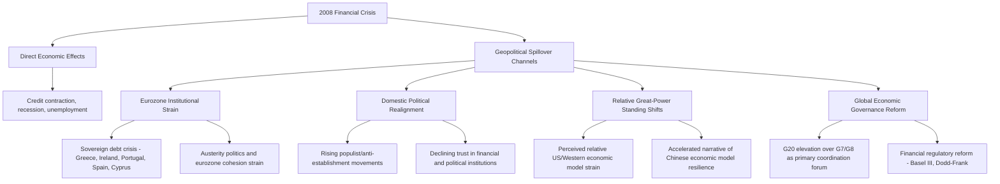

## The 2008 Financial Crisis and Its Geopolitical Spillovers

### Overview and Significance

The 2008 global financial crisis (GFC) is a primary case study for geopolitical risk practitioners not principally as a financial event but as an illustration of how an economic shock originating in a specific national financial system can generate wide-ranging, multi-year geopolitical consequences — reshaping domestic politics, international economic governance, sovereign debt dynamics, and great-power relative standing well beyond the initial financial mechanics. It is frequently used to teach the analytical discipline of tracing second- and third-order geopolitical effects from an economic shock, a skill directly relevant to assessing contemporary economic disruptions (trade wars, sanctions regimes, currency crises) for their broader political spillover potential.

**Key Points**

- Illustrates the distinction between a crisis's immediate financial mechanics and its extended geopolitical aftershocks, which unfolded over years rather than the initial crisis's acute weeks-to-months phase
- Commonly cited as an accelerant (though not sole cause) of several major subsequent political developments: European sovereign debt crisis and eurozone political strain, rising populist and anti-establishment political movements across multiple democracies, and shifts in relative US-China global economic standing
- A useful case for distinguishing correlation from causation in geopolitical risk analysis, since many subsequent political developments plausibly connected to the crisis also had substantial independent causal drivers

### Factual Sequence (Condensed)

- **2007**: US subprime mortgage market deterioration begins, with rising defaults exposing significant vulnerabilities in mortgage-backed securities and related structured financial products
- **September 2008**: Lehman Brothers files for bankruptcy, triggering acute global financial market panic and a sharp contraction in interbank lending and credit availability worldwide
- **Late 2008–2009**: Coordinated, large-scale government interventions across major economies (bank bailouts, fiscal stimulus, unconventional monetary policy including quantitative easing) aim to stabilize financial systems and arrest economic contraction
- **2010–2012**: The crisis's effects propagate into a distinct but related European sovereign debt crisis, particularly acute in Greece, Ireland, Portugal, Spain, and Cyprus, straining eurozone institutional cohesion and triggering extended, politically fraught negotiation over bailout terms and austerity conditions
- **2010s (extended aftermath)**: Slow post-crisis recovery, persistent unemployment in several economies, and associated political effects unfold over the subsequent decade

### Geopolitical Spillover Channels

#### Eurozone Institutional Strain

The crisis exposed underlying structural vulnerabilities in the eurozone's design (a shared currency without correspondingly centralized fiscal policy or banking union), which manifested acutely in the subsequent sovereign debt crisis. Extended, politically difficult negotiations over bailout terms for Greece and other affected states created lasting political strain both within affected countries (severe domestic political disruption in Greece in particular) and across the broader European Union, testing institutional cohesion in ways that shaped EU politics for years afterward.

#### Domestic Political Realignment and Populism

The crisis and its extended aftermath (persistent unemployment, austerity policies, perceived unfairness in the distribution of costs between financial institutions and ordinary households) are widely cited by political scientists as a contributing factor — among others — to a subsequent rise in populist and anti-establishment political movements across multiple democracies through the 2010s, affecting both left- and right-oriented populist movements in different national contexts.

[Inference] The causal weight of the 2008 crisis specifically, versus other contemporaneous factors (globalization-driven economic dislocation, immigration politics, social media's effect on political discourse, and others), in driving the broader 2010s populist wave is a genuinely and extensively debated question in political science literature, without full scholarly consensus on relative causal weighting; the crisis is best understood as a significant contributing accelerant and legitimacy-eroding event for existing institutions rather than a sole or fully isolable cause of the broader populist trend, and I would treat any single-factor causal claim in either direction with caution.

#### Relative Great-Power Standing and Global Economic Governance

The crisis is frequently analyzed as having accelerated existing narratives about relative shifts in global economic influence — the crisis's Western/US financial-system origin, combined with China's comparatively rapid recovery and continued growth trajectory in its immediate aftermath, contributed to (though did not singularly cause) an accelerated global narrative regarding relative shifts in economic model credibility and influence between Western liberal-market economies and state-directed alternatives, feeding into subsequent geoeconomic competition dynamics.

The crisis also catalyzed institutional change in global economic governance: the G20 (rather than the previously more central G7/G8) became the primary forum for coordinated international economic crisis response, reflecting a broader — and continuing — adjustment in global economic governance architecture toward greater inclusion of major emerging economies.

### Corporate Geopolitical Risk Implications

#### Regulatory Aftermath and Compliance Burden

Post-crisis financial regulatory reform (Basel III capital requirements, Dodd-Frank Act in the US, and equivalent reforms in other major jurisdictions) created substantial and lasting compliance burden increases for financial institutions specifically, and represents a direct case study in how an economic/financial shock translates into durable, cross-border regulatory change with long-tail compliance implications for affected industries.

#### Sovereign Risk Reassessment

The European sovereign debt crisis prompted a broad reassessment of sovereign risk assumptions specifically within developed-market economies — previously often treated by many risk models as a comparatively low-risk category relative to emerging markets — illustrating that sovereign and political risk assessment frameworks should not assume developed-market status alone implies low political/fiscal risk, a methodologically significant lesson for country risk model design (see Building an Internal Geopolitical Risk Function).

#### Political Risk in Previously "Stable" Markets

Firms operating in eurozone periphery states faced an unexpected elevation of political and fiscal risk in markets that had not previously been subject to intensive political risk monitoring, illustrating the broader lesson that political risk assessment attention should not be allocated solely based on prior historical risk classification, since underlying vulnerabilities can remain latent until a triggering shock (in this case, financial rather than directly political in origin) surfaces them.

#### Extended Timeline of Geopolitical Effects

Consistent with lessons drawn from other cases in this chapter (see The Arab Spring and Regional Contagion Dynamics), the 2008 crisis illustrates that significant geopolitical effects of an economic shock can continue to unfold over a period of years to a full decade after the acute financial event itself, reinforcing the importance of extended-horizon monitoring rather than treating a crisis's "resolution" (e.g., stabilization of financial markets) as the end of its risk-relevant effects.

### Analytical Lessons for Geopolitical Risk Practice

#### Lesson: Trace Second- and Third-Order Effects Beyond the Immediate Shock Domain

The crisis illustrates the value of explicitly mapping how a shock originating in one domain (financial markets) propagates into distinct downstream domains (sovereign debt, domestic politics, international governance architecture) over an extended timeline — a general analytical discipline directly transferable to assessing contemporary economic shocks (trade disputes, sanctions regimes, currency crises) for broader political spillover risk.

#### Lesson: Avoid Overconfident Causal Attribution Across Complex, Multi-Causal Political Outcomes

Given the genuine scholarly debate over the crisis's precise causal weight in subsequent political developments (populism, EU institutional strain), the case is commonly used to illustrate the broader analytical discipline (also emphasized in Maintaining Analytical Rigor and Avoiding Politicization) of appropriately hedged causal claims when multiple plausible contributing factors exist, rather than asserting a single dominant causal narrative for complex political outcomes.

#### Lesson: Reassess Risk Model Assumptions About "Safe" Market Categories

The exposure of latent political and fiscal vulnerability in previously lower-risk-classified developed markets reinforces the broader principle that geopolitical risk monitoring attention should not be allocated purely on the basis of prior historical risk categorization, since economic shocks can surface latent vulnerabilities in markets not previously subject to close political risk scrutiny.

#### Lesson: Plan for Extended, Multi-Year Geopolitical Aftershocks

Consistent with lessons from other cases in this chapter, contingency and monitoring frameworks should explicitly account for the possibility that a shock's most significant geopolitical effects may unfold well after the acute financial or economic event itself appears resolved.

### Comparative Context

The 2008 crisis is often studied alongside the Arab Spring (see The Arab Spring and Regional Contagion Dynamics) as a comparative case in how shocks originating in one domain (financial versus political) can generate extended, cross-domain geopolitical spillovers — though the two cases differ substantially in their propagation speed (the Arab Spring's political contagion spread over weeks to months, while the 2008 crisis's full geopolitical aftershocks unfolded over most of the following decade), offering a useful contrast in the differing timescales over which distinct categories of geopolitical shock can propagate.

**Related Topics**

- Eurozone institutional design and sovereign debt crisis mechanics
- Populism and anti-establishment political movements: comparative political science analysis
- Geoeconomics and great-power economic competition dynamics
- Global economic governance architecture (G20, IMF, World Bank reform)
- The Arab Spring and regional contagion dynamics (comparative shock-propagation case)
- Sovereign risk assessment methodology and developed-market risk reassessment
- Scenario-based corporate strategic planning (extended-horizon aftershock scenario modeling)
- Financial regulatory reform and cross-border compliance burden (Basel III, Dodd-Frank)