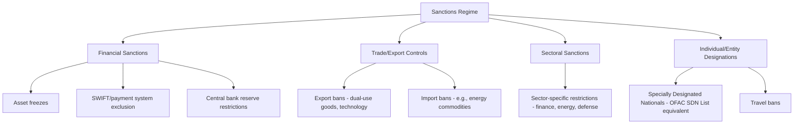
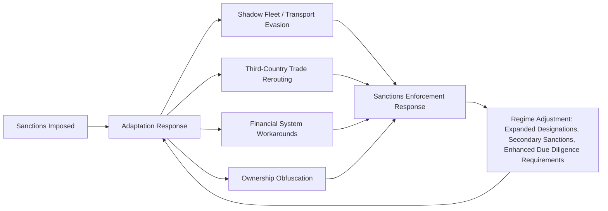

## Sanctions Regimes and Adaptation in Modern Conflicts

### Overview and Significance

Sanctions regimes imposed in response to modern conflicts — most extensively studied through the Russia sanctions regime following the 2014 Crimea annexation and especially the substantially expanded sanctions following the February 2022 full-scale invasion of Ukraine, alongside comparative cases such as Iran — provide the primary contemporary case study for geopolitical risk practitioners on both the design of large-scale coordinated sanctions programs and, critically, the systematic ways targeted states and entities adapt to evade or mitigate sanctions pressure over time. This case is central to modern corporate geopolitical risk practice because sanctions exposure and compliance complexity has grown substantially as a distinct, high-consequence risk category for multinational firms operating across an increasingly fragmented global regulatory landscape.

**Key Points**

- Modern large-scale sanctions regimes are coordinated multilaterally (US, EU, UK, and allied jurisdictions) far more extensively than earlier historical sanctions episodes, though coordination is not always fully aligned across jurisdictions in scope or timing
- Sanctioned states and entities have developed increasingly sophisticated adaptation strategies, making sanctions effectiveness assessment and evasion-risk monitoring a distinct, technically demanding analytical discipline
- Sanctions compliance has become a major corporate geopolitical risk category in its own right, carrying severe penalty exposure (including for firms with no direct sanctioned-country presence, via secondary sanctions and extraterritorial enforcement)

### Sanctions Regime Design: Core Instruments

- **Financial sanctions**: asset freezes, exclusion from international payment/messaging systems (e.g., SWIFT exclusion applied to designated Russian banks), and restrictions on central bank foreign reserve access
- **Trade and export controls**: restrictions on export of specific goods and technologies (particularly dual-use and advanced technology items, e.g., semiconductor-related export controls), and import restrictions on specific commodities (e.g., price-cap mechanisms and import bans on Russian energy exports)
- **Sectoral sanctions**: restrictions targeting entire economic sectors (financial services, energy, defense) rather than only specific named entities
- **Individual and entity designations**: sanctions lists naming specific individuals, companies, and government entities (e.g., the US Treasury's OFAC Specially Designated Nationals list and equivalent EU, UK, and allied-jurisdiction lists), triggering asset freezes and prohibition on transactions with designated parties

#### Primary vs. Secondary Sanctions

A critical technical distinction for corporate risk assessment: **primary sanctions** restrict the sanctioning jurisdiction's own persons and entities from transacting with sanctioned targets; **secondary sanctions** extend consequences to third-country entities that transact with sanctioned parties, even absent any direct nexus to the sanctioning jurisdiction — creating extraterritorial compliance exposure that has become a major corporate risk category, since a firm with no US or EU presence can still face significant penalty risk under some secondary sanctions authorities if it conducts business with sanctioned counterparties.

[Inference] The legal scope and enforcement practice around secondary sanctions varies significantly by sanctioning jurisdiction and specific sanctions program, and firms typically require specialized sanctions counsel to assess specific transaction exposure rather than relying on general principles alone — this is a genuinely complex and evolving area of law that I would not attempt to characterize with a single universal rule.

### Adaptation and Evasion Strategies: A Central Analytical Focus

A defining feature of the post-2014 and especially post-2022 Russia sanctions case, and a core reason this case is used for training modern sanctions-risk analysts, is the extensively documented range of adaptation strategies deployed by sanctioned states, entities, and their counterparties to mitigate sanctions impact.

#### Shadow Fleet and Transportation Evasion

Extensive use of aging tankers operating outside traditional Western-flagged and Western-insured shipping networks (often referred to as a "shadow fleet" or "dark fleet") to continue exporting sanctioned energy commodities, frequently employing techniques such as ship-to-ship transfers, AIS transponder manipulation or disabling to obscure vessel location and origin, and reflagging to jurisdictions with lower compliance scrutiny.

#### Trade Rerouting and Third-Country Intermediation

Increased trade flows routed through third countries not party to the sanctions regime, sometimes involving legitimate arm's-length trade diversion and sometimes involving deliberate transshipment or re-labeling schemes designed to obscure the true origin or destination of sanctioned goods, complicating export control enforcement for dual-use and restricted technology items in particular.

#### Financial System Workarounds

Development of alternative payment and settlement mechanisms, increased use of cryptocurrency and non-traditional financial channels in some documented cases, and expanded use of banking relationships in non-sanctioning jurisdictions to maintain international financial connectivity despite exclusion from primary Western financial infrastructure.

#### Shell Companies and Ownership Obfuscation

Use of complex multi-jurisdictional corporate ownership structures to obscure beneficial ownership and evade entity-level sanctions designations, a long-standing sanctions evasion technique that has required corresponding evolution in beneficial ownership transparency requirements and enhanced due diligence practices by compliance functions.

[Inference] The scale and effectiveness of these various adaptation strategies is an area of active, ongoing analysis by sanctions researchers, financial intelligence units, and specialized commercial data providers, and quantitative estimates of, for example, what proportion of sanctioned trade continues to flow through evasion channels vary across sources and methodologies; I would treat any specific quantitative claim on this topic as requiring verification against current, dated sources rather than a stable, settled figure, given how actively both the evasion techniques and the countermeasures continue to evolve.

### Sanctions Effectiveness: A Genuinely Contested Assessment

Whether large-scale sanctions regimes achieve their stated policy objectives (behavior change, conflict resolution, regime pressure) is a substantively and methodologically difficult question, and a core analytical challenge for risk practitioners assessing sanctions-related scenarios.

- **Economic impact versus political objective attainment**: sanctions can impose substantial, well-documented economic costs on a targeted economy (reduced GDP growth, currency pressure, reduced access to technology and capital) without necessarily achieving the underlying political objective (e.g., ending a conflict or reversing a specific policy), and analysts should treat these as analytically distinct questions rather than assuming economic pain straightforwardly translates into policy change
- **Adaptation erosion of intended impact over time**: the adaptation strategies described above mean sanctions effectiveness is not static — initial economic shock effects often partially erode as targeted economies and entities adapt, requiring ongoing analytical reassessment rather than a one-time effectiveness judgment at the point of sanctions imposition
- **Distributional effects within the targeted economy**: sanctions impact is frequently unevenly distributed, sometimes disproportionately affecting broader populations or specific economic sectors rather than the specific political or military decision-makers the sanctions are nominally intended to pressure — a point of extensive academic and policy debate regarding sanctions design and targeting precision

[Inference] Sanctions effectiveness is one of the most extensively studied and genuinely contested questions in the broader economic statecraft literature, with a substantial body of academic research reaching mixed conclusions depending on the specific sanctions case, time horizon, and definition of "effectiveness" employed; I would present any specific effectiveness claim about a current, ongoing sanctions regime with explicit reference to the genuine methodological difficulty and contestation in this literature, rather than as a settled empirical fact.

### Corporate Compliance and Risk Management Implications

#### Escalating Compliance Complexity

The scale, speed of expansion, and multi-jurisdictional (not always fully harmonized) nature of modern sanctions regimes has substantially increased compliance burden for multinational firms, requiring sophisticated screening systems, ongoing monitoring of frequently-updated designation lists, and specialized legal expertise — a direct driver of increased investment in dedicated sanctions compliance functions, often working in close coordination with the broader geopolitical risk function (see Building an Internal Geopolitical Risk Function).

#### Supply Chain Due Diligence Burden

Given documented evasion techniques involving trade rerouting and ownership obfuscation, firms face substantially elevated due diligence burden to ensure supply chain counterparties are not inadvertently facilitating sanctions evasion — extending compliance risk beyond direct counterparties to multi-tier supply chain relationships, a significant operational and cost burden for firms with complex global supply chains.

#### Secondary Sanctions Exposure for Non-Direct Participants

As noted above, firms without direct operations in or trade with a sanctioned jurisdiction can still face material sanctions risk exposure through secondary sanctions authorities if their broader counterparty network includes entities transacting with sanctioned parties — requiring risk assessment that extends well beyond a firm's own direct market footprint.

#### Rapid Regime Evolution Requiring Continuous Monitoring

Given the extensively documented adaptation-and-countermeasure cycle described above, sanctions regimes are not static rule sets but continuously evolving frameworks, requiring ongoing monitoring rather than a one-time compliance assessment at the point of initial sanctions imposition — directly reinforcing the early-warning indicator and continuous monitoring practices discussed in Building an Internal Geopolitical Risk Function.

### Analytical Lessons for Geopolitical Risk Practice

#### Lesson: Treat Sanctions Effectiveness Assessment as Genuinely Uncertain, Not Assumed

Given the substantively contested nature of sanctions effectiveness in the broader literature, risk analysts should avoid assuming a straightforward, linear relationship between sanctions imposition and desired policy outcomes, and should explicitly flag this uncertainty in scenario planning and forecasting work involving sanctions-related dynamics (see Communicating Uncertainty and Confidence Levels).

#### Lesson: Model the Adaptation-Countermeasure Cycle, Not a Static Snapshot

Sanctions risk assessment should explicitly account for the dynamic, iterative nature of sanctions regimes — adaptation strategies by targeted parties, followed by countermeasure adjustments by sanctioning authorities, followed by further adaptation — rather than treating a sanctions regime's initial scope as a fixed, unchanging constraint for the duration of a conflict or dispute.

#### Lesson: Extend Compliance Risk Assessment Beyond Direct Market Exposure

The secondary sanctions and supply chain evasion dynamics discussed above reinforce that sanctions risk assessment must extend beyond a firm's own direct operational footprint to encompass its full counterparty and supply chain network, given the demonstrated ability of evasion schemes to obscure ultimate beneficiaries and transaction chains.

#### Lesson: Coordinate Sanctions Monitoring Closely with the Broader Geopolitical Risk Function

Given the close linkage between sanctions regime evolution and the broader conflict or political dynamics driving it, effective sanctions compliance monitoring benefits substantially from close integration with the broader geopolitical risk and intelligence function rather than being treated as a purely legal/compliance exercise disconnected from broader conflict trajectory analysis.

### Comparative Context

The Russia sanctions case is commonly studied alongside the Iran sanctions regime (a long-running, multi-decade case with its own extensively documented evasion and adaptation history) and historical cases such as South Africa apartheid-era sanctions, offering comparative perspective on how sanctions regime design, effectiveness, and evasion dynamics vary across different targeted-state characteristics, sanctions coalition breadth, and time horizons.

**Related Topics**

- Building an internal geopolitical risk function (sanctions compliance integration)
- Economic statecraft and the broader sanctions effectiveness literature
- The Iran sanctions regime as a comparative long-running case study
- Export control regimes and dual-use technology restriction frameworks
- Beneficial ownership transparency and shell company due diligence
- Communicating uncertainty and confidence levels (sanctions effectiveness assessment under genuine contestation)
- Crisis management and business continuity planning (sanctions-triggered operational contingency planning)
- Supply chain due diligence and multi-tier counterparty risk assessment