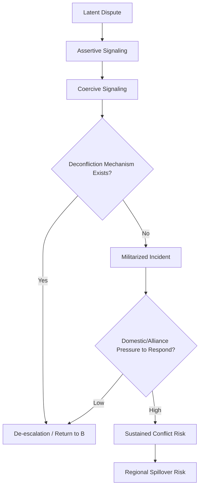

## Escalation Risk in Contested Maritime and Border Zones

### Definitional Framework

Escalation risk refers to the probability that a low-intensity incident—a naval encounter, a border skirmish, a fishing dispute—transitions into a higher-intensity confrontation involving military force, formal state commitments, or broader regional conflict. In geopolitical risk analysis, this is treated as a distinct analytical object from the underlying territorial dispute itself. A dispute can remain latent (unresolved but stable) for decades; escalation risk measures the probability and pathways by which that latency breaks down.

Analysts typically decompose escalation into stages:

- **Latent dispute**: Competing claims exist but no active contestation of control.
- **Assertive signaling**: Patrols, base construction, legal filings, resource exploration.
- **Coercive signaling**: Blockades, exclusion zones, live-fire exercises, ramming incidents.
- **Militarized incident**: Direct use of force with casualties or material damage, short of declared war.
- **Sustained conflict**: Organized, repeated use of force involving state military assets.

This staged model matters because most contested zones cycle between the first three stages indefinitely; analysts are usually forecasting movement between stages rather than binary war/no-war outcomes.

### Core Drivers of Escalation

**Structural drivers** set the baseline probability of friction:

- Overlapping Exclusive Economic Zone (EEZ) or continental shelf claims under UNCLOS, especially where resource value (hydrocarbons, fisheries, seabed minerals) is high or perceived to be high.
- Ambiguous or undemarcated land borders inherited from colonial-era treaties, armistice lines, or uti possidetis principles.
- Asymmetries in military capability that create incentives for the stronger party to test limits, or for the weaker party to use asymmetric tactics (gray-zone operations, proxy forces).
- Domestic legitimacy needs, where nationalist sentiment around a contested zone becomes politically useful, raising the cost of de-escalation for leaders.

**Proximate triggers** are the specific events that convert structural risk into an active incident:

- Unplanned encounters between military or paramilitary vessels/patrols operating without agreed rules of the road.
- Unilateral infrastructure moves (artificial island construction, border fence extension, dam or resource extraction projects).
- Domestic political shocks (leadership transitions, economic crises) that increase incentives for external diversion.
- Third-party involvement, including alliance guarantees, freedom-of-navigation operations, or arms transfers that alter the local balance.

### Analytical Frameworks for Assessment

**1. Escalation Ladder Analysis**

Adapted from Herman Kahn's Cold War escalation ladder framework, analysts map contested zones onto a rung-based scale of intensity, then assess:

- Current rung occupied by each actor.
- Rate and direction of movement over time (trend analysis).
- "Rungs skipped"—sudden jumps that indicate loss of control or deliberate signaling rather than incremental testing.

**2. Deterrence and Compellence Modeling**

Drawing on Schelling's bargaining theory, escalation risk is modeled as a function of:

$$P_{escalation} = f(C_a, C_b, R_a, R_b, I)$$

where $C_a$ and $C_b$ represent each actor's cost tolerance, $R_a$ and $R_b$ represent resolve (willingness to bear costs), and $I$ represents the quality of crisis communication infrastructure (hotlines, deconfliction mechanisms). Lower $I$ increases the probability that miscalculation—rather than deliberate choice—drives escalation. [Inference] This formalization is a heuristic simplification used in academic and think-tank modeling; it is not a validated predictive equation with empirically fitted coefficients.

**3. Gray-Zone / Salami-Slicing Detection**

Many contested maritime and border zones exhibit "salami-slicing"—a sequence of small, individually sub-threshold actions that cumulatively shift the status quo without triggering a proportionate response. Analysts track this through:

- Frequency and duration of incursions or patrol overlaps over rolling windows (e.g., monthly incursion counts into another party's claimed waters or airspace).
- Change in baseline presence (permanent structures, personnel rotations, administrative acts like issuing passports or holding elections in disputed territory).
- Response asymmetry—whether the disadvantaged party's responses are proportionate, delayed, or absent, which signals tolerance thresholds to the initiating party.

**4. Indicators and Warning (I&W) Methodology**

Standard intelligence community practice for contested zones uses tiered indicator sets:

- **Strategic indicators**: Doctrine shifts, defense budget reallocation toward relevant theater, alliance consultations.
- **Operational indicators**: Force posture changes, logistics buildup, exercise patterns, NOTAM/NAVAREA warnings.
- **Tactical indicators**: Real-time vessel/aircraft tracking (AIS, ADS-B), communications intercepts (where available to state actors), incident reports.

### Illustrative Escalation Pathway (Diagram)

### Case Pattern Comparison

| Zone Type | Primary Driver | Typical Escalation Ceiling | Key Mitigating Mechanism |
| --- | --- | --- | --- |
| Maritime EEZ overlap (resource-driven) | Hydrocarbon/fishery value | Coercive signaling, rare militarized incidents | Joint development agreements, arbitration (e.g., UNCLOS Annex VII tribunals) |
| Undemarcated land border (colonial legacy) | Sovereignty/nationalism | Militarized incident, contained | Bilateral border commissions, confidence-building measures |
| Alliance-backed contested strait/island | Great-power competition | Sustained conflict risk (structural) | Extended deterrence signaling, crisis hotlines |
| Riverine/transboundary water dispute | Resource scarcity, downstream dependency | Assertive/coercive signaling | Water-sharing treaties, basin commissions |

[Inference] This table generalizes recurring patterns observed across multiple contested zones; specific cases may deviate significantly based on local political conditions, and it should not be read as a predictive classification for any single named dispute.

### Worked Example: Analytical Walkthrough

**Example:** Consider a hypothetical maritime zone where two states, A and B, both claim an EEZ overlap containing a fishing bank and a possible gas field.

1. **Baseline mapping**: Establish claim lines under UNCLOS Article 57 (200nm EEZ) and identify overlap area in square kilometers.
2. **Actor capability assessment**: Compare coast guard and naval tonnage, patrol frequency, and legal assertiveness (has either party filed with the International Tribunal for the Law of the Sea or initiated Annex VII arbitration?).
3. **Trigger monitoring**: Track fishing fleet incursions (count/month), coast guard shadowing incidents, and any exploratory drilling announcements.
4. **Escalation ladder placement**: If State A begins escorting fishing fleets with armed coast guard vessels, this moves the dispute from "assertive signaling" to "coercive signaling."
5. **Forecast output**: Given historical incident frequency and lack of a bilateral hotline, assign a probability band (e.g., low/moderate/high) for a militarized incident within a defined forecast window (e.g., 12 months), explicitly flagging this as a probabilistic judgment rather than a prediction.

### Data Sources and Monitoring Tools

- **AIS (Automatic Identification System)** and **ADS-B** tracking for vessel and aircraft movement patterns near contested zones.
- **Satellite imagery analysis** (commercial providers) for infrastructure construction, military buildup, or fishing fleet activity.
- **NOTAM/NAVAREA warnings** issued by states, which often precede exercises or exclusion zone declarations.
- **Legal filings** with international bodies (ICJ, PCA, ITLOS) as formal escalation-alternative signals.
- **Open-source incident databases** (e.g., ACLED for some border conflict zones, though maritime coverage is uneven) [Unverified: coverage completeness varies by region and should be checked against the specific zone under analysis].

### Key Points

- Escalation risk is a distinct variable from dispute existence; most contested zones are chronically disputed but rarely escalate to sustained conflict.
- Structural drivers (resource value, capability asymmetry, domestic politics) set baseline risk; proximate triggers (incidents, infrastructure moves) convert that baseline into active crises.
- The absence of crisis communication infrastructure (hotlines, deconfliction protocols) is one of the most consistently cited factors increasing miscalculation-driven escalation.
- Salami-slicing tactics are designed specifically to stay below the threshold that would trigger a proportionate or allied response; detecting them requires trend analysis over incident frequency, not single-event assessment.
- Analytical outputs should be expressed as probability bands over defined time windows, not binary predictions, given the inherent uncertainty in modeling state behavior.

### Related Topics

- UNCLOS dispute resolution mechanisms (Annex VII arbitration, ITLOS proceedings)
- Gray-zone warfare and hybrid conflict doctrine
- Crisis communication and deconfliction hotline design
- Alliance entrapment and abandonment dynamics in territorial disputes
- Nationalism and domestic legitimacy as conflict drivers
- Satellite imagery and open-source intelligence (OSINT) methodologies for conflict monitoring
- Comparative case study: South China Sea claims architecture
- Comparative case study: India-Pakistan Line of Control dynamics
- Comparative case study: Eastern Mediterranean EEZ disputes (Greece-Turkey, Cyprus-Turkey)
- Transboundary water conflict frameworks (Nile Basin, Indus Waters Treaty)