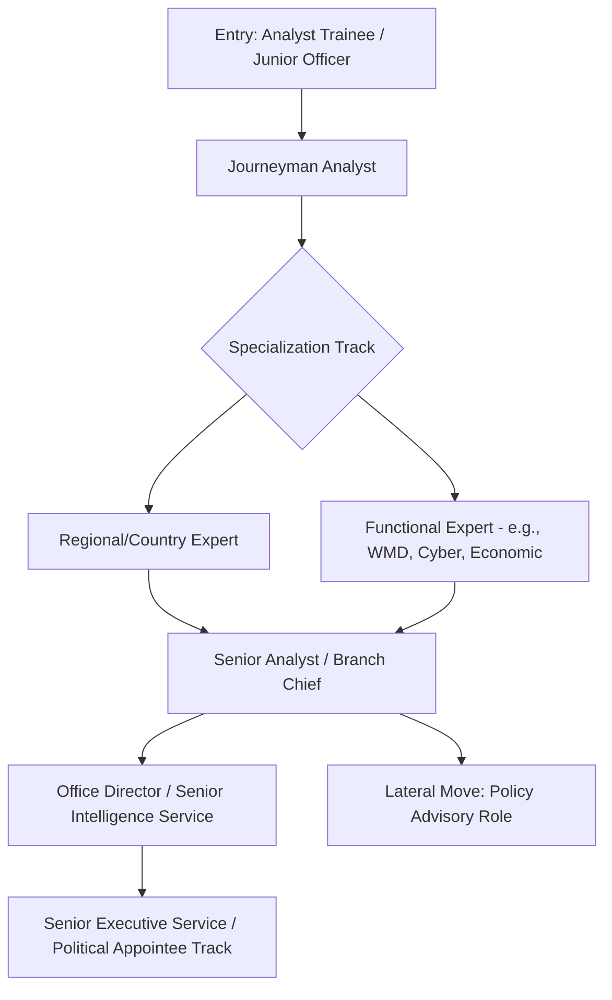

## Career Paths in Government and Intelligence

### Overview of the Field

Government and intelligence careers in geopolitical risk analysis span a spectrum from policy-facing generalist roles to highly specialized technical analytic functions. Unlike private-sector risk consulting, government roles typically require security clearances, involve formal analytic tradecraft standards, and are structured around civil service or military career ladders rather than market-driven compensation. Understanding this ecosystem requires distinguishing between the type of institution, the analytic function performed, and the entry pathway required.

### Institutional Categories

**1. Intelligence Community (IC) Agencies**

In the U.S. context, the IC comprises 18 member organizations coordinated under the Office of the Director of National Intelligence (ODNI). Key employers of geopolitical risk analysts include:

- **Central Intelligence Agency (CIA)** — Directorate of Analysis produces all-source assessments on foreign political, economic, and military developments.
- **Defense Intelligence Agency (DIA)** — Military-focused intelligence supporting the Department of Defense and combatant commands.
- **State Department Bureau of Intelligence and Research (INR)** — Diplomatically-oriented analysis supporting policy formulation.
- **National Geospatial-Intelligence Agency (NGA)** and **National Security Agency (NSA)** — Technical collection disciplines (GEOINT, SIGINT) with analytic components.
- Comparable structures exist in other states: the UK's Joint Intelligence Organisation (JIO), Germany's Bundesnachrichtendienst (BND), and equivalents elsewhere, each with distinct entry requirements and clearance regimes. [Unverified: specific organizational structures and entry requirements change over time and should be verified against current official sources for the jurisdiction in question.]

**2. Diplomatic and Foreign Policy Bodies**

- Foreign/diplomatic services (e.g., U.S. Foreign Service, UK Diplomatic Service) employ political and economic officers who produce field-based reporting that functions as raw analytic input.
- Ministries of foreign affairs maintain policy planning staffs that synthesize risk assessments for senior decision-makers.

**3. Defense and Military Analytic Roles**

- Uniformed intelligence officer career tracks within national militaries.
- Civilian analyst positions embedded in defense ministries, war colleges, and combatant command staffs.
- Multinational bodies such as NATO's intelligence and assessment structures.

**4. Legislative and Oversight Bodies**

- Congressional/parliamentary research services and committee staff roles (e.g., U.S. Congressional Research Service, House/Senate Intelligence Committee staff) that produce risk assessments for legislators.
- Government Accountability Office (GAO) or equivalent bodies conducting risk-relevant program evaluations.

**5. International and Multilateral Organizations**

- UN Department of Political and Peacebuilding Affairs (DPPA), World Bank fragility/conflict units, and regional bodies (EU External Action Service, African Union) that employ political risk analysts, though these are not "government" roles in the national sense and often have different clearance/citizenship requirements.

### Core Analytic Functions Within Government

| Function | Description | Typical Output |
| --- | --- | --- |
| Current intelligence | Near-term event monitoring and rapid assessment | Daily briefs (e.g., President's Daily Brief analog) |
| Strategic/long-term analysis | Multi-year trend forecasting on state behavior, capability development | National Intelligence Estimates (NIEs) or equivalents |
| Warning analysis | Dedicated indications & warning (I&W) for crisis/conflict onset | Warning memoranda, watch lists |
| Targeting/operational support | Analysis directly supporting military or covert operations | Operational assessments (higher clearance tiers) |
| Economic/financial intelligence | Sanctions evasion, economic coercion, resource flows | Economic assessments, sanctions risk products |

[Inference] This functional breakdown reflects commonly described IC structures in open-source literature on intelligence analysis; exact product names and organizational divisions vary by country and change over time.

### Entry Pathways

**Academic preparation:**

- Undergraduate/graduate degrees in international relations, political science, area studies, economics, data science, or regional languages are common but not universally required.
- Programs with direct pipelines include war colleges, national security fellowships, and university programs with IC partnerships (e.g., Centers of Academic Excellence in the U.S. context).

**Direct entry routes:**

- Agency-specific analyst trainee programs (structured onboarding with rotational assignments).
- Military intelligence officer commissioning (ROTC, service academies, officer candidate school routes).
- Presidential Management Fellows or equivalent government-wide fellowship programs feeding into analytic roles.

**Lateral entry:**

- Mid-career transitions from academia, journalism, or private-sector risk consulting, particularly for regional/language expertise or technical specialties (cyber, WMD, economic statecraft).
- Reservist or National Guard intelligence billets as a bridge between civilian and government/military analytic work.

**Clearance process (a defining structural feature):**

- Government/intelligence analytic roles typically require a background investigation and adjudication process before or shortly after hire, which can take many months and includes financial history review, foreign contacts disclosure, and polygraph examination for higher-tier clearances in some agencies.
- Dual citizenship, significant foreign residency, or certain foreign contacts can complicate or disqualify candidates depending on agency policy. [Unverified: specific disqualifying criteria vary by agency and are subject to policy change; candidates should consult official agency guidance directly.]

### Career Progression Pattern

### Skills Emphasized in Government Analytic Tradecraft

- **Structured Analytic Techniques (SATs)**: Formal methods such as Analysis of Competing Hypotheses (ACH), Key Assumptions Check, and Devil's Advocacy, codified in tradecraft standards (e.g., U.S. Intelligence Community Directive 203).
- **Source evaluation and sourcing discipline**: Rigorous standards for citing and caveating classified and open-source material, with explicit confidence-level language ("high confidence," "moderate confidence," "low confidence") distinct from probability language used in academic or private-sector work.
- **Writing for the consumer**: Government analytic writing (e.g., BLUF—Bottom Line Up Front—structure) differs stylistically from academic or journalistic writing, emphasizing brevity and actionability for time-constrained policymakers.
- **Regional/language proficiency**: Often formally tested and compensated (e.g., language incentive pay in some systems), and can be a decisive differentiator in hiring.

### Comparison: Government vs. Private-Sector Risk Analysis Careers

| Dimension | Government/Intelligence | Private Sector (consultancies, banks, corporates) |
| --- | --- | --- |
| Clearance requirement | Usually mandatory | Rarely required |
| Compensation structure | Fixed civil service scales, slower growth | Market-driven, higher ceiling but variable |
| Access to classified sources | Yes (tiered by clearance) | No — open-source and proprietary data only |
| Output audience | Policymakers, military commanders | Clients, investors, corporate leadership |
| Mobility between employers | Constrained by clearance transfer processes | Higher lateral mobility |
| Typical entry age/pathway | Structured early-career pipelines common | More flexible, lateral entry common |

**Example:** A candidate with a master's degree in Middle East studies and Arabic proficiency might enter as a CIA analyst trainee, spend several years as a country desk analyst, transition to a warning analysis role during a period of regional instability, and later move laterally to a State Department INR position or a think tank—each move altering their clearance status, writing style requirements, and analytic audience.

### Practical Considerations for Career Planning

- **Clearance portability**: Clearances are generally not automatically transferable between agencies without reinvestigation, which affects lateral mobility timing.
- **Geographic concentration**: Many roles cluster around capital regions (e.g., the Washington D.C. metro area in the U.S. context), which is a practical relocation consideration.
- **Public vs. covert track distinction**: Career paths diverge significantly between overt analytic positions (publicly acknowledged agency employment) and clandestine operational tracks, with different lifestyle, travel, and disclosure implications.
- **Political appointee vs. career civil service distinction**: Senior leadership positions may be politically appointed and change with administrations, while the analytic workforce beneath them is typically career civil service, providing continuity.

### Key Points

- Government and intelligence analytic careers are structurally distinct from private-sector risk roles primarily due to clearance requirements, classified source access, and formal tradecraft standards.
- Entry pathways include structured trainee programs, military commissioning, fellowships, and mid-career lateral moves, with academic background in IR, area studies, or technical fields being common but not exclusively required.
- Career progression typically bifurcates into regional/country expertise or functional/technical specialization before consolidating into senior analytic or leadership roles.
- Clearance processes are a defining bottleneck and risk factor in career planning, given lengthy adjudication timelines and portability limitations across agencies.

### Related Topics

- Structured Analytic Techniques (ACH, Key Assumptions Check) in practice
- Security clearance process and adjudication criteria
- Intelligence Community Directive 203 and analytic tradecraft standards
- Foreign Service Officer career track and entry examinations
- Transitioning from government intelligence to private-sector risk consulting
- Warning intelligence and the role of the National Intelligence Officer for Warning
- Comparative national intelligence structures (Five Eyes vs. non-aligned states)
- Ethics and oversight mechanisms in intelligence analysis