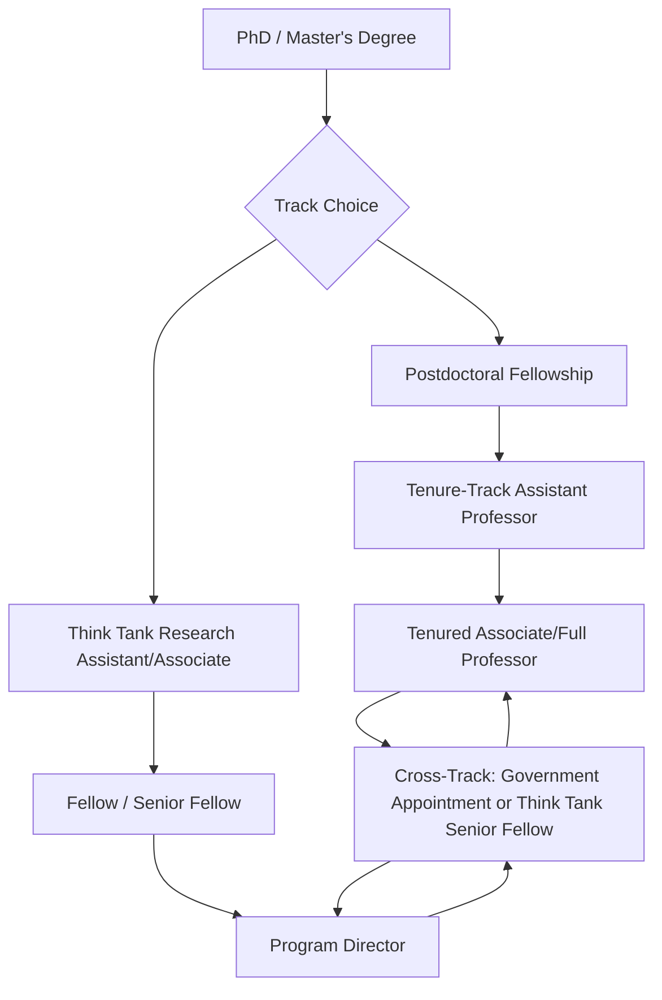

## Opportunities in Think Tanks and Academia

### Overview of the Field

Think tanks and academic institutions form a distinct career track for geopolitical risk analysts, positioned between government service and private-sector consulting. Unlike government roles, these positions generally do not require security clearances and rely on open-source research, published scholarship, and public-facing analysis. The defining features of this track are intellectual independence, publication-driven output, and a dual mandate of policy relevance and scholarly rigor that varies significantly by institution type.

### Institutional Categories

**1. Policy-Oriented Think Tanks**

Organizations producing applied, near-term policy analysis for government, media, and business audiences:

- **Foreign policy-focused**: Council on Foreign Relations, Chatham House (Royal Institute of International Affairs), International Institute for Strategic Studies (IISS), Brookings Institution.
- **Security/defense-focused**: RAND Corporation, Center for Strategic and International Studies (CSIS), Atlantic Council.
- **Regional specialists**: Carnegie Endowment (with regional centers), Middle East Institute, Asia Society Policy Institute.

These institutions vary along an ideological spectrum and funding model (government contracts, corporate donors, foundation grants, membership dues), which shapes both research agendas and perceived independence. [Unverified: specific funding structures and ideological positioning change over time and are often contested; analysts should consult institutional disclosures directly.]

**2. Academic Institutions**

- University departments (political science, international relations, security studies) offering faculty positions with research and teaching responsibilities.
- Dedicated research centers and institutes housed within universities (e.g., area studies centers, conflict research institutes) that may operate with more applied, policy-facing mandates than traditional departments.
- Professional schools (schools of international affairs, public policy schools) that blend academic rigor with practitioner-oriented training and often serve as hiring pipelines between academia and government/think tank roles.

**3. Hybrid and Boundary Institutions**

- University-affiliated but operationally independent research centers (e.g., federally funded research and development centers in some national systems) that combine academic credibility with government-adjacent funding and access.
- Think tanks with formal academic affiliations or joint appointments, blurring the line between the two tracks.

### Core Functional Roles

| Role Type | Typical Institution | Primary Output |
| --- | --- | --- |
| Research fellow / senior fellow | Think tank | Policy briefs, op-eds, testimony |
| Program/project director | Think tank | Grant-funded research agendas, team management |
| Faculty (assistant/associate/full professor) | University | Peer-reviewed publications, teaching |
| Postdoctoral researcher | University/research center | Publications, grant applications, limited teaching |
| Research assistant/associate | Either | Data collection, literature review, drafting support |
| Nonresident/adjunct fellow | Think tank | Part-time contribution alongside primary employment |

### Entry Pathways

**Academic track (university-bound careers):**

- Requires a PhD in political science, international relations, economics, history, or a related field for tenure-track faculty positions; the process typically involves multi-year doctoral study, a dissertation, and a competitive academic job market.
- Postdoctoral fellowships (often 1-2 years) serve as an intermediate step between doctoral completion and tenure-track hiring, particularly in fields with tight faculty markets.
- Publication record in peer-reviewed journals is the primary currency for hiring and promotion (tenure review), evaluated through metrics such as journal ranking, citation counts, and increasingly, broader "impact" measures.

**Think tank track:**

- Entry points range from junior research assistant roles (often open to bachelor's/master's degree holders) to senior fellow positions typically requiring a PhD, extensive government experience, or a substantial public policy publication record.
- Many senior think tank fellows arrive via "revolving door" pathways—former government officials, diplomats, or military officers who bring institutional experience and networks rather than traditional academic credentials.
- Master's degrees in international affairs or public policy are common entry credentials for mid-level research roles, particularly from professional schools with strong placement pipelines.

**Cross-track mobility:**

- Movement between government, think tanks, and academia is common and often cyclical—a pattern sometimes called the "revolving door," where individuals move from academic or think tank roles into government appointments (particularly with administration changes in systems with political appointee turnover) and back again.
- Academic sabbaticals are sometimes used for temporary think tank or government placements without severing the academic position.

### Career Progression Pattern

### Comparison: Think Tank vs. Academic Career Tracks

| Dimension | Think Tank | Academia |
| --- | --- | --- |
| Primary output | Policy briefs, testimony, media commentary | Peer-reviewed articles, books |
| Timeline pressure | Fast (news-cycle to monthly) | Slow (multi-year publication cycles) |
| Audience | Policymakers, journalists, business leaders | Academic peers, students |
| Job security model | Grant/donor-dependent, often less stable | Tenure system provides long-term stability (post-tenure) |
| Credential requirement | Flexible (experience can substitute for PhD) | PhD generally required for faculty track |
| Public visibility | High (op-eds, media appearances expected) | Variable (depends on subfield and individual choice) |
| Funding dependency | Direct (donor/grant-driven research agendas) | Indirect (institutional salary; grants supplement) |

**Example:** A PhD graduate in international relations specializing in South Asian security might take a two-year postdoctoral fellowship at a university research center, publish in peer-reviewed journals to build a tenure case, simultaneously write shorter policy pieces for a think tank as a nonresident fellow to build public visibility, and eventually choose between a tenure-track offer and a full-time senior fellow position—each path trading off long-term academic stability against policy relevance and faster-paced influence.

### Practical Considerations for Career Planning

- **Funding volatility**: Think tank positions, especially grant-funded program roles, can be less stable than tenured academic positions, with funding cycles directly affecting staffing.
- **Publish-or-perish dynamics**: Academic tenure review timelines (commonly 5-7 years pre-tenure in many systems) impose a distinct career rhythm requiring sustained scholarly output before job security is achieved. [Unverified: specific tenure timelines vary substantially by country, institution type, and discipline.]
- **Public commentary expectations**: Think tank roles typically expect regular media engagement (op-eds, interviews, congressional/parliamentary testimony), which is a skill set distinct from academic writing and not universally comfortable for all analysts.
- **Geographic concentration**: Major think tanks cluster in capital cities (Washington D.C., London, Brussels), while academic positions are more geographically dispersed, affecting relocation flexibility.
- **Independence and funding transparency concerns**: Analysts should be aware that donor influence on research agendas is a recurring point of scrutiny in the think tank sector, relevant both to career choice and to the credibility assessment of think tank outputs used as sources elsewhere in risk analysis.

### Key Points

- Think tank and academic careers differ primarily in output format, timeline, and credentialing requirements, with think tanks offering more flexible entry and faster-paced influence, and academia offering structured credentialing and long-term stability via tenure.
- PhD credentials are effectively required for the academic faculty track but are one of several possible qualifications (alongside government experience) for think tank fellow positions.
- Cross-track mobility, including movement into and out of government service, is a defining and common feature of this career ecosystem rather than an exception.
- Funding model and donor transparency are practical career considerations and also relevant to evaluating the credibility of think tank output as a source in broader risk analysis work.

### Related Topics

- Peer review process and academic publishing in international relations
- Think tank funding models and donor transparency debates
- The "revolving door" between government, academia, and think tanks
- Public policy schools as hybrid academic-practitioner training pipelines
- Op-ed writing and public communication skills for policy analysts
- Grant writing and research funding mechanisms (foundations, government contracts)
- Nonresident and adjunct fellow models as career supplements
- Comparative institutional independence: government-funded vs. privately-funded think tanks