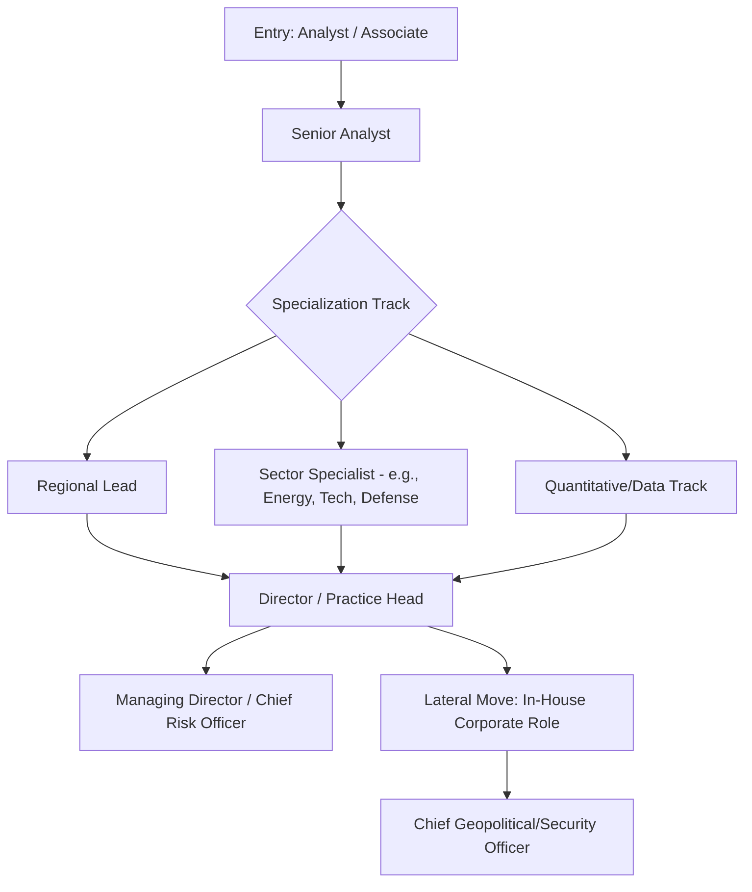

## Corporate and Financial-Sector Risk Roles

### Overview of the Field

Corporate and financial-sector risk roles apply geopolitical risk analysis to commercial decision-making rather than policy formulation. The defining feature of this track is that outputs must translate political and security developments into business-relevant terms—financial exposure, operational continuity, supply chain resilience, or investment return—for an audience of executives, portfolio managers, and boards rather than policymakers. Unlike government or think tank roles, success is measured by decision utility to a paying client or internal business unit, not by classified access or scholarly publication.

### Institutional Categories

**1. Political Risk Consultancies**

Dedicated firms selling geopolitical risk analysis as a product:

- Standalone specialist firms (e.g., Eurasia Group, Control Risks, Verisk Maplecroft, S-RM) offering subscription research, bespoke advisory, and forecasting products.
- Risk practices embedded within larger professional services firms (e.g., political/country risk teams inside major consulting or insurance brokerage firms).
- Boutique regional specialists focused on specific geographies or sectors (e.g., extractives-focused political risk advisors).

**2. Financial Institutions**

- **Investment banks**: Geopolitical/macro strategy teams within research divisions, informing trading desks and institutional clients.
- **Asset managers and hedge funds**: In-house geopolitical analysts advising portfolio managers on country and sector allocation; some funds run dedicated "macro" or "event-driven" strategies built around geopolitical catalysts.
- **Sovereign wealth funds and pension funds**: Long-horizon risk assessment supporting strategic asset allocation across jurisdictions.
- **Credit rating agencies**: Sovereign risk analysts (e.g., at agencies producing sovereign credit ratings) assessing political stability as an input to creditworthiness.
- **Insurance and reinsurance**: Political risk insurance underwriters (e.g., covering expropriation, political violence, currency inconvertibility) and specialty lines at Lloyd's-type markets.

**3. Corporate In-House Risk Functions**

- Multinational corporations with dedicated geopolitical risk or "global security" functions, common in extractives (oil, gas, mining), infrastructure, defense contracting, and technology sectors with significant cross-border exposure.
- Enterprise risk management (ERM) departments that incorporate geopolitical risk as one category alongside operational, financial, and cyber risk.
- Government affairs / public policy teams that overlap with geopolitical risk functions, particularly around regulatory and sanctions risk.

**4. Data and Analytics Providers**

- Firms building quantitative risk indices and monitoring platforms (e.g., country risk scoring products) that employ analysts to construct and validate models rather than produce narrative reporting alone.

### Core Functional Roles

| Role Type | Typical Employer | Primary Output |
| --- | --- | --- |
| Political risk analyst/associate | Consultancy, bank | Country reports, scenario briefs |
| Sovereign risk analyst | Rating agency, asset manager | Credit risk assessments, ratings input |
| Geopolitical strategist | Investment bank, hedge fund | Market-moving event analysis, trade recommendations |
| Political risk underwriter | Insurer/reinsurer | Policy pricing, exposure assessment |
| Corporate security/intelligence analyst | Multinational corporation | Duty-of-care assessments, operational risk briefs |
| ESG/regulatory risk analyst | Asset manager, corporation | Sanctions/compliance exposure analysis |
| Quantitative risk modeler | Data/analytics provider | Country risk indices, scoring models |

### Entry Pathways

**Academic preparation:**

- Degrees in international relations, economics, finance, or political science are common; quantitative roles increasingly value data science, statistics, or econometrics backgrounds alongside regional expertise.
- Master's degrees (MBA, MA in international affairs, MSc in finance) are frequently preferred or required for analyst-level entry at consultancies and banks, though this varies significantly by firm and role seniority.

**Entry routes:**

- Graduate analyst programs at major banks and consultancies, often structured as 1-2 year rotational schemes.
- Direct hire into political risk consultancy research teams, sometimes from academic or think tank backgrounds bringing regional expertise.
- Internal transfer from adjacent corporate functions (compliance, government affairs, corporate security) into dedicated geopolitical risk roles as companies formalize these functions.

**Lateral entry (a defining feature of this track):**

- Government/intelligence veterans (former diplomats, intelligence officers, military officers) are commonly recruited into senior political risk consultancy and corporate security roles for their networks and analytic tradecraft.
- Academic and think tank researchers move into financial-sector roles seeking higher compensation or more direct market impact for their regional expertise.
- This lateral flow is bidirectional and creates a career ecosystem that overlaps substantially with the government/intelligence and think tank/academic tracks discussed elsewhere in this chapter.

### Career Progression Pattern

### Comparison: Consultancy vs. In-House vs. Financial Institution Roles

| Dimension | Consultancy | In-House Corporate | Financial Institution |
| --- | --- | --- | --- |
| Client relationship | External, multiple clients | Internal stakeholders only | Internal trading/portfolio teams |
| Output cadence | Report/project-based | Continuous operational support | Market-hours responsiveness often required |
| Compensation structure | Base + bonus, client-billable pressure | Base + bonus, less billable pressure | Often highest ceiling, especially at hedge funds |
| Travel requirements | Frequently high (client sites, field research) | Variable (site visits, crisis response) | Generally lower |
| Analytic focus | Broad multi-client geographic/sector coverage | Deep focus on firm's specific footprint | Market-moving events, trade-relevant catalysts |
| Direct financial stakes in analysis | Indirect (client decisions) | Indirect (firm operations) | Direct (P&L impact of trades/positions) |

**Example:** An analyst with a master's degree in international affairs and regional expertise in Sub-Saharan Africa might begin as a junior analyst at a political risk consultancy producing country reports for extractive-sector clients, move to an in-house corporate security role at a mining company overseeing operational risk in the same region, and later transition to a sovereign risk analyst position at a credit rating agency—each move shifting the analytic output from advisory reporting toward direct decision inputs (credit ratings) with quantifiable financial consequences.

### Skills Emphasized in Corporate/Financial Risk Analysis

- **Financial literacy**: Understanding of how political risk translates into specific financial metrics (currency risk, sovereign spread movements, equity/bond price impact, insurance loss ratios) is a key differentiator from purely policy-oriented analysis.
- **Scenario and stress-testing methodology**: Constructing decision-relevant scenarios (e.g., probability-weighted outcomes for an election affecting currency convertibility) rather than purely descriptive assessments.
- **Client communication and commercial awareness**: Ability to translate complex political dynamics into concise, decision-actionable briefings for non-specialist business audiences, often under significant time pressure.
- **Quantitative modeling**: Increasing demand for analysts who can build or interpret country risk indices, econometric models, and machine-learning-assisted forecasting tools, rather than relying solely on qualitative judgment.
- **Sanctions and regulatory expertise**: Growing specialization given the expansion of sanctions regimes, export controls, and investment screening mechanisms as direct sources of corporate and financial risk.

### Practical Considerations for Career Planning

- **Compensation variance**: This track generally offers the highest compensation ceiling among the career paths discussed in this chapter, particularly at hedge funds and senior consultancy/corporate positions, though with correspondingly higher performance and billability pressure. [Inference] This is a widely observed pattern in career-track comparisons rather than a guaranteed outcome for any individual, given substantial variance by firm, role, and market conditions.
- **No clearance requirement (generally)**: Most corporate/financial roles do not require government security clearances, which increases hiring flexibility for dual nationals or those with disqualifying foreign contacts under government clearance standards, though sanctions-adjacent roles may involve their own compliance screening.
- **Market-hours responsiveness**: Roles supporting trading desks or portfolio managers often require real-time availability during market hours across relevant time zones, a distinct lifestyle consideration compared to government or academic schedules.
- **Reputational and legal exposure**: Corporate risk analysts, particularly in sanctions/compliance-adjacent roles, carry personal and institutional liability considerations tied to regulatory compliance that differ from the accountability structures in government or academic work.

### Key Points

- Corporate and financial-sector risk roles are distinguished by their translation function: converting political and security developments into financial or operational decision inputs for business audiences.
- This track spans political risk consultancies, financial institutions (banks, asset managers, rating agencies, insurers), in-house corporate functions, and data/analytics providers, each with distinct output formats and audiences.
- Lateral entry from government, intelligence, academic, and think tank backgrounds is a defining and common feature of this ecosystem, reflecting substantial cross-track mobility within the broader geopolitical risk profession.
- This track generally does not require security clearances and typically offers the highest compensation ceiling among the career paths in this chapter, at the cost of commercial performance pressure and, in some roles, market-hours responsiveness.

### Related Topics

- Political risk insurance and expropriation coverage mechanisms
- Sovereign credit rating methodology and political risk inputs
- Sanctions compliance and export control risk functions
- Enterprise risk management (ERM) frameworks and geopolitical risk integration
- Scenario planning and stress-testing methodologies for financial decision-making
- Country risk indices and quantitative scoring model construction
- Duty-of-care obligations and corporate security for multinational operations
- Cross-track mobility between government, academia, and the private sector