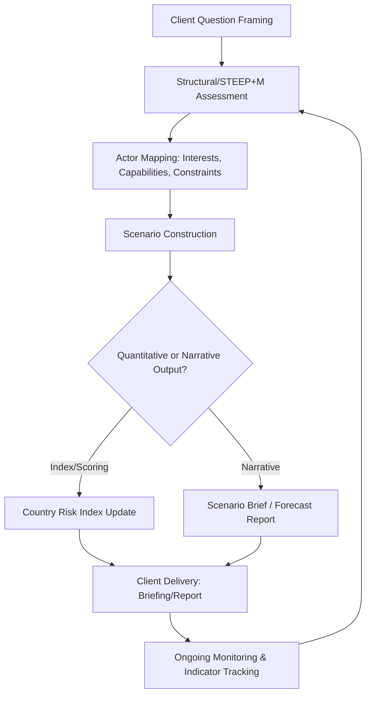

## Leading Geopolitical Risk Consultancies and Their Methodologies

### Overview of the Sector

The political and geopolitical risk consultancy sector comprises specialist firms that sell forward-looking political analysis as a commercial product, distinguishing themselves from government intelligence (clearance-based, policy-facing) and academic research (peer-reviewed, theory-driven) by competing on client-relevant, decision-actionable output. Key firms in this space include Eurasia Group, Control Risks, Stratfor (acquired by RANE Network in 2020), Oxford Analytica, and Verisk Maplecroft, each offering overlapping yet differentiated approaches to risk mitigation. Firms differentiate primarily along two axes: narrative/qualitative analysis versus quantitative/data-driven scoring, and advisory-only models versus integrated operational/security service delivery. [Grokipedia](https://grokipedia.com/page/Eurasia_Group)

### Firm Profiles and Methodological Positioning

**1. Eurasia Group**

Eurasia Group is positioned as a pure-play political risk and geopolitical advisory firm built around bespoke client analysis rather than operational fieldwork. Its advisory model is built around forward-looking political analysis, scenario planning, executive briefings, and direct access to country and thematic specialists, and the firm is particularly relevant for clients that need to understand how elections, great-power competition, industrial policy, sanctions, energy security, and geopolitical fragmentation may affect business outcomes. [Advisory Ranking](https://advisoryranking.com/news/2026/04/202604288615)

The firm's signature public product is its annual forecasting report. Top Risks is Eurasia Group's annual forecast of the political risks that are most likely to play out over the course of the year, with the most recent edition published in early January. This report functions as both a marketing artifact and a demonstration of methodology, ranking a fixed number of discrete risks by likely impact for the coming year. Distinct from Control Risks' fieldwork-heavy model, Eurasia Group's emphasis is on bespoke geopolitical strategy and direct analyst-client interaction, without the operational fieldwork that defines Control Risks' model. [Eurasia Group](https://www.eurasiagroup.net/issues/Top-Risks-2025-Implications-for-Europe)[Grokipedia](https://grokipedia.com/page/Eurasia_Group)

**2. Control Risks**

Control Risks is a global risk and strategic consulting firm that specializes in geo-political, security, technical, and integrity risk assessments, founded in 1975 and headquartered in London. Unlike pure analytic shops, it offers a wide range of services including cyber risk assessments, open source intelligence and threat monitoring, and building risk assessments, and originated from operational crisis response work. The firm was formed when a founder approached kidnap and ransom underwriters at Lloyd's to provide an insurance-backed service for organizations with employees exposed to kidnapping risk, with early work concentrated in Latin America before political and security risk analysts joined the crisis management specialists. This history explains why Control Risks extends beyond pure political risk into integrated security, compliance, and operational advisory, serving a broader client base that includes crisis response for multinationals in high-threat environments. [Control Risks +3](https://en.wikipedia.org/wiki/Control_Risks)

Control Risks' flagship public product is a geographic risk-rating output. The firm publishes 'RiskMap,' a forecast of business risk and geopolitical risks and trends, alongside a geopolitical calendar tracking events and anniversaries worldwide. The most recent RiskMap edition characterizes a global uptick in risk driven by political instability, security threats, and regulatory volatility, with decreases concentrated in areas of post-election stabilization and governance reform. [Wikipedia](https://en.wikipedia.org/wiki/Control_Risks)[Control Risks](https://www.controlrisks.com/riskmap/maps)

**3. Oxford Analytica**

Oxford Analytica differentiates through a high-frequency, expert-network-sourced briefing model rather than headline annual forecasts. The firm, based in Oxford, delivers concise daily briefings and quantitative risk models with an academic tone, appealing to institutional clients seeking rapid insights over more narrative-driven approaches from competitors. Its core subscription product is structured around daily analytical turnaround: the Oxford Analytica Daily Brief delivers timely, unbiased, and actionable analysis of emerging trends in geopolitics and the global political economy to help clients anticipate impact on strategies, operations, policies, and investments. The firm also runs a dedicated tracking index: its Global Risk Monitor tracks the likelihood of a defined set of top global risks, using a methodology intended to help businesses and policymakers track emerging risks and measure their impact on geopolitics, macroeconomics, and investor interests through an interactive interface linked to further Daily Brief analysis. [Eurasia Group — Grokipedia +2](https://grokipedia.com/page/Eurasia_Group)

**4. Verisk Maplecroft**

Verisk Maplecroft is the clearest example of the quantitative/index-driven methodological pole in this sector. Rather than relying only on narrative political analysis, the firm provides quantitative and qualitative tools that help clients benchmark geopolitical, social, regulatory, environmental, and governance exposure across global portfolios, with relevance for organizations that require systematic, comparable, and data-driven views of political and operating risk across countries and assets. Its core data infrastructure spans over 190 risk indices across 198 countries, built on stated principles of independent and objective data and robust, transparent, flexible, and customizable methodologies, supporting sector-specific scoring, supply chain mapping, and API-based site-level risk scoring. This integrates political risk with environmental, social, and governance (ESG) metrics through data indices, providing a more metrics-heavy alternative to narrative-driven competitors. [Top 20 Geopolitical & Political Risk Advisory 2026 | Advisory Ranking +2](https://advisoryranking.com/news/2026/04/202604288615)

**5. Stratfor / RANE Network**

Stratfor represents a subscription open-source-intelligence model that was later absorbed into an integrated risk platform. Stratfor, established in 1996 in Austin, Texas, historically prioritized subscription-based open-source intelligence and long-term forecasting, resembling annual forecast-style outputs but lacking the same depth in customized corporate consulting as bespoke advisory firms. Following its acquisition, the combined entity positions itself around cross-domain risk correlation: RANE connects cyber, geopolitical, security, and compliance risk to surface intersections other single-domain providers miss, offering not just analysis of current events but forecasts of where situations are heading, built on an analytical methodology the firm describes as refined over three decades. [Grokipedia](https://grokipedia.com/page/Eurasia_Group)[RANE](https://www.ranenetwork.com/)

### Comparative Methodology Matrix

| Firm | Primary Method | Signature Product | Distinguishing Feature |
| --- | --- | --- | --- |
| Eurasia Group | Narrative scenario/forecast analysis | Annual "Top Risks" report | Bespoke analyst access, no operational fieldwork |
| Control Risks | Integrated risk + operational/security services | RiskMap | Origins in kidnap/ransom crisis response; broadest service scope |
| Oxford Analytica | Expert-network daily briefing | Daily Brief; Global Risk Monitor | High-frequency turnaround, academic tone |
| Verisk Maplecroft | Quantitative index/data scoring | 190+ country risk indices | ESG integration, API-scalable data products |
| RANE (Stratfor) | Cross-domain risk correlation | Situation reports, integrated platform | Merges OSINT legacy with cyber/compliance/security domains |

[Inference] This matrix summarizes each firm's dominant public positioning based on their own marketing and third-party industry characterizations; in practice, most large firms offer hybrid qualitative-quantitative products, and the boundaries between categories are less rigid than the table implies.

### Underlying Analytic Methodology Common Across the Sector

While firms brand their approaches differently, practitioner literature describes a broadly convergent underlying process synthesized from multiple traditions. This methodology has evolved through the combined efforts of practitioners at organizations such as Oxford Analytica, Eurasia Group, Control Risks, and Verisk Maplecroft, drawing on structured analytical techniques codified for the intelligence community, scenario planning methods developed originally at Royal Dutch Shell, and academic frameworks from institutions including Harvard's Belfer Center, RAND Corporation, and the International Institute for Strategic Studies. One synthesized version of this process follows a six-step sequence: precise formulation of the analytical question; structural assessment using a STEEP+M (Social, Technological, Economic, Environmental, Political, plus Military) framework; and actor mapping by interests, capabilities, constraints, and decision logic, typically followed by scenario construction, probability/impact weighting, and monitoring/indicator design for ongoing tracking. [Substack](https://josricardomartins.substack.com/p/geopolitical-risk-analysis-what-methodology)[Substack](https://josricardomartins.substack.com/p/geopolitical-risk-analysis-what-methodology)

### Methodology Flow (Generalized Consultancy Process)

### Worked Example: Comparing Outputs on the Same Event

**Example:** Consider a contested national election with disputed results in a resource-exporting country.

- A firm using **Eurasia Group's model** would likely produce a scenario-weighted narrative brief: probability-ranked outcomes (contested result stands / annulled / negotiated power-sharing), each with business implications for currency and asset nationalization risk, delivered via direct analyst briefing to the client.
- A firm using **Control Risks' model** might supplement this with an updated RiskMap country score and, if the client has personnel or assets on the ground, integrate crisis response and security advisory for potential unrest.
- A firm using **Verisk Maplecroft's model** would update the relevant country's political risk index score within its broader index suite, allowing the client to benchmark this country against others in its portfolio programmatically via API rather than reading a standalone narrative report.
- A firm using **Oxford Analytica's model** would likely issue same-day or next-day Daily Brief coverage prioritizing speed and concision over the deeper scenario modeling of a bespoke Eurasia Group-style engagement.

[Inference] This comparison illustrates typical differences in emphasis based on each firm's public positioning; actual client deliverables vary by engagement type, and larger firms often blend narrative and quantitative outputs regardless of primary brand positioning.

### Practical Considerations for Evaluating or Engaging These Firms

- **Fit to decision type**: Quantitative index products (Verisk Maplecroft-style) suit portfolio-wide comparative screening across many countries; narrative scenario products (Eurasia Group-style) suit high-stakes, single-market strategic decisions requiring nuanced judgment.
- **Operational vs. advisory-only need**: Clients with physical assets or personnel in high-risk environments benefit from firms with integrated security/crisis response capability (Control Risks-style) rather than advisory-only shops.
- **Update frequency requirements**: Time-sensitive trading or crisis-monitoring use cases favor high-frequency briefing products (Oxford Analytica-style, Stratfor/RANE situation reports) over annual flagship reports.
- **Methodological transparency**: Index-driven firms increasingly emphasize methodological transparency as a selling point, given growing client scrutiny of how composite risk scores are constructed; this is a relevant due-diligence question when selecting a provider for compliance-sensitive uses.

### Key Points

- The major geopolitical risk consultancies differentiate primarily along a qualitative-narrative to quantitative-index spectrum, with firms like Eurasia Group and Oxford Analytica emphasizing narrative/briefing outputs and Verisk Maplecroft emphasizing data-index products, while Control Risks and RANE integrate risk analysis with operational security and cross-domain (cyber/compliance) services.
- Firm origins shape current positioning: Control Risks' security/crisis-response roots and Stratfor's OSINT subscription heritage continue to differentiate their product architecture from firms built from the outset as pure advisory shops.
- No single institution owns "the" geopolitical risk methodology; sector-wide practice draws convergently on structured analytic techniques from intelligence tradecraft, scenario planning methods originating in corporate strategic planning, and academic international relations frameworks.
- Selecting among these firms is a decision-fit exercise: matching product type (index vs. narrative vs. integrated operational) to the client's specific use case (portfolio screening, single-market strategy, or on-the-ground crisis management).

### Related Topics

- STEEP+M and PESTLE frameworks for structural risk assessment
- Structured Analytic Techniques (Heuer, Pherson) applied in commercial settings
- Scenario planning methodology origins (Shell, Pierre Wack, Peter Schwartz)
- Country risk index construction and composite scoring methods
- Client engagement models: subscription platforms vs. bespoke advisory
- Crisis response and kidnap-and-ransom risk consulting origins
- ESG integration into political risk assessment
- Comparative evaluation criteria for selecting a risk advisory provider