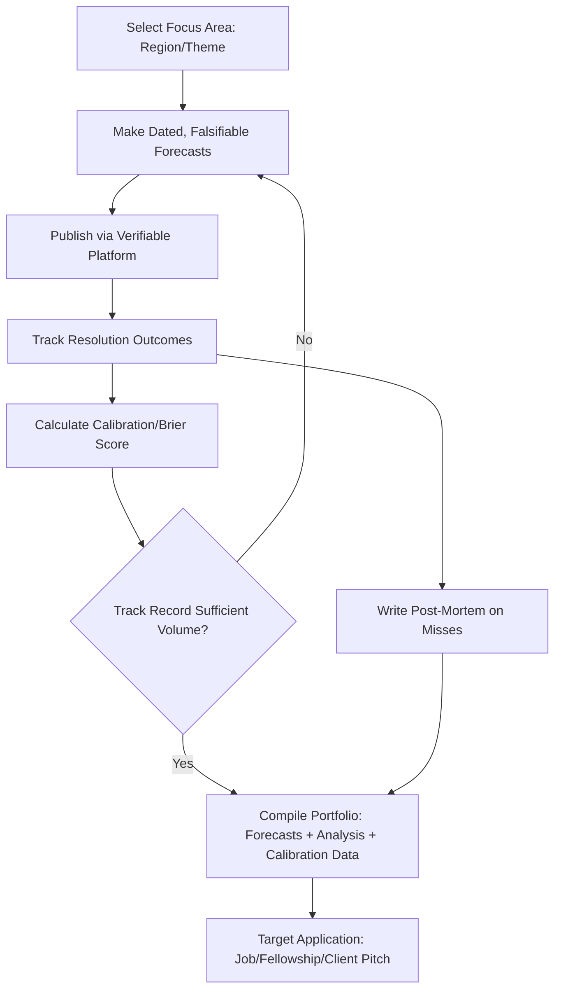

## Building an Analytical Portfolio and Public Track Record

### Overview and Purpose

A public analytical track record serves a distinct function from a resume or credential list: it demonstrates the quality of an analyst's reasoning process, not merely their credentials or institutional affiliation. In geopolitical risk analysis—where predictions are inherently probabilistic and outcomes are influenced by unpredictable human decisions—a portfolio's value lies in showing calibrated, falsifiable judgment over time rather than claiming a perfect predictive record, which is neither achievable nor credible in this field. This is a distinguishing entry and advancement asset across every career track discussed in this chapter: government hiring boards, think tank fellowship committees, consultancy recruiters, and financial-sector employers all use public track records as a proxy for analytic competence that credentials alone cannot demonstrate.

### Core Components of an Analytical Portfolio

**1. Forecasting Track Record**

The centerpiece of a credible portfolio is a documented history of specific, falsifiable forecasts:

- Forecasts must include an explicit proposition (a clearly defined event), a timeframe (a resolution date), and a probability or confidence level—vague statements like "tensions will likely rise" are not falsifiable and carry little evidentiary weight.
- Forecasts should be dated and timestamped in a way that cannot be retroactively edited, using platforms or methods with external verification (e.g., public forecasting platforms, version-controlled blog posts, dated social media posts, or third-party forecasting tournaments).
- A meaningful track record requires volume: a handful of forecasts, even if correct, provides insufficient statistical basis to assess calibration. Analysts building a serious record typically aim for dozens to hundreds of resolved forecasts over time.

**2. Calibration and Brier Scoring**

Calibration—not accuracy alone—is the standard by which serious forecasters evaluate track records. A well-calibrated forecaster who assigns 70% probability to a class of events should see those events occur approximately 70% of the time across many such forecasts, which is distinct from and more informative than simply counting "correct" versus "incorrect" calls on individual binary outcomes.

The standard quantitative scoring method is the **Brier score**, which measures the mean squared difference between predicted probabilities and actual outcomes:

$$BS = \frac{1}{N}\sum_{i=1}^{N}(f_i - o_i)^2$$

where $f_i$ is the forecast probability for event $i$, $o_i$ is the actual outcome (1 if it occurred, 0 if not), and $N$ is the total number of forecasts. Lower Brier scores indicate better calibration, with 0 representing perfect forecasting and 0.25 representing the baseline achieved by always forecasting 50%. Brier scores are widely used in forecasting tournaments (such as those associated with the Good Judgment Project) as the standard method for comparing forecaster performance across large samples of resolved questions.

**3. Written Analysis and Commentary**

Beyond discrete forecasts, a portfolio typically includes longer-form analytical writing:

- Structural/explanatory pieces that demonstrate depth of regional or thematic expertise, distinct from short-term predictions.
- Post-mortem or retrospective analyses examining why a previous forecast succeeded or failed, which signals intellectual honesty and analytic rigor more strongly than an unbroken record of claimed successes.
- Commentary on breaking events produced within a reasonably short window of the event itself, demonstrating the ability to produce timely, decision-relevant analysis under real-world time pressure.

**4. Platform and Distribution Choices**

| Platform Type | Examples/Category | Primary Value |
| --- | --- | --- |
| Forecasting tournaments | Good Judgment Open, Metaculus, Manifold Markets | Externally verified, scored track record |
| Personal publication | Newsletter, blog, Substack-style platform | Demonstrates voice, depth, consistency |
| Academic/think tank affiliation | Working papers, guest contributions | Institutional credibility signal |
| Social/professional media | Long-form threads, professional network posts | Real-time engagement, network visibility |
| Peer-reviewed or trade journals | Foreign Affairs-type outlets, specialist journals | Highest credibility signal, slowest cycle |

[Inference] The relative weighting analysts should give to each platform type depends heavily on target career track (e.g., forecasting tournament performance may carry more weight for quantitative/financial-sector roles, while journal publication carries more weight for academic tracks); this is not a fixed hierarchy.

### Methodological Standards for Credible Forecasts

To be evaluable and credible, individual forecasts should follow disciplined formatting conventions, commonly summarized as:

- **Specific**: A clearly defined event or threshold, not an open-ended trend statement.
- **Time-bound**: An explicit resolution date or window.
- **Probabilistic**: A numeric probability or defined confidence band, not binary "will/won't happen" language alone.
- **Resolvable**: A criterion that can be objectively assessed as true or false once the timeframe passes, avoiding ambiguous language that allows post-hoc reinterpretation.

**Example (well-formed forecast):** "There is a 35% probability that State A and State B will sign a formal ceasefire agreement covering the contested border region before March 1, 2027, as verified by an official joint statement or UN-recognized agreement text."

**Example (poorly-formed forecast, for contrast):** "Border tensions between State A and State B will probably escalate soon." This lacks a specific proposition, timeframe, and probability, making it unfalsifiable and therefore of limited value for a credible track record.

### Portfolio-Building Process

### Comparative Evaluation Criteria Employers and Committees Apply

| Criterion | What It Signals | Common Red Flag |
| --- | --- | --- |
| Forecast specificity | Analytic discipline | Vague, unfalsifiable claims |
| Volume of resolved forecasts | Statistical reliability of track record | Cherry-picked handful of "wins" |
| Calibration (not just accuracy) | Honest probabilistic reasoning | Overconfidence (frequent 90%+ calls that fail) |
| Presence of documented misses | Intellectual honesty | Portfolio showing only successes (implausible, suspicious) |
| Timeliness relative to events | Real-world analytic speed | Analysis published long after resolution is already known |
| Source transparency | Rigor and reproducibility | Unsourced or unverifiable claims |

### Practical Considerations

- **Avoiding survivorship bias in self-presentation**: A portfolio that shows only correct predictions is a warning sign to sophisticated reviewers rather than a strength; experienced hiring committees and forecasting-literate employers specifically look for documented misses and the accompanying reasoning about what went wrong.
- **Institutional vs. independent publication trade-offs**: Publishing through an institutional affiliation (university, think tank) lends credibility but may involve editorial constraints or slower publication cycles; independent publication offers speed and full attribution but requires building audience and credibility from a lower starting baseline.
- **Consistency over intensity**: A sustained, moderate cadence of forecasts and analysis over years is generally more persuasive to evaluators than a short burst of high-volume activity, since it demonstrates durability and depth of engagement rather than a one-time effort assembled for a specific application.
- **Domain focus vs. breadth trade-off**: Early-career analysts often benefit from establishing depth in one region or thematic area (a recognizable specialization) before expanding breadth, as a track record spread too thin across unrelated topics can dilute the perceived expertise signal.
- **Disclosure of conflicts and affiliations**: Where a forecast or analysis touches on an area where the analyst has a financial or institutional stake, transparent disclosure strengthens rather than weakens credibility, and its absence can undermine an otherwise strong track record if discovered later.

### Key Points

- A credible analytical portfolio centers on dated, falsifiable, probabilistic forecasts rather than vague directional claims, evaluated through calibration (e.g., Brier scoring) rather than simple accuracy counts.
- Documented forecasting misses and honest post-mortem analysis are portfolio strengths, not weaknesses, since an unbroken record of claimed successes is implausible and undermines credibility with sophisticated reviewers.
- Portfolio platforms range from externally-scored forecasting tournaments to personal publications to institutional/academic outlets, each carrying different credibility signals relevant to different career tracks.
- Building a statistically meaningful track record requires sustained volume and consistency over time, making this a long-horizon career investment rather than a task completed shortly before a job application.

### Related Topics

- Brier score and log score methodology in forecasting evaluation
- The Good Judgment Project and superforecasting research (Philip Tetlock)
- Calibration training exercises and probabilistic reasoning skill-building
- Forecasting platforms comparison (Metaculus, Good Judgment Open, prediction markets)
- Structured Analytic Techniques as inputs to forecast formation
- Writing effective post-mortem/retrospective analysis
- Personal branding and professional network-building for policy analysts
- Avoiding overconfidence and common cognitive biases in geopolitical forecasting