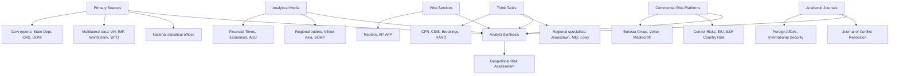

## Key Publications, Journals, and Information Sources

### Overview

Geopolitical risk analysis is an interdisciplinary practice drawing on international relations theory, economics, intelligence studies, and regional expertise. Practitioners rely on a layered information ecosystem: peer-reviewed academic journals for theoretical grounding, think tank publications for policy-relevant analysis, commercial risk intelligence platforms for real-time monitoring, government and multilateral sources for primary data, and specialized media for current developments. No single source is sufficient; professional practice requires triangulating across these categories and understanding the biases, funding models, and analytical methodologies behind each.

### Academic Journals

**International Relations & Political Science**

- **Foreign Affairs** — Published by the Council on Foreign Relations; bridges academic rigor and policy accessibility. Widely read by practitioners for agenda-setting essays from senior scholars, former officials, and heads of state.
- **International Security** — MIT Press; a top-tier peer-reviewed journal for security studies, deterrence theory, and strategic analysis. Heavily cited in academic risk modeling.
- **Foreign Policy** — More journalistic in tone than *Foreign Affairs*, with faster turnaround on breaking geopolitical developments and a stronger digital/analysis hybrid format.
- **World Politics** — Princeton-based; emphasizes comparative politics and formal/quantitative approaches to international relations.
- **Journal of Conflict Resolution** — Focuses on the causes and dynamics of interstate and intrastate conflict, often using quantitative and game-theoretic methods.
- **International Organization** — Covers international institutions, regimes, and global governance; relevant for understanding multilateral risk (WTO, UN Security Council dynamics, sanctions regimes).
- **Survival** — Published by the International Institute for Strategic Studies (IISS); strategic studies with a strong defense and military-balance focus.
- **The Washington Quarterly** — CSIS-affiliated; policy-oriented security and foreign policy analysis.

**Economics & Political Economy**

- **Journal of International Economics** — For understanding trade, capital flow, and sanctions transmission mechanisms that underpin economic geopolitical risk.
- **Review of International Political Economy** — Bridges IR and economics; useful for resource nationalism, sovereign risk, and globalization-related analysis.

[Inference] Access to most of these journals typically requires institutional subscriptions (JSTOR, Project MUSE, Taylor & Francis Online) or individual paywalls; professional analysts commonly rely on employer or university library access rather than personal subscriptions.

### Think Tanks and Policy Research Institutions

Think tanks produce the bulk of applied, timely geopolitical risk analysis consumed by practitioners. Political orientation and funding sources should be factored into how their output is weighted.

| Institution | Focus Area | Notes |
| --- | --- | --- |
| Council on Foreign Relations (CFR) | Broad U.S. foreign policy | Publishes *Foreign Affairs*; maintains widely used tracker tools (e.g., conflict trackers) |
| Center for Strategic and International Studies (CSIS) | Defense, security, regional programs | Strong regional expertise (China, Middle East, Europe) |
| Brookings Institution | Broad policy, economics, governance | Center-left leaning; strong on domestic-international policy linkages |
| RAND Corporation | Defense, military strategy, quantitative modeling | Originally defense-contractor-adjacent; heavy quantitative/simulation methodology |
| Atlantic Council | Transatlantic relations, sanctions, cyber | Publishes real-time crisis trackers (e.g., on Russia-Ukraine) |
| International Institute for Strategic Studies (IISS) | Military balance, defense economics | Publishes *The Military Balance*, an annual reference on global military capabilities |
| Chatham House (Royal Institute of International Affairs) | UK/European foreign policy | Operates under the "Chatham House Rule" for off-record discussions |
| Carnegie Endowment for International Peace | Nuclear policy, regional programs (strong Russia/Eurasia, Middle East desks) | Global network with regional centers (Carnegie Moscow historically, now closed; Carnegie China, Carnegie India) |
| Peterson Institute for International Economics (PIIE) | International economic policy, trade, sanctions | Leading source for sanctions-impact quantification |
| Center for a New American Security (CNAS) | U.S. defense and technology policy | Strong on emerging tech/national security intersection |
| Eurasia Group | Political risk consultancy (commercial) | Publishes the widely cited annual "Top Risks" report |
| Stratfor (RANE) | Geopolitical intelligence, forecasting | Commercial; known for scenario-based geopolitical forecasting methodology |

[Inference] Think tank funding — from governments, corporations, or private foundations — can shape topic selection and framing even where individual scholarship remains rigorous; cross-referencing multiple institutions across the political spectrum is standard practice to mitigate this.

### Commercial Risk Intelligence Platforms

These are subscription-based services used heavily in corporate, financial, and insurance risk functions:

- **Eurasia Group** — Political risk consultancy; produces the annual "Top Risks" report widely cited across finance and media.
- **Verisk Maplecroft** — Quantitative risk indices (political, human rights, environmental) used for corporate due diligence and ESG screening.
- **Control Risks** — Corporate security and political risk consultancy; publishes an annual "RiskMap."
- **S&P Global Market Intelligence / Country Risk** — Sovereign and country risk ratings integrated with financial risk products.
- **BMI (Fitch Solutions)** — Country and industry risk reports tied to credit rating methodology.
- **RANE (Stratfor)** — Real-time geopolitical intelligence and scenario planning.
- **Economist Intelligence Unit (EIU)** — Country forecasts, democracy index, business environment rankings; long-standing methodology transparency.
- **Oxford Analytica** — Daily geopolitical briefs used by corporate and government clients.

[Unverified] Specific subscription pricing and access tiers for these platforms change frequently and are not consistently public; verify current terms directly with each provider.

### Government and Multilateral Primary Sources

Primary sources are essential for verifying claims found in secondary analysis and for original research:

- **U.S. Government**: State Department country reports, Congressional Research Service (CRS) reports (public and non-classified), Office of the Director of National Intelligence (ODNI) unclassified threat assessments, Treasury OFAC sanctions lists, CIA World Factbook (baseline country data).
- **Intelligence & Defense Adjacent**: Annual "Worldwide Threat Assessment" testimony to Congress; DoD China Military Power Report.
- **Multilateral Institutions**: UN Security Council resolutions and reports, IMF Article IV consultations and World Economic Outlook, World Bank country data and Doing Business-successor indicators, WTO dispute settlement records.
- **National Statistical Offices** — Primary economic data (GDP, trade, inflation) for the countries under analysis; essential for verifying claims made in secondary commercial reports.
- **NATO, EU (European External Action Service)** — Official positions and threat assessments relevant to transatlantic and European risk.

### News and Wire Services

- **Reuters, Associated Press, Agence France-Presse (AFP)** — Wire services providing baseline factual reporting with minimal editorializing; preferred as first-pass sources for event verification.
- **Financial Times, The Economist, The Wall Street Journal** — Deeper analytical journalism with dedicated geopolitics/emerging markets desks.
- **Bloomberg** — Strong on market-moving geopolitical developments (sanctions, energy, trade).
- **Nikkei Asia, South China Morning Post** — Regional perspectives valuable for Asia-focused risk work, though editorial independence and access constraints vary by outlet and jurisdiction. [Inference] Outlets operating under or adjacent to jurisdictions with press restrictions warrant additional scrutiny of framing on politically sensitive domestic topics.

### Specialized and Regional Sources

- **Jane's (by Janes)** — Defense, security, and terrorism intelligence; long-standing authority on military hardware and order-of-battle data.
- **The Jamestown Foundation** — Publishes region-specific analysis (China Brief, Eurasia Daily Monitor, Terrorism Monitor).
- **Middle East Institute, Arab Center Washington DC** — Regional specialist analysis for MENA risk.
- **Lowy Institute** — Leading Australian/Indo-Pacific focused think tank; publishes the Lowy Institute Asia Power Index.
- **Council on Foreign Relations' Global Conflict Tracker** — A continuously updated tool tracking active and potential conflicts worldwide.
- **ACLED (Armed Conflict Location & Event Data Project)** — Open-access, event-level conflict data used for quantitative risk modeling and academic research.
- **GDELT Project** — Large-scale, automated global event database used for computational geopolitical risk analysis.

### Evaluating Source Quality

**Key Points**

- **Methodology transparency**: Prefer sources (e.g., EIU, ACLED) that publish their data collection and scoring methodology over "black box" risk scores.
- **Funding and institutional affiliation**: Understand whether a source is government-funded, corporate-funded, or independently endowed, as this shapes framing even absent explicit bias.
- **Primary vs. secondary distinction**: Treat wire services and official government data as closer to primary sources; treat think tank and commentary pieces as interpretive layers built atop them.
- **Recency vs. depth trade-off**: Wire services and commercial trackers offer speed; academic journals and books offer depth and theoretical rigor but lag real-time events by months or years.
- **Triangulation**: Cross-reference at least two ideologically or institutionally distinct sources before treating a contested claim (e.g., troop movements, sanctions effectiveness) as established.

[Inference] A common practitioner workflow layers these sources by cadence: wire services and commercial trackers for daily monitoring, think tank briefs for weekly/monthly synthesis, and journals/books for foundational theory revisited periodically — though the specific cadence varies by organization and role.

### Illustrative Source Ecosystem Diagram

### Building a Personal Information Diet

**Example**

A practicing geopolitical risk analyst covering Eastern Europe might structure daily/weekly intake as follows:

- **Daily**: Reuters and AFP wire alerts; Atlantic Council's Ukraine/Russia crisis tracker; Institute for the Study of War (ISW) daily campaign assessments.
- **Weekly**: Chatham House and Carnegie Endowment briefs; Economist's Europe section.
- **Monthly/Quarterly**: EIU country forecast updates; IMF/World Bank data releases relevant to sanctioned economies.
- **Periodic (foundational)**: *International Security* articles on deterrence theory; RAND reports on military balance and escalation modeling.

**Next Steps**

- Career pathways into geopolitical risk roles (government, corporate, consultancy, journalism)
- Building a personal research and monitoring workflow (RSS aggregation, alert systems)
- Evaluating think tank bias and funding transparency in practice
- Open-source intelligence (OSINT) techniques and tools for primary verification
- Quantitative risk modeling using open datasets (ACLED, GDELT)
- Professional certifications and academic programs relevant to geopolitical risk analysis
- Networking and professional associations (e.g., International Studies Association)